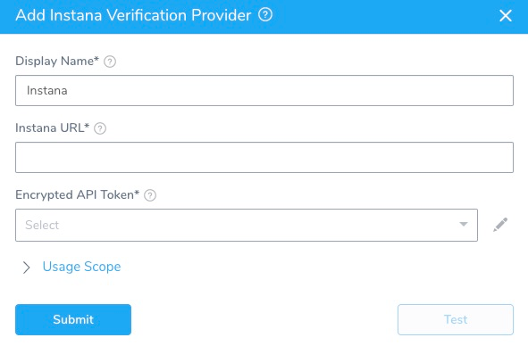

The first step in using Instana with Harness is to set up a Instana Verification Provider in Harness.

A Harness Verification Provider is a connection to monitoring tools such as Instana. Once Harness is connected, you can use Harness 24/7 Service Guard and Deployment Verification with your Instana data and analysis.

### Instana Verification Provider Setup

To add Instana as a verification provider:

1. Click **Setup**.
2. Click **Connectors**, and then click **Verification Providers**.
3. Click **Add Verification Provider**, and select **Instana**. The **Add****Instana Verification Provider** dialog appears.  
   
   

4. Complete the following fields in this dialog.On Instana, you must have the account owner role to create the API token needed to connect Harness to Instana.

|  |  |
| --- | --- |
| **Field** | **Description** |
| **Display Name** | Enter a display name for the provider. If you are going to use multiple providers of the same type, ensure that you give each provider a different name. |
| **Instana** **URL** | Enter the URL of the Instana server, such as:`https://integration-<your-company>.instana.io` |
| **Encrypted** **API Token** | Select or create a new [Harness Encrypted Text secret](https://docs.harness.io/article/ygyvp998mu-use-encrypted-text-secrets) for your Instana API token. |
| **Usage Scope** | Usage scope is inherited from the secrets used in the settings. |

To create an API key in Instana, do the following:
1. In Instana Settings, select **Team Settings** > **API Tokens**.
2. Select **Add** **API Token**.
3. On the resulting **New API Token** page, enter a name for the new API key, such as **Harness**.
4. Under Permssions, enable **Service & Endpoint Mapping**.
5. Copy the value from the **API Token** field, and save the token.
6. In **Harness**, paste the token's value into the **API Token** field.

### Testing and Saving Your Setup

1. After you have filled in the **Add Instana Verification Provider** dialog's settings, click **Test** to confirm them.
2. Once the test is successful, click **Submit** to create your new Instana Connector.

### Next Step

* [2 – 24/7 Service Guard for Instana](instana-service-guard.md)

