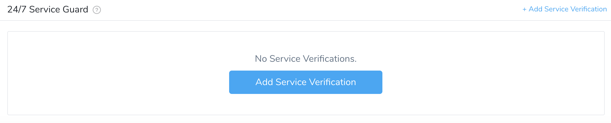
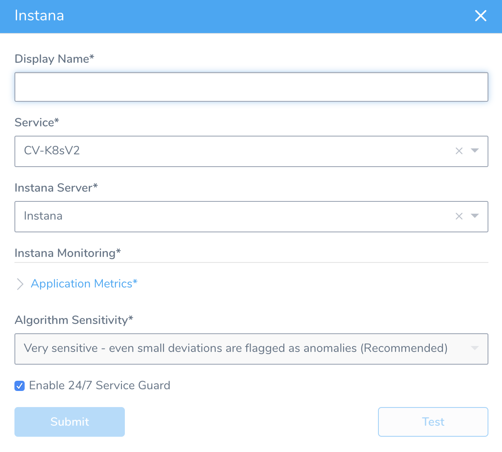
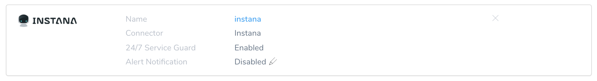
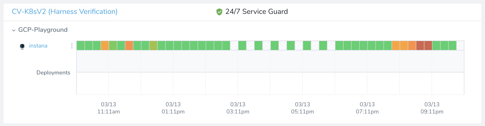

Harness 24/7 Service Guard monitors your live applications, catching problems that surface minutes or hours following deployment. For more information, see [24/7 Service Guard Overview](../continuous-verification-overview/concepts-cv/24-7-service-guard-overview.md).

You can add your Instana monitoring to Harness 24/7 Service Guard in your Harness Application Environment. For a setup overview, see [Instana Connection Setup](instana-connection-setup.md).

This section assumes you have a Harness Application set up, containing a Service and an Environment. For steps on setting up a Harness Application, see [Application Components](../../model-cd-pipeline/applications/application-configuration.md).

### 24/7 Service Guard Setup

To set up 24/7 Service Guard for Instana:

1. Ensure that you have added Instana as a Harness Verification Provider, as described in [Verification Provider Setup](../datadog-verification/1-datadog-connection-setup.md#datadog-verification-provider-setup).
2. In your Harness Application, ensure that you have added a Service, as described in [Services](../../model-cd-pipeline/setup-services/service-configuration.md). For 24/7 Service Guard, you do not need to add an Artifact Source to the Service, nor configure its settings. You simply need to create a Service, and name it. It will represent your application for 24/7 Service Guard.
3. In your Harness Application, click **Environments**.
4. In **Environments**, ensure that you have added an Environment for the Service you added. For steps on adding an Environment, see [Environments](../../model-cd-pipeline/environments/environment-configuration.md).
5. Click the Environment for your Service. Typically, the **Environment Type** is **Production**.
6. In the **Environment** page, locate **24/7 Service Guard**.

  
  
7. In **24/7 Service Guard**, click **Add Service Verification**, and select click **Instana**. The **Instana** dialog appears.

   
   
8. Fill out the dialog. The dialog has the following fields.

    For 24/7 Service Guard, the queries you define to collect metrics are specific to the Application or Service you want monitored. Verification is Application/Service level. This is unlike Workflows, where verification is performed at the host/node/pod level.

    * **Display Name** -- The name that will identify this Service on the **Continuous Verification** dashboard. Use a name that indicates the Environment and monitoring tool, such as **Instana**. 
    * **Service** -- The Harness Service to monitor with 24/7 Service Guard. 
    * **Instana Server** -- Select the Instana [Verification Provider](instana-connection-setup.md) to use. 
    * **Application Metrics** -- This section is where you specify API endpoint metrics to monitor from Instana:
    
      1. Click **Add** to display a **Tag Filters** row, as shown below.You must specify at least one Tag Filter. These correspond to Filters applied to your metrics on Instana's **Analytics** tab > **Filters**.
      2. In the **Name** field, enter the Instana Filter's name, such as `kubernetes.pod.name`.
      3. Select an **Operator** to define the threshold or condition for considering this metric anomalous.
      4. Enter a **Value** corresponding to the **Operator**.
      5. To define additional Tag Filters, repeat the above steps.

    * **Algorithm Sensitivity** -- See [CV Strategies, Tuning, and Best Practices](../continuous-verification-overview/concepts-cv/cv-strategies-and-best-practices.md#algorithm-sensitivity-and-failure-criteria).**Moderately sensitive** is recommended.
    * **Enable 24/7 Service Guard** -- Select this check box to turn on 24/7 Service Guard monitoring with Instana. If you simply want to set up 24/7 Service Guard, but not yet enable it, leave this check box empty. 

    When you are finished, the dialog will look something like this:

    

9. Click **Test**. Harness verifies the settings that you entered.

  
  
10. Click **Submit**. Instana 24/7 Service Guard monitoring is now configured.

   

To see the running 24/7 Service Guard analysis, click **Continuous Verification**.

The 24/7 Service Guard dashboard displays your production verification results.

For more information, see [24/7 Service Guard Overview](../continuous-verification-overview/concepts-cv/24-7-service-guard-overview.md).

### Next Step

* [3 – Verify Deployments with Instana](instana-verify-deployments.md)

