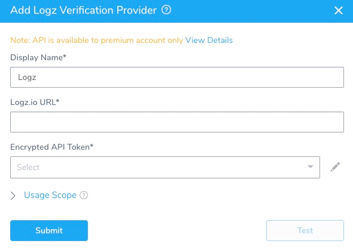

To set up Logz.io to work with Harness' Continuous Verification features, you must add Logz.io as Harness Verification Provider. 

### Before You Begin

* [What Is Continuous Verification (CV)?](../continuous-verification-overview/concepts-cv/what-is-cv.md)

### Limitations

You must have a Logz.io Enterprise account to generate the API tokens required to integrate with Harness. (Logz.io Pro and Community accounts do not support token generation.)
### Step 1: Add Verification Provider

To begin adding Logz.io as a Harness Verification Provider,:

1. In Harness, click **Setup**.
2. Click **Connectors**, and then click **Verification Providers**.
3. Click **Add Verification Provider**, and select Logz.io. The **Add Logz Verification Provider** dialog appears.

      
   
### Step 2: Display Name

Enter a name for this connection. You will use this name when selecting the Verification Provider in Harness Environments and Workflows.

If you plan to use multiple providers of the same type, ensure that you give each provider a different name.

### Step 3: Logz.io URL

Enter the URL of the server.

### Step 4: Token

In **Encrypted API Token**, 

For secrets and other sensitive settings, select or create a new [Harness Encrypted Text secret](https://docs.harness.io/article/ygyvp998mu-use-encrypted-text-secrets) for the token.

For details, see Logz.io's [Announcing the Logz.io Search API](https://logz.io/blog/announcing-the-logz-io-search-api/) tutorial, [Managing API Tokens](https://docs.logz.io/user-guide/tokens/api-tokens.html) topic, and [Authentication](https://docs.logz.io/api/#section/Authentication) API documentation.
### Step 5: Usage Scope

Usage scope is inherited from the secrets used in the settings.

### Step 6: Test and Save

1. When you have configured the dialog, click **Test**.
2. Once the test is successful, click **Submit** to add this Verification Provider.

### Next Step

We will soon add additional topics on using Logz.io for Harness deployment and service verification.