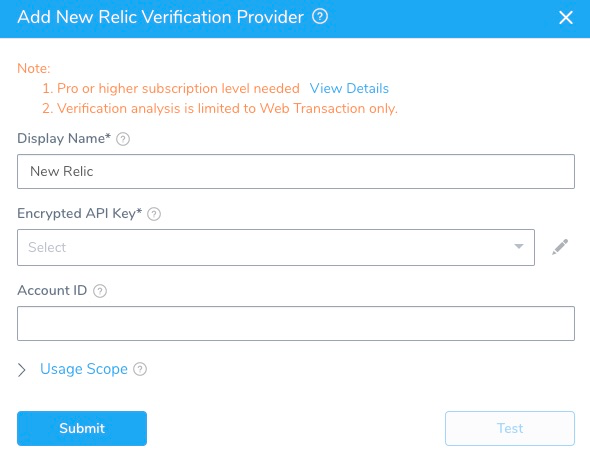
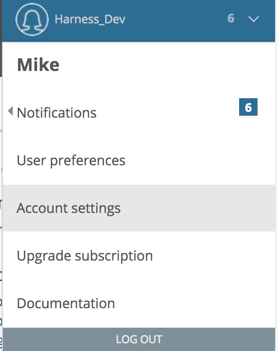
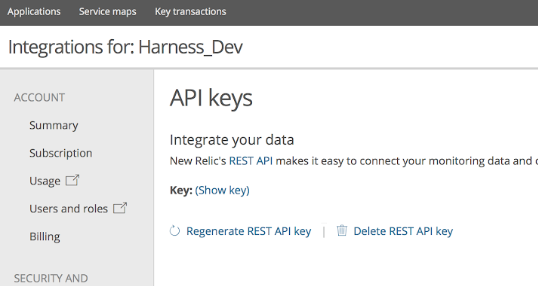

The first step in using New Relic with Harness is to set up an New Relic Verification Provider in Harness.

A Harness Verification Provider is a connection to monitoring tools such as New Relic. Once Harness is connected, you can use Harness 24/7 Service Guard and Deployment Verification with your New Relic data and analysis.

### Before You Begin

* See the [New Relic Verification Overview](../continuous-verification-overview/concepts-cv/new-relic-verification-overview.md).

### Step 1: Add New Relic Verification Provider

To connect a verification provider, do the following:

1. Click **Setup**.
2. Click **Connectors**, and then click **Verification Providers**.
3. Click **Add Verification Provider**, and select **New Relic**. The **Add New Relic Verification Provider** dialog appears.

   
   
4. Complete the following fields of the **Add New Relic Verification Provider** dialog.

### Step 2: Encrypted API Key

For secrets and other sensitive settings, select or create a new [Harness Encrypted Text secret](https://docs.harness.io/article/ygyvp998mu-use-encrypted-text-secrets).Enter the API key needed to connect with the server. For information on API keys, see [Access to REST API keys](https://docs.newrelic.com/docs/apis/getting-started/intro-apis/access-rest-api-keys) from New Relic.

1. Log into New Relic.
2. On the home page, click your account name, and then click **Account Settings**.

   
   
3. Click the left menu, under **Integrations**, click **API keys**.

   
   
   The API keys are displayed.
   
   
   
   An index of Admin user's API keys appears below the account's REST API key. The list includes the Admin's full name and the date their key was last used. You can view your own Admin user's API key: From the Admin index, select **(Show key)** for your name.

### Step 3: Account ID

To get the account ID for your New Relic account, in the New Relic Dashboard, copy the number after the **/accounts/** portion of the URL.

### Step 4: Display Name

Enter a display name for the provider. If you are going to use multiple providers of the same type, ensure you give each provider a different name.

### Step 5: Usage Scope

Usage scope is inherited from the secrets used in the settings.

Pro or higher subscription level needed. For more information, see [Introduction to New Relic's REST API Explorer](https://docs.newrelic.com/docs/apis/rest-api-v2/api-explorer-v2/introduction-new-relics-rest-api-explorer) from New Relic.

### Next Steps

* [Monitor Applications 24/7 with New Relic](2-24-7-service-guard-for-new-relic.md)
* [New Relic Deployment Marker](3-new-relic-deployment-marker.md)
* [Verify Deployments with New Relic](4-verify-deployments-with-new-relic.md)

