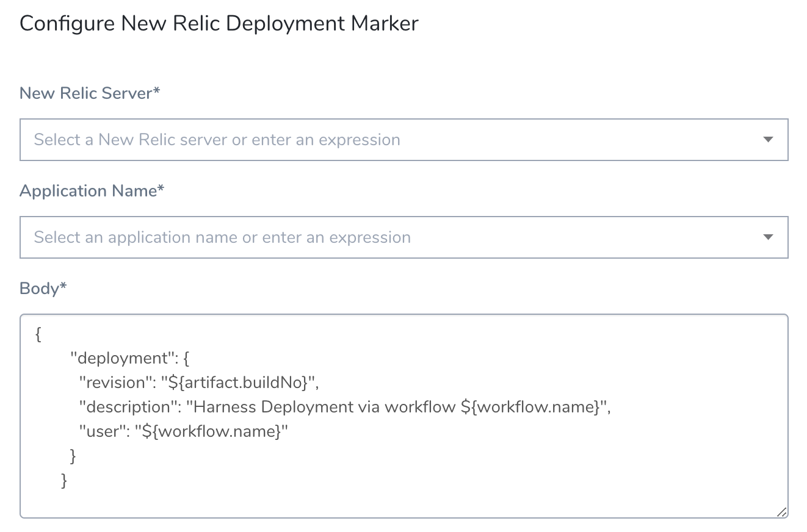

You can use the New Relic REST API v2 to record Harness deployments and then view them in the New Relic APM **Deployments** page and in the **Event** log list on the **Overview** page. For more information, see
 [REST API Procedures](https://docs.newrelic.com/docs/apm/new-relic-apm/maintenance/record-deployments#api) from New Relic.

### Review: New Relic Deployment Markers


In a Harness Workflow, you can add a **New Relic Deployment Marker** to perform the POST as part of your Workflow:



The result is similar to using a cURL command that sends a POST to the API to record a deployment. See the `deployment` section in this example:


```
curl -X POST 'https://api.newrelic.com/v2/applications/${APP_ID}/deployments.json' \  
     -H 'X-Api-Key:${APIKEY}' -i \  
     -H 'Content-Type: application/json' \  
     -d \  
'{  
  "deployment": {  
    "revision": "REVISION",  
    "changelog": "Added: /v2/deployments.rb, Removed: None",  
    "description": "Added a deployments resource to the v2 API",  
    "user": "datanerd@example.com"  
  }  
}'
```

### Step 1: Add a New Relic Verification Provider


You connect Harness to New Relic using a Harness New Relic Verification Provider.


See
 [Connect to New Relic](1-new-relic-connection-setup.md).


Later, when you add the **New Relic Deployment Marker** step in your Workflow, the API key parameter (shown in the cURL example above) is provided by the credentials you entered in the New Relic Verification Provider. 


### Step 2: Add New Relic Deployment Marker


New Relic Deployment Marker is only available within a Workflow deployment phase in the **Verify** section.


You cannot use it in the **Pre-deployment Steps** of a canary Workflow.


1. To select the **New Relic Deployment Marker** step, click **Add Step**, and then, in the **Utility** section, select **New Relic Deployment Marker**.
2. In **New Relic Server**, select the
 [New Relic Verification Provider](1-new-relic-connection-setup.md) you added.


You can also enter set up a
 [Service or Workflow variable](https://docs.harness.io/article/9dvxcegm90-variables) in the **New Relic Server** setting, such as: `${serviceVariable.new_relic_connector_name}` .


If the **New Relic Server** field contains an expression, the **Application Name** field must also use an expression.
The App ID parameter is provided by the **Application Name** you select. The list of applications is pulled from the New Relic Server you selected. You can also enter variable expressions, such as: `${app.name}`.


The **Body** section contains the standard JSON content as in the cURL example:


```
{  
  "deployment": {  
    "revision": "${artifact.buildNo}",  
    "description": "Harness Deployment via workflow ${workflow.name}",  
    "user": "${workflow.name}"  
  }  
}
```

Harness uses some
 [built-in variables](https://docs.harness.io/article/9dvxcegm90-variables) to provide the revision information and other settings.


Now when the Workflow is deployed you will see the Deployment Marker vertical line in New Relic:


### YAML Example


Here's an example YAML schema that you can use for New Relic Deployment Marker.


```
- type: NEW_RELIC_DEPLOYMENT_MARKER  
      name: New Relic Deployment Marker  
      properties:  
        analysisServerConfigId: 1crZaE-DQrKE_YFmH97CSg  
        applicationId: "${service.name}"  
        body: |-  
          {  
                "deployment": {  
                  "revision": "${artifact.buildNo}",  
                  "description": "Harness Deployment via workflow ${workflow.name}",  
                  "user": "${workflow.name}"  
                }  
              }  
        templateUuid: null  
        templateVariables: null  
        templateVersion: null  
 
```


For **applicationId**, you can use a Harness built-in variable expression such as **${service.name}** or a Workflow or Service variable.


For more information about variables and expressions, see the following topics:


* [Add Service Config Variables](../../model-cd-pipeline/setup-services/add-service-level-config-variables.md)
* [What is a Harness Variable Expression?](https://docs.harness.io/article/9dvxcegm90-variables)


### See Also


* [Verify Deployments with New Relic](4-verify-deployments-with-new-relic.md)


