The following procedure describes how to add New Relic as a verification step in a Harness workflow. For more information about workflows, see [Add a Workflow](../../model-cd-pipeline/workflows/workflow-configuration.md).

Once you run a deployment and New Relic preforms verification, Harness machine-learning verification analysis will assess the risk level of the deployment.

### Before You Begin

* See the [New Relic Verification Overview](../continuous-verification-overview/concepts-cv/new-relic-verification-overview.md).
* See [Connect to New Relic](1-new-relic-connection-setup.md).

### Step 1: Set Up the Deployment Verification

To verify your deployment with New Relic, do the following:

1. Ensure that you have added New Relic as a verification provider, as described in [Connect to New Relic](1-new-relic-connection-setup.md).
2. In your workflow, under **Verify Service**, click **Add Verification**.

   
   
3. In the resulting **Add Step** settings, select **Performance Monitoring** > **New Relic**.

  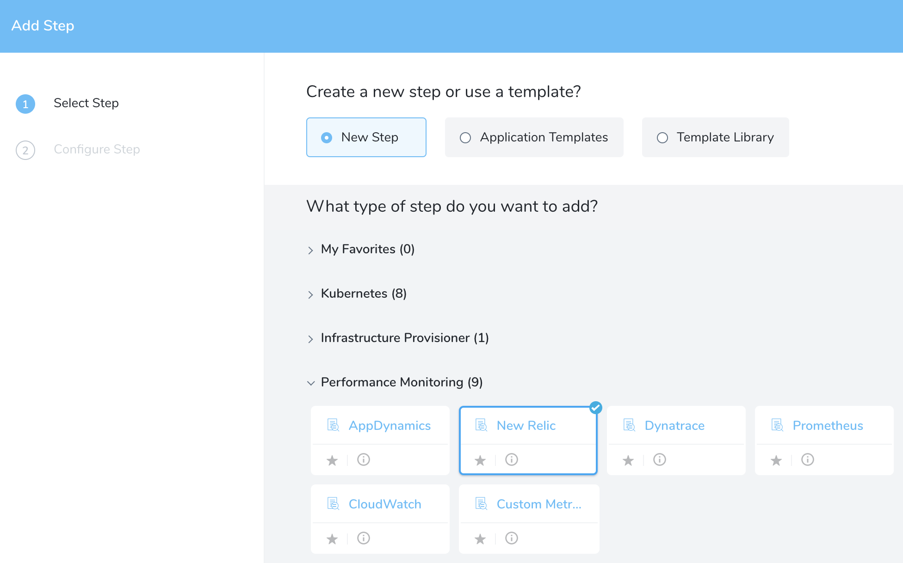
  
4. Click **Next**. The **Configure****New Relic** settings appear.

   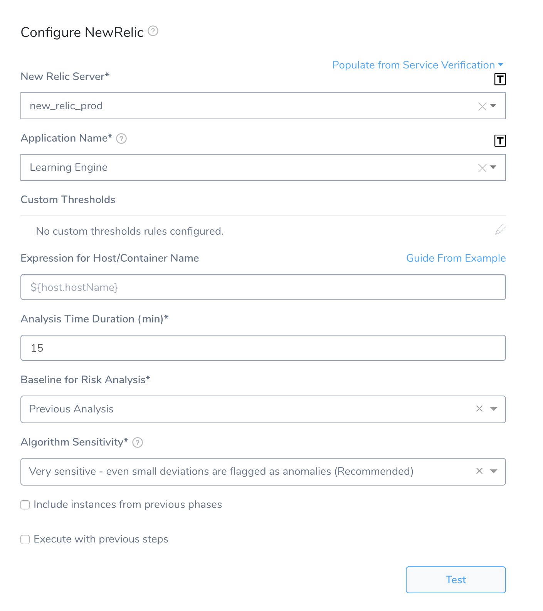

### Step 2: New Relic Server

In **Harness**, click **Setup**, click **Connectors**, click **Verification Providers**. The New Relic verification provider(s) are listed. The New Relic logo is next to each New Relic provider.

Select the server you added when you set up the New Relic verification provider.

You can also enter variable expressions, such as: `${serviceVariable.new_relic_connector_name}`

If the **New Relic Server** field contains an expression, the **Application Name** field must also use an expression.

### Step 3: Application Name

Select the application to use for this verification step.

If your New Relic account contains hundreds or thousands of applications, Harness requests that you enter in the application name. You can just paste in the application name as it appears in the New Relic Applications page **Name** column.

This is the application name used to aggregate data in the New Relic UI. You set both the license and the app name as part of the New Relic installation process.

You can also enter variable expressions, such as: `${app.name}`

If the **New Relic Server** field contains an expression, the **Application Name** field must also use an expression.To find your application, in **New Relic**, click Applications. The list of applications is displayed on the **Applications** page.

[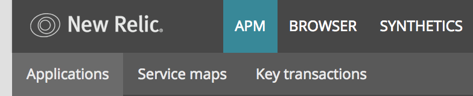](./static/4-verify-deployments-with-new-relic-03.png)

### Step 4: Custom Thresholds

In the **Custom Thresholds** section, define two types of rules that override normal verification behavior:

* **Ignore Hints** instruct Harness to skip certain metrics/value combinations from verification analysis.
* **Fast-Fail Hints** cause a Workflow to promptly enter a failed state.

You can configure the following metric types as part of Custom Thresholds: Apdex Score, Average Response Time, Error, and Requests Per Minute (in Workflow).

To configure these rules, see  [Apply Custom Thresholds to Deployment Verification](../tuning-tracking-verification/custom-thresholds.md).

### Step 5: Expression for Host/Container Name

The expression entered here should resolve to a host/container name in your deployment environment. For instructions on how to the **Guide From Example** feature, see [Guide From Example](#guide_from_example).

When you are setting up the workflow for the first time, Harness will not be able to help you create an expression in the **Guide From Example** feature because there has not been a host/container deployed yet. For this reason, you should add the Verify Step **after** you have done one successful deployment.

For AWS EC2 hostnames, use the expression `${instance.hostName`}.To ensure that you pick the right name when using **Guide From Example**, you can use a host name in New Relic as a guide. In **New Relic**, click your application, click the left menu, and then click **JVMs**. The host names are listed in the first column of the table.

[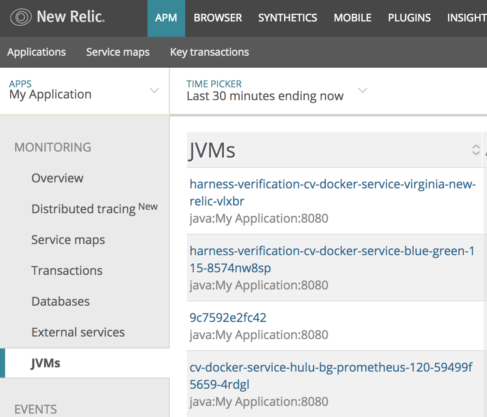](./static/4-verify-deployments-with-new-relic-05.png)

The expression that you provide in **Expression for Host/Container Name** should evaluate to the names here.

### Step 6: Analysis Time Duration

You can use integers and expressions in the **Analysis Time Duration** field.

See [Harness Variable Expression](https://docs.harness.io/article/9dvxcegm90-variables) and [Analysis Time Duration](../continuous-verification-overview/concepts-cv/cv-strategies-and-best-practices.md#analysis-time-duration).

### Step 7: Baseline for Risk Analysis

See [CV Strategies, Tuning, and Best Practices](../continuous-verification-overview/concepts-cv/cv-strategies-and-best-practices.md).

### Step 8: Execute with previous steps

Check this checkbox to run this verification step in parallel with the previous steps in **Verify Service**.

### Step 9: Include instances from previous phases

If you are using this verification step in a multi-phase deployment, select this checkbox to include instances used in previous phases when collecting data. Do not apply this setting to the first phase in a multi-phase deployment.

### Step 10: Wait interval before execution

Set how long the deployment process should wait before executing the verification step.

### Review: Guide from Example

This section explains how to use the **Guide From Example** option next to the **Expression for Host/Container name** field, but the same information applies to when the **Guide From Example** option is next any other field, such as a **Message** field.In the New Relic verification step's settings, you can see the **Guide From Example** option next to the **Expression for Host/Container name** field. This option lets you select the host(s), pod(s), or container(s) for Harness to use when performing verification.

You select the host, pod, or container in **Guide From Example**, and an expression is added to the **Expression for Host/Container name** field. The default expression is **${instance.host.hostName}**.

In order to obtain the names of the host(s) pod(s), or container(s) where your service is deployed, the verification provider should be added to your workflow **after** you have run at least one successful deployment. Then the **Guide From Example** feature can display the host or container name(s) for you to select.To ensure that you pick the right name when using **Guide From Example**, you can use a host name in New Relic as a guide.

To use **Guide From Example** for a host or container name expression, do the following:

1. In **New Relic**, click your application, click the left menu, and then click **JVMs**. The host names are listed in the first column of the table.

   
   
   The expression that you provide in **Expression for Host/Container Name** should evaluate to the names here.
   
2. In your Harness Workflow's **Configure****New Relic** settings, click **Guide From Example**. The **Expression for Host Name** popover appears.  
   The dialog shows the Service, Environment, and Service Infrastructure used for this Workflow.
   
   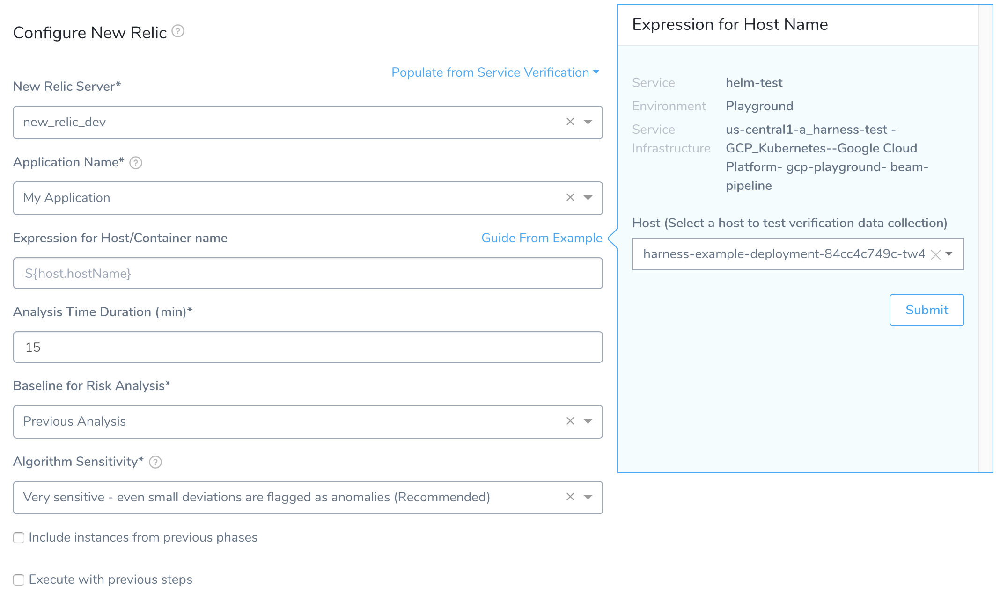
   
3. In **Host**, click the name of the host to use when testing verification. Match the hostname from the New Relic JVMs to the hostname in the Expression for Host Name popover:

   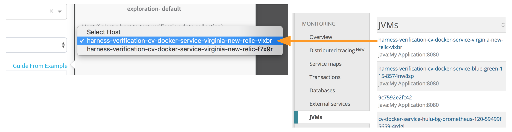
   
4. Click **SUBMIT**. The YAML for the host appears. Look for the **host** section.

   
   
   You want to use a **hostName** label in the **host** section. Do not use a **hostName** label outside of that section.
   
   
   
5. To identify which label to use to build the expression, compare the host/container names in the YAML with the host names in the New Relic **JVMs** page.

  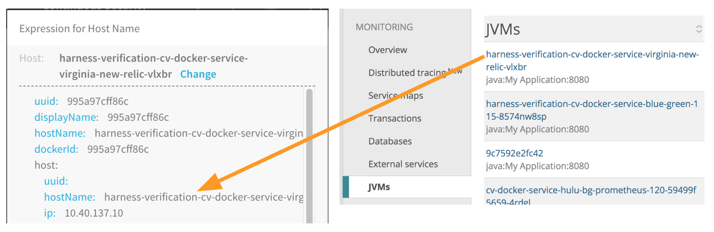
  
6. Locate the host/pod/container to use, and click the **label** to select the expression. For example, if you clicked the **hostName** label, the expression **${host.hostName}** is added to the **Expression for Host/Container name** field. Click back in the main dialog to close the **Guide From Example**.
7. At the bottom of the New Relic dialog, click **TEST**.

   
   
   A new **Expression for Host Name** popover appears.
   
   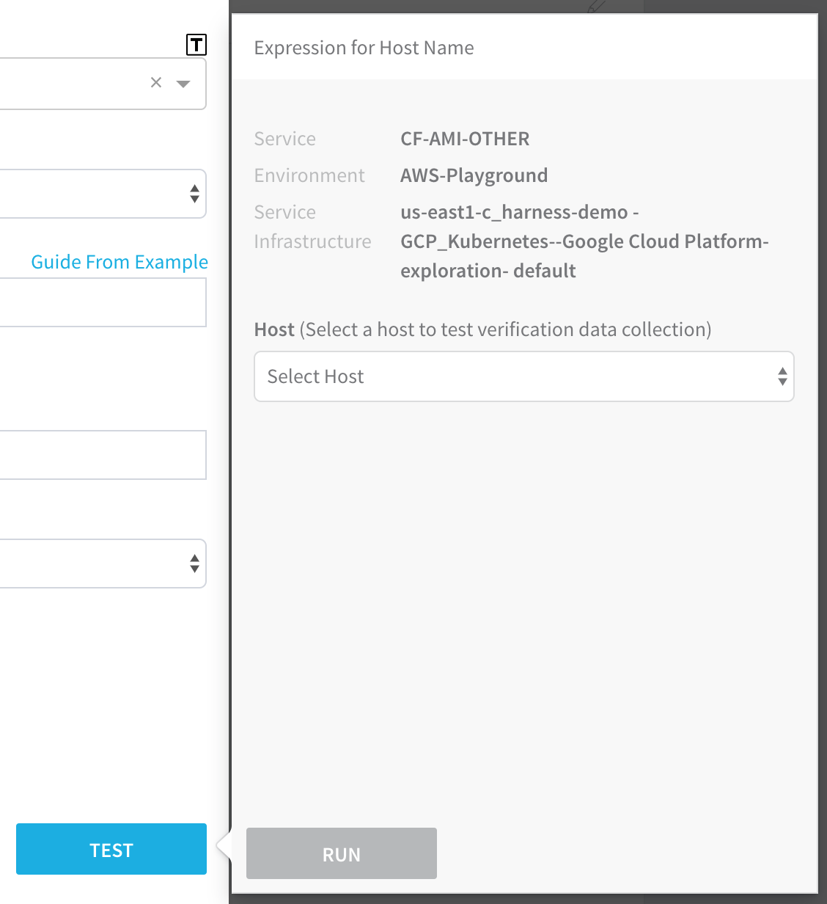
   
8. In **Host**, select the same host you selected last time, and then click **RUN**. Verification for the host is found.

   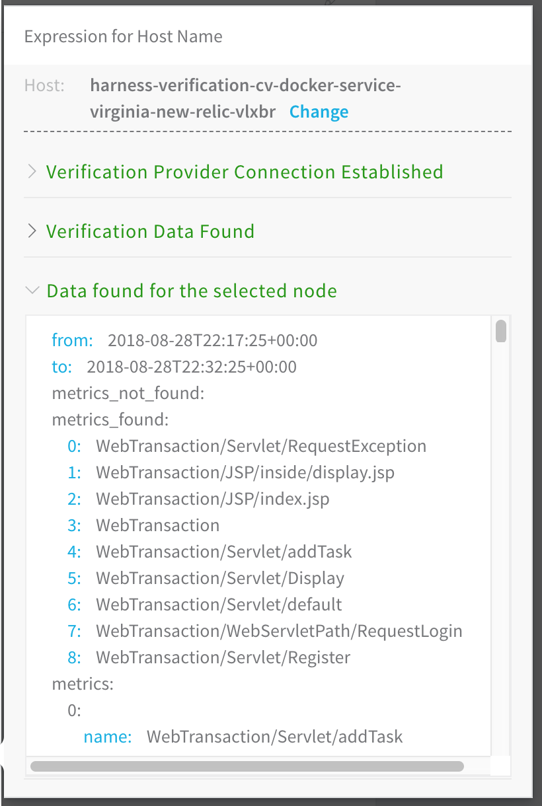
   
   If you have errors, see [Troubleshooting](#troubleshooting).
   
9. Click back in the **New Relic** dialog and click **SUBMIT**. The New Relic verification step is added to your workflow.

   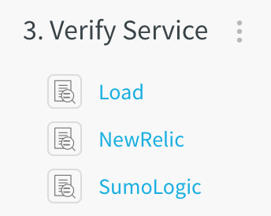

Using **Guide From Example** for other dialog fields is the same process as above.

### Review: Templatize New Relic Verification

Once you have created a New Relic verification step, you can templatize certain settings. This enables you to use the New Relic verification step in the Workflow (and multiple Pipelines) without having to provide settings until runtime.

You templatize settings by click the **[T]** icon next to the setting.

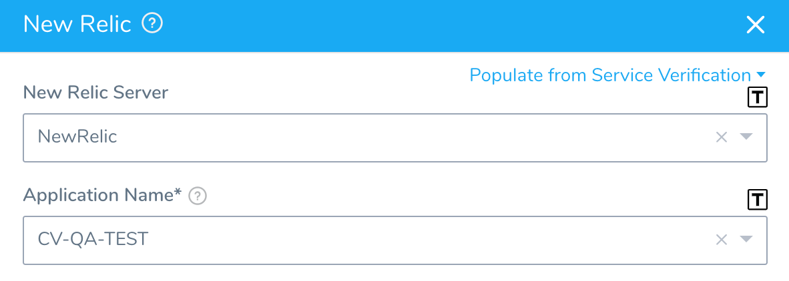

The settings are replaced by Workflow variables:

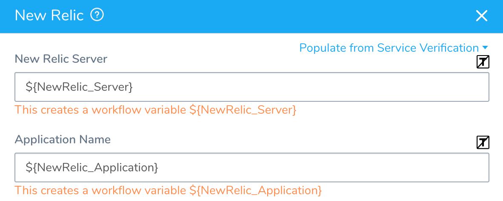

You will now see them in the **Workflow Variables** section of the Workflow:

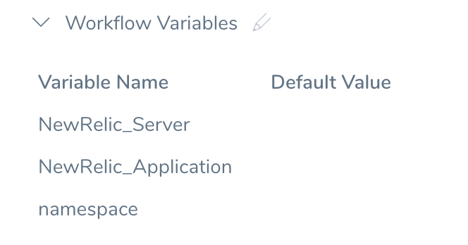

When you deploy the Workflow, **Start New Deployment** prompts you to enter values for templatize settings:

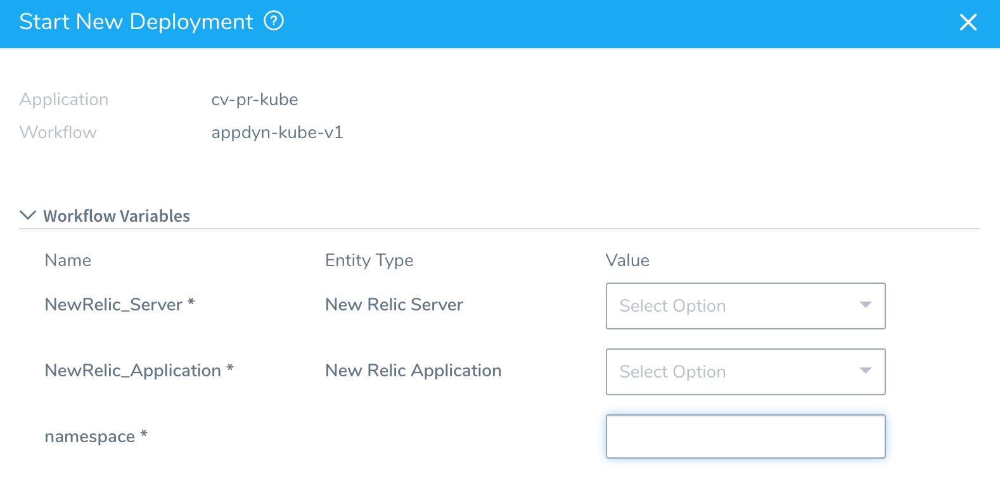

You can select the necessary settings and deploy the Workflow.

You can also pass variables into a Workflow from a Trigger that can be used for templatized values. For more information, see [Passing Variables into Workflows and Pipelines from Triggers](../../model-cd-pipeline/expressions/passing-variable-into-workflows.md).

### Review: Harness Expression Support in CV Settings

You can use expressions (`${...}`) for [Harness built-in variables](https://docs.harness.io/article/7bpdtvhq92-workflow-variables-expressions) and custom [Service](../../model-cd-pipeline/setup-services/service-configuration.md) and [Workflow](../../model-cd-pipeline/workflows/add-workflow-variables-new-template.md) variables in the settings of Harness Verification Providers.

Expression support lets you template your Workflow verification steps. You can add custom expressions for settings, and then provide values for those settings at deployment runtime. Or you can use Harness built-in variable expressions and Harness will provide values at deployment runtime automatically.

### Step 11: View Verification Results

Once you have deployed your workflow (or pipeline) using the New Relic verification step, you can automatically verify cloud application and infrastructure performance across your deployment.

New Relic APIs will return transactions with and without data, so Harness checks for load. Harness gets all the web transactions and then fetches metric data to find out if they have load. If load exists, then Harness fetches node level data. In cases where none of the web transactions have load Harness doesn't collect anything. In cases where there is no load, Harness can't create a baseline.

#### Workflow Verification

To see the results of Harness machine-learning evaluation of your New Relic verification, in your workflow or pipeline deployment you can expand the **Verify Service** step and then click the **New Relic** step.

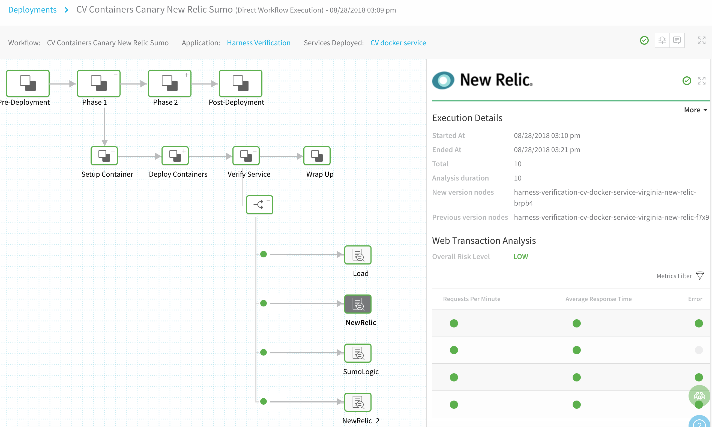

#### Continuous Verification

You can also see the evaluation in the **Continuous Verification** dashboard. The workflow verification view is for the DevOps user who developed the workflow. The **Continuous Verification** dashboard is where all future deployments are displayed for developers and others interested in deployment analysis.

To learn about the verification analysis features, see the following sections.

#### Transaction Analysis

|  |  |
| --- | --- |
| **Execution details**See the details of verification execution. Total is the total time the verification step took, and Analysis duration is how long the analysis took.**Risk level analysis**Get an overall risk level and view the cluster chart to see events.**Transaction-level summary**See a summary of each transaction with the query string, error values comparison, and a risk analysis summary. | 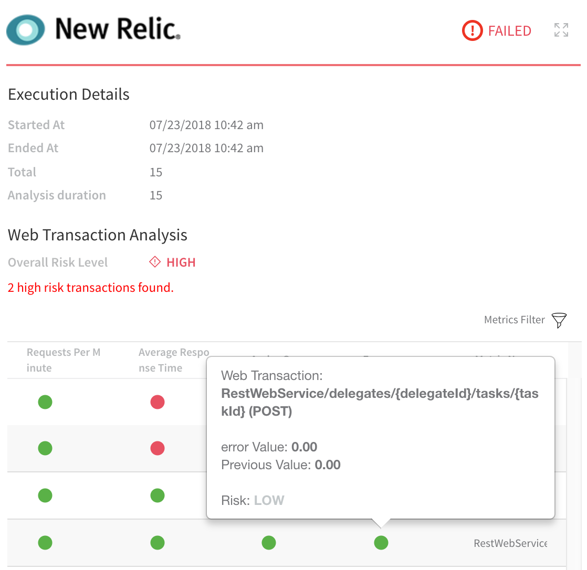 |

#### Execution Analysis

|  |  |
| --- | --- |
| 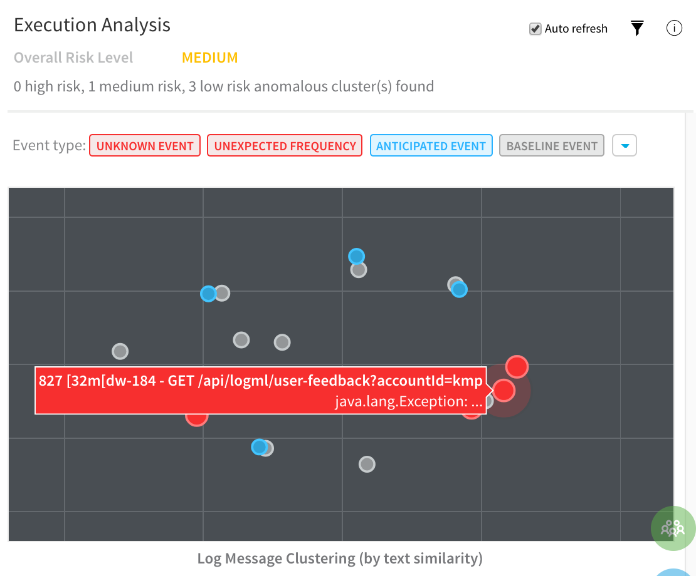  | **Event type**Filter cluster chart events by Unknown Event, Unexpected Frequency, Anticipated Event, Baseline Event, and Ignore Event.**Cluster chart**View the chart to see how the selected event contrast. Click each event to see its log details. |

#### Event Management

|  |  |
| --- | --- |
| **Event-level analysis**See the threat level for each event captured.**Tune event capture**Remove events from analysis at the service, workflow, execution, or overall level.**Event distribution**Click the chart icon to see an event distribution including the measured data, baseline data, and event frequency. |  |

### Next Steps

* [Troubleshoot Deployment Verification with New Relic](5-troubleshooting-new-relic.md)

