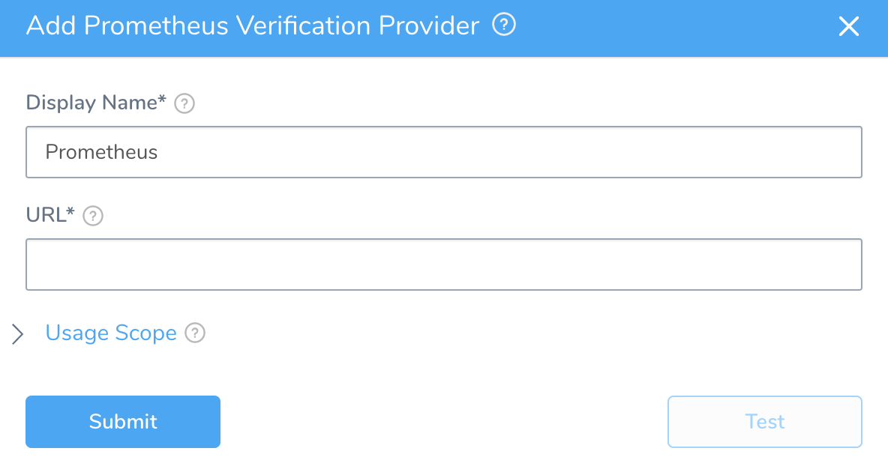

The first step in using Prometheus with Harness is to set up a Prometheus Verification Provider in Harness.

A Harness Verification Provider is a connection to monitoring tools such as Prometheus. Once Harness is connected, you can use Harness 24/7 Service Guard and Deployment Verification with your Prometheus data and analysis.

### Before You Begin

* See the [Prometheus Verification Overview](../continuous-verification-overview/concepts-cv/prometheus-verification-overview.md).

### Step 1: Add Prometheus Verification Provider

To add Prometheus as a Verification Provider, do the following:

1. Click **Setup**.
2. Click **Connectors**, and then click **Verification Providers**.
3. Click **Add Verification Provider**, and select **Prometheus**. The **Add Prometheus Verification** **Provider** dialog appears.

### Step 2: URL

Enter the URL of the server.

You cannot use a Grafana URL.

### Step 3: Display Name

Enter a display name for the provider. If you are going to use multiple providers of the same type, ensure you give each provider a different name.

### Step 4: Usage Scope

If you want to restrict the use of a provider to specific applications and environments, do the following:

In **Usage Scope**, click the drop-down under **Applications**, and click the name of the application.

In **Environments**, click the name of the environment.

### Next Steps

* [Monitor Applications 24/7 with Prometheus](2-24-7-service-guard-for-prometheus.md)
* [Verify Deployments with Prometheus](3-verify-deployments-with-prometheus.md)

