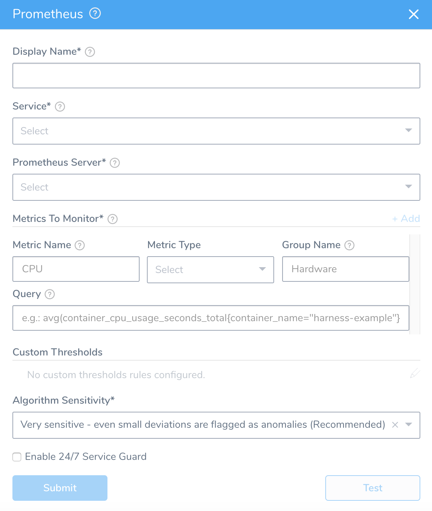
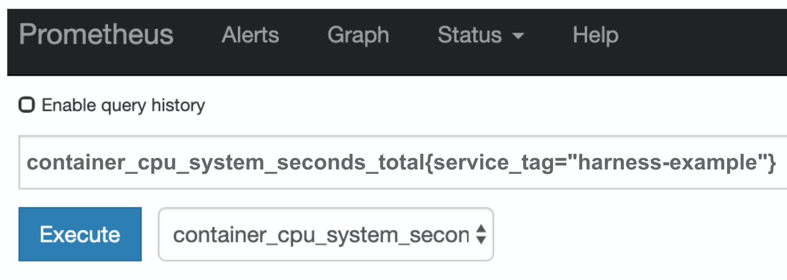
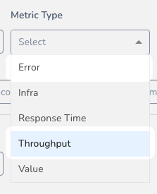

Harness 24/7 Service Guard monitors your live applications, catching problems that surface minutes or hours following deployment. For more information, see [24/7 Service Guard Overview](../continuous-verification-overview/concepts-cv/24-7-service-guard-overview.md).

Harness 24/7 Service Guard differs from Deployment Verification in that it monitors the live microservice whereas Deployment Verification monitors the hosts and nodes for the first 15 minutes following steady state.

You can add your Prometheus monitoring to Harness 24/7 Service Guard in your Harness Application Environment. See [Connect to Prometheus](1-prometheus-connection-setup.md).

This section assumes you have a Harness Application set up and containing a Service and Environment. For steps on setting up a Harness Application, see [Application Checklist](../../model-cd-pipeline/applications/application-configuration.md).

### Before You Begin

* Set up a Harness Application, containing a Service and Environment. See [Create an Application](../../model-cd-pipeline/applications/application-configuration.md).
* See the [Prometheus Verification Overview](../continuous-verification-overview/concepts-cv/prometheus-verification-overview.md).

### Visual Summary

Here's an example of a 24/7 Service Guard configuration for Prometheus.

### Step 1: Set Up 24/7 Service Guard for Prometheus

To set up 24/7 Service Guard for Prometheus, do the following:

1. Ensure that you have added Prometheus as a Harness Verification Provider, as described in [Connect to Prometheus](1-prometheus-connection-setup.md).
2. In your Harness Application, ensure that you have added a Service, as described in [Services](../../model-cd-pipeline/setup-services/service-configuration.md). For 24/7 Service Guard, you do not need to add an Artifact Source to the Service, or configure its settings. You simply need to create a Service and name it. It will represent your application for 24/7 Service Guard.
3. In your Harness Application, click **Environments**.
4. In **Environments**, ensure that you have added an Environment for the Service you added. For steps on adding an Environment, see [Environments](../../model-cd-pipeline/environments/environment-configuration.md).
5. Click the Environment for your Service. Typically, the **Environment Type** is **Production**.
6. In the **Environment** page, locate **24/7 Service Guard**.

   
   
7. In **24/7 Service Guard**, click **Add Service Verification**, and then click **Prometheus**. The **Prometheus** dialog appears.

   

The **Prometheus** dialog has the following fields.

For 24/7 Service Guard, the queries you define to collect logs are specific to the Application or Service you want monitored. (Verification is Application/Service level.) This is unlike Workflows, where deployment verification is performed at the host/node/pod level.

### Step 2: Display Name

Enter the name to identify this Service's Prometheus monitoring on the 24/7 Service Guard dashboard.

### Step 3: Service

The Harness Service to monitor with 24/7 Service Guard.

### Step 4: Prometheus Server

Select the server you added when setting up the [Connect to Prometheus](1-prometheus-connection-setup.md).

### Step 5: Metric to Monitor

Every time series is uniquely identified by its metric name and a set of key-value pairs, also known as labels. For more information, see [Data Model](https://prometheus.io/docs/concepts/data_model/) from Prometheus. A metric requires the following parameters:

* **Metric Name:** The name of the metric defined in Prometheus.
* **Metric Type:** The type of metric (Response Time, Error, Throughput, or Value).
* **Group Name:** The transaction (service or request context) which the metric relates to. For example, Login or Hardware.
* **Query:** The API query required to retrieve the metric value.

When you add your query in **Query**, you want the query to return a single time series result for the metric and transaction you identify. If it returns multiple results, Harness will not process your verification step.You can simply obtain your query from Prometheus and paste it into Harness.

For example, here is a query in Prometheus:

See [Expression queries](https://prometheus.io/docs/prometheus/latest/querying/api/#expression-queries) from Prometheus for example of queries, but always use the placeholders demonstrated above.

You cannot use the built-in Harness expressions `${service.name}` in the query.

#### Always Use Throughput with Error and Response Time Metrics

Whenever you use the Error metric type, you should also add another metric for Throughput with the same Group Name.

Harness analyze errors as error percentage and without the throughput the error number does not provide much information.

The same setup should used with the Response Time metric also. Whenever you set up a Response Time metric, setup a Throughput metric with the same Group Name.

### Step 6: Custom Thresholds

In the **Custom Thresholds** section, you can define **Ignore Hints**. These are rules that instruct Harness to skip certain metrics/value combinations from verification analysis.

To configure these rules, see [Apply Custom Thresholds to 24/7 Service Guard](../24-7-service-guard/custom-thresholds-24-7.md).

### Step 7: Algorithm Sensitivity

See [CV Strategies, Tuning, and Best Practices](../continuous-verification-overview/concepts-cv/cv-strategies-and-best-practices.md#algorithm-sensitivity-and-failure-criteria).

### Step 8: Enable 24/7 Service Guard

Click the checkbox to enable 24/7 Service Guard.

### Next Steps

* [Verify Deployments with Prometheus](3-verify-deployments-with-prometheus.md)

