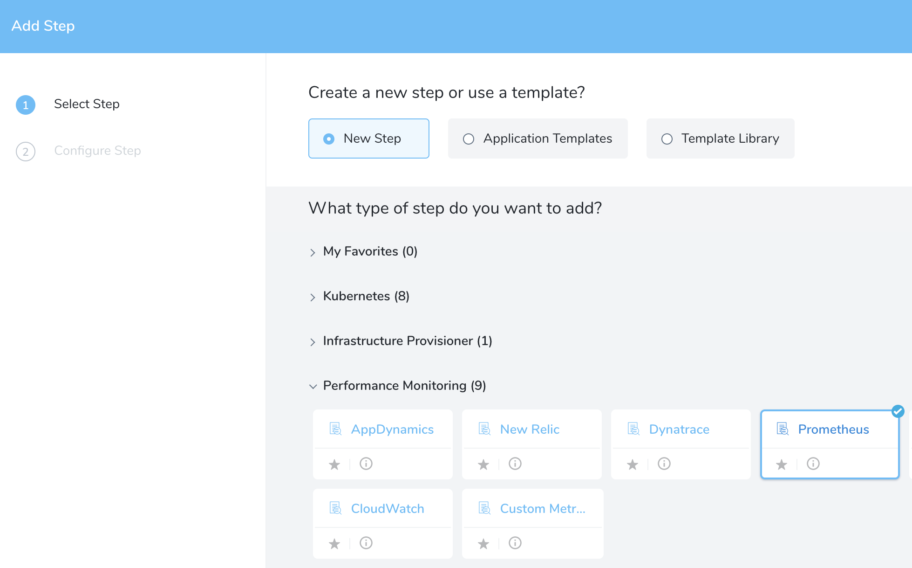
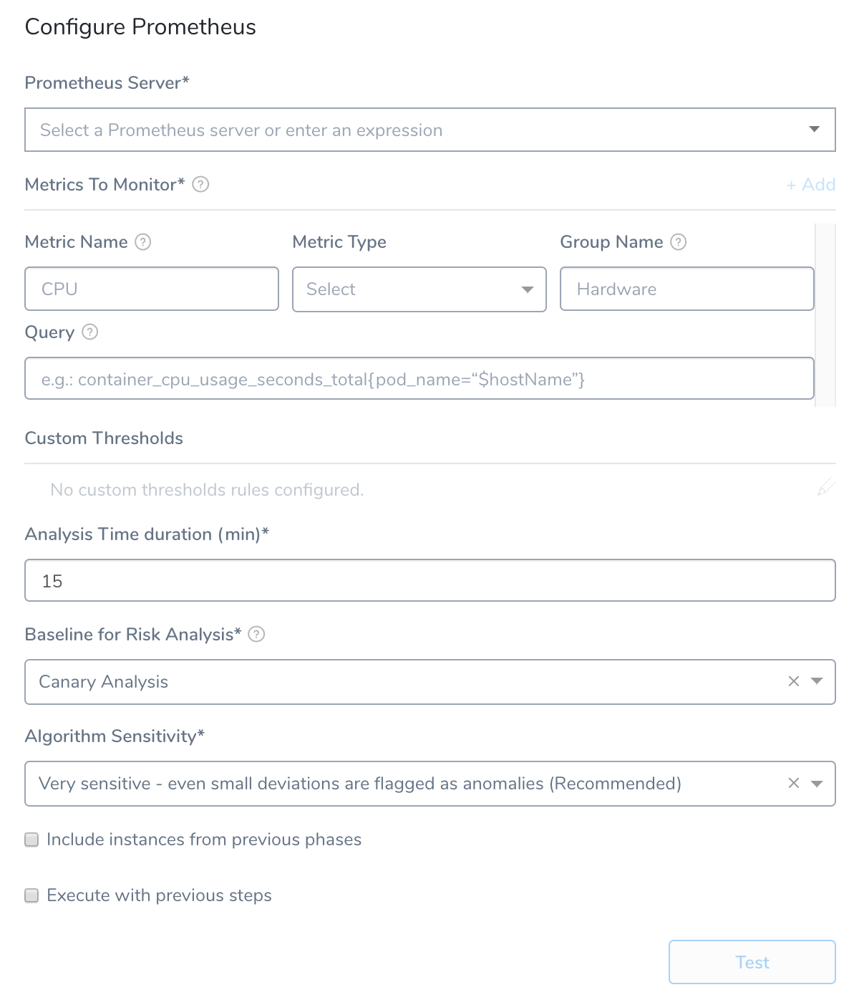
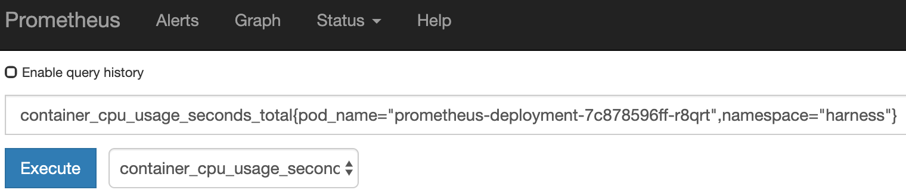
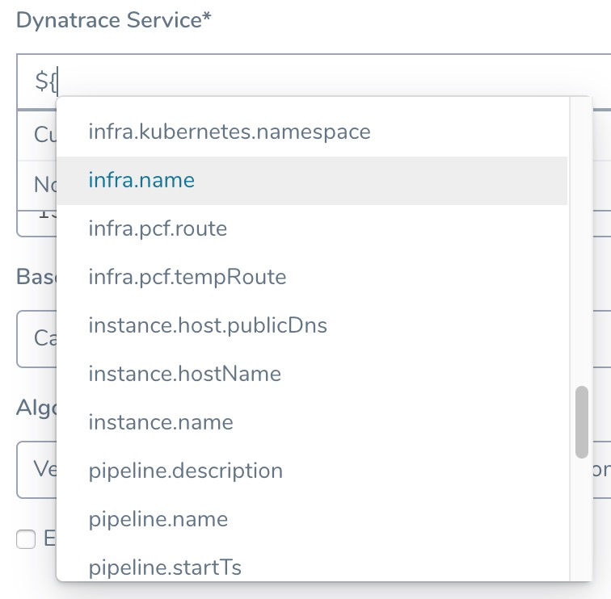

When Harness deploys a new application or service to the target environment defined in the workflow, it will immediately connect to the Prometheus Server and build a model of what it is observing.

Next, Harness compares this model with previous deployment models to identify anomalies or regressions. If necessary, Harness rolls back to the previous working version automatically. For more information, see [Rollback Steps](../../model-cd-pipeline/workflows/workflow-configuration.md#rollback-steps).


### Before You Begin

* Set up a Harness Application, containing a Service and Environment. See  [Create an Application](../../model-cd-pipeline/applications/application-configuration.md).
* See the  Prometheus Verification Overview.

### Visual Summary

Here's an example of a Prometheus setup for verification.


Here is an example of a deployment Pipeline Stage verified using Prometheus.


Under **Prometheus**, you can see that all Prometheus metrics have been validated by the Harness machine learning algorithms. Green indicates that there are no anomalies or regressions identified and the deployment is operating within its normal range.

### Step 1: Set Up the Deployment Verification

To verify your deployment with Prometheus, do the following:

1. Ensure that you have added Prometheus as a verification provider, as described in [Prometheus Connection Setup](1-prometheus-connection-setup.md).
2. In your Workflow, under **Verify Service**, click **Add Verification**.
3. In the resulting **Add Step** settings, select **Performance Monitoring** > **Prometheus**.

   
   
4. Click **Next**. The **Configure****Prometheus** settings appear.

   

The **Configure** **Prometheus** settings include the following fields.

### Step 2: Prometheus Server

Select the server you added when setting up the [Prometheus Connection Setup](1-prometheus-connection-setup.md).

### Step 3: Metrics to Monitor

Every time series is uniquely identified by its metric name and a set of key-value pairs, also known as labels. For more information, see [Data Model](https://prometheus.io/docs/concepts/data_model/) from Prometheus. A metric requires the following parameters:

* **Metric Name:** The name of the metric defined in Prometheus.
* **Metric Type:** The type of metric (Response Time, Error, Infra, Throughput, or Value).
* **Group Name:** The transaction (service or request context) which the metric relates to. For example, Login or Hardware.
* **Query:** The API query required to retrieve the metric value. This query must include a placeholder for hostname, `$hostName`.

When you add your query in **Query**, you want the query to return a single time series result for the metric and transaction you identify. If it returns multiple results, Harness will not process your verification step.For **Query**, you can simply copy your query from Prometheus and paste it into Harness, and then replace the actual hostname in the query with `$hostName`.

For example, here is a query in Prometheus:

[](./static/3-verify-deployments-with-prometheus-05.png)

The actual query string is:

`container_cpu_usage_seconds_total{pod_name="prometheus-deployment-7c878596ff-r8qrt",namespace="harness"}`

When you paste that string into the Query field in Harness, you replace the `pod_name` value with `$hostName`:

`container_cpu_usage_seconds_total{pod_name="$hostName",namespace="harness"}`

#### Always Use Throughput with Error and Response Time Metrics

Whenever you use the Error metric type, you should also add another metric for Throughput with the same Group Name.


Harness analyze errors as error percentage and without the throughput the error number does not provide much information.

The same setup should used with the Response Time metric also. Whenever you set up a Response Time metric, setup a Throughput metric with the same Group Name.


### Step 4: Custom Thresholds

In the **Custom Thresholds** section, define two types of rules that override normal verification behavior:

* **Ignore Hints** instruct Harness to skip certain metrics/value combinations from verification analysis.
* **Fast-Fail Hints** cause a Workflow to promptly enter a failed state.

To configure these rules, see [Apply Custom Thresholds to Deployment Verification](../tuning-tracking-verification/custom-thresholds.md).

### Step 5: Analysis Time Duration

Set the duration for the verification step. If a verification step exceeds the value, the workflow [Failure Strategy](../../model-cd-pipeline/workflows/workflow-configuration.md#failure-strategy) is triggered. For example, if the Failure Strategy is **Ignore**, then the verification state is marked **Failed** but the workflow execution continues.

See [CV Strategies, Tuning, and Best Practices](../continuous-verification-overview/concepts-cv/cv-strategies-and-best-practices.md#analysis-time-duration).

### Step 6: Baseline for Risk Analysis

**Canary Analysis:** (Available in Workflows using the **Canary** and **Rolling** Workflow Types) 

Harness will compare the metrics received for the nodes deployed in each phase with metrics received for the rest of the nodes in the application. For example, if this phase deploys to 25% of your nodes, the metrics received from Prometheus during this deployment for these nodes will be compared with metrics received for the other 75% during the defined period of time.

**Previous Analysis:** (Available in Workflows using the **Basic**, **Blue/Green**, and **Rolling** Workflow Types)

Harness will compare the metrics received for the nodes deployed in each phase with metrics received for all the nodes during the previous deployment. For example, if this phase deploys V1.2 to node A, the metrics received from Prometheus during this deployment will be compared to the metrics for nodes A, B, and C during the previous deployment (V1.1). Previous Analysis is best used when you have predictable load, such as in a QA environment.

See [CV Strategies, Tuning, and Best Practices](../continuous-verification-overview/concepts-cv/cv-strategies-and-best-practices.md).

### Step 7: Algorithm Sensitivity

See [CV Strategies, Tuning, and Best Practices](../continuous-verification-overview/concepts-cv/cv-strategies-and-best-practices.md#algorithm-sensitivity-and-failure-criteria).

### Step 8: Include instances from previous phases

If you are using this verification step in a multi-phase deployment, select this checkbox to include instances used in previous phases when collecting data. Do not apply this setting to the first phase in a multi-phase deployment.

### Step 9: Execute with previous steps

Check this checkbox to run this verification step in parallel with the previous steps in **Verify Service**.

### Step 10: Test Configuration

Click **Test**.

If a multiple time series error occurs as follows, add more filters to your query to configure successfully.


```
Error while saving Prometheus configuration. Multiple time series values are returned for metric name CPU and group name Hardware. Please add more filters to your query to return only one time series.
```
Update your query to add more filters (like container\_name = "POD"), as follows:


```
query=container_cpu_usage_seconds_total{pod_name="$hostName", container_name="POD"}
```
### Review: Harness Expression Support in CV Settings

You can use expressions (`${...}`) for [Harness built-in variables](https://docs.harness.io/article/7bpdtvhq92-workflow-variables-expressions) and custom [Service](../../model-cd-pipeline/setup-services/service-configuration.md) and [Workflow](../../model-cd-pipeline/workflows/add-workflow-variables-new-template.md) variables in the settings of Harness Verification Providers.



Expression support lets you template your Workflow verification steps. You can add custom expressions for settings, and then provide values for those settings at deployment runtime. Or you can use Harness built-in variable expressions and Harness will provide values at deployment runtime automatically.

### Step 11: View Verification Results

When Harness deploys a new application or service to the target environment defined in the workflow, it will immediately connect to the Prometheus Server and build a model of what it is observing.

Next, Harness compares this model with previous deployment models to identify anomalies or regressions. If necessary, Harness rolls back to the previous working version automatically. For more information, see [Rollback Steps](../../model-cd-pipeline/workflows/workflow-configuration.md#rollback-steps).

Here is an example of a deployment Pipeline Stage verified using Prometheus.


Under **Prometheus**, you can see that all Prometheus metrics have been validated by the Harness machine learning algorithms. Green indicates that there are no anomalies or regressions identified and the deployment is operating within its normal range.

To see an overview of the verification UI elements, see [Continuous Verification Tools](https://docs.harness.io/article/xldc13iv1y-meet-harness#-continuous-verification-tools-).

### Next Steps

* [Configuration as Code](https://docs.harness.io/article/htvzryeqjw-configuration-as-code)
* [Managing Users and Groups (RBAC)](https://docs.harness.io/article/ven0bvulsj-users-and-permissions)

