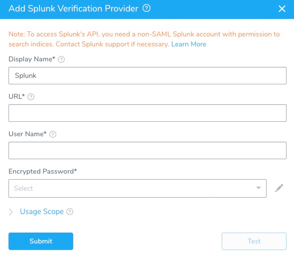

The first step in using Splunk with Harness is to set up an Splunk Verification Provider in Harness.

A Harness Verification Provider is a connection to monitoring tools such as Bugsnag. Once Harness is connected, you can use Harness 24/7 Service Guard and Deployment Verification with your Splunk data and analysis.

### Before You Begin

* See the [Splunk Verification Overview](../continuous-verification-overview/concepts-cv/splunk-verification-overview.md).

### Step 1: Assign Permissions for API Connection

Splunk APIs require that you authenticate with a non-SAML account. To access your Splunk Cloud deployment using the Splunk REST API and SDKs, submit a support case requesting access on the Support Portal. For managed deployments, Splunk Support opens port 8089 for REST access. You can specify a range of IP addresses to control who can access the REST API. For self-service deployments, Splunk Support defines a dedicated user and sends you credentials that enable that user to access the REST API. For information on Splunk self-service accounts, see [Using the REST API with Splunk Cloud](http://docs.splunk.com/Documentation/Splunk/7.2.0/RESTTUT/RESTandCloud).

Ensure that the Splunk user account used to authenticate Harness with Splunk is assigned to a role that contains the following REST-related capabilities:

* Search.
* Access to the indexes you want to search.

#### Permissions Setup Example

Here, we've created a new Splunk role named **Harness User**, and assigned it search capability:


We've given this role access to **All non-internal indexes**. However, we could restrict the access to only the few relevant indexes:


### Step 2: Add Splunk Verification Provider

To add Splunk as a verification provider, do the following:

1. Click **Setup**.
2. Click **Connectors**.
3. Click **Verification Providers**.
4. Click **Add Verification Provider**, and select **Splunk**. The **Add Splunk Verification Provider** dialog appears.

  
  
  The **Add Splunk Verification Provider** dialog has the following fields.

### Step 3: URL

Enter the URL for accessing the REST API on the Splunk server. Include the port number in the format **https://&lt;deployment-name&gt;.cloud.splunk.com:8089**: The default port number is 8089.The port number is required for hosted Splunk, also. For example: **https://mycompany.splunkcloud.com:8089**.For more information, see [Using the REST API with Splunk Cloud](http://docs.splunk.com/Documentation/Splunk/7.1.3/RESTTUT/RESTandCloud) from Splunk.

### Step 4: Username and Encrypted Password

For secrets and other sensitive settings, select or create a new [Harness Encrypted Text secret](https://docs.harness.io/article/ygyvp998mu-use-encrypted-text-secrets).Enter the account credentials to authenticate with the server. A user role that is **not** authenticated with SAML is required. You do not need an admin role.

### Step 5: Display Name

Enter a display name for the provider. If you are going to use multiple providers of the same type, ensure you give each provider a different name.

### Step 6: Usage Scope

Usage scope is inherited from the secrets used in the settings.

### Step 7: Test Delegate Connection to Splunk Server

**Delegate connection** — If the Test button fails, you can use the following script to verify that the Harness Delegate's host can connect to the Splunk server:


```
curl -k https://<splunkURL>:8089/services/auth/login --data-urlencode username=<userName> --data-urlencode password='<password>'
```
If this script fails, it is likely that the host running the Harness Delegate has networking issues, or there is an authentication issue.

**Search Job Permission** — As part of validating the configuration, Harness creates a search job as a test. This test will fail if the user account used for the Harness Splunk Verification Provider does not have the permission to search jobs.

To test if the user account can run searches, use the following cURL command.


```
curl -u admin:changeme -k https://localhost:8089/services/search/jobs -d search="search *"
```
### Next Steps

* [Monitor Applications 24/7 with Splunk](2-24-7-service-guard-for-splunk.md)
* [Verify Deployments with Splunk](3-verify-deployments-with-splunk.md)

