The following procedure describes how to add Splunk as a verification step in a Harness workflow. For more information about workflows, see [Add a Workflow](../../model-cd-pipeline/workflows/workflow-configuration.md).

Once you run a deployment and Splunk preforms verification, Harness' machine-learning verification analysis will assess the risk level of the deployment.

In order to obtain the names of the host(s), pod(s), or container(s) where your service is deployed, the verification provider should be added to your workflow **after** you have run at least one successful deployment.


### Before You Begin

* See the [Splunk Verification Overview](../continuous-verification-overview/concepts-cv/splunk-verification-overview.md).
* See [Monitor Applications 24/7 with Splunk](2-24-7-service-guard-for-splunk.md).

### Visual Summary

Here's an example configuration of the Splunk Deployment Verification.

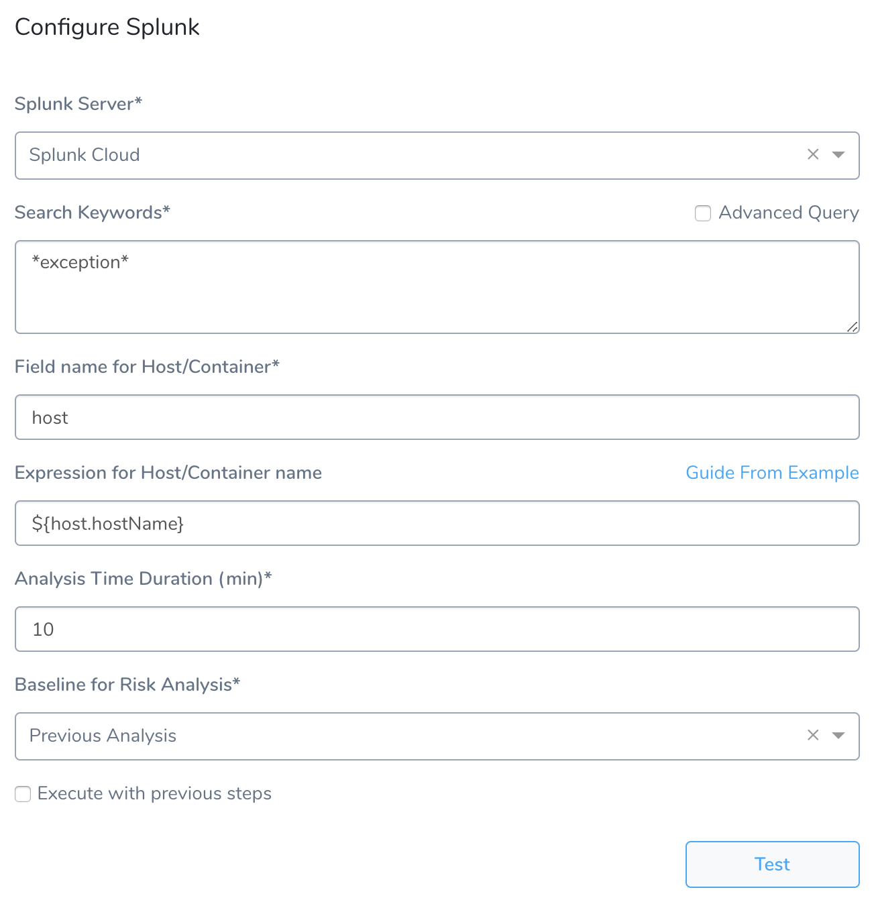

### Step 1: Set Up the Deployment Verification

To verify your deployment with Splunk, do the following:

1. Ensure that you have added Splunk as a verification provider, as described in [Splunk Connection Setup](1-splunk-connection-setup.md).
2. In your Workflow, under **Verify Service**, click **Add Verification**.
3. In the resulting **Add Step** settings, select **Log Analysis** > **Splunk**.

   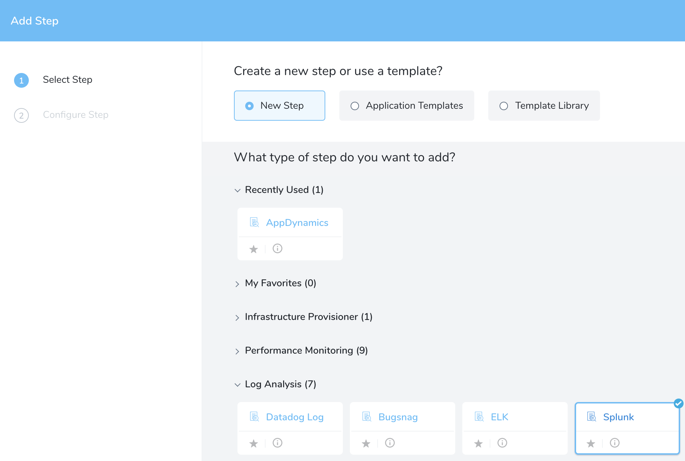
   
4. Click **Next**. The **Configure Splunk** settings appear.

  

These settings include the following fields.

### Step 2: Splunk Server

Select the Harness Verification Provider you configured using your Splunk account.

You can templatize the **Splunk Server** setting by clicking the **[T]** button. This puts the expression `${Splunk_Server}` in the **Splunk Server** setting. You can change the variable name in the expression.

When you templatize the **Splunk Server** setting, it creates a [Workflow variable](../../model-cd-pipeline/workflows/workflow-configuration.md#add-workflow-variables), which is a parameter that must be given a value when the Workflow is deployed.

The following diagram shows the templatized **Splunk Server** setting, the Workflow variable it creates, and how you can provide a value when you deploy the Workflow.

[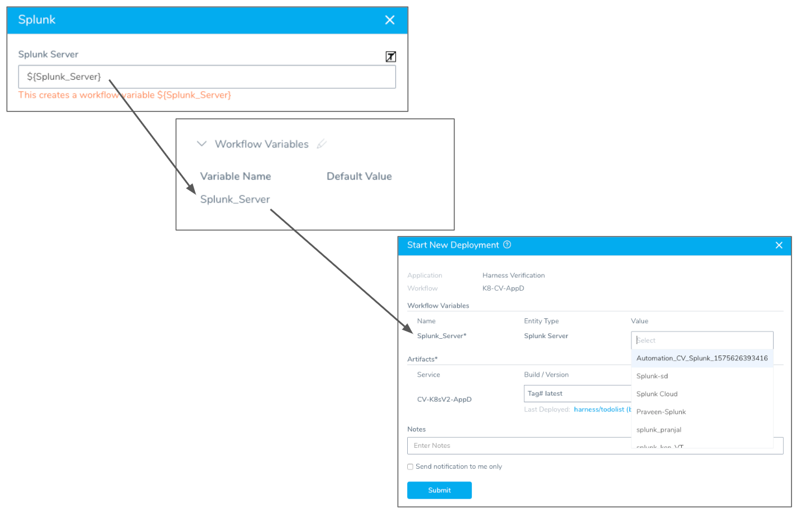](./static/3-verify-deployments-with-splunk-10.png)

### Step 3: Search Keywords

Enter a search term or query. To search for all exceptions, use asterisks (\*) around **exception**, for example, **\*exception\***. For more information, see [Retrieve events from the index](http://docs.splunk.com/Documentation/Splunk/7.2.0/SearchTutorial/Startsearching#Retrieve_events_from_the_index) from Splunk.

When you enter a search such as **\*exception\***, at runtime Harness will generate a query containing your search and information Harness needs to perform verification, such as the information following **\*exception\*** below:


```
search *exception* host = ip-172-31-81-88 | bin _time span=1m |    
cluster t=0.9999 showcount=t labelonly=t|  
table _time, _raw,cluster_label, host |  
stats latest(_raw) as _raw count as cluster_count by _time,cluster_label,host
```
If you want more flexibility in your search, or to repurpose Splunk searches you already have, you can click **Advanced Query** and enter whatever you like in **Search Keywords**. For example, you could replace **\*exception\*** with an existing Splunk search like `search index=*prod *exception*`.

Note that you will specify host field name and host/pod/container name in other settings so you do not need to include them in the search query.

### Step 4: Field name for Host/Container

Typically, you will enter **host**. You can enter **host** into the Splunk **Search** field to see the host for your Harness deployment:

[](./static/3-verify-deployments-with-splunk-12.png)

### Step 5: Expression for Host/Container name

See [Guide From Example](#guide_from_example).

### Step 6: Analysis Time duration

Set the duration for the verification step. If a verification step exceeds the value, the workflow [Failure Strategy](../../model-cd-pipeline/workflows/workflow-configuration.md#failure-strategy) is triggered. For example, if the Failure Strategy is **Ignore**, then the verification state is marked **Failed** but the workflow execution continues.

See [CV Strategies, Tuning, and Best Practices](../continuous-verification-overview/concepts-cv/cv-strategies-and-best-practices.md#analysis-time-duration).

### Step 7: Baseline for Risk Analysis

**Canary Analysis** - Harness will compare the metrics received for the nodes deployed in each phase with metrics received for the rest of the nodes in the application. For example, if this phase deploys to 25% of your nodes, the metrics received from Splunk during this deployment for these nodes will be compared with metrics received for the other 75% during the defined period of time.

**Previous Analysis** - Harness will compare the metrics received for the nodes deployed in each phase with metrics received for all the nodes during the previous deployment. For example, if this phase deploys V1.2 to node A, the metrics received from Splunk during this deployment will be compared to the metrics for nodes A, B, and C during the previous deployment (V1.1).

See [CV Strategies, Tuning, and Best Practices](../continuous-verification-overview/concepts-cv/cv-strategies-and-best-practices.md).

### Step 8: Execute with previous steps

Check this checkbox to run this verification step in parallel with the previous steps in **Verify Service**.

### Option: Use Guide from Example - Host field

This section uses a **host** field for the **Expression for Host/Container name** field. For Kubernetes, see [Kubernetes and Splunk](3-verify-deployments-with-splunk.md#kubernetes-and-splunk).In the Splunk verification step dialog, you can see the **Guide From Example** option next to the **Expression for Host/Container name** field. This option lets you select the host(s), pod(s), or container(s) for Harness to use when performing verification.

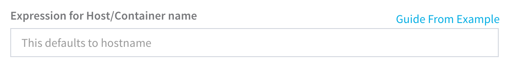

You select the host, pod, or container in **Guide From Example**, and an expression is added to the **Expression for Host/Container name** field. The default expression is `${instance.host.hostName}`. Typically, you can simply use `${instance.host.hostName}`.

For AWS EC2 hostnames, use the expression `${instance.hostName`}.In order to obtain the names of the host(s) pod(s), or container(s) where your service is deployed, the verification provider should be added to your workflow **after** you have run at least one successful deployment. Then the **Guide From Example** feature can display the host or container name(s) for you to select.To ensure that you pick the right name when using **Guide From Example**, you can use a host name in Splunk as a guide.

To use **Guide From Example** for a host or container name expression, do the following:

1. In **Splunk**, click **App: Search & Reporting**, and then click **Search & Reporting**.

   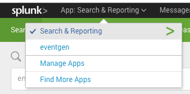
   
2. In **Search**, enter **host** to see a list of the available hosts being tracked.

   
   
3. Click the name of your host to add it to the search, select a date range, and click the search icon. The event log entries for the host appear.

   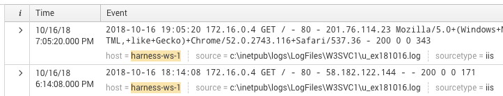
   
   The name of the host can be seen in the event message, next to **host =**. The expression that you provide in the **Expression for Host/Container Name** field in the Harness **Splunk** dialog should evaluate to the name here.

    You might have a different label than **host**, such as **pod\_name**. You simply use the label that identifies the host or container.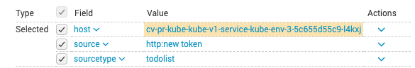

4. In your Harness workflow **Splunk** dialog, click **Guide From Example**. The **Expression for Host Name** popover appears.

   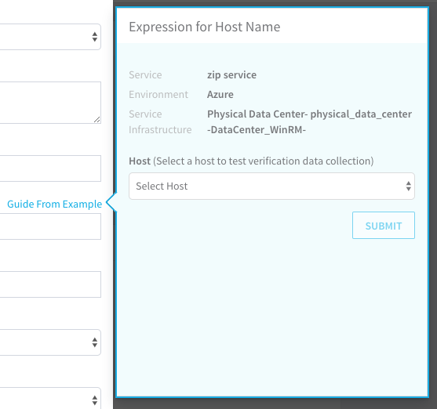
   
   The dialog shows the service, environment, and service infrastructure used for this workflow.
   
5. In **Host**, click the name of the host to use when testing verification. Match the hostname from the Splunk Search to the hostname in the **Expression for Host Name** popover:

   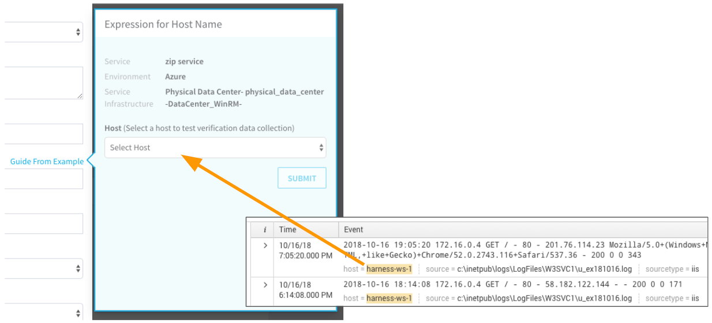

6. Click **SUBMIT**. The YAML for the host appears. Look for the **host** section.

   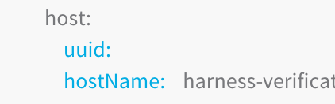

   You want to use a **hostName** label in the **host** section. Do not use a **hostName** label outside of that section.
  
   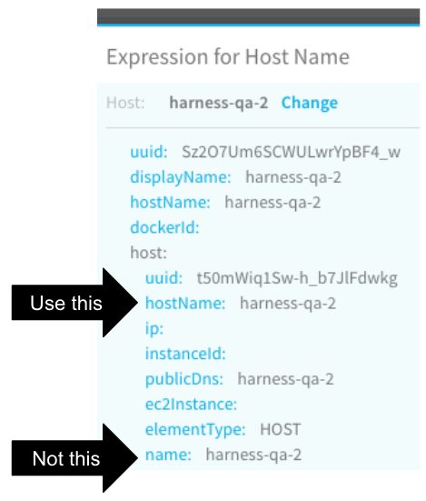

7. Click the **hostName** label. The variable name is added to the **Expression for Host/Container name** field.

   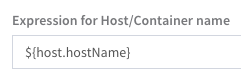

8. At the bottom of the Splunk dialog, click **TEST**. A new **Expression for Host Name** popover appears.

  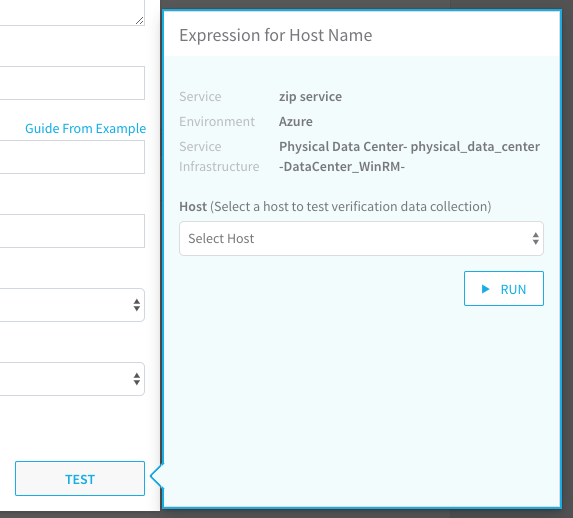

9. In **Host**, select the same host you selected last time, and then click **RUN**. Verification information for the host is found. In there is no verification data for the selected node, the test will display connection information only.

   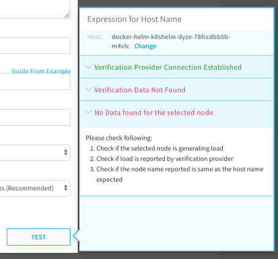

10. Click back in the **Splunk** dialog and click **SUBMIT**. The Splunk verification step is added to your workflow.

   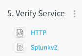

### Option: Use Guide from Example - Kubernetes

In the **Guide From Example** section above we used a **host** example for the **Expression for Host/Container name** field, but if the Workflow is deploying Kubernetes, you will likely use **pod** or **pod\_name** or a custom label.

For Kubernetes deployments, your Splunk account must perform Kubernetes log collection. This is typically done using [Splunk Connect for Kubernetes](https://github.com/splunk/splunk-connect-for-kubernetes). For information on using Splunk Connect, see [Deploy Splunk Enterprise on Kubernetes](https://www.splunk.com/blog/2018/12/17/deploy-splunk-enterprise-on-kubernetes-splunk-connect-for-kubernetes-and-splunk-insights-for-containers-beta-part-1.html) on the Splunk Blog.

In addition, the Splunk [fields.conf](https://docs.splunk.com/Documentation/ITSI/4.2.1/Configure/fields.conf) file should contain the following fields in order to search Kubernetes logs in Splunk:


```
 [namespace]  
 INDEXED = true  
   
 [pod]  
 INDEXED = true  
   
 [container_name]  
 INDEXED = true  
   
 [container_id]  
 INDEXED = true  
   
 [cluster_name]  
 INDEXED = true
```
You can edit fields.conf in `$SPLUNK_HOME/etc/system/local/fields.conf` or in a custom app directory `$SPLUNK_HOME/etc/apps/myapp/local/fields.conf`.

Ensure that your Kubernetes deployment is set up to log what you need. See [Logging Architecture](https://kubernetes.io/docs/concepts/cluster-administration/logging/) from Kubernetes.

### Review: Harness Expression Support in CV Settings

You can use expressions (`${...}`) for [Harness built-in variables](https://docs.harness.io/article/7bpdtvhq92-workflow-variables-expressions) and custom [Service](../../model-cd-pipeline/setup-services/service-configuration.md) and [Workflow](../../model-cd-pipeline/workflows/add-workflow-variables-new-template.md) variables in the settings of Harness Verification Providers.


Expression support lets you template your Workflow verification steps. You can add custom expressions for settings, and then provide values for those settings at deployment runtime. Or you can use Harness built-in variable expressions and Harness will provide values at deployment runtime automatically.

### Step 9: View Verification Results

Once you have deployed your workflow (or pipeline) using the Splunk verification step, you can automatically verify app performance across your deployment. For more information, see [Add a Workflow](../../model-cd-pipeline/workflows/workflow-configuration.md) and [Add a Pipeline](../../model-cd-pipeline/pipelines/pipeline-configuration.md).

#### Workflow Verification

After you add the Splunk verification step to your workflow, the next time you deploy the workflow you will see the Splunk verification step running:

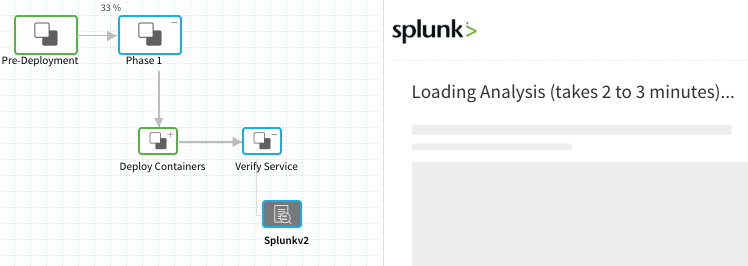

To see the results of Harness machine-learning evaluation of your Splunk verification, in your workflow or pipeline deployment you can expand the **Verify Service** step and then click the **Splunk** step.

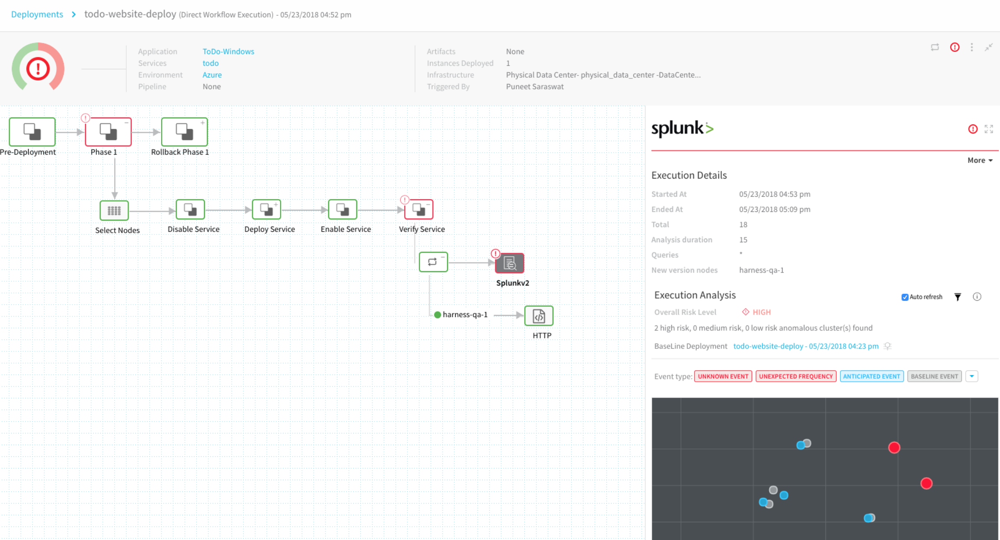

#### Continuous Verification

You can also see the evaluation in the **Continuous Verification** dashboard. The workflow verification view is for the DevOps user who developed the workflow. The **Continuous Verification** dashboard is where all future deployments are displayed for developers and others interested in deployment analysis.

To learn about the verification analysis features, see the following sections.

##### Transaction Analysis

**Execution details:** See the details of verification execution. Total is the total time the verification step took, and Analysis duration is how long the analysis took.

**Risk level analysis:** Get an overall risk level and view the cluster chart to see events.

**Transaction-level summary:** See a summary of each transaction with the query string, error values comparison, and a risk analysis summary.  

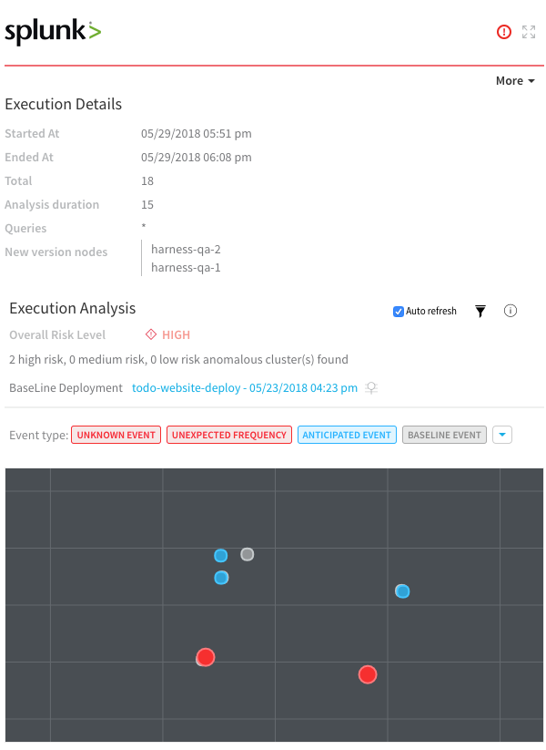


##### Execution Analysis

**Event type:** Filter cluster chart events by Unknown Event, Unexpected Frequency, Anticipated Event, Baseline Event, and Ignore Event.

**Cluster chart:** View the chart to see how the selected event contrast. Click each event to see its log details.

 

##### Event Management

**Event-level analysis:** See the threat level for each event captured.

**Tune event capture:** Remove events from analysis at the service, workflow, execution, or overall level.

**Event distribution:** Click the chart icon to see an event distribution including the measured data, baseline data, and event frequency. 

### Next Steps

* [Configuration as Code](https://docs.harness.io/article/htvzryeqjw-configuration-as-code)
* [Users and Permissions](https://docs.harness.io/article/ven0bvulsj-users-and-permissions)

