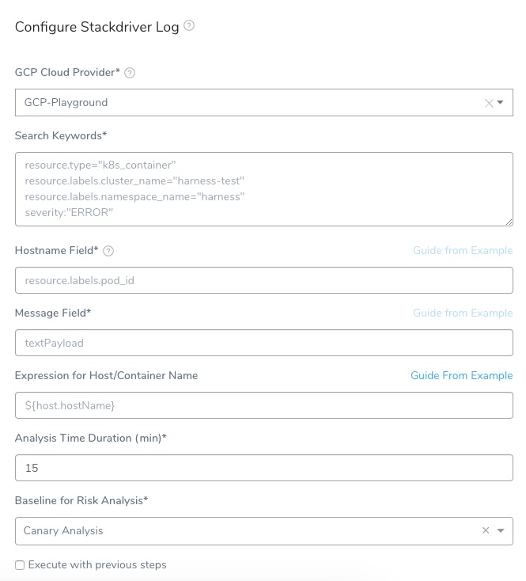
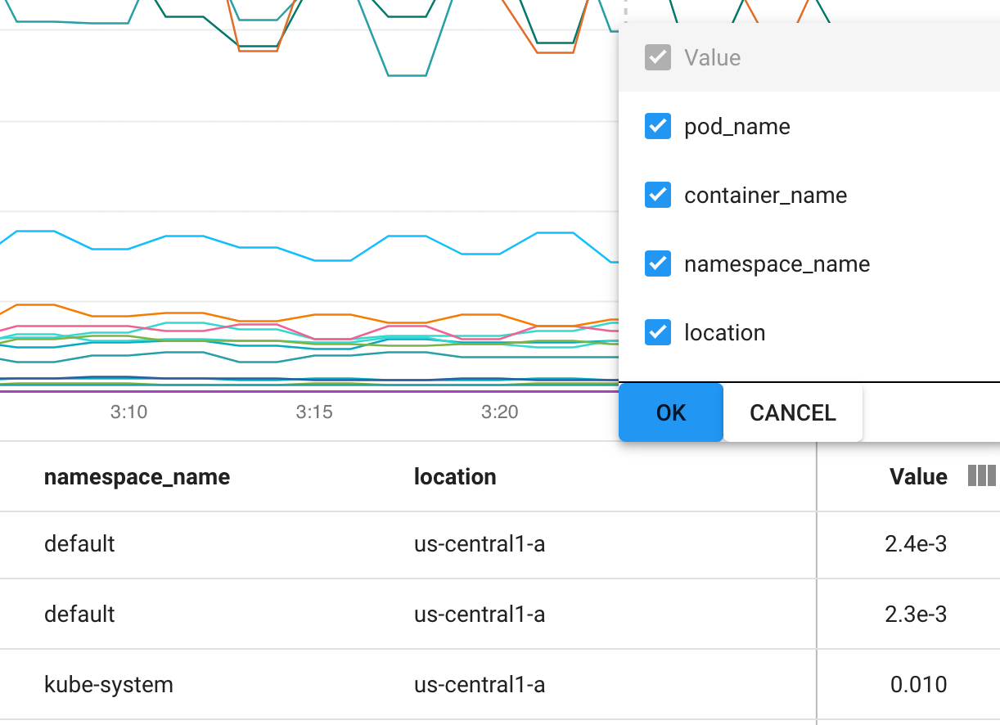
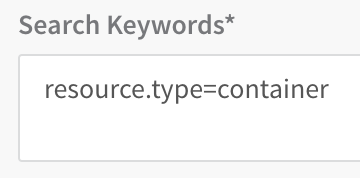
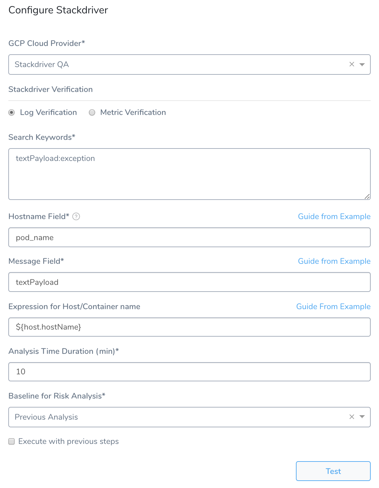

Harness can analyze Stackdriver data and analysis to verify, rollback, and improve deployments. To apply this analysis to your deployments, you set up Stackdriver as a verification step in a Harness Workflow.

This topic covers how to set up Stackdriver Logs in a Harness Workflow, and provides a summary of Harness verification results.

In order to obtain the names of the host(s), pod(s), or container(s) where your service is deployed, the verification provider should be added to your workflow *after* you have run at least one successful deployment.

### Before You Begin

* Set up a Harness Application, containing a Service and Environment. See [Create an Application](../../model-cd-pipeline/applications/application-configuration.md).
* See the [Stackdriver Verification Overview](../continuous-verification-overview/concepts-cv/stackdriver-and-harness-overview.md).

### Visual Summary

Here's an example of a completed Stackdriver setup for verification.



### Step 1: Set up the Deployment Verification

To verify your deployment with Stackdriver, do the following:

1. Ensure that you have added Google Cloud Platform as a Cloud Provider provider, as described in [Connect to Stackdriver](stackdriver-connection-setup.md).
2. In your Workflow, under **Verify Service**, click **Add Step**.
3. In the resulting **Add Step** settings, select **Log Analysis** > **Stackdriver**.
4. Click **Next**. The **Configure****Stackdriver** settings appear.
5. In **GCP Cloud Provider**, select the [Google Cloud Platform (GCP) Cloud Provider](https://docs.harness.io/article/whwnovprrb-cloud-providers#google_cloud_platform_gcp) you set up in Harness.  
   You can also enter variable expressions, such as: `${serviceVariable.stackdriver_connector_name}`.

   If the **GCP Cloud Provider** field contains an expression, the **Region** field must also use an expression.1. In **Region**, select the GCP [region](https://cloud.google.com/compute/docs/regions-zones/) where the application is hosted. The Stackdriver API uses a service-specific notion of location. Harness uses the name of a region. You can find the region in Stackdriver Metrics Explorer by selecting the **location** column:

   

   You can also enter a variable expression for the region, such as `${env.name}`.Because Harness does not currently support multi-region load balancers, you must add a Stackdriver step for each region. If the **GCP Cloud Provider** field contains an expression, the **Region** field must also use an expression.
   
6. Select **Log Verification**.

### Step 2: Search Keywords

Enter search keywords for your query. You can use the same filters you have in GCP **Logs Viewer**.


Simply copy a filer entry into **Search Keywords**:



To use multiple filter entries, you can place an **AND** between them or use multiline entries. For example:


For advanced filter examples, see [Advanced filters library](https://cloud.google.com/logging/docs/view/filters-library) from GCP.

#### Troubleshooting queries

Once you try to verify the deployment and you can encounter an error as follows:

`Execution logs are not available for old executions.`

**Solution**

Update your query to include the required statement (`jsonPayload.message:*` in this case), as follows:


```
resource.type="k8s_container" resource.labels.cluster_name="guse4-kube-poc" resource.labels.namespace_name="rc"   
resource.labels.container_name="hello-container"   
jsonPayload.message:*   
severity="ERROR"
```
### Step 3: Host Name Field

Enter the log field that contains the name of the host for which you want logs. You can enter a pod ID or name.

For example, the query in **Search Keywords** looks for pods labelled `nginx-deployment`:


```
resource.type="container"  
resource.labels.pod_id:"nginx-deployment-"
```
In **Host Name Field**, you would enter **pod\_id** because it is the log field containing the pod name. In a log, this field will be in the resource section:


```
...  
 resource: {  
  labels: {  
   cluster_name:  "doc-example"      
   container_name:  "harness-delegate-instance"      
   instance_id:  "1733097732247470454"      
   namespace_id:  "harness-delegate"      
 **pod\_id: "harness-sample-k8s-delegate-wverks-0"**   project_id:  "exploration-161417"      
   zone:  "us-central1-a"      
  }  
  type:  "container"     
 }  
...
```
### Step 4: Message Field

Enter the field by which the messages are usually indexed. You can also enter variable expressions, such as: `${serviceVariable.message_field}`.

#### Troubleshooting Message Field Entries

If you select `jsonPayload.message` as Message Field, but the queries return log messages that do not have the field `jsonPayload.message`, the workflow will fail.

**Solution**

Add a statement in your query to ensure that the query only fetches logs which always have `jsonPayload.message` field included, as follows.

`jsonPayload.message:*`

### Step 5: Algorithm Sensitivity

Select the Algorithm Sensitivity. See [CV Strategies, Tuning, and Best Practices](../continuous-verification-overview/concepts-cv/cv-strategies-and-best-practices.md#algorithm-sensitivity-and-failure-criteria).

### Step 6: Baseline

Select the baseline time unit for monitoring. For example, if you select **For 4 hours**, Harness will collect the logs for the last 4 hours as the baseline for comparisons with future logs. If you select **Custom Range** you can enter a **Start Time** and **End Time.**

When you are finished, the dialog will look something like this:



### Step 7: Confirm Your Settings

Click **Test** to confirm your settings. In the testing assistant, select a host and click **Run**. When you have confirmed your settings, click **Submit**.

The Stackdriver verification step is added to your Workflow.

### Review: Harness Expression Support in CV Settings

You can use expressions (`${...}`) for [Harness built-in variables](https://docs.harness.io/article/7bpdtvhq92-workflow-variables-expressions) and custom [Service](../../model-cd-pipeline/setup-services/service-configuration.md) and [Workflow](../../model-cd-pipeline/workflows/add-workflow-variables-new-template.md) variables in the settings of Harness Verification Providers.


Expression support lets you template your Workflow verification steps. You can add custom expressions for settings, and then provide values for those settings at deployment runtime. Or you can use Harness built-in variable expressions and Harness will provide values at deployment runtime automatically.

### Step 8: View Verification Results

Once you have deployed your Workflow (or Pipeline) using the Stackdriver verification step, you can automatically verify performance across your deployment. For more information, see [Add a Workflow](../../model-cd-pipeline/workflows/workflow-configuration.md) and [Add a Pipeline](../../model-cd-pipeline/pipelines/pipeline-configuration.md).

#### Workflow Verification

To see the results of Harness machine-learning evaluation of your Stackdriver verification, in your Workflow or pipeline deployment you can expand the **Verify Service** step and then click the **Stackdriver** step.


#### Continuous Verification

You can also see the evaluation in the **Continuous Verification** dashboard. The Workflow verification view is for the DevOps user who developed the Workflow. The **Continuous Verification** dashboard is where all future deployments are displayed for developers and others interested in deployment analysis.

### Next Steps

* [Verify Deployments with Stackdriver Metrics](verify-deployments-with-stackdriver-metrics.md)
* [Configuration as Code](https://docs.harness.io/article/htvzryeqjw-configuration-as-code)
* [Users and Permissions](https://docs.harness.io/article/ven0bvulsj-users-and-permissions)
* [CV Strategies, Tuning, and Best Practices](../continuous-verification-overview/concepts-cv/cv-strategies-and-best-practices.md#algorithm-sensitivity-and-failure-criteria)

