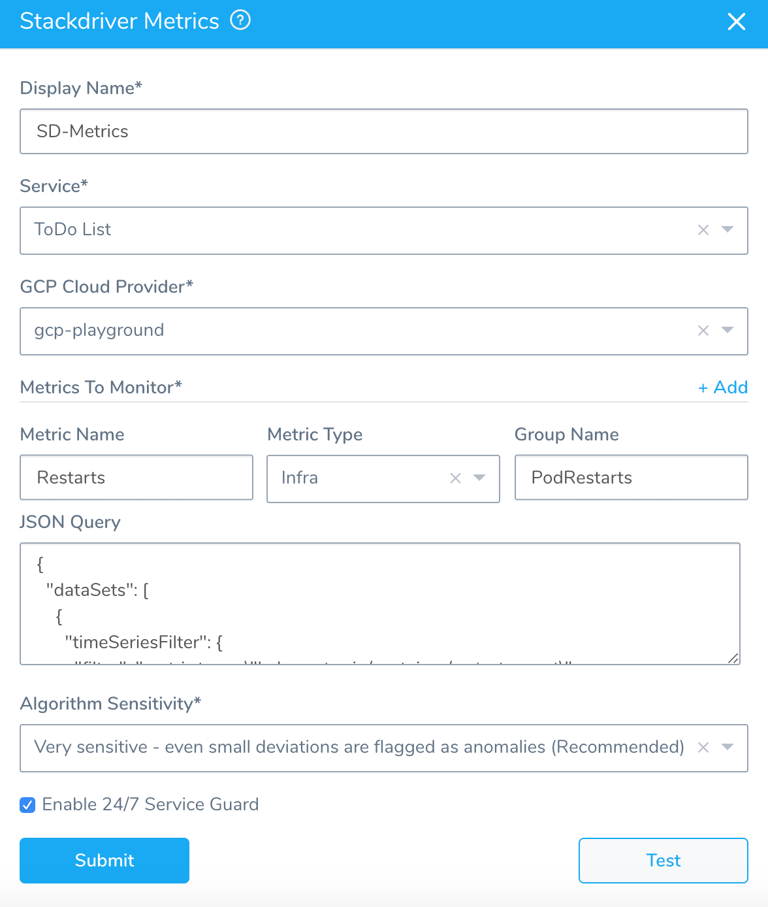
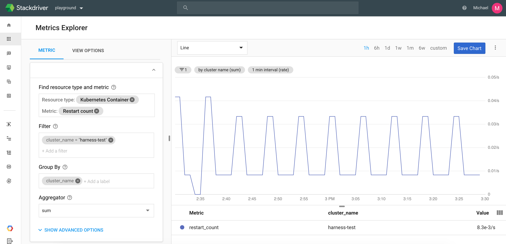
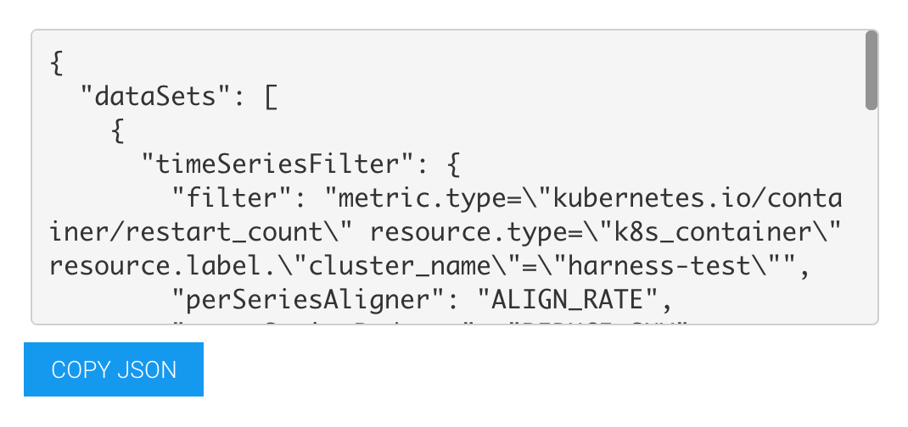
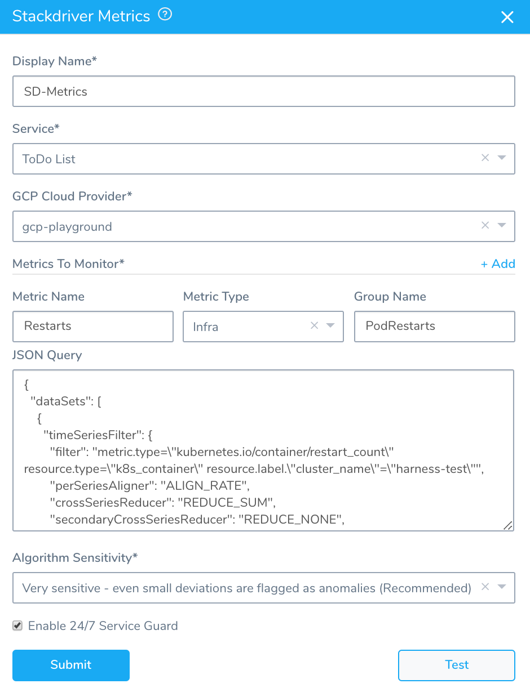
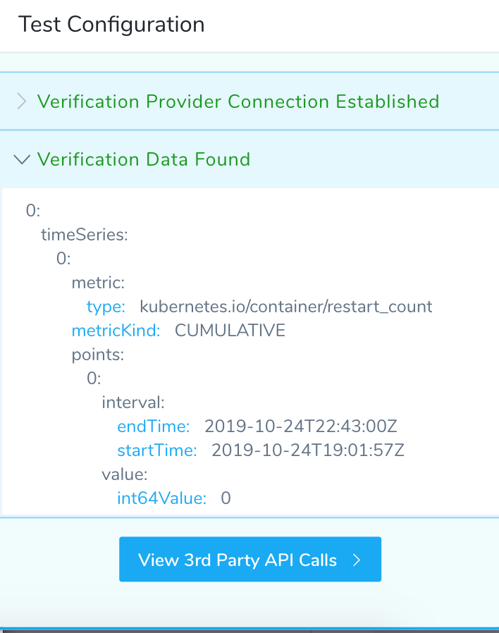
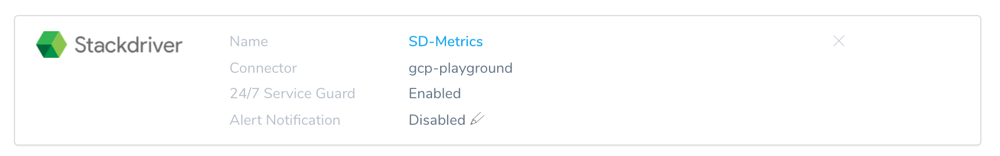
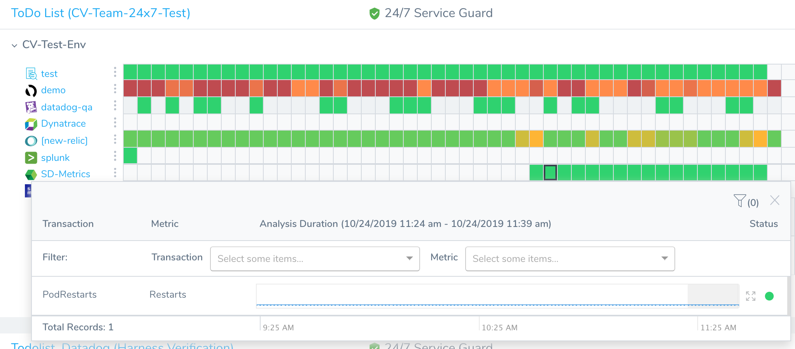

Harness 24/7 Service Guard monitors your live applications, catching problems that surface minutes or hours following deployment.

Once you have set up the Stackdriver Verification Provider in Harness, as described in [Connect to Stackdriver](stackdriver-connection-setup.md), you can add your Stackdriver **Metrics** monitoring to Harness 24/7 Service Guard in your Harness Application Environment.

### Before You Begin

* Set up a Harness Application, containing a Service and Environment. See [Create an Application](../../model-cd-pipeline/applications/application-configuration.md).
* See the [Stackdriver Verification Overview](../continuous-verification-overview/concepts-cv/stackdriver-and-harness-overview.md).

### Visual Summary

Here's an example of a completed Stackdriver Metrics for 24/7 Service Guard setup.

### Step 1: Set up 24/7 Service Guard

To set up 24/7 Service Guard for Stackdriver, do the following:

1. Ensure that you have added Stackdriver as a Harness Verification Provider, as described in  [Connect to Stackdriver](stackdriver-connection-setup.md).
2. In your Harness Application, ensure that you have added a Service, as described in  [Services](../../model-cd-pipeline/setup-services/service-configuration.md). For 24/7 Service Guard, you do not need to add an Artifact Source to the Service, or configure its settings. You simply need to create a Service and name it. It will represent your application for 24/7 Service Guard.
3. In your Harness Application, click **Environments**.
4. In **Environments**, ensure that you have added an Environment for the Service you added. For steps on adding an Environment, see  [Environments](../../model-cd-pipeline/environments/environment-configuration.md).
5. Click the Environment for your Service. Typically, the **Environment Type** is **Production**.
6. In the **Environment** page, locate **24/7 Service Guard**.
7. In **24/7 Service Guard**, click **Add Service Verification**, and then click **Stackdriver Metrics**. The **Stackdriver Metric** dialog appears.

### Step 2: Display Name

The name that will identify this service on the **Continuous Verification** dashboard. Use a name that indicates the environment and monitoring tool, such as **Stackdriver**.

### Step 3: Service

The Harness Service to monitor with 24/7 Service Guard.

### Step 4: GCP Cloud Provider

Select the GCP Cloud Provider to use, as described in [Connect to Stackdriver](stackdriver-connection-setup.md). If you currently connect to GCP via a Kubernetes Cluster Cloud Provider, you must set up a GCP Cloud Provider for access to the Stackdriver data on your cluster.

### Step 5: Metrics to Monitor

In this section you define the Stackdriver metrics you want to monitor. For example, here is a Stackdriver Metrics Explorer configured to monitor Kubernetes container restarts, filtered by a cluster name and grouped by cluster.

To reproduce these settings in **Metrics To Monitor**, you simply copy its filter and group by details via its JSON.

### Step 6: Metric Name, Metric Type, and Group Name

In **Metric Name**, enter a name to identify the metric in Harness, such as **Restarts**. This is not the Stackdriver-specific name of a metric.

In **Metric Type**, select the type of metric to monitor, such as **Infra**.

In **Group Name**, enter a name for grouping the metrics in Harness, such as **PodRestarts**. The Group Name is useful when you want Harness to monitor multiple metrics, and be able to group them.

### Step 7: JSON Query

Paste in the JSON query from Stackdriver Metrics Explorer.

In Stackdriver Metrics Explorer, once you have your metric query set up, click the **View as JSON** option.

Next, click **COPY JSON**.

In Harness Stackdriver Metrics, in **JSON Query**, paste in the JSON.

### Step 8: Algorithm Sensitivity

See [CV Strategies, Tuning, and Best Practices](../continuous-verification-overview/concepts-cv/cv-strategies-and-best-practices.md).

### Step 9: Enable 24/7 Service Guard

Click the checkbox to enable 24/7 Service Guard.

When you are finished, the dialog will look something like this:

### Step 10: Verify Your Settings

Click **TEST**. Harness verifies the settings you entered.

Click **SUBMIT**. The Stackdriver 24/7 Service Guard is configured.

To see the running 24/7 Service Guard analysis, click **Continuous Verification**. The 24/7 Service Guard dashboard displays the production verification results.

### Next Steps

* [Verify Deployments with Stackdriver Logging](3-verify-deployments-with-stackdriver.md)
* [Verify Deployments with Stackdriver Metrics](verify-deployments-with-stackdriver-metrics.md)

