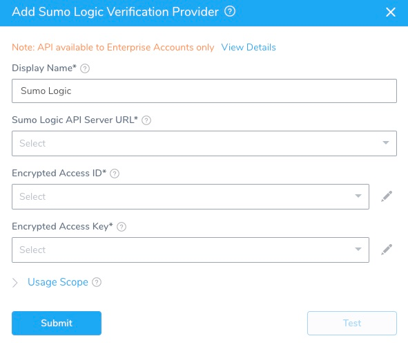

The first step in using Sumo Logic with Harness is to set up a Sumo Logic Verification Provider in Harness.

A Harness Verification Provider is a connection to monitoring tools such as Sumo Logic. Once Harness is connected, you can use Harness 24/7 Service Guard and Deployment Verification with your Sumo Logic data and analysis.

The Sumo Logic API is available to Sumo Logic Enterprise Accounts only. For more information, see [About the Search Job API](https://help.sumologic.com/APIs/Search-Job-API/About-the-Search-Job-API) from Sumo Logic.

### Before You Begin

* See the [Sumo Logic Verification Provider Overview](../continuous-verification-overview/concepts-cv/sumo-logic-verification-overview.md).

### Step 1: Add Sumo Logic Verification Provider

To add Sumo Logic as a verification provider, do the following:

1. In Harness, click **Setup**.
2. Click **Connectors**, and then click **Verification Providers**.
3. Click **Add Verification Provider**, and select **Sumo Logic**. The **Add Sumo Logic Verification Provider** dialog appears.

   
   
4. Complete the following fields of the **Add Sumo Logic Verification Provider** dialog.

### Step 2: Display Name

The name for the Sumo Logic verification provider connection in Harness. If you will have multiple Sumo Logic connections, enter a unique name.You will use this name to select this connection when integrating Sumo Logic with the **Verify Steps** of your workflows, described below.

### Step 3: Sumo Logic API Server URL

The API URL for your Sumo Logic account. The format of the URL is:https://api.*YOUR\_DEPLOYMENT*.sumologic.com/api/v1/Where *YOUR\_DEPLOYMENT* is either **us1**, **us2**, **eu**, **de**, or **au**. For **us1**, use **api.sumologic.com**.Sumo Logic applies default [rate limiting](https://help.sumologic.com/APIs/General-API-Information/API-Authentication#Rate_limiting).For more information, see [API Authentication](https://help.sumologic.com/APIs/General-API-Information/API-Authentication) from Sumo Logic.

### Step 4: Encrypted Access ID

For secrets and other sensitive settings, select or create a new [Harness Encrypted Text secret](https://docs.harness.io/article/ygyvp998mu-use-encrypted-text-secrets).Select/create the [Harness Encrypted Text secret](https://docs.harness.io/article/ygyvp998mu-use-encrypted-text-secrets) for the access ID for the user account you want to use to connect to Sumo Logic.

Access keys are generated by an individual user in Sumo Logic depending on the permissions set for their account.For more information on creating the access keys, see [Access Keys](https://help.sumologic.com/Manage/Security/Access-Keys) from Sumo Logic.

### Step 5: Encrypted Access Key

Select/create the [Harness Encrypted Text secret](https://docs.harness.io/article/ygyvp998mu-use-encrypted-text-secrets) for the access key for the Sumo Logic user account using the connection.

For more information, see [Access Keys](https://help.sumologic.com/Manage/Security/Access-Keys) from Sumo Logic.

### Step 6: Usage Scope

If you want to restrict the use of a provider to specific applications and environments, do the following:

In **Usage Scope**, click the drop-down under **Applications**, and click the name of the application.

In **Environments**, click the name of the environment.

### Step 7: Test and Submit

1. When you have set up the dialog, click **TEST**.
2. Once the test is completed, click **SUBMIT** to add the **Verification Provider**.

Once you have set up Sumo Logic as a Verification Provider, you can integrate it into 24/7 Service Guard and your Workflows, as described below.

### Next Steps

* [Monitor Applications 24/7 with Sumo Logic](2-24-7-service-guard-for-sumo-logic.md)
* [Verify Deployments with Sumo Logic](3-verify-deployments-with-sumo-logic.md)

