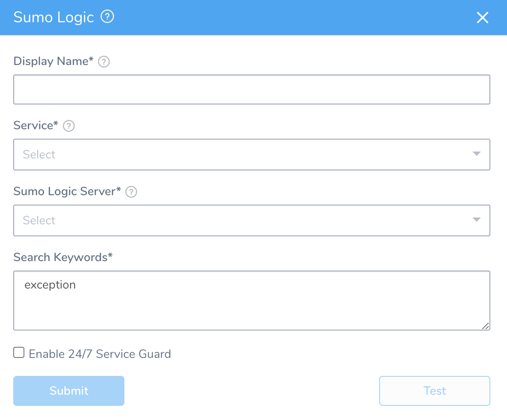
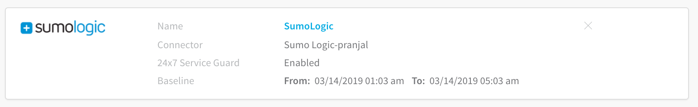
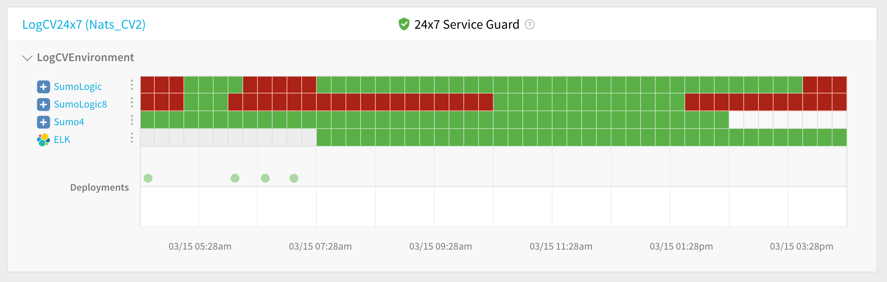

Harness 24/7 Service Guard monitors your live applications, catching problems that surface minutes or hours following deployment. For more information, see [24/7 Service Guard Overview](../continuous-verification-overview/concepts-cv/24-7-service-guard-overview.md).

You can add your Sumo Logic monitoring to Harness 24/7 Service Guard in your Harness Application Environment. For a setup overview, see  [Connect to Sumo Logic](1-sumo-logic-connection-setup.md).

For more information on 24/7 Service Guard, see [24/7 Service Guard](https://docs.harness.io/article/l5ky4p140j-24-x-7-service-guard).

### Before You Begin

* See the [Sumo Logic Verification Overview](../continuous-verification-overview/concepts-cv/sumo-logic-verification-overview.md).
* See [Connect to Sumo Logic](1-sumo-logic-connection-setup.md).

### Visual Summary

Here's an example configuration of 24/7 Service Guard for Sumo Logic.

### Step 1: Set Up 24/7 Service Guard for Sumo Logic

To set up 24/7 Service Guard for Sumo Logic, do the following:

1. Ensure that you have added Sumo Logic as a Harness Verification Provider, as described in [Verification Provider Setup](#verification_provider_setup).
2. In your Harness Application, ensure that you have added a Service, as described in [Services](../../model-cd-pipeline/setup-services/service-configuration.md). For 24/7 Service Guard, you do not need to add an Artifact Source to the Service, or configure its settings. You simply need to create a Service and name it. It will represent your application for 24/7 Service Guard.
3. In your Harness Application, click **Environments**.
4. In **Environments**, ensure that you have added an Environment for the Service you added. For steps on adding an Environment, see [Environments](../../model-cd-pipeline/environments/environment-configuration.md).
5. Click the Environment for your Service. Typically, the **Environment Type** is **Production**.
6. In the **Environment** page, locate **24/7 Service Guard**.
7. In **24/7 Service Guard**, click **Add Service Verification**, and then click **Sumo Logic**. The **Sumo Logic** dialog appears.
8. Fill out the dialog. The dialog has the following fields.

For 24/7 Service Guard, the queries you define to collect logs are specific to the application or service you want monitored. Verification is application/service level. This is unlike Workflows, where verification is performed at the host/node/pod level.

### Step 2: Display Name

The name that will identify this service on the **Continuous Verification** dashboard. Use a name that indicates the environment and monitoring tool, such as **SumoLogic**.

### Step 3: Service

The Harness Service to monitor with 24/7 Service Guard.

### Step 4: Sumo Logic Server

Select the Sumo Logic Verification Provider to use.

### Step 5: Search Keywords

Enter search keywords for your query, such as **\*exception\***.

### Step 6: Enable 24/7 Service Guard

Click the checkbox to enable 24/7 Service Guard.

### Step 7: Verify Your Settings

1. Click **TEST**. Harness verifies the settings you entered.
2. Click **SUBMIT**. The Sumo Logic 24/7 Service Guard is configured.

To see the running 24/7 Service Guard analysis, click **Continuous Verification**.

The 24/7 Service Guard dashboard displays the production verification results.

 For more information, see [24/7 Service Guard Overview](../continuous-verification-overview/concepts-cv/24-7-service-guard-overview.md).

### Next Steps

* [Verify Deployments with Sumo Logic](3-verify-deployments-with-sumo-logic.md)

