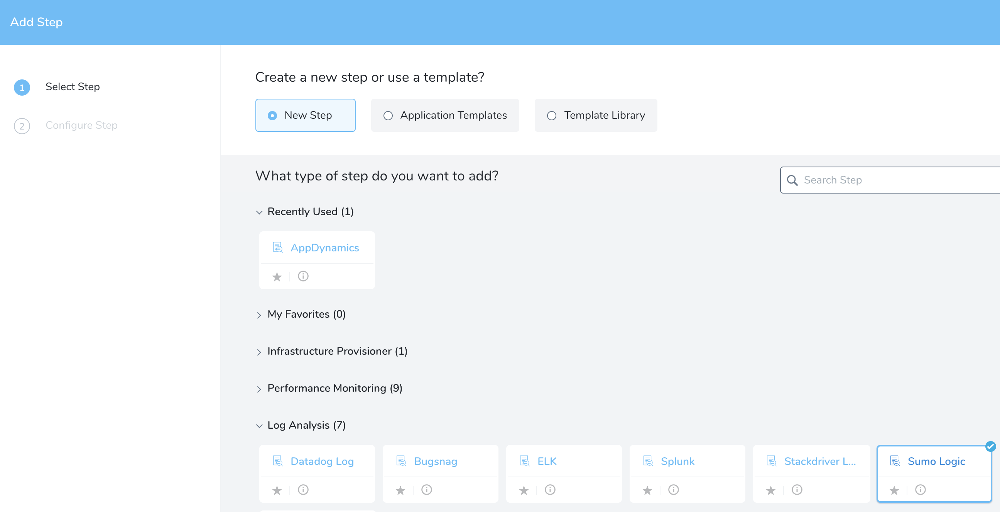
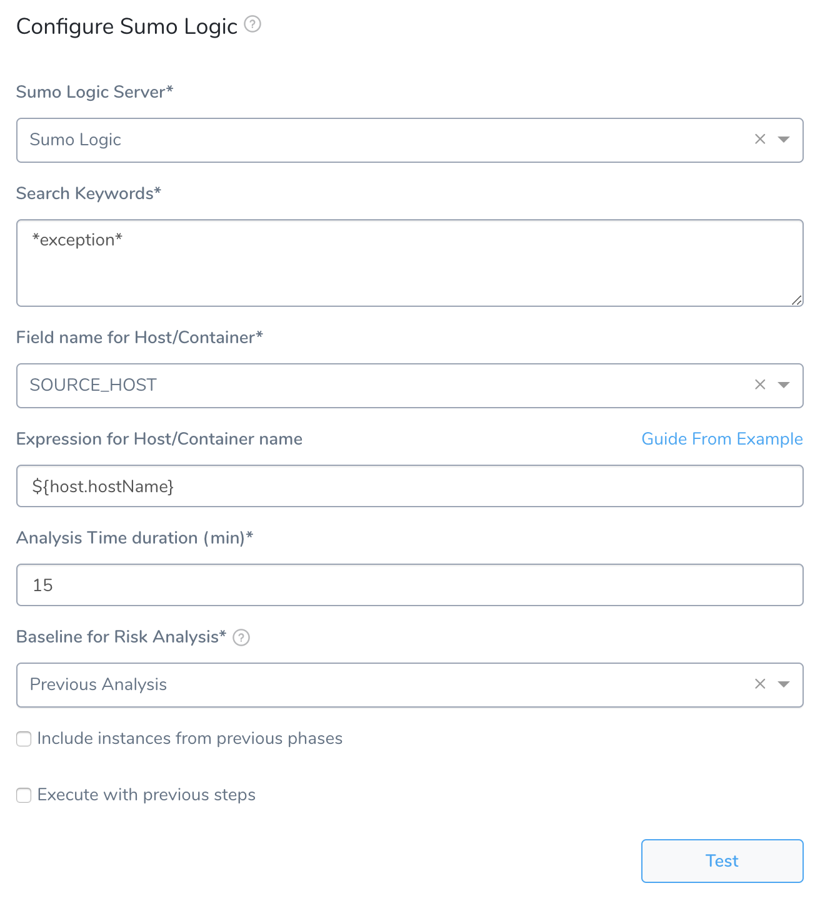
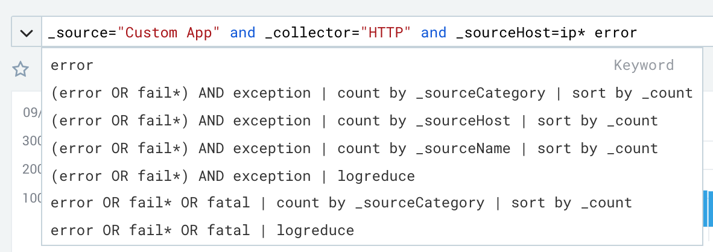
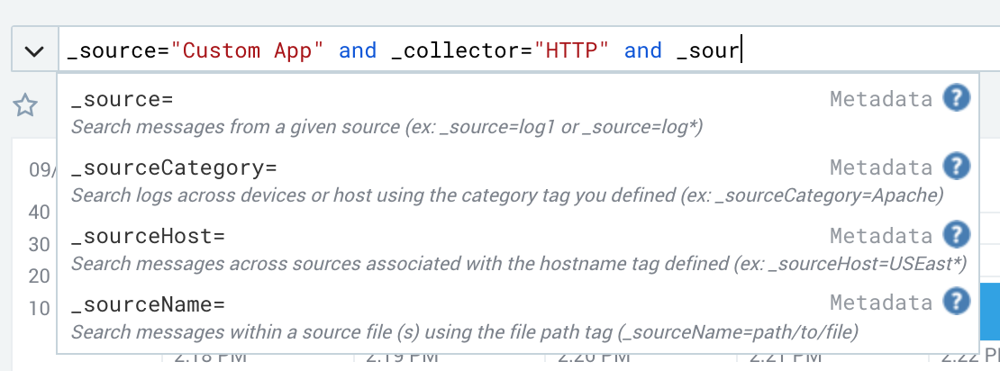
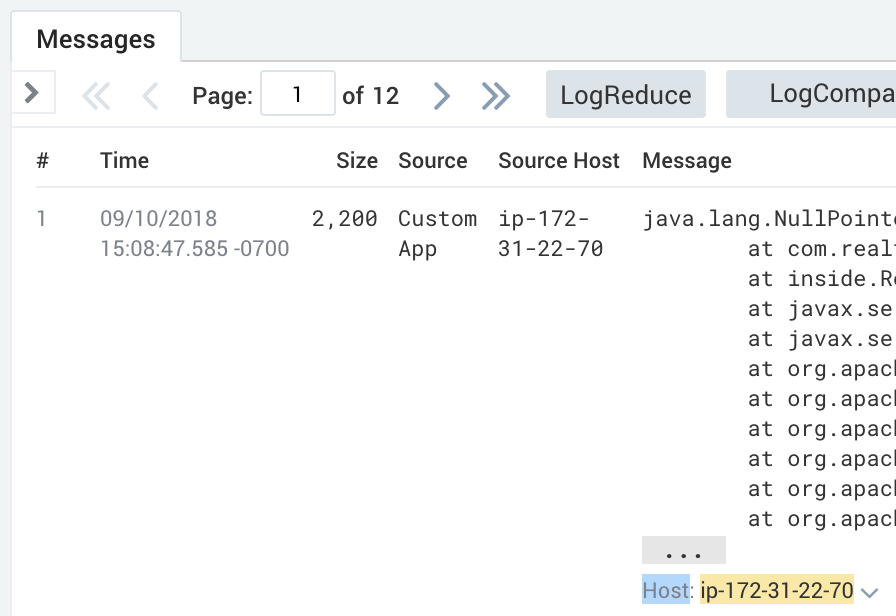
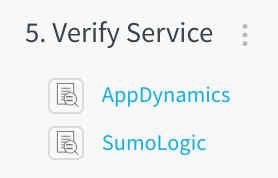
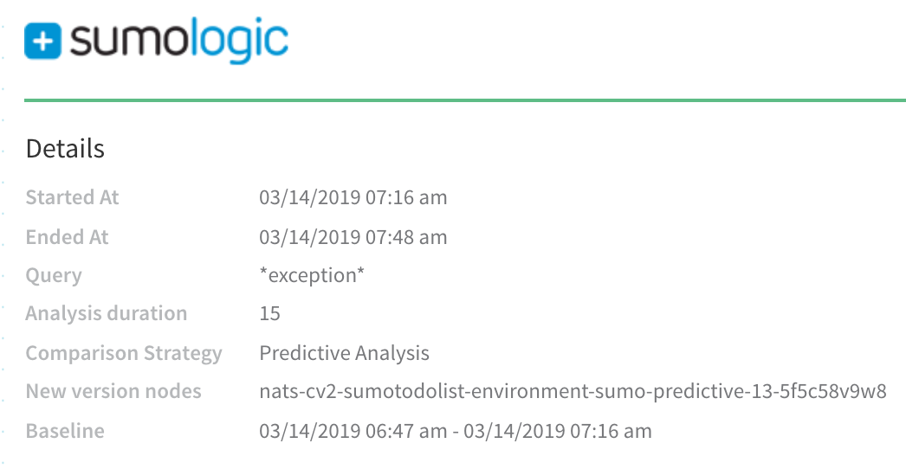
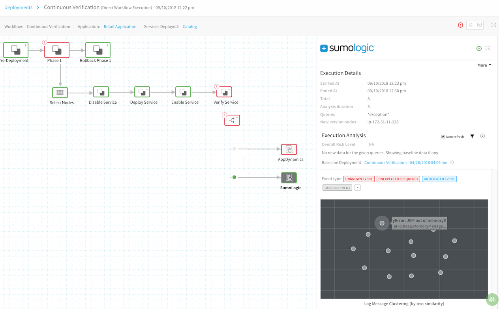

Harness can analyze Sumo Logic data to verify, rollback, and improve deployments. To apply this analysis to your deployments, you set up Sumo Logic as a verification step in a Harness Workflow. This section covers how to do so, and provides a summary of Harness verification results.

In order to obtain the names of the host(s), pod(s), or container(s) where your service is deployed, the verification provider should be added to your Workflow *after* you have run at least one successful deployment.

##   Before You Begin

* See the [Sumo Logic Verification Overview](../continuous-verification-overview/concepts-cv/sumo-logic-verification-overview.md).
* See [Connect to Sumo Logic](1-sumo-logic-connection-setup.md).

##   Visual Summary

Here's an example of Sumo Logic setup for verification.

##   Step 1: Set Up the Deployment Verification

To verify your deployment with Sumo Logic, do the following:

1. Ensure that you have added Sumo Logic as a verification provider, as described in [Sumo Logic Connection Setup](1-sumo-logic-connection-setup.md).
2. In your Workflow, under **Verify Service**, click **Add Verification**.
3. In the resulting **Add Step** settings, select **Log Analysis** > **Sumo Logic**.

   
   
4. Click **Next**. The **Configure****Sumo Logic** settings appear.

   

##   Step 2: Sumo Logic Server

Select the Sumo Logic verification provider you added, as described above.

##   Step 3: Search Keywords

Enter the keywords for your search. Use the Sumo Logic search field and then copy your keywords into the **Sumo Logic** dialog.

Example keywords: **\*exception\*** and **\*error\***.For more information, see [Search Syntax Overview](https://help.sumologic.com/Search/Get-Started-with-Search/How-to-Build-a-Search/Search-Syntax-Overview) and [Keyword Search Expressions](https://help.sumologic.com/Search/Get-Started-with-Search/How-to-Build-a-Search/Keyword-Search-Expressions) from Sumo Logic.

##   Step 4: Field name for Host/Container

Enter the message field that contains the host name. You can find this in the Sumo Logic search. In the Sumo Logic search field, start typing **\_source** and see the metadata options:

Click on the source host option, **\_sourceHost**, and execute a query with it.

View the query results and confirm that the **\_sourceHost** field returns the name of the host. And then enter **\_sourceHost** in the **Field name for Host/Container** field.

##   Step 5: Expression for Host/Container name

Add an expression that evaluates to the hostname value for the **Message** field host information. For example, in Sumo Logic, if you look at an exception **Message**, you will see a **Host** field:

In the service infrastructure where your Workflow deployed your artifact (see [Add a Service Infrastructure](../../model-cd-pipeline/environments/environment-configuration.md#add-a-service-infrastructure)), the hostname is listed in a JSON **name** label under a **host** label.Locate the **name** label that displays the same value as the **Host** field in your Sumo Logic **Message**. Locate the path to that **name** label and use it as the expression in **Expression for Host/Container name**.The default expression is **${instance.host.hostName}**.

For AWS EC2 hostnames, use the expression `${instance.hostName`}.

##   Step 6: Analysis Time duration

Set the duration for the verification step. If a verification step exceeds the value, the Workflow's [Failure Strategy](../../model-cd-pipeline/workflows/workflow-configuration.md#failure-strategy) is triggered. For example, if the Failure Strategy is **Ignore**, then the verification state is marked **Failed** but the Workflow execution continues.

See [CV Strategies, Tuning, and Best Practices](../continuous-verification-overview/concepts-cv/cv-strategies-and-best-practices.md#analysis-time-duration).

##   Step 7: Baseline for Risk Analysis

See [CV Strategies, Tuning, and Best Practices](../continuous-verification-overview/concepts-cv/cv-strategies-and-best-practices.md).

##   Step 8: Baseline for Predictive Analysis

This option appears if you selected **Predictive Analysis** in **Baseline for Risk Analysis**. Specify the time unit Harness should use to pull logs to set as the baseline for predictive analysis, such as **Last 30 minutes**.

A few notes about selecting the time unit for **Baseline for Predictive Analysis**:

* The greater the length of time you specify for a **Predictive Analysis** baseline (in **Baseline for Predictive Analysis**), the longer it takes Harness to run the analysis. If you select **Last 24 hours**, it could take up to 15 or more minutes to perform predictive analysis.
* The greater the length of time you specify for a Predictive Analysis baseline, the more API calls Harness makes to the verification provider. Harness makes API calls to verification providers to obtain logs grouped in 15 minutes batches. If you specify a long amount of time for a Predictive Analysis baseline, Harness will need to make a lot of API calls to the verification provider. For example, if you select **Last 24 hours** as the baseline for Predictive Analysis, then Harness will make 96 API calls to collect that data.

##   Step 9: Algorithm Sensitivity

Select the sensitivity that will result in the most useful results for your analysis.

See [CV Strategies, Tuning, and Best Practices](../continuous-verification-overview/concepts-cv/cv-strategies-and-best-practices.md#algorithm-sensitivity-and-failure-criteria).

##   Step 10: Execute with previous steps

Check this checkbox to run this verification step in parallel with the previous steps in **Verify Service**.

##   Step 11: Include instances from previous phases

If you are using this verification step in a multi-phase deployment, select this checkbox to include instances used in previous phases when collecting data. Do not apply this setting to the first phase in a multi-phase deployment.

##   Step 12: Verify your Settings

Click **Test**. Harness verifies the settings you entered.

When you are finished, click **Submit**. The **Sumo Logic** verification step is added to your Workflow.

If you select **Predictive Analysis** in **Baseline for Risk Analysis**, the time unit range is displayed in the **Details** section of the results. See **Baseline** in the image below:

##   Review: Harness Expression Support in CV Settings

You can use expressions (`${...}`) for [Harness built-in variables](https://docs.harness.io/article/7bpdtvhq92-workflow-variables-expressions) and custom [Service](../../model-cd-pipeline/setup-services/service-configuration.md) and [Workflow](../../model-cd-pipeline/workflows/add-workflow-variables-new-template.md) variables in the settings of Harness Verification Providers.

Expression support lets you template your Workflow verification steps. You can add custom expressions for settings, and then provide values for those settings at deployment runtime. Or you can use Harness built-in variable expressions and Harness will provide values at deployment runtime automatically.

##   Step 13: View Verification Results

Once you have deployed your Workflow (or Pipeline) using the Sumo Logic verification step, you can automatically verify cloud application and infrastructure performance across your deployment. For more information, see [Add a Workflow](../../model-cd-pipeline/workflows/workflow-configuration.md#deploy-a-workflow) and [Add a Pipeline](../../model-cd-pipeline/pipelines/pipeline-configuration.md#deploy-a-pipeline).

###   Workflow Verification

To see the results of Harness machine-learning evaluation of your Sumo Logic verification: In your Workflow or Pipeline deployment, you can expand the **Verify Service** step, and then click the **Sumo Logic** step.

###   Continuous Verification

You can also see the evaluation in the **Continuous Verification** dashboard. The Workflow verification view is for the DevOps user who developed the Workflow. The **Continuous Verification** dashboard is where all future deployments are displayed for developers and others interested in deployment analysis.

To learn about the verification analysis features, see the following sections.

###   Transaction Analysis

* **Execution details:** See the details of verification execution. Total is the total time the verification step took, and Analysis duration is how long the analysis took.
* **Risk level analysis:** Get an overall risk level and view the cluster chart to see events.
* **Transaction-level summary:** See a summary of each transaction with the query string, error values comparison, and a risk analysis summary. 

###   Execution Analysis

* **Event type:** Filter cluster chart events by Unknown Event, Unexpected Frequency, Anticipated Event, Baseline Event, and Ignore Event.
* **Cluster chart:** View the chart to see how the selected event contrasts with other events. Click each event to see its log details. 

###   Event Management

* **Event-level analysis:** See the threat level for each event captured.
* **Tune event capture:** Remove events from analysis at the Service, Workflow, execution, or overall level.
* **Event distribution:** Click the chart icon to see an event distribution including the measured data, baseline data, and event frequency.

##   Next Steps

* [CV Strategies, Tuning, and Best Practices](../continuous-verification-overview/concepts-cv/cv-strategies-and-best-practices.md#algorithm-sensitivity-and-failure-criteria)
* [Configuration as Code](https://docs.harness.io/article/htvzryeqjw-configuration-as-code)
* [Managing Users and Groups (RBAC)](https://docs.harness.io/article/ven0bvulsj-users-and-permissions)

