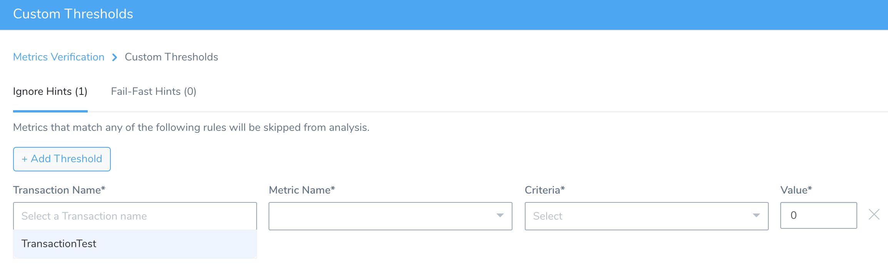
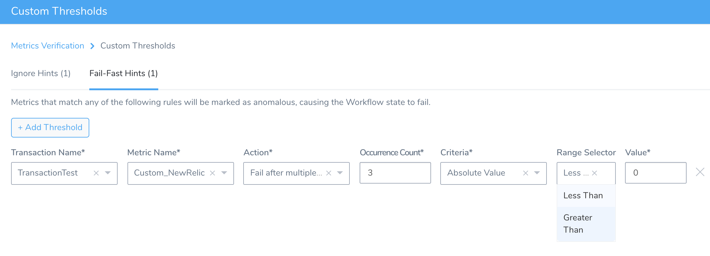

Use Custom Thresholds to define two types of rules that override normal verification behavior:

* **Ignore Hints** that instruct Harness to skip certain metrics/value combinations from verification analysis.
* **Fast-Fail Hints** that cause a Workflow to enter a failed state.

This topic covers:

* [Limitations](#limitations)
* [Before You Begin](#before_you_begin)
* [Step 1: Invoke Custom Thresholds](#invoke)
* [Step 2: Define a Rule](#define_rule)
* [Step 3: Select Criteria](#select_criteria)
* [Step 4: Add Rules and Save](#repeat_save)
* [Next Steps](#next_steps)

### Limitations

* Harness currently supports Ignore thresholds for all verification providers.
* Fail fast thresholds are supported with [New Relic](../continuous-verification-overview/concepts-cv/new-relic-verification-overview.md), [Prometheus](../prometheus-verification/3-verify-deployments-with-prometheus.md) and [Custom APMs](../custom-metrics-and-logs-verification/custom-verification-overview.md).

### Before You Begin

* In a Workflow's **Verify Service** section, click **Add Verification.**
* In the resulting **Add Step** settings, select a verification provider compatible with Custom Thresholds.  
Configure at least one Metrics Collection.

### Step 1: Invoke Custom Thresholds

To begin defining one or more Custom Thresholds:

1. In your Workflow, in the CV step you add, such as **Configure Prometheus**, click the pencil icon shown below.

  
  
2. In the resulting dialog, select either the **Ignore Hints** or the **Fast-Fail Hints** tab.

3. Click **Add Threshold** to begin defining a rule, as shown below.

  

### Step 2: Define a Rule

1. Use the drop-downs to select a desired **Transaction Name** and **Metric Name** from your defined Metrics Collections.
2. For Fast-Fail Hints, select an **Action** to take: **Fail immediately**, **Fail after multiple occurrences**, or **Fail after multiple occurrences in a row**. Two of these selections will expose a field where you must also specify the threshold **Occurrence Count**.

### Step 3: Select Criteria

Select the **Criteria** for this rule, and enter a corresponding **Value**.

For various **Criteria** selections, the **Value** field's label will change to **Less than** for Ignore Hints, and to **Greater than** and/or **Less than** selectors for Fast-Fail Hints (as shown below).

Here are the **Criteria** and **Value** options available for the metric you've selected:

|  |  |
| --- | --- |
| **Criteria** | **Value** |
| Absolute Value | Enter a literal value of the selected metric. In Ignore Hints, observed values **Less than** this threshold will be skipped from verification analysis. In Fast-Fail Hints, use the **Range Selector** drop-down to select whether observed values **Less than** or **Greater than** your threshold **Value** will move the Workflow to a failed state. |
| Percentage Deviation | Enter a threshold percentage at which to either skip the metric from analysis (Ignore Hints), or fail the Workflow (Fast-Fail Hints). Units here are percentages, so entering `3` will set the threshold at a 3% anomaly from the norm. |
| Deviation | This also sets a threshold deviation from the norm. But here, the units are not percentages, but literal values of the selected metric. |

### Step 4: Add Rules and Save

1. If you want to define additional rules, click **Add Threshold**, then repeat Steps 2–3.
2. Click **Submit** to save your rules and apply them to this Verification step.

### Next Steps

When you deploy this Workflow: Where a Fast-Fail Hint moves the Workflow to a failed state, the Workflow's Details panel for the corresponding Verification step will indicate the triggering threshold.

