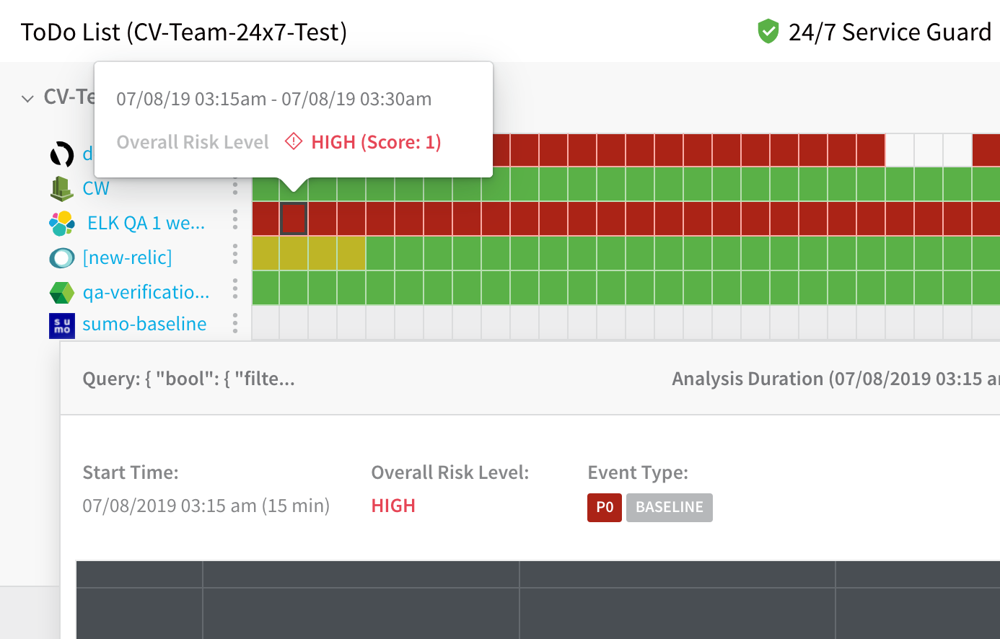
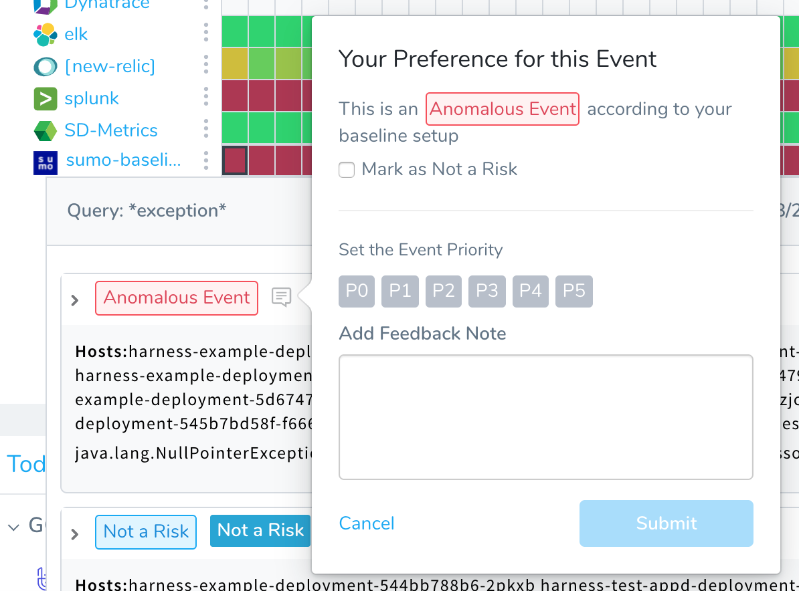
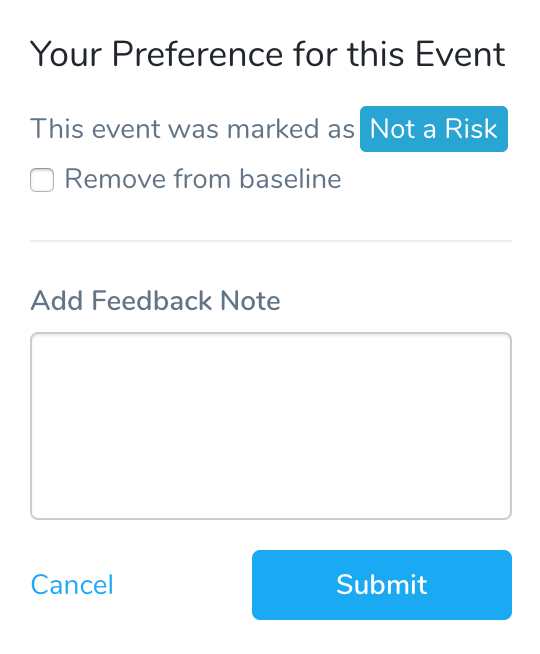
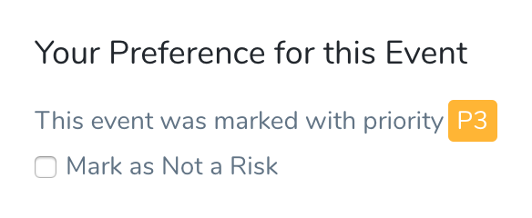
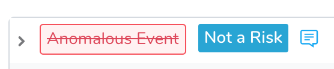
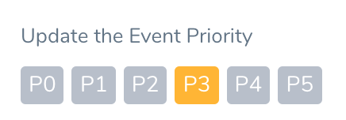
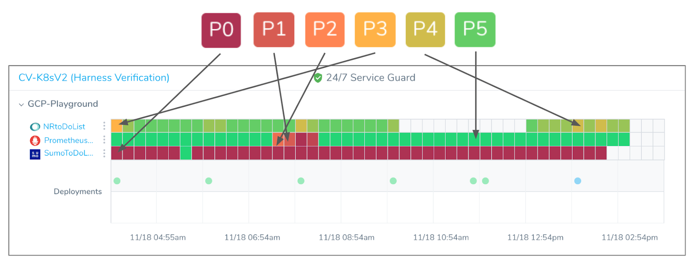
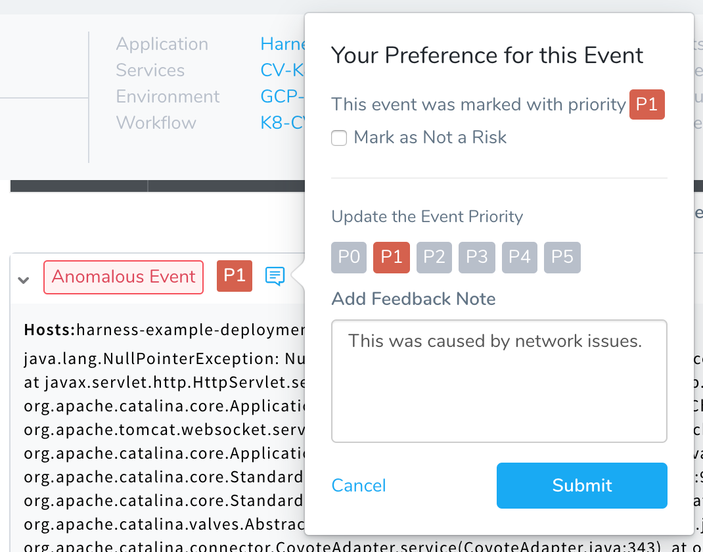
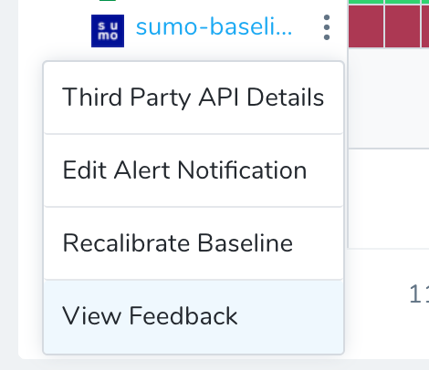

You can refine the priority or classification of an event in 24/7 Service Guard.

For information on changing event priorities in a deployment, see [Refine Deployment Verification Analysis](refine-deployment-verification-analysis.md). Event classifications are covered in [Verification Event Classifications](https://docs.harness.io/article/339hy0kbnu-verification-event-classifications). For an overview of verification analysis feedback, see [Harness Verification Feedback Overview](../continuous-verification-overview/concepts-cv/harness-verification-feedback-overview.md).In this topic:

* [Review: Permissions Required](#review_permissions_required)
* [Step 1: Change Event Priority in 24/7 Service Guard](#step_1_change_event_priority_in_24_7_service_guard)
* [Option: Remove from Baseline](#option_remove_from_baseline)
* [Option: Mark as Not a Risk](#option_mark_as_not_a_risk)
* [Option: Update the Event Priority](#option_update_the_event_priority)
* [Option: Add Feedback Note](#option_add_feedback_note)
* [Step 2: Review 24/7 Service Guard Feedback](#step_2_review_24_7_service_guard_feedback)

### Review: Permissions Required

To mark an event as not a risk (**Mark as Not a Risk**) or change its priority setting (**P0**, **P1**, etc), a Harness User must be a member of a User Group with the following User Group **Application Permissions**:

|  |  |  |  |
| --- | --- | --- | --- |
| **Permission Types** | **Applications** | **Filters** | **Actions** |
| **Services** | `<Name of Application>` | `<Name of Service being monitored>` | **Update** |
| **Environments** | `<Name of Application>` | `<Name of Environment where Service is monitored>` | **Update** |

 For example, the User Group Application Permissions might look like this:

### Step 1: Change Event Priority in 24/7 Service Guard

To change the priority of an event in 24/7 Service Guard, do the following:

1. In Harness Manager, click **Continuous Verification**.
2. Locate the Service you are interested in reviewing, and then click in the heatmap of the verification tool to view its verification analysis.

   

3. Review the analysis to determine if any events need to be changed.
4. To change the risk assessment for an event, click the risk assessment icon:

  

  The priority adjustment dialog appears:

  

5. Select a different priority setting. The options in the dialog are described below.

Once you have assigned a priority to an event (P0-P5), you can create a Jira issue using the event. See [File Jira Tickets on Verification Events](jira-cv-ticket.md).

For details on the different verification settings, see [Verification Event Classifications](https://docs.harness.io/article/339hy0kbnu-verification-event-classifications).

#### Priority Events in 24/7 Service Guard

While adding P# priority to events after a deployment is very useful (as described in [Refine Deployment Verification Analysis](https://harness.helpdocs.io/article/gd9skrjb4g-refine-deployment-verification-analysis)), priority events are especially useful in 24/7 Service Guard.

24/7 Service Guard monitors your live, production application or service. You can mark events that show up in the live monitoring as P0-P5 and assign Jira issues for them, thereby fixing issues as soon as they show up. This prevents issues from surfacing during your next deployment.

See [File Jira Tickets on Verification Events](https://harness.helpdocs.io/article/v4d4pd5lxi-jira-cv-ticket).

### Option: Remove from Baseline

This option appears if the event was marked as **Not a Risk**.  

If you consider this event to be a risk, click **Remove from baseline** and assign a priority to the event.

### Option: Mark as Not a Risk

This option appears if the event was marked with a priority (P0-P5).

Priority events fail deployments (as do Anomalous Events) .If the event should not fail the deployment, select **Mark as Not a Risk**.

The next time this deployment is run, this event will be marked as a **Known Event** and added to the baseline for comparison with future deployments.

### Option: Update the Event Priority

This option is available if an event has a priority assigned to it (P0-P5).

**Update the Event Priority** lets you change the priority for the event. All priority events fail deployments, but using the priority levels helps to reveal the different levels in the Deployments page. The priority level colors are also reflected in the 24/7 Service Guard heatmap:

Once you have assigned a priority to an event (P0-P5), you can create a Jira issue using the event. See [File Jira Tickets on Verification Events](jira-cv-ticket.md).

### Option: Add Feedback Note

You can add notes to each event using the **Add Feedback Note** option.

The note will remain with the event in future deployments.

### Step 2: Review 24/7 Service Guard Feedback

Once you have changed the priority or classification of an event, the event is listed in the Continuous Verification Feedback dialog for the 24/7 Service Guard Analysis.

To review the 24/7 Service Guard feedback, do the following:

1. In Harness Manager, click **Continuous Verification** to open 24/7 Service Guard.
2. Locate a Service you want to review.
3. Locate the Verification Provider for the Service you want to review.
4. Click the more options menu (**︙**) and then click **View Feedback**.

The **Continuous Verification Feedback** dialog appears.

1. Review the Execution Analysis to determine if any events need to be changed.
2. Click the **More Options** and then click **View Feedback**.

The event title will change to indicate who updated it by adding your name to **Updated priority by &lt;User name&gt;**.

All future analyses will use the new priority setting for similar events (similar by text similarity).

