Harness provides deployment support for all of the major platforms, listed in the[​Continuous Delivery](https://docs.harness.io/category/continuous-delivery) category.

In some cases, you might be using a platform that does not have first class support in Harness, such as WebLogic, WebSphere, or [Google Cloud functions](https://community.harness.io/t/google-cloud-functions-with-harness-deployment-template/598). For these situations, Harness provides a custom deployment option using Deployment Templates.

Deployment Templates use shell scripts to connect to target platforms, obtain target host information, and execute deployment steps.

### Before You Begin

You can review some of the other custom options Harness provides in addition to its support for all major platforms:

* [Using Custom Artifact Sources](https://docs.harness.io/article/jizsp5tsms-custom-artifact-source)
* [Add and Use a Custom Secrets Manager](https://docs.harness.io/article/ejaddm3ddb-add-and-use-a-custom-secrets-manager)
* [Custom Shell Script Approvals](https://docs.harness.io/article/lf79ixw2ge-shell-script-ticketing-system)
* [Shell Script Provisioner](https://docs.harness.io/article/1m3p7phdqo-shell-script-provisioner)
* [Custom Verification Overview](https://docs.harness.io/article/e87u8c63z4-custom-verification-overview)

Google Cloud Function deployments using Deployment Templates are covered in [Google Cloud Functions with Harness Deployment Template](https://community.harness.io/t/google-cloud-functions-with-harness-deployment-template/598).

### Visual Summary

The following illustration shows how the settings in the Deployment Template are applied in a Harness Service, Infrastructure Definition, and Workflow Fetch Instances and Shell Script steps.

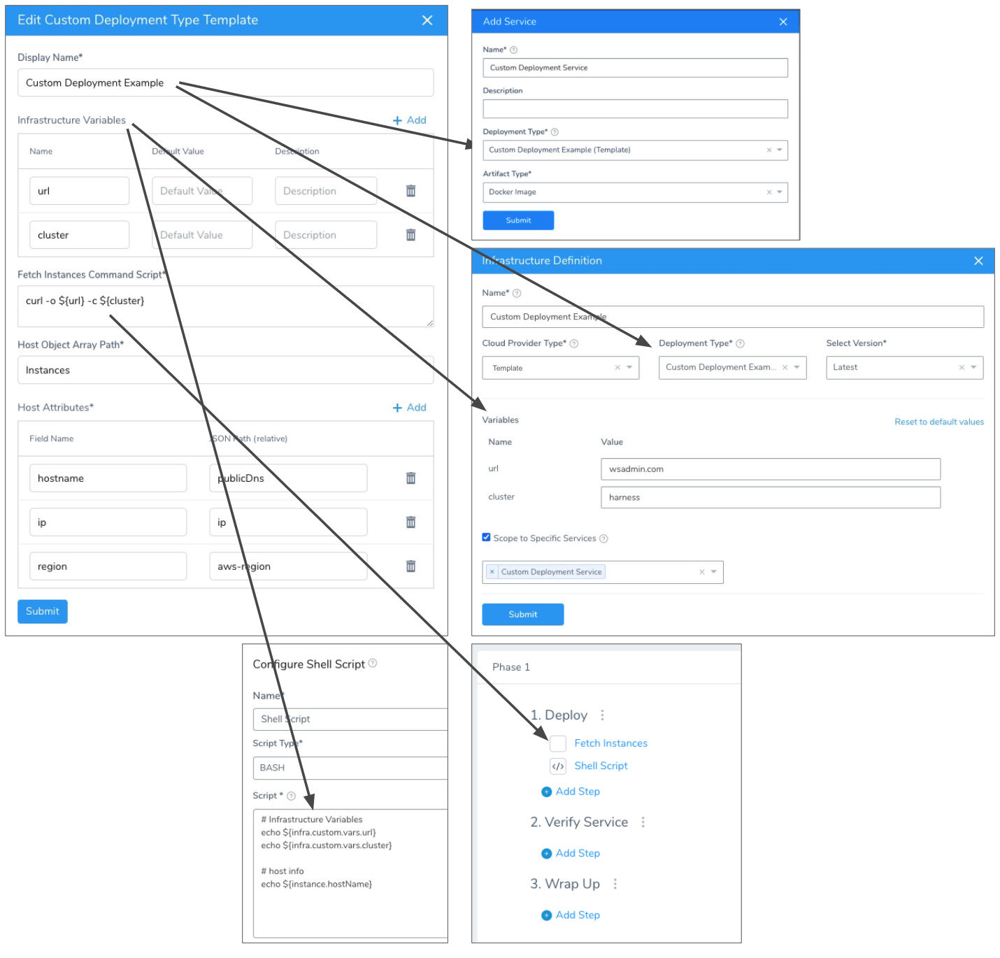

### Review: Custom Deployment using Deployment Template Overview

Here is a summary of the steps for setting up custom deployments using Deployment Templates:

1. Create a Deployment Template.
2. In the template, include a script that returns a JSON array containing a list of the target instances Harness will use to deploy your artifact.
3. Identify the array path to the host object in the JSON so Harness can locate it at deployment runtime.
4. Map any important host attributes that you want to reference later, like IP, region, etc.
5. Create a Harness Service that using the Deployment Template.Artifacts are added just as they are for supported platforms. See [Add Artifact Servers](https://docs.harness.io/article/7dghbx1dbl-configuring-artifact-server). Harness includes the [Custom Artifact Source](https://docs.harness.io/article/jizsp5tsms-custom-artifact-source) also.
6. Create a Harness Infrastructure Definition that uses the template.
7. Create a Workflow that uses the Harness Service and Infrastructure Definition.
8. In the Workflow, add the **Fetch Instances** step wherever you want to execute the script in your template.

That's it. Your Workflow will fetch the target instances as you requested and deploy your artifact to them.

### Limitations

Unlike the deployments for supported platforms, like Kubernetes and AWS, Deployment Templates have certain limitations:

* No steady state checks on deployed services.
* Harness does not track releases.
* The Deployment Template where you define your infrastructure can be created in the account-wide Template Library only (also called the Shared Template Library). Not in an Application-wide Template Library. See [Use Templates](../concepts-cd/deployment-types/use-templates.md).
* Only Basic, Canary, and Multi-Service Deployment [Workflow types](https://docs.harness.io/article/m220i1tnia-workflow-configuration#workflow_types) are supported.

### Step 1: Harness Delegate Setup

Install a Delegate in your deployment environment, verify that its host/pod can connect to the server you plan to query for your target host information, and the target host.

See [Harness Delegate Overview](https://docs.harness.io/article/h9tkwmkrm7-delegate-installation).

### Step 2: Connectors Setup

In a custom deployment using Deployment Templates, Harness Connectors are only used for the Artifact Server. See [Add Artifact Servers](https://docs.harness.io/article/7dghbx1dbl-configuring-artifact-server).

No Harness Cloud Providers are used unless you are using an artifact source from GCP or AWS.

### Step 3: Create Custom Deployment Template

The Deployment Template contains a script that will query a server at deployment runtime to obtain the target host information needed to deploy your artifact to the target host(s).

#### Infrastructure Variables

These are variables that you can use in the following places:

* In the script in **Fetch Instances Command Script**. For example, you can create a variable for the URL that the script in **Fetch Instances Command Script** uses.
* When you define the Infrastructure Definition for your deployment. The variable values can be overwritten in the Infrastructure Definition, as we will show later.
1. Click **Add** to add the variables you need in the script in **Fetch Instances Command Script**.
2. Add the variables you will need to identify the target host(s) in your Harness Infrastructure Definition.  
For example, if you will be targeting a cluster, add the variable `cluster`, and then you can provide a value for the variable in the Infrastructure Definition.

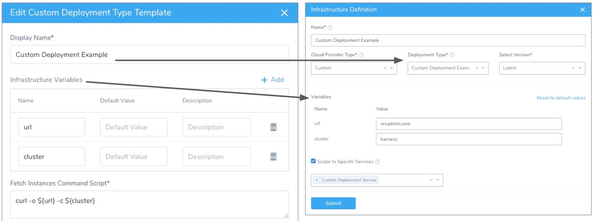

If you want to make the URL that obtains the target host information a variable that can be configured in an Infrastructure Definition, be sure to include it in **Infrastructure Variables**.

Often, you will add variables for username and password so that they can be provided in the Infrastructure Definition.

Any variables set here can he referenced in your Workflow using the expression `${infra.custom.vars.varName}`. For example:


```
echo ${infra.custom.vars.url}  
echo ${infra.custom.vars.cluster}
```
#### Fetch Instances Command Script

Enter the shell script to pull the JSON collection from your server.

The script is expected to query the server and receive a JSON array containing the target hosts, saved in the environment variable `${INSTANCE_OUTPUT_PATH}`.

This shell script will be executed at runtime by the Harness Delegate on its host. This should be a shell script you have run on the Delegate host to ensure that the host can connect to your server.

The script should return a JSON array containing the target host information Harness needs to deploy.

Here is an example:


```
apt-get -y install awscli  
aws configure set aws_access_key_id ${secrets.getValue("access_key")  
aws configure set aws_secret_access_key ${secrets.getValue("password")  
aws configure set region us-west-1  
aws ec2 describe-instances --instance-ids i-0beacf0f260edd19f > "${INSTANCE_OUTPUT_PATH}"
```
This example uses AWS. Harness already has full, first-class support for AWS deployments. We just use this script as an example. See the AWS Quickstarts in [Start Here](https://docs.harness.io/category/get-started).

This example also uses Harness secrets for username and password. See [Use Encrypted Text Secrets](https://docs.harness.io/article/ygyvp998mu-use-encrypted-text-secrets).

Here's another example using Kubernetes and NGINX (Kubernetes also has [first-class support](https://docs.harness.io/article/7in9z2boh6-kubernetes-quickstart)):


```
POD=$(kubectl get pod -l app=mynginx -o json)  
echo ${POD} > "${INSTANCE_OUTPUT_PATH}"
```
When you create your Harness Workflow later, you will add a **Fetch Instances** step that will run this script:


#### Host Object Array Path

Enter the JSON path to the JSON array object for the target host.

For example, the following JSON object contains an Instances array with two items (the JSON is abbreviated):


```
{  
  "Instances": [  
    {  
      "StackId": "71c7ca72-55ae-4b6a-8ee1-a8dcded3fa0f",  
      ...  
      "InfrastructureClass": "ec2",  
      "RootDeviceVolumeId": "vol-d08ec6c1",  
      "SubnetId": "subnet-b8de0ddd",  
      "InstanceType": "t1.micro",  
      "CreatedAt": "2015-02-24T20:52:49+00:00",  
      "AmiId": "ami-35501205",  
      "Hostname": "ip-192-0-2-0",  
      "Ec2InstanceId": "i-5cd23551",  
      "PublicDns": "ec2-192-0-2-0.us-west-2.compute.amazonaws.com",  
      "SecurityGroupIds": [  
        "sg-c4d3f0a1"  
      ],  
      ...  
    },  
    {  
      "StackId": "71c7ca72-55ae-4b6a-8ee1-a8dcded3fa0f",  
      ...  
      "InfrastructureClass": "ec2",  
      "RootDeviceVolumeId": "vol-e09dd5f1",  
      "SubnetId": "subnet-b8de0ddd",  
      "InstanceProfileArn": "arn:aws:iam::123456789102:instance-profile/aws-opsworks-ec2-role",  
      "InstanceType": "c3.large",  
      "CreatedAt": "2015-02-24T21:29:33+00:00",  
      "AmiId": "ami-9fc29baf",  
      "SshHostDsaKeyFingerprint": "fc:87:95:c3:f5:e1:3b:9f:d2:06:6e:62:9a:35:27:e8",  
      "Ec2InstanceId": "i-8d2dca80",  
      "PublicDns": "ec2-192-0-2-1.us-west-2.compute.amazonaws.com",  
      "SecurityGroupIds": [  
        "sg-b022add5",  
        "sg-b122add4"  
      ],  
      ...  
    }  
  ]  
}
```
In this case, we want to point to the first item in the JSON file using its index, and so we use `Instances` in **Host Object Array Path**.

To ensure that you referring to the correct item in your array, test your **Host Object Array Path** using your JSON collection and an online validator such as  [JSON Editor Online](https://jsoneditoronline.org/).

#### Payloads without High-Level Objects

In some cases you might have a JSON payload without a high-level object. In these cases, you can use `$` in **Host Object Array Path**.

Let's look at an example:


```
[  
  {  
    "id": "aef-default-0000000000000-qnhh",  
    "instance": {  
      "id": "aef-default-0000000000000-qnhh",  
      "name": "apps/sales/services/default/versions/0000000000000/instances/aef-default-0000000000000-qnhh",  
      "startTime": "2021-01-07T21:05:54.658Z",  
      "vmIp": "192.168.0.0",  
      "vmLiveness": "HEALTHY",  
      "vmStatus": "RUNNING"  
    },  
    "service": "default",  
    "version": "0000000000000"  
  },  
  {  
    "id": "aef-default-0000000000000-0sbt",  
    "instance": {  
      "id": "aef-default-0000000000000-0sbt",  
      "name": "apps/sales/services/default/versions/0000000000000/instances/aef-default-0000000000000-0sbt",  
      "startTime": "2021-01-07T21:05:46.262Z",  
      "vmIp": "192.168.255.255",  
      "vmLiveness": "HEALTHY",  
      "vmStatus": "RUNNING"  
    },  
    "service": "default",  
    "version": "0000000000000"  
  }  
]
```
In this example, the **Host Object Array Path** is `$`and the **hostname** field would use  `instance.vmIp`.

#### Host Attributes

Now that you have provided a path to the host object, you can map any useful JSON keys in **Host Attributes**.

**The** **`hostname`** **value in the Field Name setting is mandatory.**

You must use `hostname` to identify the target host(s) in the JSON array.Map the keys containing information you want to reference in your Workflow, most likely in a Shell Script step.

You can reference the host in your Workflow using the expression `${instance.hostName}`, but you reference Host Attributes using `${instance.host.properties.<Field_Name>}`.

For example, to reference the Host Attribute hostname below you would use `${instance.host.properties.hostname}`.

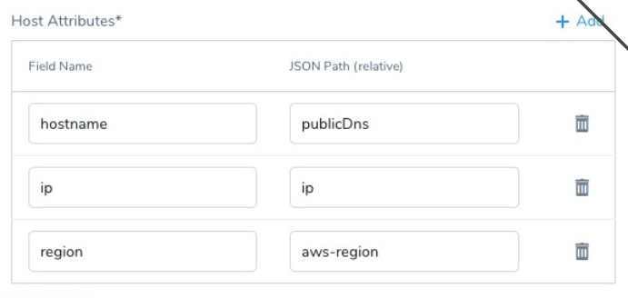

You can also use any of the default Harness expressions that are host-related. See [What is a Harness Variable Expression?](https://docs.harness.io/article/9dvxcegm90-variables).

#### Artifact Build Number and Different Artifact Versions

Currently, this feature is behind the feature flag `CUSTOM_DEPLOYMENT_ARTIFACT_FROM_INSTANCE_JSON`. Contact [Harness Support](mailto:support@harness.io) to enable the feature.If your deployment targets are a fixed set of instances but you don't update all of them on each new deployment, Harness might not show the artifact versions of older artifacts in the Service Dashboard.

For example:

1. Initially there are 10 instances with version V1.
2. You deploy version V2 to 5 of the instances but still output all 10 instances.
3. The **Current Deployment Status** in the Service Dashboard will show 10 instances with version V2.

This result occurs because the **Fetch Instances** Workflow step doesn't consider the artifact information form your script by default. The step considers the instances information only.

To display the artifact versions, include the `artifactBuildNumber` in **Host Attributes**. and reference the artifact build number in your script output.

For example, here's a script output where `artifactBuildNo` includes the build numbers:


```
{  
  "hosts": [  
    {  
      "hostname": "host-1.harness.com",  
      "artifactBuildNo": "1.0"  
    },  
    {  
      "hostname": "host-2.harness.com",  
      "artifactBuildNo": "1.0"  
    },  
    {  
      "hostname": "host-3.harness.com",  
      "artifactBuildNo": "2.0"  
    }  
  ]  
}
```
In **Host Attributes**, you map `artifactBuildNumber` to `artifactBuildNo`:

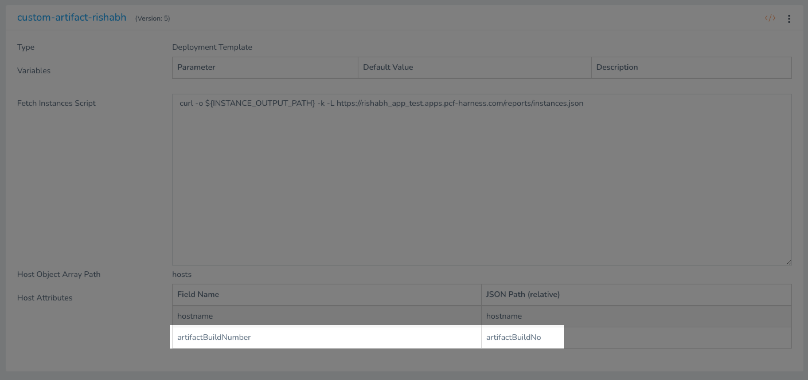

In the Services Dashboard, you will see different artifact versions and the number of hosts where they were deployed:

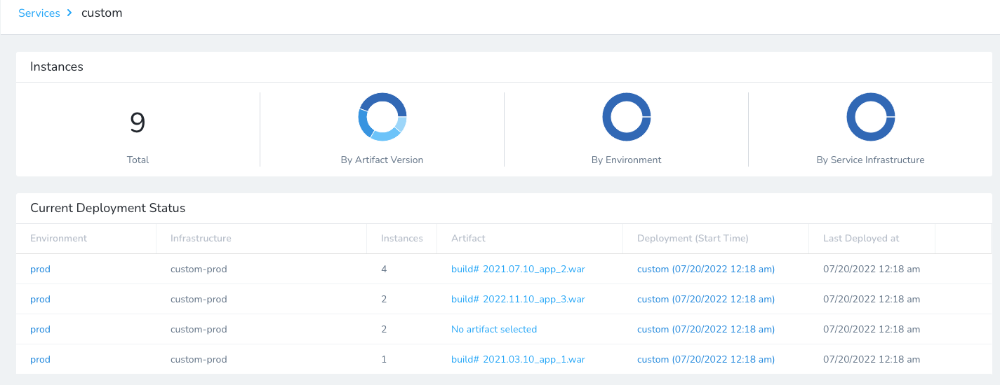

### Step 4: Create Harness Service

Create your Harness Service as described in [Add Specs and Artifacts using a Harness Service](https://docs.harness.io/article/eb3kfl8uls-service-configuration).

In **Deployment Type**, select your Deployment Template.

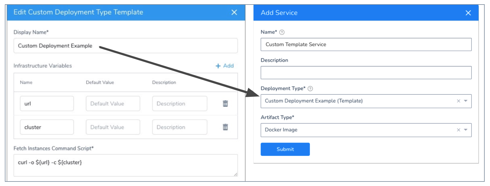

In the new Service, add your Artifact Source just as you would with any other Harness Service deployment type. All supported artifact sources are available, as is the custom artifact source.

You must reference the artifact source somewhere in your Harness entities, such as a Shell Script Workflow step. If you do not reference the artifact source, Harness does not prompt you to select an artifact version when you deploy your Workflow. See [Option: Reference Artifact Sources](#option_reference_artifact_sources).See

* [Service Types and Artifact Sources](https://docs.harness.io/article/qluiky79j8-service-types-and-artifact-sources)
* [Add a Docker Artifact Source](https://docs.harness.io/article/gxv9gj6khz-add-a-docker-image-service)
* [Using Custom Artifact Sources](https://docs.harness.io/article/jizsp5tsms-custom-artifact-source)

There are no specs for the custom deployment service. You can add Configuration variables (environment variables) and files that can be referenced and used in your Workflow, and [overwritten by Harness Environments](https://docs.harness.io/article/4m2kst307m-override-service-files-and-variables-in-environments).

See:

* [Add Service Config Variables](https://docs.harness.io/article/q78p7rpx9u-add-service-level-config-variables)
* [Add Service Config Files](https://docs.harness.io/article/iwtoq9lrky-add-service-level-configuration-files)

### Step 5: Create Target Infrastructure Definition

Next you create an Infrastructure Definition that uses the Deployment Template's Infrastructure Variables settings to define the target hosts/container.

1. In the Infrastructure Definition settings, in **Cloud Provider Type**, select **Template**.
2. In **Deployment Type**, select the Deployment Template you created.
3. In **Select Version**, select the version of the template you want to use. Harness templates can have multiple versions. See [Use Templates](../concepts-cd/deployment-types/use-templates.md).

Here is an example targeting a cluster:

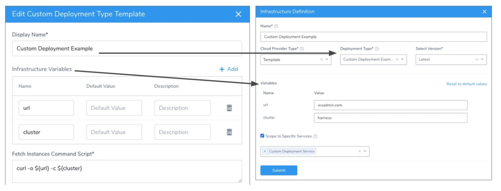

In the Infrastructure Definition, you can edit the variable values from the Deployment Template. You can use Harness variable expressions and secrets. See [What is a Harness Variable Expression?](https://docs.harness.io/article/9dvxcegm90-variables) and [Managing Harness Secrets](https://docs.harness.io/article/8bldcebkkf-managing-harness-secrets).

**If you do not change the defaults**, and the variables are changed in the Deployment Template, or new ones are added, the variables in the Infrastructure Definition are updated with the new defaults from the Deployment Template automatically.

If you do change the default, changes made to the Deployment Template default variables doe not impact the Infrastructure Definition.

In the Infrastructure Definition **Scope to Specific Services** setting, you can select the Service you created using the Deployment Template, but this is not mandatory.

Now that the Infrastructure Definition is completed, you can use it in a Workflow.

You can also override any Deployment Template variable values in the Environment overrides settings. See [Override Variables at the Infrastructure Definition Level](../kubernetes-deployments/override-variables-per-infrastructure-definition.md).

### Step 6: Create the Workflow

Once you have the created the Harness Service and Infrastructure Definition using the Deployment Template, you can create a Workflow to execute the **Fetch Instances Command Script** in the template.

In the Workflow, you add a **Fetch Instances** step where you want the script in **Fetch Instances Command Script** to execute. You can also reference any variable from the Deployment Template's **Infrastructure Variables** section, such as in a **Shell Script** step.

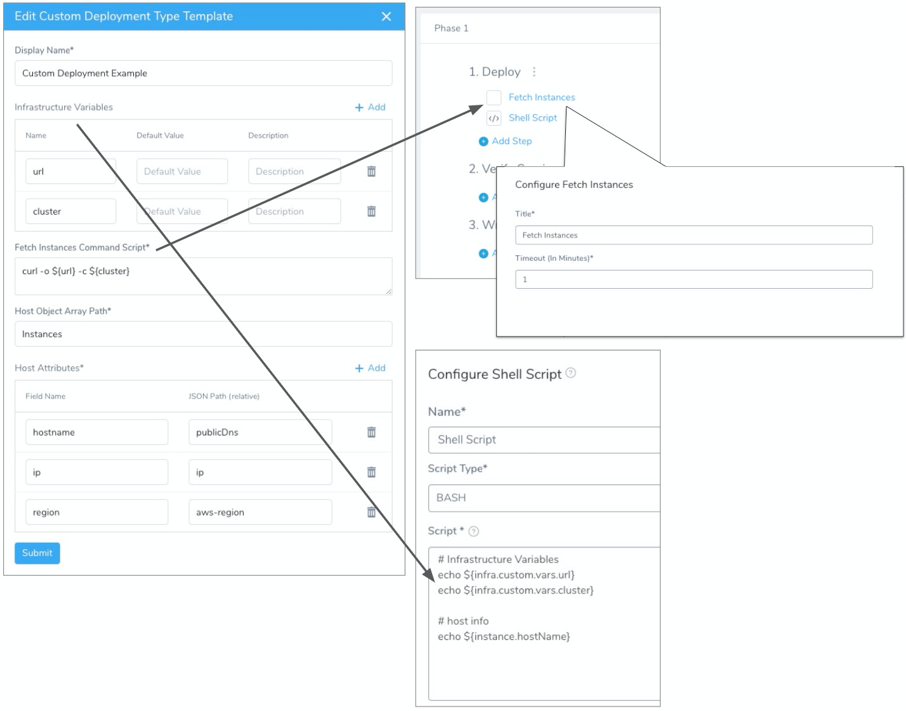

Deployment Templates are supported in the following Workflow Deployment Types:

* Basic
* Canary
* Multi-Service

To create the Workflow, do the following:

1. In **Workflows**, click **Add Workflow**. The Workflow settings appear.
2. Name the Workflow.
3. Select one of the supported Workflow Types.
4. Select the Environment that contains the Infrastructure Definition using your Deployment Template.
5. Select the Service using your Deployment Template.
6. Select the Infrastructure Definition using your Deployment Template.
7. Click **Submit**.

The Workflow is created. The Workflow does not have any default steps added like the platform-specific Workflows.

The Workflow is fully customizable. You can add sections, phases, Rollback Steps, etc, as needed. See [Workflows](https://docs.harness.io/article/m220i1tnia-workflow-configuration).

As this a custom deployment Workflow, the number of available steps is limited:


The only required step for custom deployment Workflows is **Fetch Instances**.

### Option: Reference Artifact Sources

If you added an artifact source to the Harness Service used by this Workflow, you must reference the artifact source somewhere in your Harness entities, such as a Shell Script Workflow step.

If you do not reference the artifact source, Harness does not prompt you for an artifact version when you deploy the Workflow.

For example, let's say you added an artifact source for a WAR file in the Service's Artifact Source:

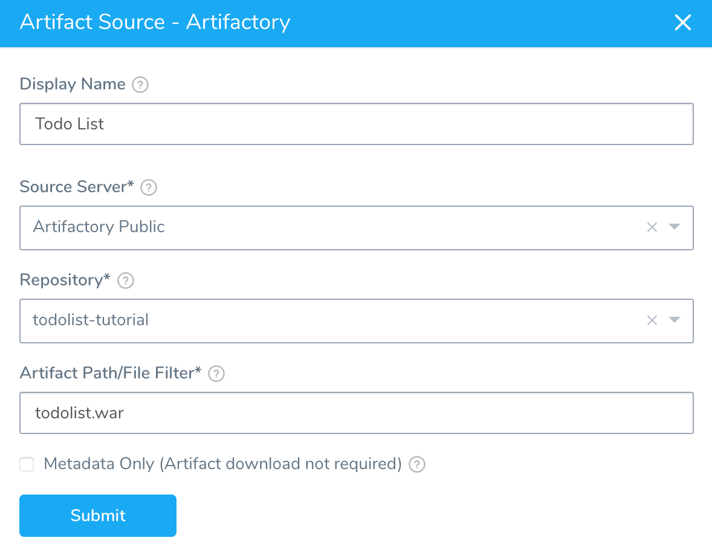

In your Workflow, add a [Shell Script step](https://docs.harness.io/article/1fjrjbau7x-capture-shell-script-step-output) that echos the `${artifact.buildNo}` or other [artifact built-in variables](https://docs.harness.io/article/aza65y4af6-built-in-variables-list#artifact).

Now when you deploy this Workflow, you will be prompted to select an artifact version.

If you did not reference the artifact in the Workflow, you would not be prompted.

See [Run Shell Scripts in Workflows](https://docs.harness.io/article/1fjrjbau7x-capture-shell-script-step-output).

### Step 7: Fetch Instances

The **Fetch Instances** step runs the script in your Deployment Template's **Fetch Instances Command Script** setting:

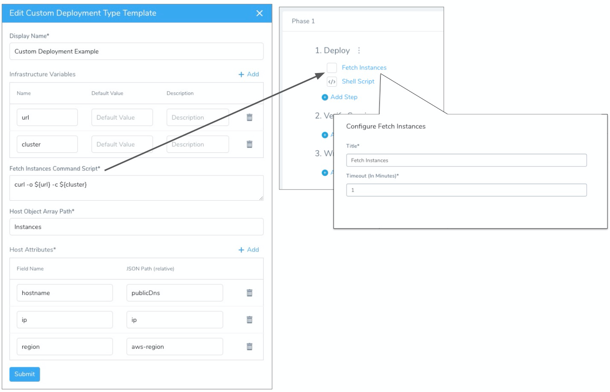

1. Add Fetch Instances to any point in the Workflow where you want to run your script.
2. In **Delegate Selector**, select the Delegate you want to use to run this step. See [Select Delegates with Selectors](https://docs.harness.io/article/c3fvixpgsl-select-delegates-for-specific-tasks-with-selectors).

### Option: Deployment Template Variable Expressions

Any variables set in **Infrastructure Variables** can he referenced in your Workflow using the expression `${infra.custom.vars.varName}`.

You can reference the host in your Workflow using the expression `${instance.hostName}`.

You can also use any of the default Harness expressions that are host-related. See [What is a Harness Variable Expression?](https://docs.harness.io/article/9dvxcegm90-variables).

Here is an example using a Shell Script step:

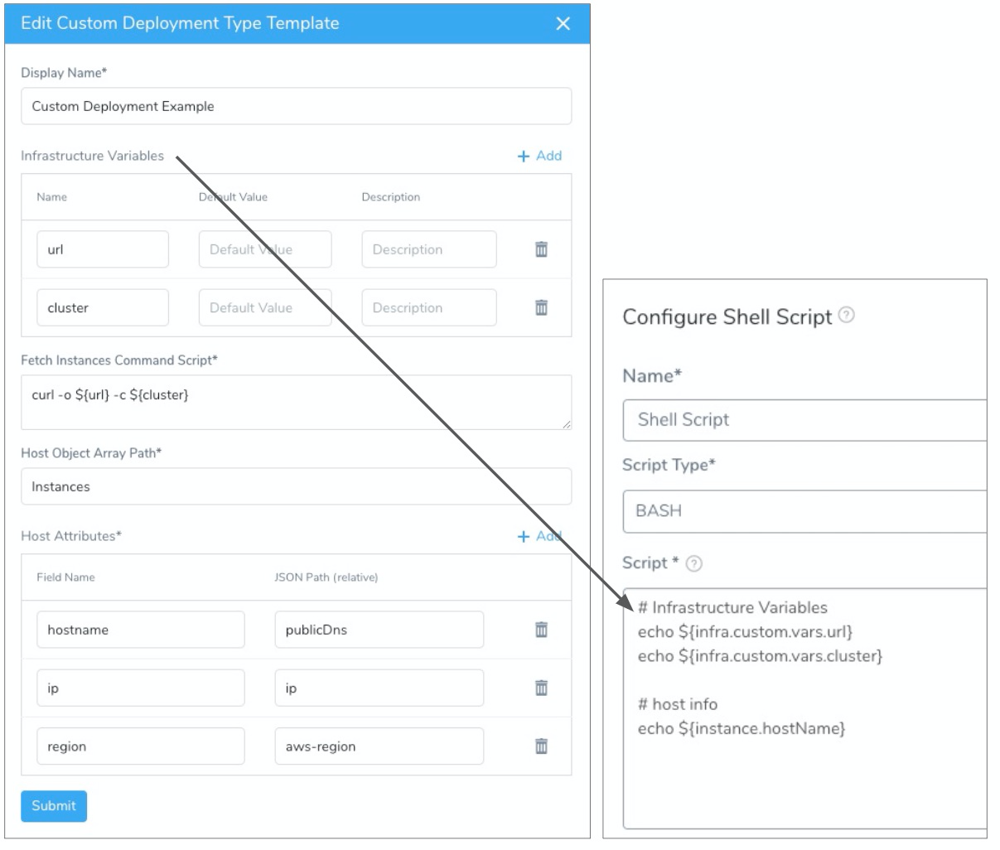

### See Also

* [Using Custom Artifact Sources](https://docs.harness.io/article/jizsp5tsms-custom-artifact-source)
* [Add and Use a Custom Secrets Manager](https://docs.harness.io/article/ejaddm3ddb-add-and-use-a-custom-secrets-manager)
* [Custom Shell Script Approvals](https://docs.harness.io/article/lf79ixw2ge-shell-script-ticketing-system)
* [Shell Script Provisioner](https://docs.harness.io/article/1m3p7phdqo-shell-script-provisioner)

### Configure As Code

To see how to configure the settings in this topic using YAML, configure the settings in the UI first, and then click the **YAML** editor button.

