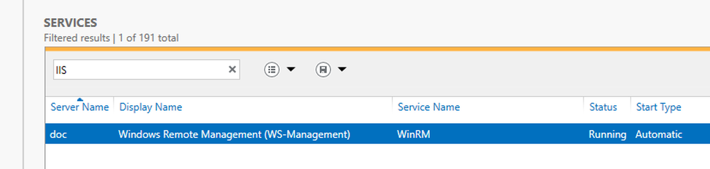
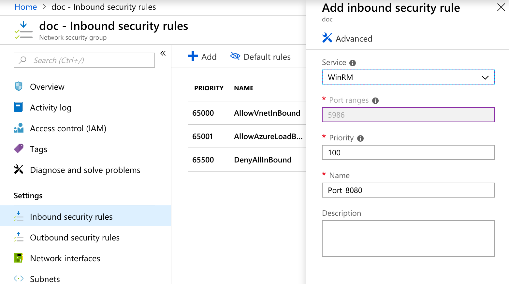
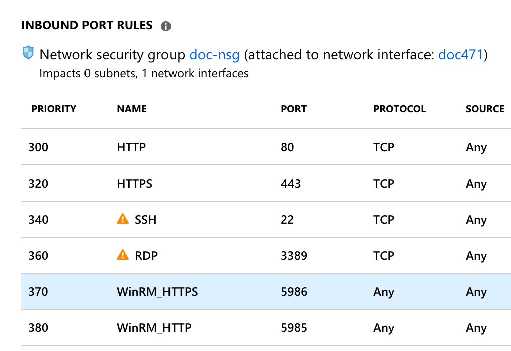
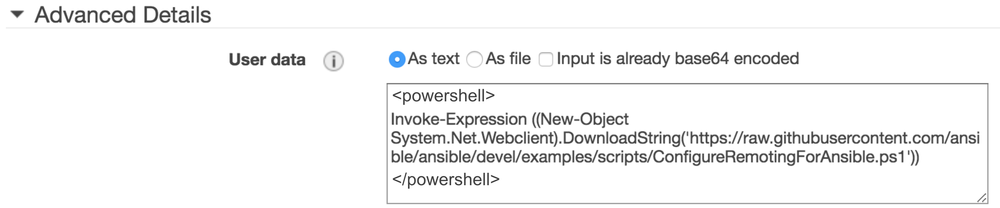
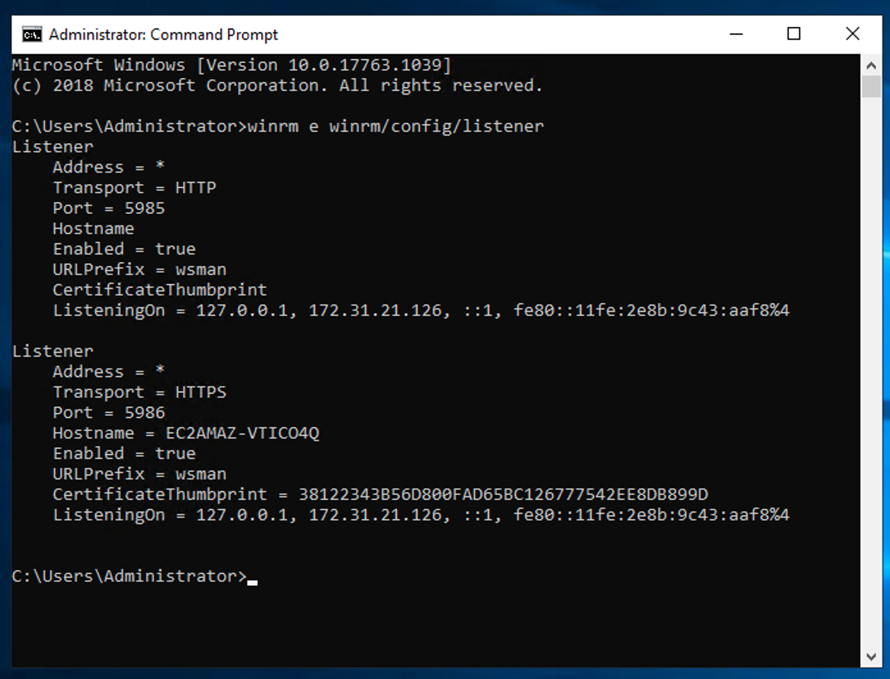
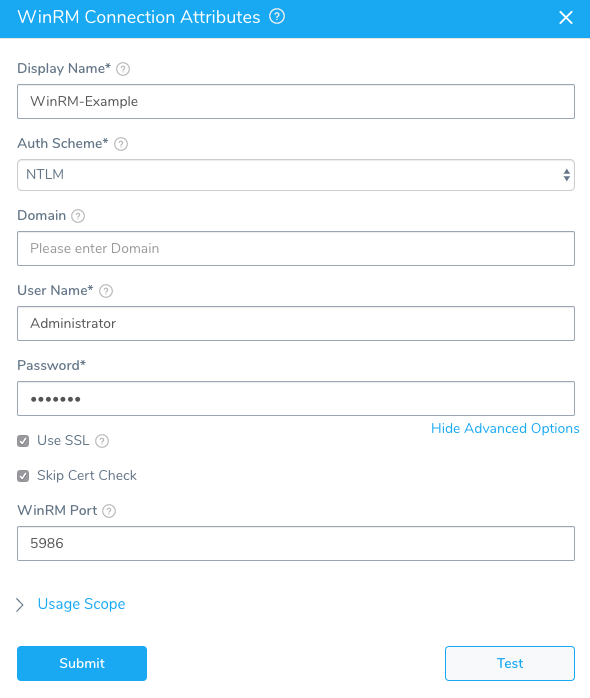
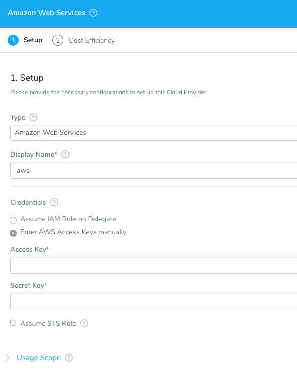
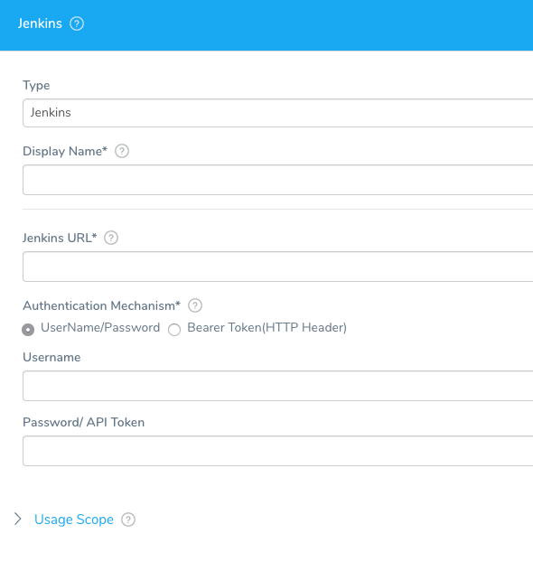

This topic sets up the Harness Delegate, WinRM Connection, Artifact Server, and Cloud Provider for your IIS Deployment. You can use these connections globally for all the IIS services and environments you add in Harness, or restrict them to specific applications and environments.


### Harness Delegate Connections for Azure

A Harness Delegate needs to connect to the Artifact Servers, Cloud Providers, and hosts you configure with Harness. The Delegate is only supported for Linux and cannot be run on a Windows VM in Azure.

To ensure that the Harness Delegate you use for Azure deployments can connect to your Azure resources, you can run the Delegate on a Linux VM in your Azure VPC (such as Ubuntu) or simply ensure that the Delegate has network access to resources in your Azure VPC.

For steps on setting up the Harness Delegate, see [Delegate Installation and Management](https://docs.harness.io/article/h9tkwmkrm7-delegate-installation).

### Set Up WinRM on Instances and Network

WinRM is a management protocol used by Windows to remotely communicate with another server, in our case, the Harness delegate. WinRM communicates over HTTP (5985)/HTTPS (5986), and is included in all recent Windows operating systems.

For WinRM, you need the following networking configured:

* The VMs must listen on HTTP (5985)/HTTPS (5986)
* Open the VMs ports for HTTP (5985)/HTTPS (5986)
* Open the subnet ports for HTTP (5985)/HTTPS (5986)

In cases where WinRM is not already set up on your Windows instances, you can set WinRM for HTTPS up using the following command:


```
Invoke-Expression ((New-Object System.Net.Webclient).DownloadString('https://raw.githubusercontent.com/ansible/ansible/devel/examples/scripts/ConfigureRemotingForAnsible.ps1')) 
```
We recommend using this command as it configures the necessary port and firewall settings for the Windows instance.**HTTP only** — To set up WinRM for HTTP (not HTTPS), from the command line (not PowerShell), run the following (the default HTTP port is 5985):


```
winrm quickconfig  
winrm set winrm/config/service @{AllowUnencrypted="true"}  
netsh advfirewall firewall add rule name="WinRM-HTTP" dir=in localport=5985 protocol=TCP action=allow
```
#### Set Up WinRM in Azure

Here is an example of the PowerShell set up of WinRM on an Azure Windows Server VM.


```
C:\Users\harness>PowerShell.exe  
Windows PowerShell  
Copyright (C) 2016 Microsoft Corporation. All rights reserved.  
  
PS C:\Users\harness> Invoke-Expression ((New-Object System.Net.Webclient).DownloadString('https://raw.githubusercontent.  
com/ansible/ansible/devel/examples/scripts/ConfigureRemotingForAnsible.ps1'))  
Self-signed SSL certificate generated; thumbprint: 4B4AAFE402B3B96EAC3C26FE0DE7332E9010B1C7  
  
  
wxf                 : http://schemas.xmlsoap.org/ws/2004/09/transfer  
a                   : http://schemas.xmlsoap.org/ws/2004/08/addressing  
w                   : http://schemas.dmtf.org/wbem/wsman/1/wsman.xsd  
lang                : en-US  
Address             : http://schemas.xmlsoap.org/ws/2004/08/addressing/role/anonymous  
ReferenceParameters : ReferenceParameters  
  
Ok.  
  
PS C:\Users\harness> exit  
  
C:\Users\harness>winrm e winrm/config/listener  
Listener  
    Address = *  
    Transport = HTTP  
    Port = 5985  
    Hostname  
    Enabled = true  
    URLPrefix = wsman  
    CertificateThumbprint  
    ListeningOn = 10.0.1.4, 127.0.0.1, ::1, 2001:0:9d38:90d7:1868:10ad:f5ff:fefb, fe80::5efe:10.0.1.4%9, fe80::1868:10ad:f5ff:fefb%10, fe80::915e:d4bb:bf06:9807%5  
  
Listener  
    Address = *  
    Transport = HTTPS  
    Port = 5986  
    Hostname = doc  
    Enabled = true  
    URLPrefix = wsman  
    CertificateThumbprint = 4B4AAFE402B3B96EAC3C26FE0DE7332E9010B1C7  
    ListeningOn = 10.0.1.4, 127.0.0.1, ::1, 2001:0:9d38:90d7:1868:10ad:f5ff:fefb, fe80::5efe:10.0.1.4%9, fe80::1868:10ad:f5ff:fefb%10, fe80::915e:d4bb:bf06:9807%5
```
You can also see WinRM running in Server Manager:



You can also test if the WinRM service is running on a local or remote computer using the Test-WSMan PowerShell command. For more information, see [Test-WSMan](https://docs.microsoft.com/en-us/powershell/module/microsoft.wsman.management/test-wsman?view=powershell-6) from Microsoft.

Ensure that the ports you need for the WinRM connection are open on your network security group and VM. For more information, see [How to open ports to a virtual machine with the Azure portal](https://docs.microsoft.com/en-us/azure/virtual-machines/windows/nsg-quickstart-portal) to open the WinRM Inbound security rule.**Network Security Group:**



**VM Inbound Port Rules:**



For more information about Azure and WinRM, see the following:

* [Setting up WinRM access for Virtual Machines in Azure Resource Manager](https://docs.microsoft.com/en-us/azure/virtual-machines/windows/winrm)
* [Deploy a Windows VM and configures WinRM https listener](https://azure.microsoft.com/en-au/resources/templates/vm-winrm-windows/) (Azure Template)
* [WinRM on a Windows VM](https://azure.microsoft.com/en-us/resources/templates/vm-winrm-keyvault-windows/) (Azure Template)
* [Create a Key Vault](https://azure.microsoft.com/en-us/resources/templates/key-vault-create/) (Azure Template)
* [Quickstart: Set and retrieve a secret from Azure Key Vault using the Azure portal](https://docs.microsoft.com/en-us/azure/key-vault/quick-create-portal)
* [Manage Key Vault in Azure Stack by using the portal](https://docs.microsoft.com/en-us/azure/azure-stack/user/azure-stack-kv-manage-portal)
* [How to connect and log on to an Azure virtual machine running Windows](https://docs.microsoft.com/en-us/azure/virtual-machines/windows/connect-logon)
* [Understanding and troubleshooting WinRM connection and authentication](http://www.hurryupandwait.io/blog/understanding-and-troubleshooting-winrm-connection-and-authentication-a-thrill-seekers-guide-to-adventure)

#### Set Up WinRM in AWS

In AWS EC2, you can enter the command as User data when creating the instance:


```
<powershell>  
Invoke-Expression ((New-Object System.Net.Webclient).DownloadString('https://raw.githubusercontent.com/ansible/ansible/devel/examples/scripts/ConfigureRemotingForAnsible.ps1'))   
</powershell>
```


If you launch more than one instance at a time, the user data is available to all the instances in that reservation.

You can also remote into the EC2 instance, open a PowerShell session, and run the `Invoke-Expression`.

To verify that WinRM is running on your Windows instance, run the command:


```
winrm e winrm/config/listener
```
The successful output will be something like this:


```
C:\Windows\system32&gt;winrm e winrm/config/listener  
Listener  
    Address = *  
    Transport = HTTP  
    Port = 5985  
    Hostname  
    Enabled = true  
    URLPrefix = wsman  
    CertificateThumbprint  
    ListeningOn = 127.0.0.1, ....  
  
Listener  
    Address = *  
    Transport = HTTPS  
    Port = 5986  
    Hostname = EC2AMAZ-Q0MO0AP  
    Enabled = true  
    URLPrefix = wsman  
    CertificateThumbprint = 1A1A1A1A1A1A1A1A1A1A1  
    ListeningOn = 127.0.0.1, ...
```
Here's an example:



For more information about EC2 and WinRM, see the following:

* [WinRM (Windows Remote Management) Troubleshooting](https://blogs.technet.microsoft.com/jonjor/2009/01/09/winrm-windows-remote-management-troubleshooting/)
* [Running Commands on Your Windows Instance at Launch](https://docs.aws.amazon.com/AWSEC2/latest/WindowsGuide/ec2-windows-user-data.html)
* [How can I execute user data after the initial launch of my EC2 instance?](https://aws.amazon.com/premiumsupport/knowledge-center/execute-user-data-ec2/)
* [Connecting to Your Windows Instance](https://docs.aws.amazon.com/AWSEC2/latest/WindowsGuide/connecting_to_windows_instance.html)

If the default methods for setting up WinRM in your Windows instances is not working, try the script listed here: [Configure a Windows host for remote management with Ansible](https://gist.github.com/ardeshir/e0eabf7fb7e6700b314204be686f9113).

#### Set Up the WinRM Connection in Harness

Add a WinRM connection in Harness to execute deployment steps on the remote Windows servers.

1. Mouseover **Continuous Security**, and then click **Secrets Management**. The Secrets Management page appears.
2. Under **Executions Credentials**, click **WinRM Connection**. The **WinRM Connection Attributes** dialog appears.

   
	 
3. Fill out the **WinRM Connection Attributes** dialog and click **SUBMIT**. The **WinRM Connection Attributes** dialog has the following fields.


|  |  |
| --- | --- |
| **Field** | **Description** |
| **Name** | Name to identify the connection. You will use this name to identify this connection when setting up the **Connection Attributes** in the Environment Infrastructure Definition. |
| **Auth Scheme** | Specifies the mechanism used to authenticate the credentials used in this connection. Currently only NTLM is supported. |
| **Domain** | The Active Directory domain name where the user account in the credentials is registered. This can be left blank when using a local user. |
| **User Name** / **Password** | The user account credentials for this connection. The user must belong to the same Active Directory domain as the Windows instances that this connection uses. These are the same user account credentials you would use to log into the VM using a remote connection such as Microsoft Remote Desktop.In cases when **Domain** is blank (local user), you can put **./** before the user name. The **./** prefix is equivalent to `local_host_or_ip\user`. |
| **Use SSL** | Enables an HTTPS connection instead of an HTTP connection. SSL is recommended. |
| **Skip Cert Check** | When connected over HTTPS (**Use SSL** in enabled), the client does not validate server certificate. |
| **WinRM Port** | Specifies the network port on the remote computer to use.To connect to a remote computer, the remote computer must be listening on the port that the connection uses. The default ports are 5985, which is the WinRM port for HTTP, and **5986**, which is the WinRM port for HTTPS.To determine what ports WinRM is listening on, use the command:**winrm e winrm/config/listener** |

If you experience errors getting the WinRM connection to work, you might need to restart the Windows Server.

### Cloud Provider Setup

Add a connection to the Cloud Provider where the IIS website, application, or virtual directory will be deployed.

1. Click **Setup**, and then click **Cloud Providers**. The **Cloud Providers** page appears.
2. Click **Add Cloud Provider**. The **Cloud Provider** dialog appears.
3. In **Type**, select the type of cloud provider you want to add, such as **Amazon Web Services** or **Microsoft Azure**. The dialog settings will change for each cloud provider.
4. Enter the cloud provider account information, and then click **SUBMIT**. For account details and Harness permission requirements for the different providers, see [Add Cloud Providers](https://docs.harness.io/article/whwnovprrb-infrastructure-providers) ([AWS](https://docs.harness.io/article/whwnovprrb-infrastructure-providers#amazon_web_services_aws_cloud), [Azure](https://docs.harness.io/article/whwnovprrb-infrastructure-providers#azure)).  
Once you have created Harness applications and environments, you can return to this dialog and add **Usage Scope** on which applications and environments may use this provider.

For certain Cloud Providers, such as AWS, instead of using account information to set up the Cloud Provider, you can install a Harness Delegate in your VPC and use its credentials for your Cloud Provider. After you install the Delegate, you add a Selector to the Delegate, and then simply select that Selector in the Cloud Provider dialog. For an example, see [Installation Example: Amazon Web Services and ECS](https://docs.harness.io/article/h9tkwmkrm7-delegate-installation#installation_example_amazon_web_services_and_ecs).### Artifact Server Setup

Add a connection to the Artifact Server where Harness can pull the IIS website, application, or virtual directory artifact.

If you are using the same Cloud Provider as artifact server, then you can skip this step. For example, if you added AWS EC2 as a Cloud Provider and you are using AWS S3 as an artifact server, you do not need to add AWS S3 as an artifact server. You can simply use the same AWS connection.

1. Click **Setup**, and then click **Connectors**. The **Connectors** page appears.
2. Click **Artifact Server**, and then click **Add Artifact Server**. The artifact server dialog appears.
3. In **Type**, click the artifact source you want to use. The dialog settings will change for each server.
4. Enter the artifact server information and click **SUBMIT**. For account details and Harness permission requirements for the different servers, such as SMB and SFTP, see [Add Artifact Servers](https://docs.harness.io/article/7dghbx1dbl-configuring-artifact-server).  
Once you have created Harness applications and environments, you can return to this dialog and add **Usage Scope** on which applications and environments may use this server.

Now that you have connected the IIS artifact server and a cloud provider, and configured a WinRM connection to execute deployment steps on the remote Windows servers, you can add your Harness application.

Azure Storage is not currently supported as an Artifact Source. Azure Container Registry is supported for Docker and Kubernetes deployments.

### Next Step

* [2 - Services for IIS (.NET)](2-services-for-iis-net.md)

