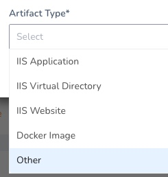
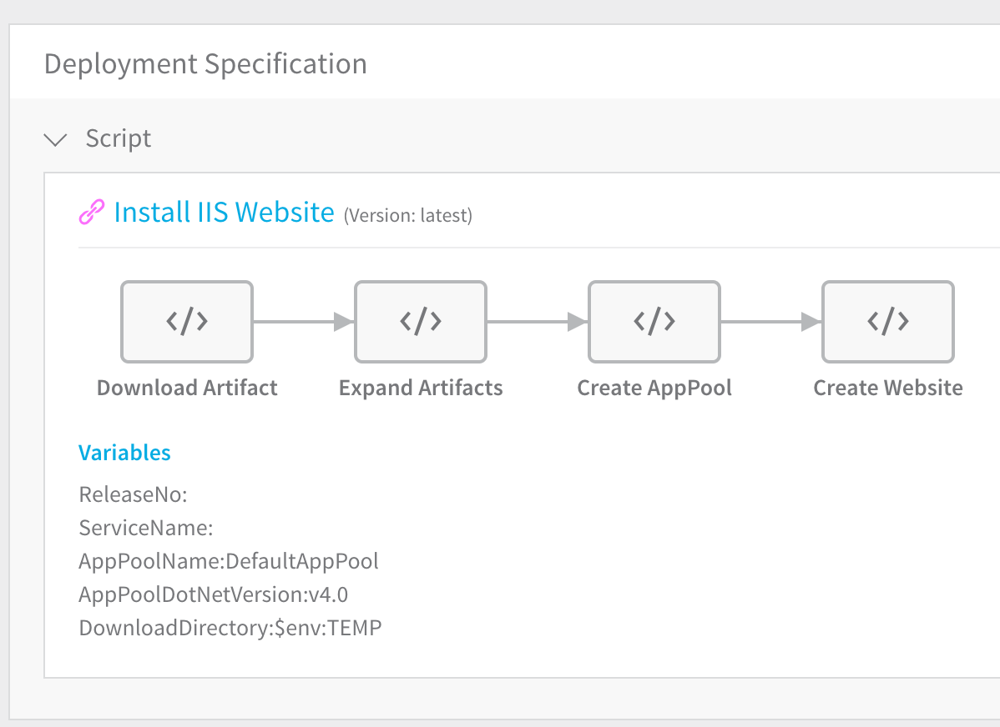
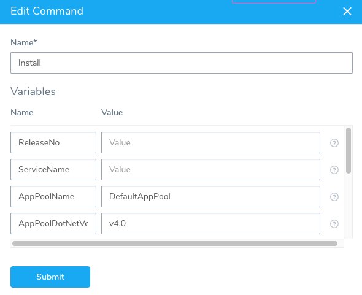
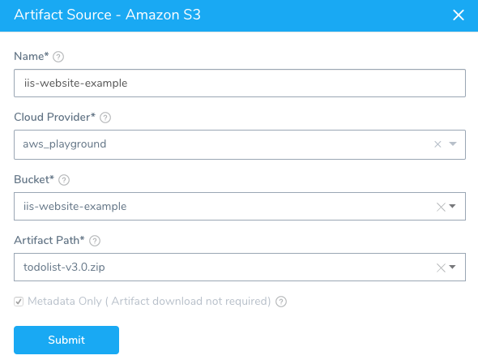
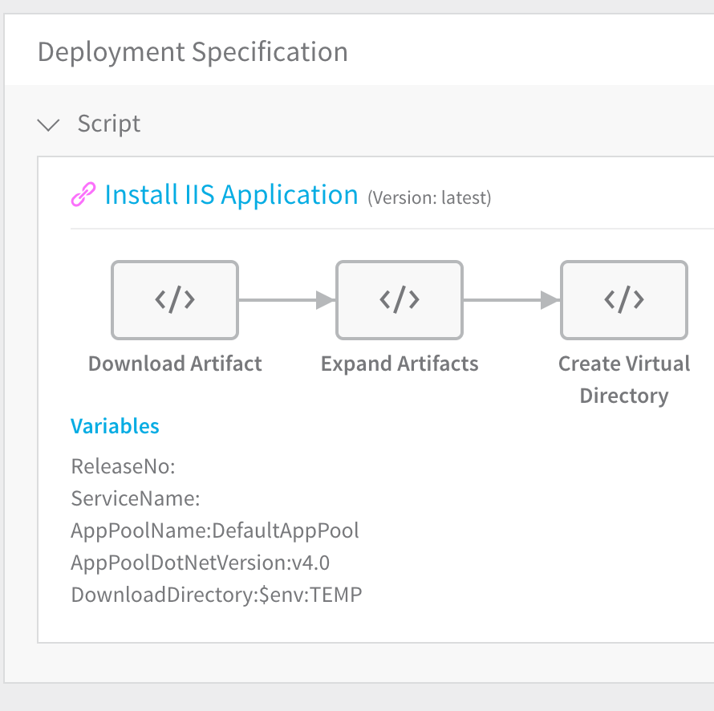
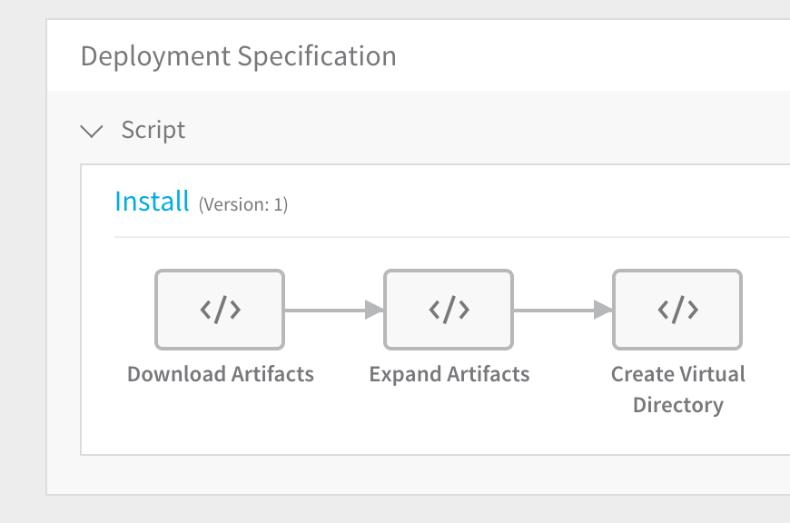
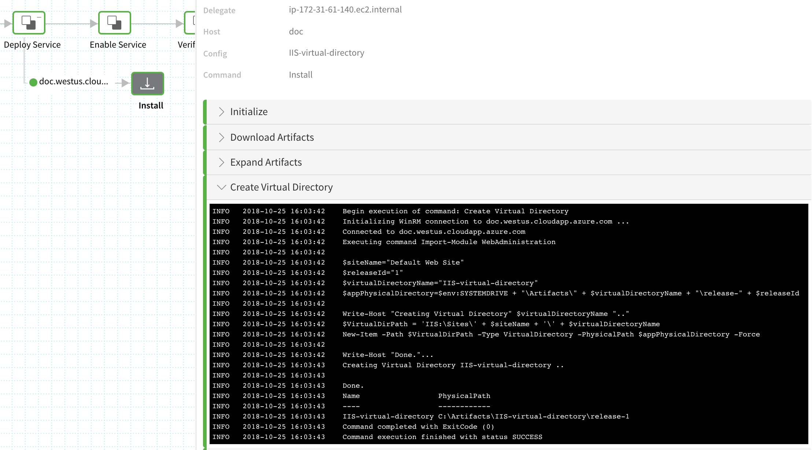

The procedures in this guide pull IIS website, application, and virtual directory metadata from AWS S3 and deploy them to a Windows instance in AWS EC2 or a Microsoft Azure VM. The first step is creating Harness Services for the IIS website, application, and virtual directory.

This topic describes how to create the IIS website, application, and virtual directory Harness Services.

### Add Harness Application

[A Harness Application](https://docs.harness.io/article/bucothemly-application-configuration) is a logical grouping of the Services, Environments, and Workflows for your IIS website deployment. First, we will create the Harness Application, and then each of the IIS Services.

To add the Harness Application, do the following:

1. Click **Setup**, and then click **Add Application**. The **Application** dialog appears.
2. Enter the name for your Application, such as **IIS-Example**, and click **SUBMIT**. Your new Application appears.
3. Click your Application’s name. The application entities appear. These are the tools you will use to define and execute your deployment.

### Add IIS Website Service

Services include artifact sources, deployment specifications, and configuration variables. For more information, see [Add a Service](https://docs.harness.io/article/eb3kfl8uls-service-configuration).

In this procedure you will define which artifact(s) to use for your IIS Website. Harness will then create a Deployment Specification using PowerShell.

We are using IIS artifact types in this topic, but Harness WinRM Services support IIS and Docker artifact types:To add a service for your IIS Website, do the following:

1. In your Application, click **Services**, and then click **Add Service**. The **Service** dialog appears.
2. Give the service a name, such as **IIS-website**.
3. In **Deployment Type**, select **Windows Remote Management (WinRM)**.
4. In **Artifact Type**, select **IIS Website**.  
There are several types supported, including **Other**, which you can use for a Windows-native application:
5. Click **SUBMIT**. The service is displayed. In **Service Overview** you can see the name and type of your service.
6. To add the artifact source for your IIS website, click **Add Artifact Source**. A list of artifact source types appears.
7. Click the artifact source type. The artifact sources consist of the cloud providers and build servers you added earlier. For this guide, we will use **Amazon S3**. Harness also supports other popular Windows protocols such as SMB and SFTP.
8. For the Amazon S3 example, in **Cloud Provider**, select the S3 provider you added earlier. Harness connects to the provider automatically
9. In **Bucket**, select one of the buckets in the S3. The list is automatically populated by Harness.
10. In **Artifact Path**, select the file(s) for your IIS website. The list is automatically populated by Harness. For this guide, we will use a zip file.  
**Harness** **uses Metadata-only:** For WinRM connections, Harness does not use direct artifact copy when you deploy. Harness executes Powershell scripts on the target host(s) to download the artifact.  
Metadata is used to download the artifact directly onto the Windows Host during deployment runtime. For this reason, ensure that the target host has connectivity to the Artifact Server before deploying.When you are finished, the Artifact Source will look something like this:
11. Click **SUBMIT**. Harness builds the service, including the **Deployment Specification**.
    
    The **Deployment Specification** section is automatically filled with the Install IIS Website template, which pulls the artifact, expands it, creates the Application Pool (AppPool) and creates the website. Later you will create the environment where the scripts will be executed.  
To add more scripts, mouseover anywhere in the script and click the plus icon:

By default the Install IIS Website Template is *linked* to the template in the Template Library and its scripts cannot be edited in the Service (although its variables may be edited).

##### Install IIS Website Template

When you create a Service of type IIS Website, a link to the Install IIS Website template is added to the Service. The template contains the following script steps:

* **Download Artifacts** - As noted earlier, for WinRM connections, Harness does not use direct artifact copy when you set up the Service. Only metadata is supported and is used to download the artifact directly onto the target Windows host during deployment runtime. Ensure the target host has connectivity to your Artifact Server.
* **Expand Artifacts** - PowerShell script runs to expand the artifact.
* **Create App Pool** - See [Application Pools](#application_pools) below.
* **Create Website** - PowerShell script to create the IIS Website.

For more information on templates, see [Use Templates](../concepts-cd/deployment-types/use-templates.md).

##### Template Variables

To edit the variables used in the Install IIS Website Template in the Service, click **Variables**. The **Edit Command** dialog appears.



Add values for the variables as needed. The variables used in the Install IIS Website Template in the Service can be modified without influencing the Install IIS Website Template in the Template Library.

##### Application Pools

Harness manages the deployment of the new IIS website, application, or virtual directory artifacts to your Windows instances using the default Application pool. If you want to specify the Application pool, use the **applicationPool** element, adding it to the **New-Item** script during application creation.

For more information, see:

* [New-Item](https://docs.microsoft.com/en-us/powershell/module/microsoft.powershell.management/new-item?view=powershell-6)
* [&lt;applicationPool&lt; Element (Web Settings)](https://docs.microsoft.com/en-us/dotnet/framework/configure-apps/file-schema/web/applicationpool-element-web-settings)

When you create the IIS services in Harness, you can modify the AppPool name used in the **Create AppPool** settings of the **Deployment Specification**.

### Add IIS Application Service

In this procedure you will define which artifact(s) to use for your IIS Application. Harness will then create a Deployment Specification using PowerShell.

To add a service for your IIS Application, do the following:

1. In your application, Click **Services**, and then click **Add Service**. The **Service** dialog appears.
2. Give the service a name, such as **IIS-application**.
3. In **Deployment Type**, select **Windows Remote Management (WinRM)**.
4. In **Artifact Type**, select **IIS Application**.
5. Click **SUBMIT**. The service is displayed.
   
   In **Service Overview** you can see the name and type of your service.
6. To add the artifact source for your IIS application, click **Add Artifact Source**. A list of artifact source types appears.
7. Click the artifact source type. The artifact sources consist of the cloud providers and build servers you added earlier. For this guide, we will use **Amazon S3**.
8. For the Amazon S3 example, in **Cloud Provider**, select the S3 provider you added earlier. Harness connects to the provider automatically
9. In **Bucket**, select one of the buckets in the S3. The list is automatically populated by Harness.
10. In **Artifact Path**, select the file(s) for your IIS application. The list is automatically populated by Harness. For this guide, we will use a zip file.  
For WinRM connections, Harness does not use direct artifact copy when you set up the Service. Metadata is supported and is used to download the artifact directly onto the Windows Host during deployment runtime. For this reason, ensure that the target host has connectivity to the Artifact Server before deploying.When you are finished, the Artifact Source will look something like this:

Click **SUBMIT** to add the artifact source. Harness builds the service, including the **Deployment Specification**.



The **Deployment Specification** section is automatically filled with, and linked to, the Install IIS Application template.

By default, the Install IIS Application template is linked to the template in the Template Library and its scripts cannot be edited in the Service (although its variables may be edited). To modify its scripts, you must copy the template instead of linking to it. To do this, in the **Deployment Specification**, click **Add Command**, select **From Template Library**, select the **Install IIS Application Template**, and choose **Copy** instead of **Link**.

##### Install IIS Application Template

When you create a Service of type IIS Application, a link to the Install IIS Application template is added to the Service. The template contains the following script steps:

* **Download Artifact** - As noted earlier, for WinRM connections, Harness does not use direct artifact copy when you set up the Service. Meta-data is supported and is used to download the artifact directly onto the Windows Host during deployment runtime. Ensure the target host has connectivity to your Artifact Server.
* **Expand Artifacts** - PowerShell script runs to expand the artifact.
* Create Virtual Directory - PowerShell script runs to create the Virtual Directory.

For more information on templates, see [Use Templates](../concepts-cd/deployment-types/use-templates.md).

To edit the values for variables used in the template, click **Variables**. The variables used in the Install IIS Application template in the Service can be modified without influencing the Install IIS Application Template in the Template Library.

### Add IIS Virtual Directory Service

In this procedure you will define which artifact(s) to use for your IIS virtual directory. Harness will then create a **Deployment Specification** using PowerShell.

To add a service for your IIS virtual directory, do the following:

1. In your application, Click **Services**, and then click **Add Service**. The **Service** dialog appears.
2. Give the service a name, such as **IIS-virtual-directory**.
3. In **Deployment Type**, select **Windows Remote Management (WinRM)**.
4. In **Artifact Type**, select **IIS Virtual Directory**.
5. Click **SUBMIT**. The service is displayed. In **Service Overview** you can see the name and type of your service.
6. To add the artifact source for your IIS virtual directory, click **Add Artifact Source**. A list of artifact source types appears.
7. Click the artifact source type. The artifact sources consist of the cloud providers and build servers you added earlier. For this guide, we will use **Amazon S3**.
8. For the Amazon S3 example, in **Cloud Provider**, select the S3 provider you added earlier. Harness connects to the provider automatically
9. In **Bucket**, select one of the buckets in the S3. The list is automatically populated by Harness.
10. In **Artifact Path**, select the file(s) for your IIS virtual directory. The list is automatically populated by Harness. For this guide, we will use a zip file.  
For WinRM connections, Harness does not use direct artifact copy when you set up the Service. Meta-data is supported and is used to download the artifact directly onto the Windows Host during deployment runtime. For this reason, ensure that the target host has connectivity to the Artifact Server before deploying.When you are finished, the Artifact Source will look something like this:

Click **SUBMIT** to add the artifact source. Harness builds the service, including the **Deployment Specification**.



The Install IIS Application template is also used for the IIS Virtual Directory service type. By default, as with the IIS Application Service, the Install IIS Application template is linked to the template in the Template Library and its scripts cannot be edited in the Service (although its variables may be edited). To modify its scripts, you must copy the template instead of linking to it. To do this, in the **Deployment Specification**, click **Add Command**, select **From Template Library**, select the **Install IIS Application Template**, and choose **Copy** instead of **Link**.

You can modify the variables of the Install IIS Application template scripts by click **Variables**. The variables used in the Install IIS Application template in the Service can be modified without influencing the Install IIS Application Template in the Template Library.

Click **Create Virtual Directory**, and the **Create Virtual Directory** dialog appears. The dialog contains the following default PowerShell script that will be run during shell session of your Harness workflow:


```
Import-Module WebAdministration  
  
$siteName="Default Web Site"  
$releaseId="${workflow.ReleaseNo}"  
$virtualDirectoryName="${service.Name}"  
$appPhysicalDirectory=$env:SYSTEMDRIVE + "\Artifacts\" + $virtualDirectoryName + "\release-" + $releaseId  
  
Write-Host "Creating Virtual Directory" $virtualDirectoryName ".."  
$VirtualDirPath = 'IIS:\Sites\' + $siteName + '\' + $virtualDirectoryName  
New-Item -Path $VirtualDirPath -Type VirtualDirectory -PhysicalPath $appPhysicalDirectory -Force  
  
Write-Host "Done."
```
Note the following:

* The `$releaseId` variable has the value `${workflow.ReleaseNo}`. This is one of the builtin Harness variables. For more information, see [Variables and Expressions in Harness](https://docs.harness.io/article/9dvxcegm90-variables).
* The `$VirtualDirPath` variable shows you where your IIS directory will be deployed.

When you deploy this service as part of your workflow, you will see these variables used in the Harness deployment dashboard:



### WinRM and Copy Configs Command

The Copy Configs command copies configuration files defined in the **Configuration** section of the Service.

There is no file size limit on the config files that can be copied using the Copy Configs command.


### Next Step

* [3 - IIS Environments in AWS and Azure](iis-environments.md)

