Once you have the Harness Services for IIS website, application, and virtual directory, and the Harness Environment for your target infrastructure, you create Harness Workflows to deploy the IIS website, application, and virtual directory Services.

In this topic we walk through create a Workflow for the IIS website Service, but the Workflows for IIS application and virtual directory Services follow the same steps:

* [Create an IIS Website Workflow](4-iis-workflows.md#create-an-iis-website-workflow)
* [Deploy IIS Website](4-iis-workflows.md#deploy-iis-website)
	+ [Confirm Deployment in your Windows Instance](4-iis-workflows.md#confirm-deployment-in-your-windows-instance)
* [Create an IIS Application and Virtual Directory Workflows](4-iis-workflows.md#create-an-iis-application-and-virtual-directory-workflows)
* [Deploy IIS Pipeline](4-iis-workflows.md#deploy-iis-pipeline)
* [Next Step](4-iis-workflows.md#next-step)

Before deploying the IIS website, application, or virtual directory to your Windows instances, there must be an existing [IIS Web Server Role](https://docs.microsoft.com/en-us/iis/web-hosting/web-server-for-shared-hosting/installing-the-web-server-role) on the instance. This ensures that the environment is ready for deployment. Harness IIS Website deployment requires the IIS Web Server Role. The Harness IIS Application and IIS Virtual Directory deployments require that an IIS Website exists. For more information, see [Installing IIS from the Command Line](5-best-practices-and-troubleshooting.md#installing-iis-from-the-command-line) below.

### Create an IIS Website Workflow

Workflows are the deployment steps for services and environments, including types such as Canary and Blue/Green. Workflows also include verification, rollback, and notification steps.

1. In your application, click **Workflows**.
2. Click **Add Workflow**. The **Workflow** dialog appears.

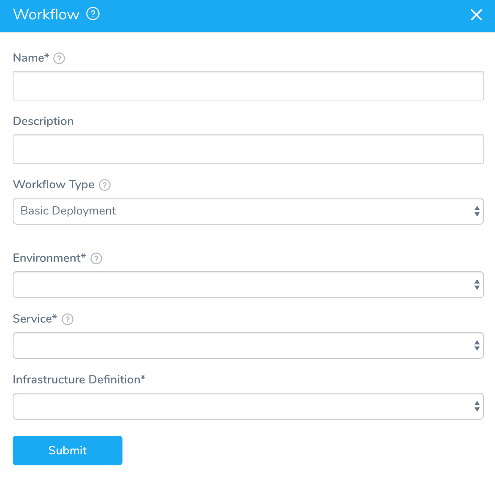

The dialog has the following fields.


|  |  |
| --- | --- |
| **Field** | **Description** |
| **Name** | Give your Workflow a name and description that tells users what it is deploying. |
| **Workflow Type** | In this guide, we will do a simple Basic workflow. For a summary of workflow types, see [Add a Workflow](https://docs.harness.io/article/m220i1tnia-workflow-configuration#workflow_types). |
| **Environment** | Select the environment you added. |
| **Service** | Select your IIS Website service. |
| **Infrastructure Definition** | Select the **Infrastructure Definition** you added. |

When you are finished, click **SUBMIT**. The workflow is generated:

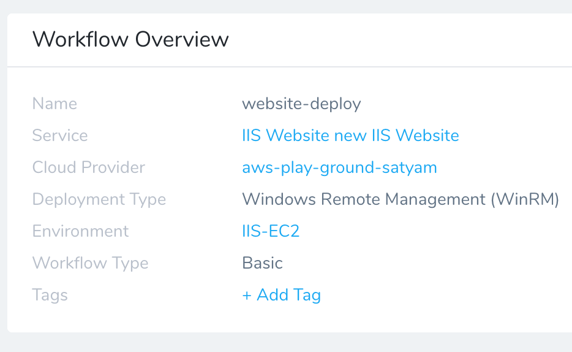

1. Under **Prepare Infra**, click **Select Nodes**. The **Node Select** dialog appears.
   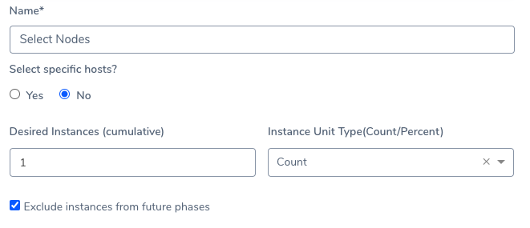

If you deploy in multiple phases, you can control what hosts to use for each phase. If you are simply doing one phase, you do not need to select hosts.  
The **Node Select** dialog has the following fields.

|  |  |
| --- | --- |
| **Field** | **Description** |
| **Select Specific hosts?** | Select **Yes** to enter the hostname(s) of the nodes where you want the website deployed.Select **No** to have Harness select the host(s) in the Infrastructure Definition based on the setup the in **Environment**. For AWS deployments, Tags are often used to help Harness select hosts. |
| **Desired** **Instances** | Enter the number of instances you want deployed.You can also enter a variable expression in this setting, such as a Workflow variable:This turns the setting into a deployment parameter. When the Workflow is deployed (manually or by [Trigger](https://docs.harness.io/article/xerirloz9a-add-a-trigger-2)) you can provide a value for the parameter.See [Set Workflow Variables](https://docs.harness.io/article/766iheu1bk-add-workflow-variables-new-template) and [Variables and Expressions in Harness](https://docs.harness.io/article/9dvxcegm90-variables). |
| **Instance Unit Type** | Identify if the number in **Instances** is a count or percentage.For example, if you select **10** in **Instances**, you can select **Count** and the artifact is deployed to **10** instances. Or you can enter 100 in **Instances** and select **Percent** and the artifact is deployed to **100%** of the instances in the Infrastructure Definition. |

When you're finished, click **SUBMIT**.

2. Under **Deploy Service**, click **Install**. The **Install** dialog appears.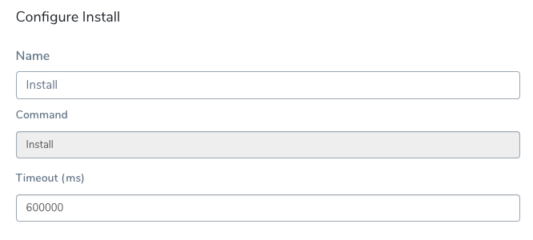
   You can set how long the installation may take before it's timed out. The default is 60000ms or 10 minutes. When you are finished, click **SUBMIT**.

Now that your workflow is complete, you are ready to deploy.

### Deploy IIS Website

Before deploying the IIS website, application, or virtual directory to your Windows instances, there must be an existing [IIS Web Server Role](https://docs.microsoft.com/en-us/iis/web-hosting/web-server-for-shared-hosting/installing-the-web-server-role) on the instance. This ensures that the environment is ready for deployment. Harness IIS Website deployment requires the IIS Web Server Role. The Harness IIS Application and IIS Virtual Directory deployments require that an IIS Website exists. For more information, see [Installing IIS from the Command Line](5-best-practices-and-troubleshooting.md#installing-iis-from-the-command-line) below.Now you can deploy your workflow, observe the deployment steps in real-time, and confirm in your VPC.

1. In your workflow, click **Deploy**.
   The **Start New Deployment** dialog appears.
	 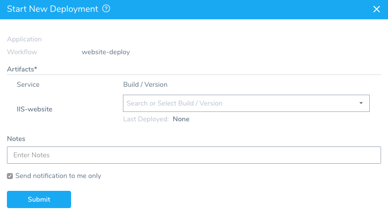
	 Here you simply select the artifact build and version to be deployed.
2. In **Artifacts**, click the dropdown menu and select the artifact build and version to deploy. The list is generated automatically by Harness from the artifact source you specified when you set up your service.  
  
You can also elect to skip any instances that already have the artifact build and version.
3. Click **SUBMIT** to deploy. Harness shows the deployment in real-time:

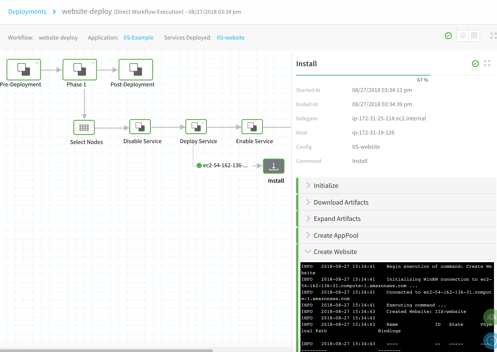

Each workflow step is displayed. Click through each deployment step to see the logs and details.

#### Confirm Deployment in your Windows Instance

Now that the deployment was successful, confirm the website was added to the Windows instance(s):

1. In your workflow Deployment page, click the **Install** step.
   
	 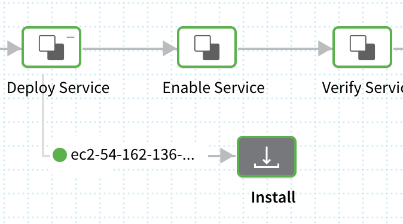
	 
2. Expand the **Create Website** section.

   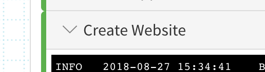

3. In the log, note the location where the website was created:  
  

```
INFO 2018-08-27 15:34:43 IIS-website 2 Started C:\Artifacts\IIS-website\relea http :8080:*
```
4. Connect to your Windows instance via Microsoft Remote Desktop or other console.
5. On the Windows instance, navigate to the location Harness reported to confirm the website was created:

### Create an IIS Application and Virtual Directory Workflows

The steps for creating Workflows for IIS Applications and Virtual Directories are the same as the steps for creating a Workflow for an IIS Website, described above.

1. Use the Harness Services you created for the IIS Application and Virtual Directory.
2. Use the same Harness Environment and Infrastructure Definition you used to create the IIS Website Workflow.
3. Deploy the IIS Virtual Directory Workflow first, then the IIS Application Workflow, and lastly the IIS Website Workflow. This sequence is best performed using a Harness Pipeline, described below.

Before deploying the IIS website, application, or virtual directory to your Windows instances, there must be an existing [IIS Web Server Role](https://docs.microsoft.com/en-us/iis/web-hosting/web-server-for-shared-hosting/installing-the-web-server-role) on the instance. This ensures that the environment is ready for deployment. Harness IIS Website deployment requires the IIS Web Server Role. The Harness IIS Application and IIS Virtual Directory deployments require that an IIS Website exists. For more information, see [Installing IIS from the Command Line](#installing_iis_from_the_command_line) below.

### Deploy IIS Pipeline

Once you have workflows for your IIS website, application, and virtual directory set up, you can create a Harness pipeline that deploys them in the correct order. For IIS, you must deploy them in the order website, application, and then virtual directory.

In you Harness application, click **Pipelines**. Follow the steps in [Add a Pipeline](https://docs.harness.io/article/zc1u96u6uj-pipeline-configuration) to add a stage for each of your workflows.

When you are done, the pipeline will look like this:

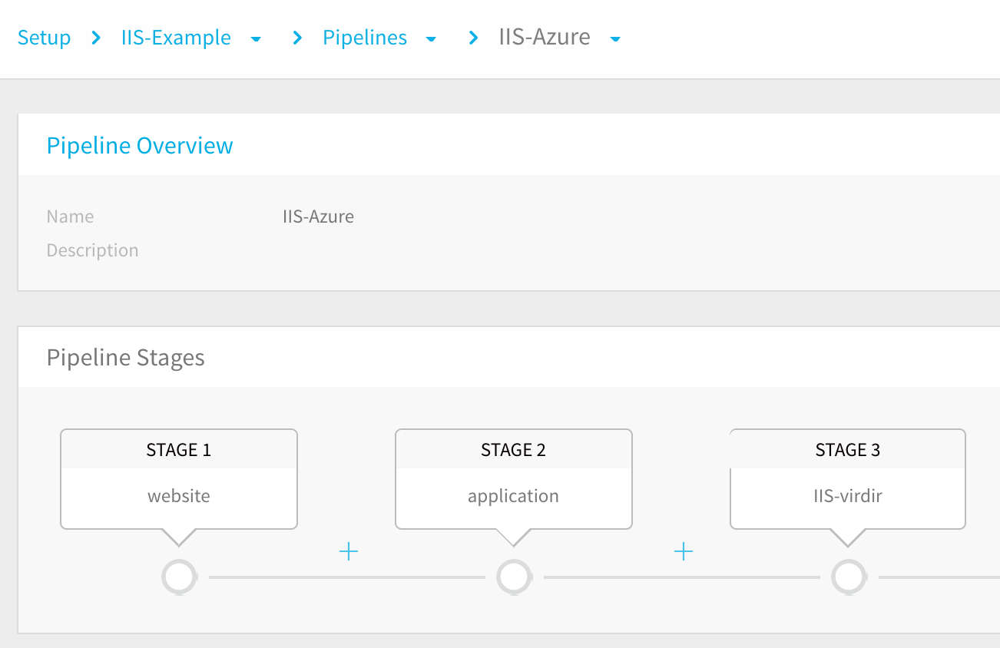

Click **Deploy**. The **Start New Deployment** dialog opens. Select each workflow artifact. When you are done, the dialog will look like this:

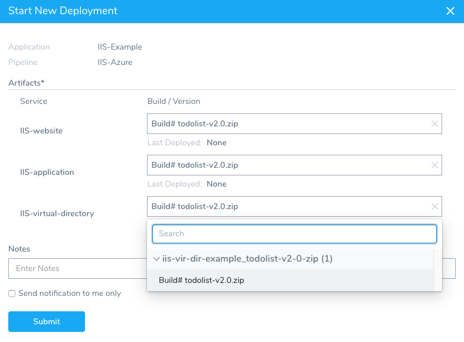

Click **SUBMIT**. Here's what the pipeline looks in the deployment dashboard. You can see each Stage was successful:

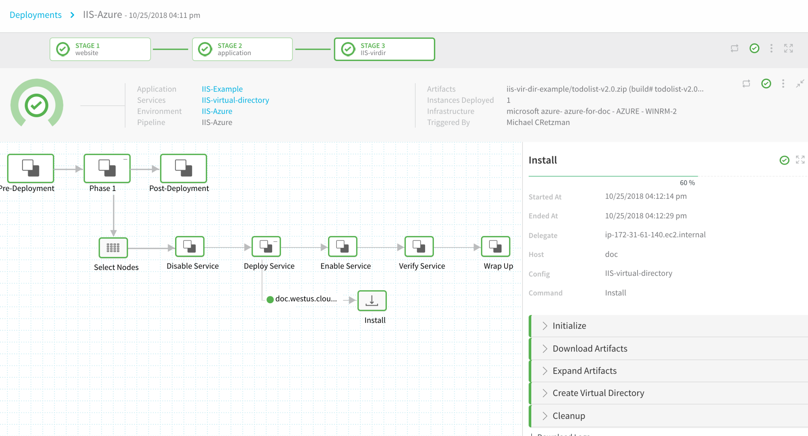

### Next Step

* [5 - Best Practices and Troubleshooting](5-best-practices-and-troubleshooting.md)

