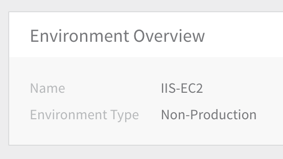
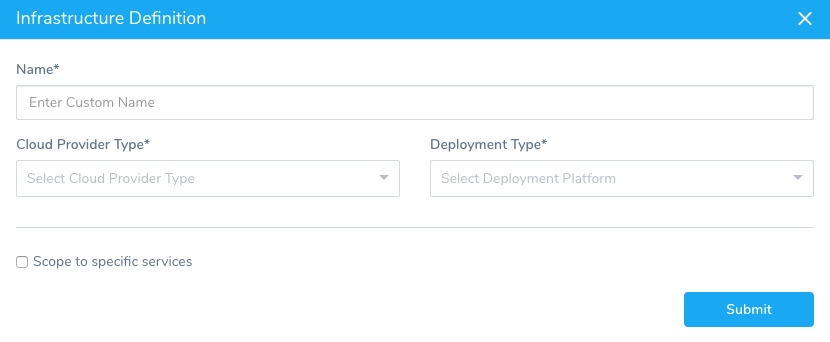
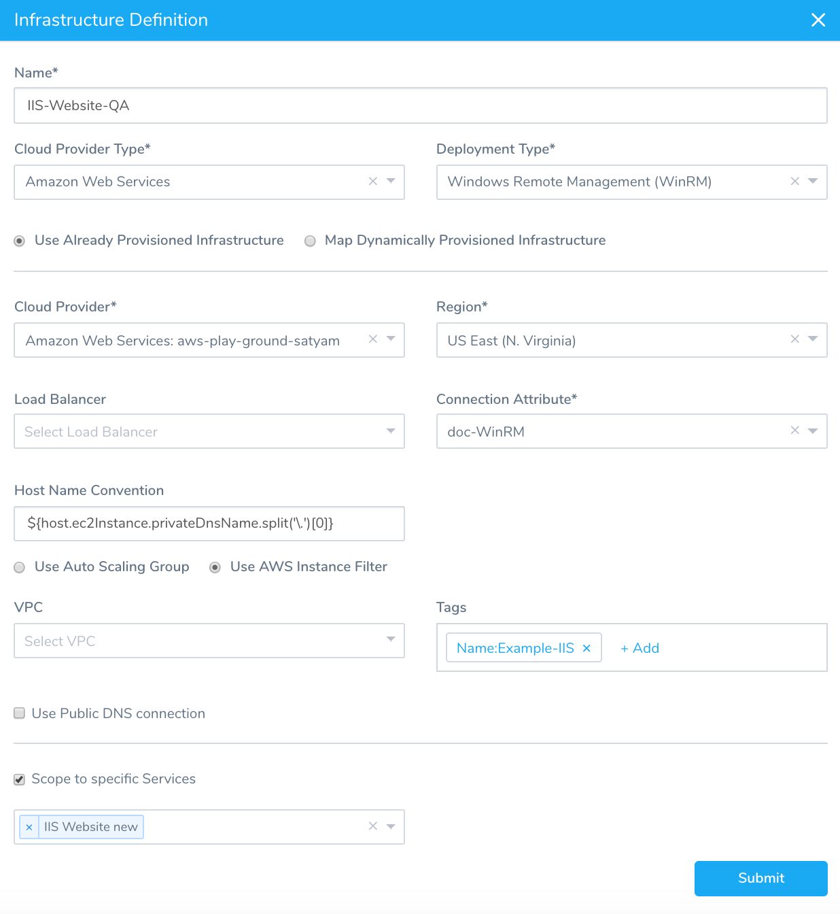
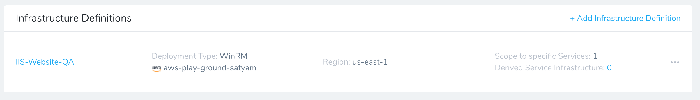
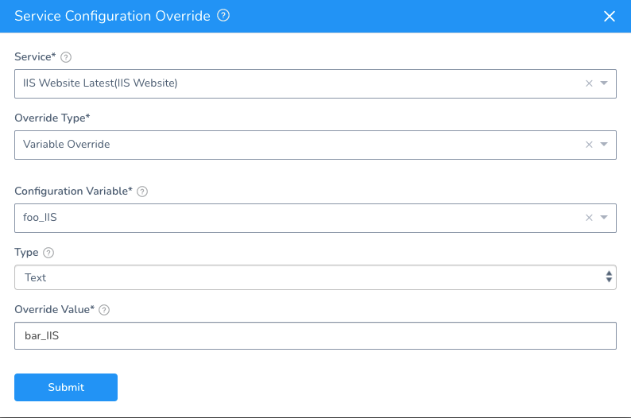

This topic describes how to add Harness Infrastructure Definitions for target deployment environments in AWS and Azure.

For more information, see [Add an Environment](https://docs.harness.io/article/n39w05njjv-environment-configuration).

### Create an Environment

To add an environment for your IIS Website, do the following:

1. In your application, click **Environments**. The Environments page for the applications appears.
2. Click **Add Environment**. The **Environment** dialog appears.
3. Enter a name for your deployment environment, such as **IIS-EC2**, and then, in **Environment Type**, click **Non-Production** or **Production**. When you are finished, click **SUBMIT**. The Environment page appears.

Next, you will add an Infrastructure Definition using the Cloud Provider you added to define where your IIS Website will be deployed.

### Add an Infrastructure Definition

​Infrastructure Definitions specify the target deployment infrastructure for your Harness Services, and the specific infrastructure details for the deployment, like VPC settings. 

You define the Kubernetes cluster to use for deployment as an ​Infrastructure Definition. For this guide, we will use the GCP Cloud Provider you added and the Kubernetes cluster with Helm installed.

To add the Infrastructure Definition, do the following:

1. In the Harness Environment, click **Add Infrastructure Definition**. The **Infrastructure Definition** dialog appears.
2. In **Name**, enter the name you will use to select this Infrastructure Definition when you create a Workflow.
3. In **Cloud Provider Type**, select the type of Cloud Provider you added earlier, such as **Amazon Web Services**, **Microsoft Azure**, etc. In the following steps we use the **Amazon Web Services** type, and so the settings are specific to AWS.
4. In **Deployment Type**, select **Windows Remote Management (WinRM)**.
5. In **Cloud Provider**, select the Cloud Provider you added earlier.
6. In **Region**, select the AWS region where you want to deploy. This list is populated using the Cloud Provider you selected.
7. In **Load Balancer**, select the load balancer used by the VPC.
8. In **Connection Attribute**, select the name of the [WinRM Connection](1-delegate-and-connectors-for-iis.md#set-up-win-rm-on-instances-and-network) you created. This is the value you entered in **Name** when you created the WinRM Connection in **Secrets Management**.
9. In **Host Name Convention**, in most cases, you can leave the default expression in this field.  
Host Name Convention is used to derive the instance(s) hostname. The hostname that results from the convention should be same as the output of the command **hostname** on the host itself.  
For information on obtaining the AWS instance hostname, see [Instance Metadata and User Data](https://docs.aws.amazon.com/AWSEC2/latest/UserGuide/ec2-instance-metadata.html) from AWS.
10. In **Scope to specific Services**, select the Harness Service you created earlier.  
The Infrastructure Definition will look something like this:
11. Click **Submit**. The new Infrastructure Definition is added to the Harness Environment.

That is all you have to do to set up the deployment Environment in Harness.

Now that you have the Service and Environment set up. Now you can create the deployment Workflow in Harness.

### AWS Infrastructure Definition

This following table describes the fields for an AWS EC2 Infrastructure Definition.

|  |  |
| --- | --- |
| **Field** | **What to Enter** |
| **Cloud Provider Type** | Select the type of Cloud Provider you added earlier, such as Amazon Web Services. |
| **Deployment Type** | Select **Windows Remote Management (WinRM)**. |
| **Cloud Provider** | Select the Cloud Provider you added. |
| **Provision Type** | If you have a Windows instance running in your Cloud Provider, click **Already Provisioned**. If you need to set up an instance, create the instance in your Cloud Provider, and then return to the Harness environment set up.If you have an Infrastructure Provisioner configured, select **Dynamically Provisioned**. This guide does not cover Harness Infrastructure Provisioners. For more information, see [Add an Infra Provisioner](https://docs.harness.io/article/o22jx8amxb-add-an-infra-provisioner). |
| **Region** | Region for the VPC. |
| **Load Balancer** | The load balancer used by the VPC. |
| **WinRM** **Connection Attributes** | Select the name of the WinRM Connection you created. This is the value you entered in **Name** when you created the WinRM Connection in **Secrets Management**. |
| **Host Name Convention** | Host Name Convention is used to derive the instance(s) hostname. The hostname that results from the convention should be same as the output of the command **hostname** on the host itself. Agent-based solutions like AppDynamics, Splunk, New Relic, etc, use the hostname to uniquely identify the instance.In most cases, you can leave the default expression in this field.For information on obtaining the AWS instance hostname, see [Instance Metadata and User Data](https://docs.aws.amazon.com/AWSEC2/latest/UserGuide/ec2-instance-metadata.html) from AWS. |
| **User Auto Scaling Group** / **Use AWS Instance Filter** | **User Auto Scaling Group:** If you are using an Auto Scaling Group, you can select it from the list.**Use AWS Instance Filter:** Specify the VPC, Tags, Subnet, and Security Group where your instance(s) will be deployed.Using **Tags** is the easiest way to reference an instance. |
| **Use Public DNS for connection** | If locating the VPC requires public DNS name resolution, enable this option. |
| **Scope to specific Services** | Select the Harness Service you created for your IIS Website. |

### Azure Infrastructure Definition

You can locate most of the Azure information on the VM overview page:

This following table describes the fields for an Azure Infrastructure Definition.

|  |  |
| --- | --- |
| **Field** | **What to Enter** |
| **Cloud Provider Type** | Select the type of Cloud Provider you added earlier, such as Microsoft Azure. |
| **Deployment Type** | Select **Windows Remote Management (WinRM)**. |
| **Cloud Provider** | Select the Cloud Provider you added. |
| **Subscription ID** | Select the Azure subscription to use. When you set up the Azure cloud provider in Harness, you entered the Client/Application ID for the Azure App registration. To access resources in your Azure subscription, you must assign the Azure app using this Client ID to a role in that subscription. Now, when you are setting up an Azure Infrastructure Definition in a Harness environment, you select the subscription. If the Azure App registration using this Client ID is not assigned a role in a subscription, no subscriptions will be available.For more information, see [Assign the application to a role](https://docs.microsoft.com/en-us/azure/active-directory/develop/howto-create-service-principal-portal#assign-the-application-to-a-role) from Microsoft. |
| **Resource Group** | Select the resource group where your VM is located. |
| **WinRM** **Connection Attributes** | Select the name of the WinRM Connection you created. This is the value you entered in **Name** when you created the WinRM Connection in **Secrets Management**. |
| **Tags** | Click **Add** to use a tag to quickly select the VM you want to use. |
| **Use Public DNS for connection** | If locating the VM(s) requires public DNS name resolution, enable this option. Since the Harness delegate can only run on Linux, it must either be run on a Linux VM in the same subnet as your deployment target VMs or on a Linux server with network access to your Azure VMs. In the latter case, you can use public DNS to resolve the hostname of the target VMs. |
| **Scope to specific Services** | Select the Harness Service you created for your IIS Website. |

### Option: Override an IIS Service Configuration

Currently, support for Config Files override is behind a Feature Flag. Contact [Harness Support](mailto:support@harness.io) to enable the feature. Feature Flags can only be removed for Harness Professional and Essentials editions. Once the feature is released to a general audience, it's available for Trial and Community Editions.You can configure your Environment to override the **Config Variables** and **Config Files** in the IIS Services that use the Environment.

For more information, see [Override a Service Configuration in an Environment](https://docs.harness.io/article/4m2kst307m-override-service-files-and-variables-in-environments).

### Next Step

* [4 - IIS Workflows and Pipelines](4-iis-workflows.md)

