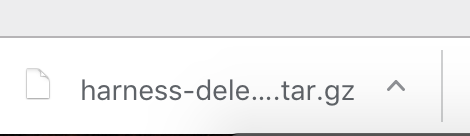
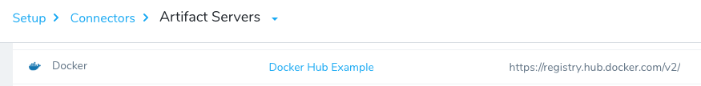
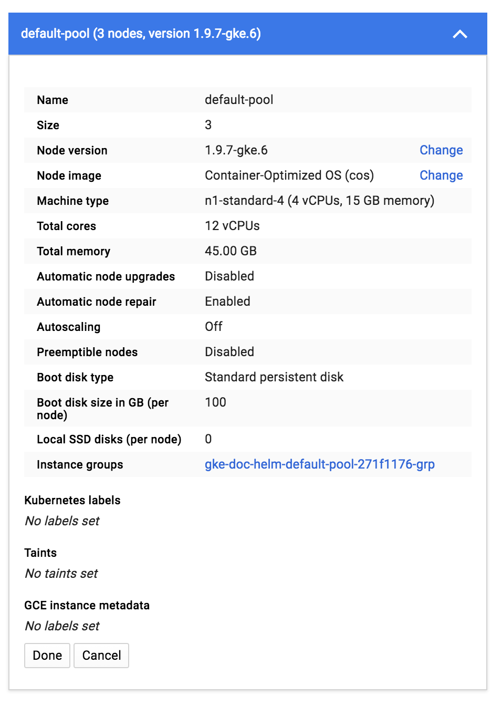

This content is for Harness [FirstGen](../../../getting-started/harness-first-gen-vs-harness-next-gen.md). Switch to [NextGen](https://docs.harness.io/article/lbhf2h71at).This topic describes how to set up the Harness Delegate, Connectors, and Cloud Providers for Helm, and provides some basic Helm setup information.

Harness includes both Kubernetes and Helm deployments, and you can Helm charts in both. Harness [Kubernetes Deployments](../kubernetes-deployments/kubernetes-deployments-overview.md) allow you to use your own Helm chart (remote or local), and Harness executes the Kubernetes API calls to build everything without Helm and Tiller needing to be installed in the target cluster. See [Helm Charts](https://docs.harness.io/article/t6zrgqq0ny-kubernetes-services#helm_charts).


### Permissions for Connections and Providers

You connect Docker registries and Kubernetes clusters with Harness using the accounts you have with those providers. The following list covers the permissions required for the Docker, Kubernetes, Helm components.

* Docker:
	+ **Read permissions for the Docker repository** - The Docker registry you use as an Artifact Server in Harness must have Read permissions for the Docker repository.
	+ **List images and tags, and pull images** - The user account you use to connect the Docker registry must be able to perform the following operations in the registry: List images and tags, and pull images. If you have a **Docker Hub** account, you can access the NGINX Docker image we use in this guide.
* Kubernetes Cluster:
	+ For the **Kubernetes Cluster** or other Cloud Providers, please see [Kubernetes Cluster](https://docs.harness.io/article/whwnovprrb-cloud-providers#kubernetes_cluster) and the Harness [Add Cloud Providers](https://docs.harness.io/article/whwnovprrb-cloud-providers) doc.
	+ For a cluster or provider such as OpenShift, please see [Kubernetes Cluster](https://docs.harness.io/article/whwnovprrb-infrastructure-providers#kubernetes_cluster).
* Helm:
	+ **URL for the Helm chart** - For this guide, we use a publicly available Helm chart for NGINX from Bitnami, hosted on their Github account. You do not need a Github account.
	+ **Helm and Tiller** - Helm and Tiller must be installed and running in your Kubernetes cluster. Steps for setting this up are listed below.

For a list of all of the permissions and network requirements for connecting Harness to providers, see [Delegate Connection Requirements](https://docs.harness.io/article/11hjhpatqz-connectivity-and-permissions-requirements).

### Harness Kubernetes Delegate

The Harness Kubernetes Delegate runs in your target deployment cluster and executes all deployment steps, such the artifact collection and kubectl commands. The Delegate makes outbound connections to the Harness Manager only.

You can install and run the Harness Kubernetes Delegate in any Kubernetes environment, but the permissions needed for connecting Harness to that environment will be different for each environment.

The simplest method is to install the Harness Delegate in your Kubernetes cluster and then set up the Harness Cloud Provider to use the same credentials as the Delegate.For information on how to install the Delegate in a Kubernetes cluster, see [Kubernetes Cluster](https://docs.harness.io/article/whwnovprrb-cloud-providers##kubernetes_cluster). For an example installation of the Delegate in a Kubernetes cluster in a Cloud Platform, see [Installation Example: Google Cloud Platform](https://docs.harness.io/article/h9tkwmkrm7-delegate-installation#installation_example_google_cloud_platform).

Here is a quick summary of the steps for installing the Harness Delegate in your Kubernetes cluster:

1. In Harness, click **Setup**, and then click **Harness Delegates**.
2. Click **Download Delegate** and then click **Kubernetes YAML**.
3. In the **Delegate Setup** dialog, enter a name for the Delegate, such as **doc-example**, select a Profile (the default is named **Primary**), and click **Download**. the YAML file is downloaded to your machine.
4. Install the Delegate in your cluster. You can copy the YAML file to your cluster any way you choose, but the following steps describe a common method.
	1. In a Terminal, connect to the Kubernetes cluster, and then use the same terminal to navigate to the folder where you downloaded the Harness Delegate YAML file. For example, **cd ~/Downloads**.
	2. Extract the YAML file: `tar -zxvf harness-delegate-kubernetes.tar.gz`.
	3. Navigate to the harness-delegate folder that was created:  
	  
	`cd harness-delegate-kubernetes`
	4. Paste the following installation command into the Terminal and press enter:  
	  
	`kubectl apply -f harness-delegate.yaml`  
	  
	You will see the following output (this Delegate is named **doc-example**):  
	  
	
	```
	namespace/harness-delegate created  
	  
	clusterrolebinding.rbac.authorization.doc-example/harness-delegate-cluster-admin created  
	  
	statefulset.apps/doc-example-lnfzrf created
	```
	Run this command to verify that the Delegate pod was created:  
	  
	`kubectl get pods -n harness-delegate`  
	  
	You will see output with the status Pending. The Pending status simply means that the cluster is still loading the pod.  
	Wait a few moments for the cluster to finish loading the pod and for the Delegate to connect to Harness Manager.  
	In Harness Manager, in the **Harness Delegates** page, the new Delegate will appear. You can refresh the page if you like.

### Connections and Providers Setup

This section describes how to set up Docker and Kubernetes with Harness, and what the requirements are for using Helm.

#### Docker Artifact Server

You can add a Docker repository, such as Docker Hub, as an Artifact Server in Harness. Then, when you create a Harness service, you specify the Artifact Server and artifact(s) to use for deployment.

For this guide, we will be using a publicly available Docker image of NGINX, hosted on Docker Hub at [hub.docker.com/\_/nginx/](https://hub.docker.com/_/nginx/). You will need to set up or use an existing Docker Hub account to use Docker Hub as a Harness Artifact Server. To set up a free account with Docker Hub, see [Docker Hub](https://hub.docker.com/).

To specify a Docker repository as an Artifact Server, do the following:

1. In Harness, click **Setup**.
2. Click **Connectors**. The **Connectors** page appears.
3. Click **Artifact Servers**, and then click **Add Artifact Server**. The **Artifact Servers** dialog appears.
4. In **Type**, click **Docker Registry**. The dialog changes for the Docker Registry account.
5. In **Docker Registry URL**, enter the URL for the Docker Registry (for Docker Hub, **https://registry.hub.docker.com/v2/**).
6. Enter a username and password for the provider (for example, your **Docker Hub** account).
7. Click **SUBMIT**. The artifact server is displayed.



##### Single GCR Docker Registry across Multiple Projects

In this document, we perform a simple set up using Docker Registry. Another common artifact server for Kubernetes deployments is GCR (Google Container Registry), also supported by Harness.

An important note about using GCR is that if your GCR and target GKE Kubernetes cluster are in different GCP projects, Kubernetes might not have permission to pull images from the GCR project. For information on using a single GCR Docker registry across projects, see [Using single Docker repository with multiple GKE projects](https://medium.com/google-cloud/using-single-docker-repository-with-multiple-gke-projects-1672689f780c) from Medium and the [Granting users and other projects access to a registry](https://cloud.google.com/container-registry/docs/access-control#granting_users_and_other_projects_access_to_a_registry) section from *Configuring access control* by Google.

#### Kubernetes Cluster

For a Cloud Provider in Harness, you can specify a Kubernetes-supporting Cloud platform, such as Google Cloud Platform and OpenShift, or your own Kubernetes Cluster, and then define the deployment environment for Harness to use.

For this guide, we will use the **Kubernetes Cluster** Cloud Provider. If you use GCP, see [Creating a Cluster](https://cloud.google.com/kubernetes-engine/docs/how-to/creating-a-cluster) from Google.

The specs for the Kubernetes cluster you create will depend on the microservices or apps you will deploy to it. To give you guidance on the node specs for the Kubernetes Cluster used in this guide, here is a node pool created for a Kubernetes cluster in GCP:



For Harness deployments, a Kubernetes cluster requires the following:

* Credentials for the Kubernetes cluster in order to add it as a Cloud Provider. If you set up GCP as a cloud provider using a GCP user account, that account should also be able to configure the Kubernetes cluster on the cloud provider.
* The kubectl command-line tool must be configured to communicate with your cluster.
* A kubeconfig file for the cluster. The kubeconfig file configures access to a cluster. It does not need to be named **kubeconfig**.

For more information, see [Accessing Clusters](https://kubernetes.io/docs/tasks/access-application-cluster/access-cluster/) and [Configure Access to Multiple Clusters](https://kubernetes.io/docs/tasks/access-application-cluster/configure-access-multiple-clusters/) from Kubernetes.

##### Set Up a Kubernetes Cluster Cloud Provider

To set up a **Kubernetes Cluster** Cloud Provider, do the following:

1. In Harness, click **Setup**.
2. Click **Cloud Providers**.
3. Click **Add Cloud Provider**. The **Cloud Provider** dialog opens.  
In this example, we will add a **Kubernetes Cluster** Cloud Provider, but there are several other provider options. In some cases, you will need to provide access keys in order for the delegate to connect to the provider.
4. In **Type**, select **Kubernetes Cluster**.
5. In **Display Name**, enter a name for the Cloud Provider.
6. Click the option **Inherit from selected Delegate** to use the credentials of the Delegate you installed in your cluster.
7. In **Delegate Name**, select the name of the Delegate installed in your cluster. When you are done, the dialog will look something like this:
8. Click **SUBMIT**. The Kubernetes Cluster Cloud Provider is added.

#### Helm Setup

There are only two Helm requirements Harness needs to deploy to your Kubernetes cluster:

* Helm and Tiller installed and running in one pod in your Kubernetes cluster.
* Helm chart hosted on an accessible server. The server may allow anonymous access.

The Helm version must match the Tiller version running in the cluster (use `helm version` to check). If Tiller is not the latest version, then upgrade Tiller to the latest version (`helm init --upgrade`), or match the Helm version with the Tiller version. You can set the Helm version in the Harness Delegate YAML file using the `HELM_DESIRED_VERSION` environment property. Include the `v` with the version. For example, `HELM_DESIRED_VERSION: v2.13.0`. For more information, see [Helm and the Kubernetes Delegate](#helm_and_the_kubernetes_delegate) in this document.

##### Set Up Helm on a Kubernetes Cluster

Setting up Helm and Tiller on a Kubernetes cluster is a simple process. Log into the cluster (for example, using the **Google Cloud Shell**), and use the following commands to set up Helm.


```
# Add the Helm version that you want to install  
HELM_VERSION=v2.14.0  
# v2.13.0  
# v2.12.0  
# v2.11.0  
  
export DESIRED_VERSION=${HELM_VERSION}  
  
echo "Installing Helm $DESIRED_VERSION ..."  
  
curl https://raw.githubusercontent.com/kubernetes/helm/master/scripts/get | bash  
  
# If Tiller is already installed in the cluster   
helm init --client-only  
  
# If Tiller is not installed in the cluster  
# helm init
```
The easiest method for installing Helm on the Delegate cluster is a Delegate Profile. For more information, see [Delegate Profiles](https://docs.harness.io/article/h9tkwmkrm7-delegate-installation#delegate_profiles).Here is an example of a shell session with the commands and the output. This example also adds a namespace for RBAC purposes:


```
j_doe@cloudshell:~ (project-121212)**$ curl https://raw.githubusercontent.com/kubernetes/helm/master/scripts/get | bash**  
  % Total    % Received % Xferd  Average Speed   Time    Time     Time  Current  
                                 Dload  Upload   Total   Spent    Left  Speed  
100  7230  100  7230    0     0   109k      0 --:--:-- --:--:-- --:--:--  110k  
Downloading https://kubernetes-helm.storage.googleapis.com/helm-v2.11.0-linux-amd64.tar.gz  
Preparing to install helm and tiller into /usr/local/bin  
helm installed into /usr/local/bin/helm  
tiller installed into /usr/local/bin/tiller  
Run 'helm init' to configure helm.  
  
j_doe@cloudshell:~ (project-121212)**$ kubectl --namespace kube-system create sa tiller**  
serviceaccount "tiller" created  
  
j_doe@cloudshell:~ (project-121212)**$ kubectl create clusterrolebinding tiller \  
> --clusterrole cluster-admin \  
> --serviceaccount=kube-system:tiller**  
clusterrolebinding.rbac.authorization.k8s.io "tiller" created  
  
j_doe@cloudshell:~ (project-121212)**$ helm init --service-account tiller**  
$HELM_HOME has been configured at /home/john_doe/.helm.  
Tiller (the Helm server-side component) has been installed into your Kubernetes Cluster.  
Happy Helming!  
  
j_doe@cloudshell:~ (project-121212)**$ helm repo update**  
Hang tight while we grab the latest from your chart repositories...  
...Skip local chart repository  
...Successfully got an update from the "stable" chart repository  
Update Complete. ⎈ Happy Helming!⎈  
  
j_doe@cloudshell:~ (project-121212)**$ kubectl get deploy,svc tiller-deploy -n kube-system**  
NAME                                  DESIRED   CURRENT   UP-TO-DATE   AVAILABLE   AGE  
deployment.extensions/tiller-deploy   1         1         1            1           20s  
NAME                    TYPE        CLUSTER-IP      EXTERNAL-IP   PORT(S)     AGE  
service/tiller-deploy   ClusterIP   10.63.251.235   <none>        44134/TCP   20s
```
If you are using TLS for communication between Helm and Tiller, ensure that you use the `--tls` parameter with your commands. For more information, see **Command Flags** in [Helm Deploy Step](#helm_deploy_step) in this document, and see [Using SSL Between Helm and Tiller](https://docs.helm.sh/using_helm/#using-ssl-between-helm-and-tiller) from Helm, and the section **Securing your Helm Installation** in that document.##### Helm Chart Example

In this guide, we will be using a simple Helm chart template for NGINX created by Bitnami. The Helm chart sets up Kubernetes for a Docker image of NGINX. There are three main files in the Helm chart template:

* **svc.yaml** - Defines the manifest for creating a service endpoint for your deployment.
* **deployment.yaml** - Defines the manifest for creating a Kubernetes deployment.
* **vhost.yaml** - ConfigMap used to store non-confidential data in key-value pairs.

The Helm chart is pulled from the [Bitnami Github repository](https://github.com/bitnami/charts/tree/master/bitnami/nginx). You can view all the chart files there, but the key templates are included below.

Here is an svc.yaml file:


```
apiVersion: v1  
kind: Service  
metadata:  
  name: {{ template "fullname" . }}  
  labels:  
    app: {{ template "fullname" . }}  
    chart: "{{ .Chart.Name }}-{{ .Chart.Version }}"  
    release: "{{ .Release.Name }}"  
    heritage: "{{ .Release.Service }}"  
spec:  
  type: {{ .Values.serviceType }}  
  ports:  
  - name: http  
    port: 80  
    targetPort: http  
  selector:  
    app: {{ template "fullname" . }}
```
Here is a deployment.yaml file:


```
apiVersion: extensions/v1beta1  
kind: Deployment  
metadata:  
  name: {{ template "fullname" . }}  
  labels:  
    app: {{ template "fullname" . }}  
    chart: "{{ .Chart.Name }}-{{ .Chart.Version }}"  
    release: "{{ .Release.Name }}"  
    heritage: "{{ .Release.Service }}"  
spec:  
  selector:  
    matchLabels:  
      app: {{ template "fullname" . }}  
      release: "{{ .Release.Name }}"  
  replicas: 1  
  template:  
    metadata:  
      labels:  
        app: {{ template "fullname" . }}  
        chart: "{{ .Chart.Name }}-{{ .Chart.Version }}"  
        release: "{{ .Release.Name }}"  
        heritage: "{{ .Release.Service }}"  
    spec:  
      {{- if .Values.image.pullSecrets }}  
      imagePullSecrets:  
      {{- range .Values.image.pullSecrets }}  
        - name: {{ . }}  
      {{- end}}  
      {{- end }}  
      containers:  
      - name: {{ template "fullname" . }}  
        image: "{{ .Values.image.registry }}/{{ .Values.image.repository }}:{{ .Values.image.tag }}"  
        imagePullPolicy: {{ .Values.image.pullPolicy | quote }}  
        ports:  
        - name: http  
          containerPort: 8080  
        livenessProbe:  
          httpGet:  
            path: /  
            port: http  
          initialDelaySeconds: 30  
          timeoutSeconds: 5  
          failureThreshold: 6  
        readinessProbe:  
          httpGet:  
            path: /  
            port: http  
          initialDelaySeconds: 5  
          timeoutSeconds: 3  
          periodSeconds: 5  
        volumeMounts:  
        {{- if .Values.vhost }}  
        - name: nginx-vhost  
          mountPath: /opt/bitnami/nginx/conf/vhosts  
        {{- end }}  
      volumes:  
      {{- if .Values.vhost }}  
      - name: nginx-vhost  
        configMap:  
          name: {{ template "fullname" . }}  
      {{- end }}
```
##### Helm Chart Repository

A Helm chart repository is an HTTP server that houses an **index.yaml** file and, if needed, packaged charts. For details, see [The Chart Repository Guide](https://helm.sh/docs/topics/chart_repository/) from Helm.

You can add a Helm Chart Repository as a Harness Artifact Server and then use it in Harness Kubernetes and Helm Services.


For steps on adding a Helm Chart Repository as a Harness Artifact Server, see [Helm Repository](https://docs.harness.io/article/7dghbx1dbl-configuring-artifact-server#helm_repository).

### Helm and the Kubernetes Delegate

You can set the Helm version for the Harness Kubernetes Delegate to use.

The Harness Kubernetes Delegate is configured and run using a YAML file that you download from Harness, as described in [Delegate Installation and Management](https://docs.harness.io/article/h9tkwmkrm7-delegate-installation). You can edit the YAML file and set the desired Helm version to use with the **HELM\_DESIRED\_VERSION** parameter.

Here is a sample of the Kubernetes delegate YAML file with the **HELM\_DESIRED\_VERSION** parameter in bold:


```
apiVersion: v1  
kind: Namespace  
metadata:  
  name: harness-delegate  
...  
apiVersion: apps/v1beta1  
kind: StatefulSet  
metadata:  
  ...  
spec:  
  ...    
  template:  
    metadata:  
      labels:  
        harness.io/app: harness-delegate  
        harness.io/account: yvcrcl  
        harness.io/name: harness-delegate  
    spec:  
      containers:  
      - image: harness/delegate:latest  
        imagePullPolicy: Always  
        name: harness-delegate-instance  
        resources:  
          limits:  
            cpu: "1"  
            memory: "6Gi"  
        env:  
        ...  
 **- name: HELM\_DESIRED\_VERSION  
 value: ""**  
      restartPolicy: Always
```
You can find the Helm versions to use on [Github](https://github.com/helm/helm/tags).

### Next Step

* [2 - Helm Services](2-helm-services.md)

