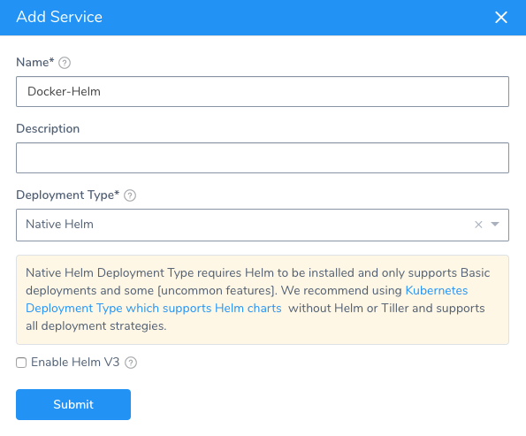
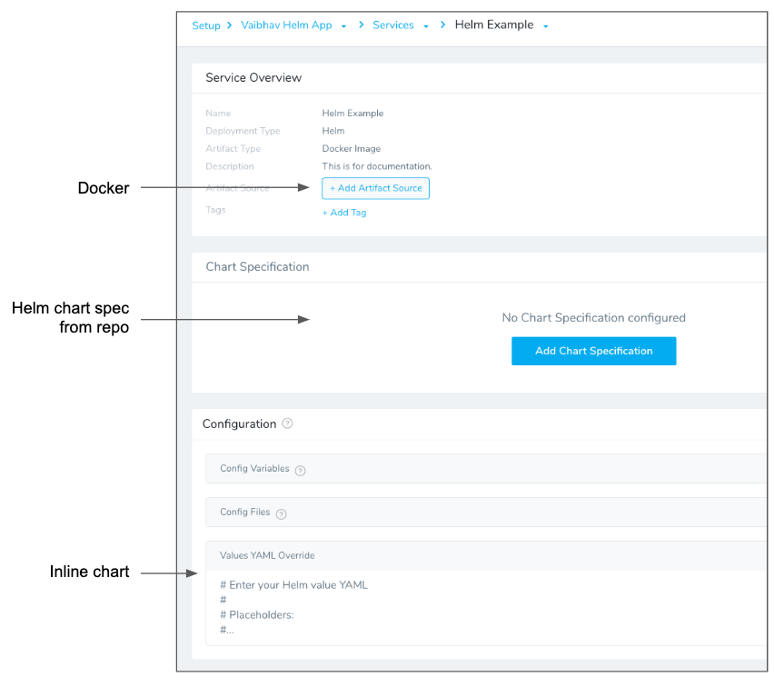
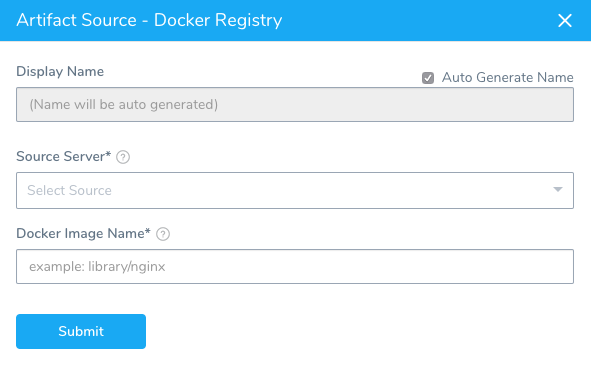
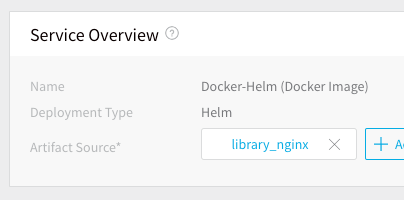
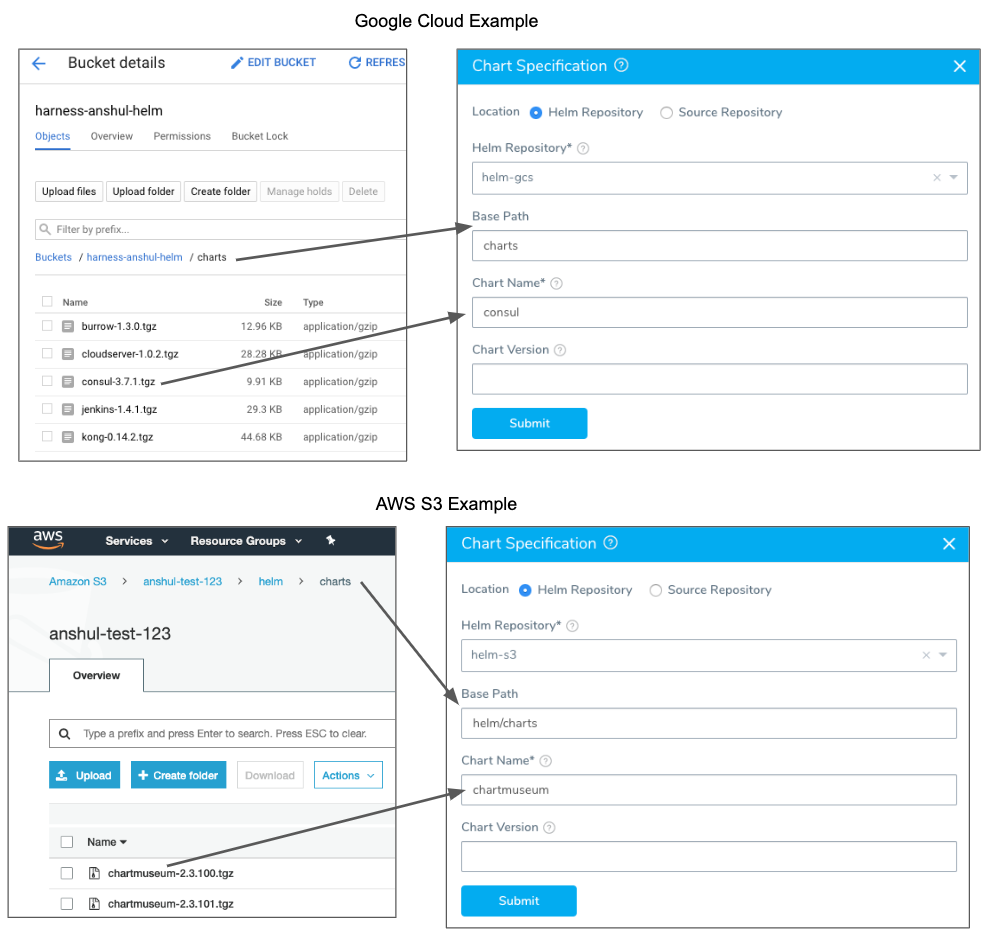
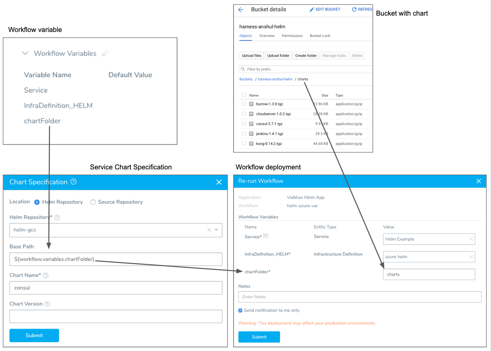
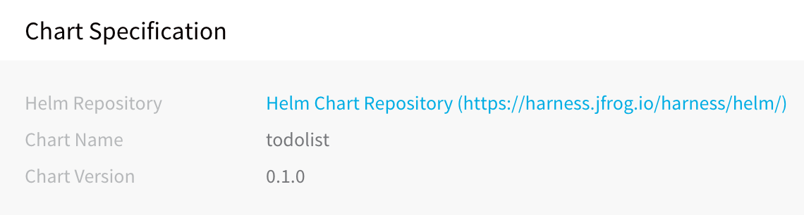
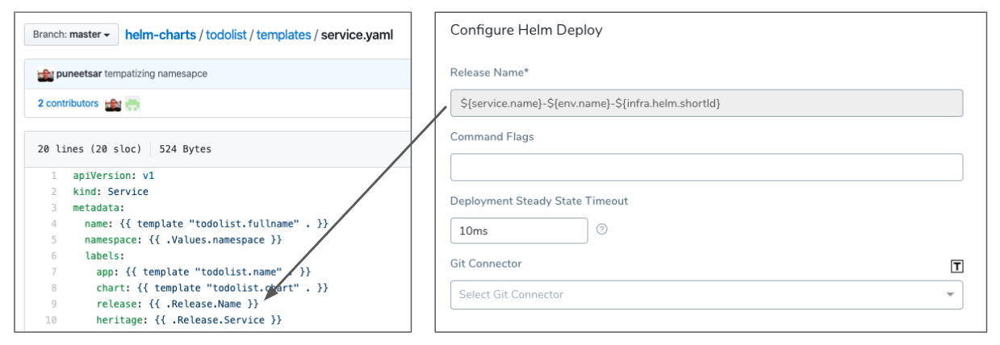
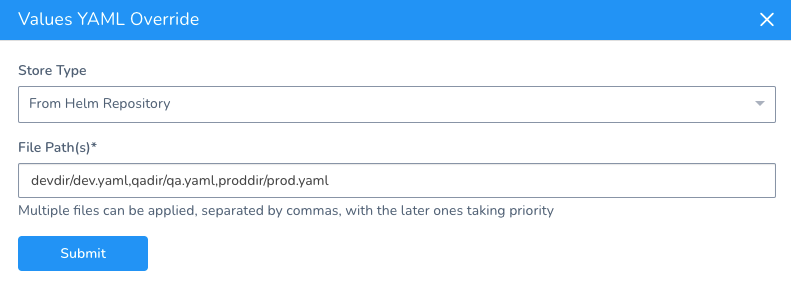

This content is for Harness [FirstGen](../../../getting-started/harness-first-gen-vs-harness-next-gen.md). Switch to [NextGen](https://docs.harness.io/article/lbhf2h71at).This topic describes how to create a Harness Application and adds a Service that uses a Docker image and Helm chart for a Kubernetes deployment.

Harness includes both Kubernetes and Helm deployments, and you can use Helm charts in both. Harness [Kubernetes Deployments](../kubernetes-deployments/kubernetes-deployments-overview.md) allow you to use your own Helm chart (remote or local), and Harness executes the Kubernetes API calls to build everything without Helm and Tiller needing to be installed in the target cluster. See [Helm Charts](https://docs.harness.io/article/t6zrgqq0ny-kubernetes-services#helm_charts).


### Release Name Required

When using a Native Helm deployment in Harness, ensure that the workload-related manifests include a Release Name in their metadata. For an example, see this [StatefulSet spec from Artifactory](https://github.com/helm/charts/blob/master/stable/artifactory/templates/artifactory-statefulset.yaml).

You can see that the release name is under:

* metadata.labels
* spec.selector.matchLabels
* spec.template.metadata.labels

Harness requires a release name for tracking different deployments as well as tracking resources deployed under that release.

The release name must be unique across the cluster.

### Create the Harness Application

An application in Harness represents a logical group of one or more entities, including Services, Environments, Workflows, Pipelines, Triggers, and Infrastructure Provisioners. Applications organize all of the entities and configurations in Harness CI/CD. For more information, see [Application Checklist](https://docs.harness.io/article/bucothemly-application-configuration).

To add the Harness Application and service, do the following:

1. In **Harness**, click **Setup**.
2. Click **Add Application**. The **Application** dialog appears.
3. Give your application a name that describes your microservice or app. For the purposes of this guide, we use the name **Docker-Helm**.
4. Click **SUBMIT**. The new application is added.
5. Click the application name to open the application. The application entities are displayed.

    

### Add the Helm Service to the Application

1. In your new application, click **Services**. The **Services** page appears.
2. In the **Services** page, click **Add Service**. The **Service** dialog appears.
3. In **Name**, enter a name for your microservice. For example, if your microservice were the checkout service in a Web application, you could name it **checkout**. For this guide, we will use **Docker-Helm**.
4. In **Deployment Type**, select **Native** **Helm**. Harness will create a service that is designed for Helm deployments. When you are finished, the dialog will look like this:
5. Select **Enable Helm V3**. This ensures that you are using the latest Helm settings.
6. Click **SUBMIT**. The new service is added. Let's look at where Docker and Helm are configured in the Service page:



The following table describes the different sections.


|  |  |  |
| --- | --- | --- |
| **Component** | **Section in Service** | **Description** |
| Docker | **Artifact Source** | You add a pointer to the Docker image location you want to deploy. |
| Helm | **Chart Specification** | You enter the Helm chart repo and chart to use.<br />Typically, this is the only Helm configuration needed in a Harness service.<br />This is the easiest way to point to your chart, but you can add the chart info in **Values YAML Override** instead. |
| Helm | **Values YAML Override** | You can enter the contents of a Helm values.yaml file here. This file contains the default values for a chart.<br />Values entered here will overwrite values in the values.yaml entered in **Chart Specification**.<br />If you want to point to your Helm chart here, you can simply add the YAML as shown in the following example. |

#### YAML Example

```
harness:  
   helm:    
      chart:      
         name: nginx
         version: 1.0.1      
         url: https://charts.bitnami.com/bitnami
```


### Add the Docker Artifact Source

1. In the new service, click **Add****Artifact Source**, and select **Docker Registry**. There are a number of artifact sources you can use. For more information, see [Add a Docker Image Server](https://docs.harness.io/article/gxv9gj6khz-add-a-docker-image-service#add_a_docker_image_service). The **Docker Registry** dialog appears.

   
2. In **Name**, let Harness generate a name for the source.
3. In **Source Server**, select the Artifact Server you added earlier in this guide. We are using **Docker Hub** in this guide.
4. In **Docker Image Name**, enter the image name. Official images in public repos such as Docker Hub need the label **library**. For example, **library/nginx**. For this guide, we will use Docker Hub and the publicly available NGINX at **library/nginx**.
5. Click **SUBMIT**. The Artifact Source is added.



### Add the Helm Chart

As explained earlier, you have two options when entering in the Helm chart info. The **Chart Specifications** or the **Values YAML**. For this guide, we will use the **Chart Specifications**.

1. Click **Chart Specifications**. The **Chart Specification** settings appear.
2. In **Location**, select **Helm Repository** or **Source Repository**.

For **Source Repository**, do the following:

1. In **Source Repository**, select a Git SourceRepo Provider for the Git repo you added to your Harness account. For more information, see [Add SourceRepo Providers](https://docs.harness.io/article/ay9hlwbgwa-add-source-repo-providers).
2. In **Commit ID**, select **Latest from Branch** or **Specific Commit ID**.
3. In **Branch** or **Commit ID**, enter the branch or commit ID for the remote repo.
4. In **File/Folder path**, enter the repo file and folder path.

Helm [chart dependencies](https://helm.sh/docs/topics/charts/) are not supported in **Source Repository**. If your Helm chart in a Git repo uses chart dependencies, you will need to move to the **Helm Repository** option.For **Helm Repository**, do the following:

1. In **Helm Repository**, select the Helm Chart Repository you added as a Harness Artifact Server. For more information, see [Helm Repository](https://docs.harness.io/article/7dghbx1dbl-configuring-artifact-server#helm_repository).

  If you are using Google Cloud Storage for your Helm repo, you will see a **Base Path** setting for the bucket. See [Google Cloud Storage (GCS)](https://harness.helpdocs.io/article/whwnovprrb-cloud-providers#google_cloud_storage_gcs) for details on the policies required.1. In **Base Path**, enter the path to the charts' bucket folder or a Workflow variable expression.
	1. If you use a charts' bucket folder, simply enter the name of the folder. Whether you need to specify a single folder (e.g. `charts`) a folder path (e.g. `helm/charts`) depends on the Helm Chart Repository you added as a Harness Artifact Server.
	2. If you use a Workflow variable expression, you can enter in the expression as part of the path. For example, `/Myservice/Chart/${workflow.variables.branchName}/` or simply `${workflow.variables.chartFolder}`.For more information, see [Variables and Expressions in Harness](https://docs.harness.io/article/9dvxcegm90-variables) and [Add Workflow Variables](https://docs.harness.io/article/m220i1tnia-workflow-configuration#add_workflow_variables).
	1. If the chart is in the **root** folder of the repository location set in the Helm Chart Repository you added as a Harness Artifact Server, leave **Base Path** empty.
2. In **Chart Name**, enter the name of the chart in that repo.
3. In **Chart Version**, enter the chart version to use. This is found in the **Chart.yaml** **version** label. If you leave this field empty Harness gets the latest chart.

Here are a couple of examples using GCS and S3:



Here is an example using a Workflow variable expression. You can see the variable created in the Workflow's **Workflow Variables** section, referenced using an expression in **Chart Specification**, and then a value provided for the variable in the deployment dialog that matches the chart folder's name.



1. To use Helm command flags, click **Enable Command Flags**, and then enter the command to use.
2. Click **SUBMIT**. The chart specification is added to the service.



When you deploy a Workflow using a Harness Kubernetes Service set up with a Helm Repository, you will see Harness fetch the chart:

[](./static/2-helm-services-44.png)

Next, you will see Harness initialize using the chart:

[](./static/2-helm-services-46.png)

#### Release Name Required

Ensure that the workload-related manifests include a Release Name in their metadata.

See [Release Name Required](#release_name_required).

#### Other Options

You can specify other options in the **Chart Specification** dialog by choosing **None** in the **Helm Repository** field, and the using the remaining fields as described in the following table.

These options are provided for backwards-compatibility and it is preferable that you use either the **Helm Repository** or **Source Repository** options.

|  |  |  |
| --- | --- | --- |
| **Installation Method** | **Example** | **Field Values** |
| Chart reference. | `helm install stable/nginx` | **Chart Name:** stable/nginx |
| Path to a packaged chart.In this method, the chart file is located on the same pod as the Harness Delegate.You can add a Delegate Profile that copies the chart from a repo to the pod. For more information, see [Delegate Profiles](https://docs.harness.io/article/h9tkwmkrm7-delegate-installation#delegate_profiles). | `helm install ./nginx-1.2.3.tgz` | **Chart Name:** *dir\_path\_to\_delegate*/nginx |
| Path to an unpacked chart directory.In this method, the chart file is located on the same pod as the Harness delegate.You can add a Delegate Profile that copies the chart from a repo to the pod. For more information, see [Delegate Profiles](https://docs.harness.io/article/h9tkwmkrm7-delegate-installation#delegate_profiles). | `helm install ./nginx` | **Chart Name:** *dir\_path\_to\_delegate*/nginx |
| Absolute URL. | `helm install https://example.com/charts/nginx-1.2.3.tgz` | **Chart Name:** https://example.com/charts/nginx-1.2.3.tgz |

For Helm, that's it. You don't have to do any further configuration to the service. Harness will use the chart you specified to configure the Kubernetes cluster.

File-based repo triggers are a powerful feature of Harness that lets you set a Webhook on your repo to trigger a Harness Workflow or Pipeline when a Push event occurs in the repo. For more information, see [File-based Repo Triggers](https://docs.harness.io/article/xerirloz9a-add-a-trigger-2#file_based_repo_triggers).Now you can define the deployment environment and workflow for the deployment.

### Option: Helm Command Flags

You can extend the Helm commands that Harness runs when deploying your Helm chart.

Use **Enable Command Flags** to have Harness run Helm-specific Helm commands and their options as part of preprocessing. All the commands you select are run before `helm install/upgrade`.

Click Enable Command Flags, and then select commands from the **Command Flag Type** dropdown.

Next, in **Input**, add any options for the command.

The `--debug` option is not supported.For Native Helm deployments using Helm charts (as opposed to Kubernetes deployments using Helm charts), multiple commands are supported.

You will see the outputs for the commands you select in the Harness deployment logs. The output will be part of pre-processing and appear before `helm install/upgrade`.

If you use Helm commands in the Harness Service and in a Workflow deploying that Service, the Helm commands in the Harness Service override the commands in the Workflow.

#### Harness Variable Expressions are Supported

You can use [Harness variable expressions](https://docs.harness.io/article/9dvxcegm90-variables) in any of the command options settings. For example, [Service Config variables](https://docs.harness.io/article/q78p7rpx9u-add-service-level-config-variables) and [Workflow variables](https://docs.harness.io/article/766iheu1bk-add-workflow-variables-new-template).

### Spec Requirements for Steady State Check and Verification

Harness requires that the `release: {{ .Release.Name }}` label be used in **every** Kubernetes spec to ensure that Harness can identify a release, check its steady state, and perform verification on it.

Ensure that the `release: {{ .Release.Name }}` label is in every Kubernetes object's manifest. If you omit the `release: {{ .Release.Name }}` label from a manifest, Harness cannot track it.The [Helm built-in Release object](https://helm.sh/docs/chart_template_guide/#built-in-objects) describes the release and allows Harness to identify each release. For this reason, the `release: {{ .Release.Name }}` label must be used in your Kubernetes spec. For example:


```
apiVersion: v1  
kind: Service  
metadata:  
  name: {{ template "todolist.fullname" . }}  
  namespace: {{ .Values.namespace }}  
  labels:  
    app: {{ template "todolist.name" . }}  
    chart: {{ template "todolist.chart" . }}  
 **release: {{ .Release.Name }}**    heritage: {{ .Release.Service }}  
...
```
You will provide a name to be used in place of `{{ .Release.Name }}` in the Helm Workflow you create in Harness. The Workflow contains the **Helm Deploy** step, where you can enter in a release name to replace `{{ .Release.Name }}` at runtime:



For information on the Helm Deploy step, see [Helm Deploy](4-helm-workflows.md).

### Values YAML Override

In the **Values YAML Override** section, you can enter the YAML for your values.yaml file. The values.yaml file contains the default values for a chart. You will typically have this file in the repo for your chart, but you can add it in the Harness service instead.

The **Values YAML** dialog has the following placeholders that save you from having to enter in some variables:

* **${NAMESPACE}** - Replaced with the Kubernetes namespace, such as **default**. You will specify the namespace of the cluster in the **Namespace** setting when adding the Harness Environment infrastructure details later, and the placeholder will be replaced with that namespace.
* **${DOCKER\_IMAGE\_NAME}** - Replaced with the Docker image name.
* **${DOCKER\_IMAGE\_TAG}** - Replaced with the Docker image tag.

For information about how values from different source are compiled at runtime, see [Helm Values Priority](4-helm-workflows.md#helm-values-priority).

You can override the values using the **Inline**, **Remote**, or **From Helm Repository** options.

#### Inline Override

Enter the YAML you want to use to override the Values YAML file used in **Chart Specification**.

#### Remote Override

In **Configuration**, in **Values YAML Override**, click the edit icon.

For **Remote**, do the following:

1. In **Source Repository**, select the Git repo you added as a [Source Repo Provider](https://docs.harness.io/article/ay9hlwbgwa-add-source-repo-providers).
2. For **Commit ID**, select either **Latest from Branch** and enter in the branch name, or **Specific Commit ID** and enter in the **commit ID**.
3. In **File path**, enter the path to the values.yaml file in the repo, including the repo name, like **helm/values.yaml**.

#### From Helm Repository Override

If you are using the Helm Chart from Helm Repository option in **Manifests**, you can override the chart in **Manifests** using one or more values YAML files inside the Helm chart.

In **Configuration**, in **Values YAML Override**, click the edit icon.

In **Store Type**, select **From Helm Repository**.

In **File Path(s)**, enter the file path to the override values YAML file.

Multiple files can be used. When you enter the file paths, separate the paths using commas.

The latter paths are given higher priority.



### Next Step

* [3 - Helm Environments](3-helm-environments.md)

