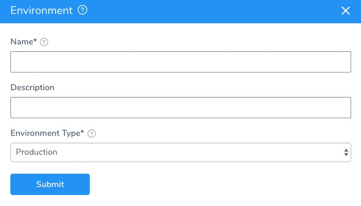
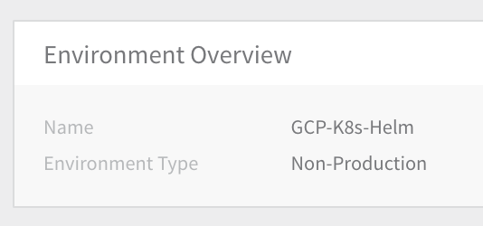
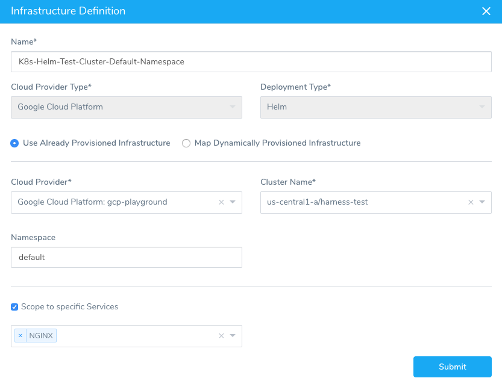
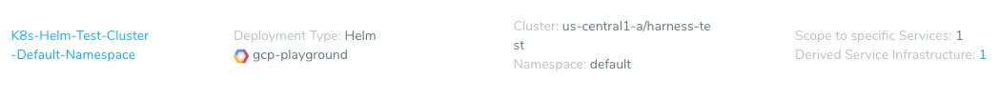

This content is for Harness [FirstGen](../../../getting-started/harness-first-gen-vs-harness-next-gen.md). Switch to [NextGen](https://docs.harness.io/article/lbhf2h71at).After you have set up the Harness [Service](2-helm-services.md) for your Helm deployment, you can add a Harness Environment that lists the Cloud Provider and Kubernetes cluster where Harness will deploy your Docker image.

Harness includes both Kubernetes and Helm deployments, and you can Helm charts in both. Harness [Kubernetes Deployments](../kubernetes-deployments/kubernetes-deployments-overview.md) allow you to use your own Helm chart (remote or local), and Harness executes the Kubernetes API calls to build everything without Helm and Tiller needing to be installed in the target cluster. See [Helm Charts](https://docs.harness.io/article/t6zrgqq0ny-kubernetes-services#helm_charts).

### Create a New Harness Environment

You will define the Infrastructure Definition for Harness to use when deploying the Docker image.

The following procedure creates a Harness environment where you can deploy your Docker image. For this guide, we will be using a Kubernetes cluster on Google Cloud Platform for the deployment environment.

To add a Harness environment, do the following:

1. In your Harness application, click **Environments**. The **Environments** page appears.
2. Click **Add Environment**. The **Environment** settings appear.  

3. In **Name**, enter a name that describes the deployment environment, for example, **GCP-K8S-Helm**.
4. In **Environment Type**, select **Non-Production**.
5. Click **SUBMIT**. The new Environment page appears.

### Add an Infrastructure Definition

​Infrastructure Definitions specify the target deployment infrastructure for your Harness Services, and the specific infrastructure details for the deployment, like VPC settings. 

You define the Kubernetes cluster to use for deployment as an ​Infrastructure Definition. For this guide, we will use the GCP Cloud Provider you added and the Kubernetes cluster with Helm installed.

To add the Infrastructure Definition, do the following:

1. In the Harness Environment, click **Add Infrastructure Definition**. The **Infrastructure Definition** dialog appears.
2. In **Name**, enter the name you will use to select this Infrastructure Definition when you create a Workflow.
3. In **Cloud Provider Type**, select **Kubernetes Cluster**.
4. In **Deployment Type**, select **Helm**.
5. Click **Use Already Provisioned Infrastructure**. If you were using a Harness [Infrastructure Provisioner](https://docs.harness.io/article/o22jx8amxb-add-an-infra-provisioner), you would select **Map Dynamically Provisioned Infrastructure**.
6. In **Cloud Provider**, select the Cloud Provider you added earlier, such as **Google Cloud Platform**, etc.
7. In **Cluster Name**, select the Kubernetes cluster where you want to deploy. This list is populated using the Cloud Provider you selected.
8. In **Namespace**, enter the name of the cluster namespace you want to use. As we noted in [Values YAML Override](2-helm-services.md#values-yaml-override), you can enter a `${NAMESPACE}` variable in your Service and Harness will replace it with the value you enter in **Namespace** at runtime.
9. In **Scope to specific Services**, select the Harness Service you created earlier.  
  
The Infrastructure Definition will look something like this:
10. Click **Submit**. The new Infrastructure Definition is added to the Harness Environment.

That is all you have to do to set up the deployment Environment in Harness.

Now that you have the Service and Environment set up. Now you can create the deployment Workflow in Harness.

### Override Service Helm Values

In the Harness environment, you can override Helm values specified in the Harness service. This can ensure that the Helm values used in the environment are consistent even if multiple services with different Helm values use that environment.

To override a service Helm value, do the following:

1. In the Harness environment, click **Add Configuration Overrides**. The **Service Configuration Override** dialog appears.
2. In **Service**, click the name of the service you want to override, or click **All Services**. The dialog changes to provide **Override Type** options.
3. Click **Values YAML**. For **Local**, a text area appears where you can paste an entire value.yaml file or simply override one or more values, such as a Docker image name. For the variables you can use in the text, see [Values YAML Override](2-helm-services.md#values-yaml-override).  
  
For **Remote**, do the following:
	1. In **Source Repository**, select the Git repo you added as a [Source Repo Provider](https://docs.harness.io/article/ay9hlwbgwa-add-source-repo-providers).
	2. For **Commit ID**, select either **Use** l**atest from Branch** and enter in the branch name, or **Use** **specific commit ID** and enter in the **commit ID**.
	3. In **File path**, enter the path to the values.yaml file in the repo, including the repo name, like **helm/values.yaml**.

For more information, see [Helm Values Priority](4-helm-workflows.md#helm-values-priority).

### Next Step

* [4 - Helm Workflows and Deployments](4-helm-workflows.md)

