This content is for Harness [FirstGen](../../../getting-started/harness-first-gen-vs-harness-next-gen.md). Switch to [NextGen](https://docs.harness.io/article/lbhf2h71at).Once you have added the Harness Service and Environment for Helm, you can add a Harness Workflow to manage how your Harness Service is deployed, verified, and rolled back, among other important phases.

Harness includes both Kubernetes and Helm deployments, and you can Helm charts in both. Harness [Kubernetes Deployments](../kubernetes-deployments/kubernetes-deployments-overview.md) allow you to use your own Helm chart (remote or local), and Harness executes the Kubernetes API calls to build everything without Helm and Tiller (for Helm v2) needing to be installed in the target cluster. See [Helm Charts](https://docs.harness.io/article/t6zrgqq0ny-kubernetes-services#helm_charts).

### Create the Workflow

Helm deployments use a Basic workflow that simply puts the Docker image on the Kubernetes cluster built using the Helm chart.

For more information about workflows, see [Add a Workflow](https://docs.harness.io/article/m220i1tnia-workflow-configuration).

To add the workflow, do the following:

1. In your Harness application, click **Workflows**.

   
   
2. On the **Workflows** page, click **Add Workflow**. The **Workflow** dialog appears.
   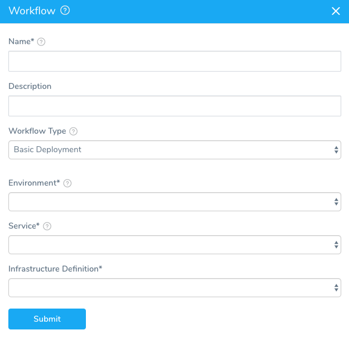
3. In **Name**, give your workflow a name that describes its purpose, such as **NGINX-K8s-Helm**.
4. In **Workflow Type**, select **Basic Deployment**. Helm deployments are Basic deployments, unlike Canary or Blue/Green. They are single-phase deployments where each deployment is installed or upgraded. You can create multiple Helm deployments and add them to a Harness pipeline. For more information, see [Add a Pipeline](https://docs.harness.io/article/zc1u96u6uj-pipeline-configuration).
5. In **Environment**, select the environment you created earlier in this guide.
6. In **Service**, select the service you added earlier in this guide.
7. In Infrastructure Definition, select the Infrastructure Definition you created earlier in this guide. When you are done, the dialog will look something like this:

    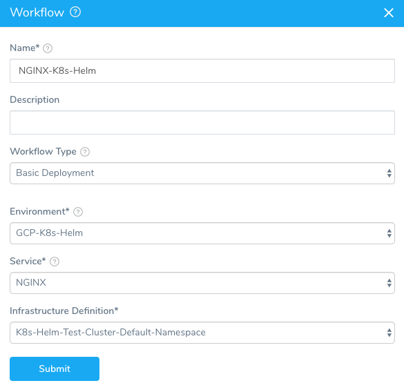

8. Click **SUBMIT**. The workflow is displayed.

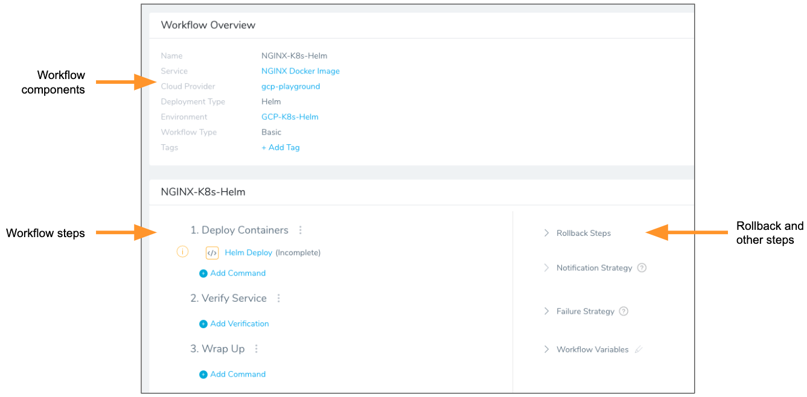

Harness creates all the steps needed to deploy the service to the target infrastructure.

You can see that one workflow step, **Helm Deploy**, is incomplete.

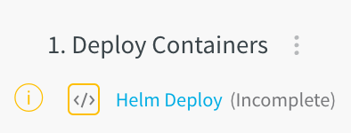

Steps are marked incomplete if they need additional input from you. To complete this step, see the following section.

#### Helm Deploy Step

In your workflow, click the **Helm Deploy** step. The **Configure** **Helm Deploy** settings appear.

The **Helm Deploy** step has a few options that you can use to manage how Helm is used in the deployment.

You can also templatize **Git Connector**,**Branch Name** and **File Path** settings. To templatize, perform the following steps:

1. Click the **[T]** icon next to the setting. The field values are replaced by variables.
2. Click **Submit**. The new variables are displayed under **Workflow Variables**.
3. To see how the Workflow variables are used, click **Deploy**. The **Start New Deployment** dialog appears, displaying the variables you created in the **Workflow Variables** section.

##### Helm Release Name

Harness requires that the `release: {{ .Release.Name }}` label be used in every Kubernetes spec to ensure that Harness can identify a release, check its steady state, and perform verification on it. For details, see [Spec Requirements for Steady State Check and Verification](2-helm-services.md#spec-requirements-for-steady-state-check-and-verification).In the **Helm Deploy Step**, you need to add a Helm release name. During deployment, this release name replaces the value of the `release: {{ .Release.Name }}` label in the Kubernetes spec:

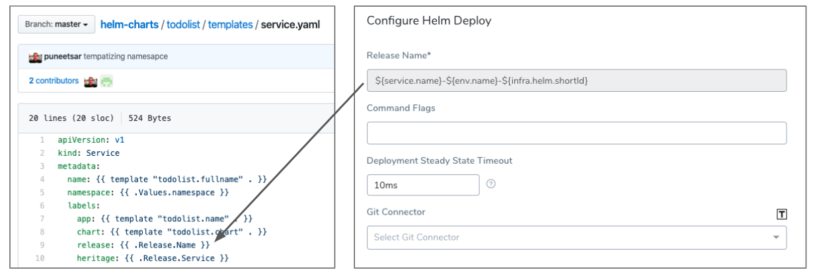

What is a release name? From the [Helm docs](https://docs.helm.sh/using_helm/#using-helm):


> A Release is an instance of a chart running in a Kubernetes cluster. One chart can often be installed many times into the same cluster. And each time it is installed, a new release is created. Consider a MySQL chart. If you want two databases running in your cluster, you can install that chart twice. Each one will have its own release, which will in turn have its own release name.

Since Helm requires release names to be unique across the cluster, Harness generates a unique identifier with the variable `${infra.helm.shortId}`. You can use this variable as a prefix or suffix for the release name. We recommend the following release name:


```
${service.name}-${env.name}-${infra.helm.shortId}
```
If the service name is **NGINX** and the environment name is **GCP-K8s-Helm**, then the release name will be **nginx-gcp-k8s-helm-rjogwmu**, where **rjogwmu** is generated by `${infra.helm.shortId}`.

##### Command Flags (Deprecated)

Previously, in **Helm Deploy**, you could enter Helm command flag(s) that you wanted applied to **every Helm command** executed at deployment runtime.

Now this feature has been expanded and migrated to the Harness Kubernetes or Native Helm Service.

If you used this feature in Helm Deploy previously, your Helm command flags have been migrated to the Native Helm Service used by the Workflow.For steps on using these commands, see the following topics:

* Kubernetes:
	+ [Use a Helm Repository with Kubernetes](../kubernetes-deployments/use-a-helm-repository-with-kubernetes.md)
	+ [Link Resource Files or Helm Charts in Git Repos](../kubernetes-deployments/link-resource-files-or-helm-charts-in-git-repos.md)
* Native Helm:
	+ [Helm Services](2-helm-services.md)

##### Deployment Steady State Timeout

For **Deployment steady state timeout**, you can leave the default of **10** minutes. It is unlikely that deployment would ever take longer than 10 minutes.

##### Git Connector

For **Git connector**, you can specify values or a full **values.yaml** file in Git repo and Harness will fetch the values during runtime.

This will override the values or values.yaml used in the Service.

For information on how Harness merges values from different source for the values.yaml, see [Helm Values Priority](#helm_values_priority).

File-based repo triggers are a powerful feature of Harness that lets you set a Webhook on your repo to trigger a Harness Workflow or Pipeline when a Push event occurs in the repo. For more information, see [File-based Repo Triggers](https://docs.harness.io/article/xerirloz9a-add-a-trigger-2#file_based_repo_triggers).To use a Git connector, you need to add a Git repo as a Harness Source Repo provider. For more information, see [Add Source Repo Providers](https://docs.harness.io/article/ay9hlwbgwa-add-source-repo-providers).

To use a **Git connector** in the **Helm Deploy** step, do the following:

1. In **Git connector**, select the Git repo you added as a Source Repo.
2. Select either **Use specific commit ID** and enter in the **commit ID**, or select **Use latest commit from branch** and enter in the **branch name**.
3. In **File path**, enter the path to the values.yaml file in the repo, including the repo name, like **helm/values.yaml**.

Here's an example of what the Git connector might look like:

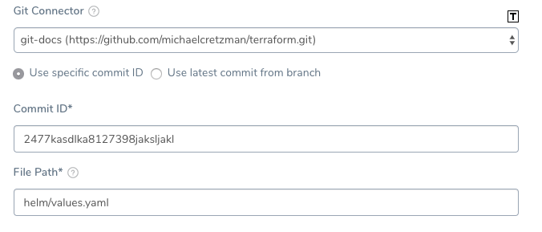

##### Completed Helm Deploy Step

When you are done, the typical **Helm Deploy** dialog will look something like this:

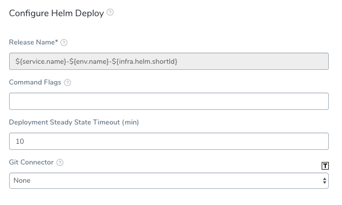

Only the **Release Name** is required.

Click **SUBMIT** and **your workflow is complete.** You can look or modify the default rollback steps and other deployment strategies in the workflow (for more information, see [Add a Workflow](https://docs.harness.io/article/m220i1tnia-workflow-configuration)), but for this guide, the workflow is complete and you can now deploy it. See the next section for deployment steps.

### Helm Deployments

The following procedure deploys the workflow you created in this guide.

Before deploying the workflow, ensure all Harness delegates that can reach the resources used in the workflow are running. In **Harness**, click **Setup**, and then click **Harness Delegates**.To deploy your workflow, do the following:

1. In your workflow, click **Deploy**.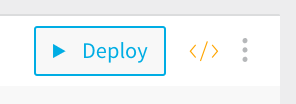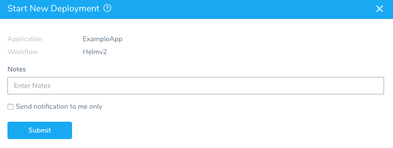
2. In **Notes**, enter information about the deployment that others should know. Harness records all the important details, and maintains the records of each deployment, but you might need to share some information about your deployment.
3. Click **SUBMIT**. The **Deployments** page appears, and displays the deployment in real time.


**The deployment was successful!** Now let's look further at the Helm deployment.

Click **Phase 1**. You will the details of the phase, including the workflow entities, listed.

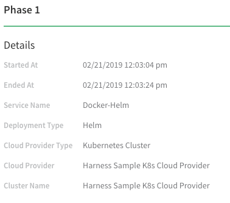

Click **Phase 1** to expand it and see **Deploy Containers**. Expand **Deploy Containers** and click the **Helm Deploy** step you set up in the workflow. The details for the step are displayed, along with the command output:

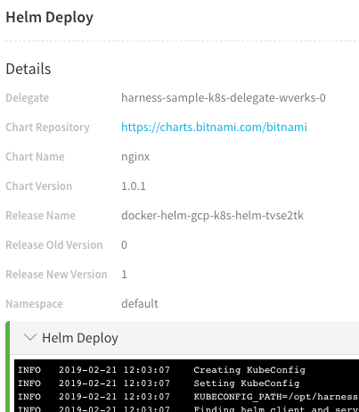

#### Viewing Deployment in the Log

Let's look through the deployment log and see how your Docker image was deployed to your cluster using Helm.

First, we check to see if the Helm chart repo has already been added and, if not, add it from **https://charts.bitnami.com/bitnami**.


```
INFO   2018-10-09 16:59:51    Adding helm repository https://charts.bitnami.com/bitnami  
INFO   2018-10-09 16:59:51    Checking if the repository has already been added  
INFO   2018-10-09 16:59:51    Repository not found  
INFO   2018-10-09 16:59:51    Adding repository https://charts.bitnami.com/bitnami with name examplefordoc-nginx  
INFO   2018-10-09 16:59:51    Successfully added repository https://charts.bitnami.com/bitnami with name examplefordoc-nginx
```
Next, we look to see if a release with the same release name exists:


```
INFO   2018-10-09 16:59:51    Installing  
INFO   2018-10-09 16:59:51    List all existing deployed releases for release name: nginx-gcp-k8s-helm-rjogwmu  
INFO   2018-10-09 16:59:51    Release: "nginx-gcp-k8s-helm-rjogwmu" not found
```
This is the release name generated from our Helm Deploy step name of **${service.name}-${env.name}-${infra.helm.shortId}**.

Since this is the first deployment, an existing release with that name is not found, and a new release occurs.


```
INFO   2018-10-09 16:59:52    No previous deployment found for release. Installing chart  
INFO   2018-10-09 16:59:54    NAME:   nginx-gcp-k8s-helm-rjogwmu  
INFO   2018-10-09 16:59:54    LAST DEPLOYED: Tue Oct  9 23:59:53 2018  
INFO   2018-10-09 16:59:54    NAMESPACE: default  
INFO   2018-10-09 16:59:54    STATUS: DEPLOYED
```
You can see the Kubernetes events in the logs as the cluster is created.


```
INFO   2018-10-09 16:59:54    NAME                                       READY  STATUS             RESTARTS  AGE  
INFO   2018-10-09 16:59:54    nginx-gcp-k8s-helm-rjogw-565bc8495f-w5tzs  0/1    ContainerCreating  0         0s  
INFO   2018-10-09 16:59:54      
INFO   2018-10-09 16:59:54    Deployed Controllers [2]:  
INFO   2018-10-09 16:59:54    Kind:Deployment, Name:nginx-gcp-k8s-helm-rjogw (desired: 1)  
INFO   2018-10-09 16:59:54    Kind:ReplicaSet, Name:nginx-gcp-k8s-helm-rjogw-565bc8495f (desired: 1)  
INFO   2018-10-09 16:59:54      
INFO   2018-10-09 16:59:54    ****  Kubernetes Controller Events  ****  
...  
INFO   2018-10-09 16:59:54    Desired number of pods reached [1/1]  
...  
INFO   2018-10-09 16:59:54    Pods are updated with image [docker.io/bitnami/nginx:1.14.0-debian-9] [1/1]  
INFO   2018-10-09 16:59:54    Waiting for pods to be running [0/1]  
INFO   2018-10-09 17:00:05      
...  
INFO   2018-10-09 17:00:05    ****  Kubernetes Pod Events  ****  
INFO   2018-10-09 17:00:05      Pod: nginx-gcp-k8s-helm-rjogw-565bc8495f-w5tzs  
INFO   2018-10-09 17:00:05       - pulling image "docker.io/bitnami/nginx:1.14.0-debian-9"  
INFO   2018-10-09 17:00:05       - Successfully pulled image "docker.io/bitnami/nginx:1.14.0-debian-9"  
INFO   2018-10-09 17:00:05       - Created container  
INFO   2018-10-09 17:00:05       - Started container  
INFO   2018-10-09 17:00:05      
INFO   2018-10-09 17:00:05    Pods are running [1/1]  
INFO   2018-10-09 17:00:05    Waiting for pods to reach steady state [0/1]
```
Lastly, but most importantly, confirm the **steady state** for the pods to ensure deployment was successful.


```
INFO   2018-10-09 17:00:20    Pods have reached steady state [1/1]  
INFO   2018-10-09 17:00:20    Pod [nginx-gcp-k8s-helm-rjogw-565bc8495f-w5tzs] is running. Host IP: 10.128.0.24. Pod IP: 10.60.1.8  
INFO   2018-10-09 17:00:20    Command finished with status SUCCESS
```
### Helm Rollbacks

Harness adds a revision number for each deployment. If a new deployment fails, Harness rolls back to the previous deployment revision number. You can see the revision number in the log of a deployment. Here is sample from a log after an upgrade:


```
INFO   2018-10-11 14:43:09    Installing  
INFO   2018-10-11 14:43:09    List all existing deployed releases for release name: nginx-gcp-k8s-helm-rjogwmu  
INFO   2018-10-11 14:43:09    REVISION	UPDATED                 	STATUS    	CHART      	DESCRIPTION       
INFO   2018-10-11 14:43:09    1       	Tue Oct  9 23:59:53 2018	SUPERSEDED	nginx-1.0.1	Install complete  
INFO   2018-10-11 14:43:09    2       	Thu Oct 11 18:27:35 2018	SUPERSEDED	nginx-1.0.1	Upgrade complete  
INFO   2018-10-11 14:43:09    3       	Thu Oct 11 21:30:24 2018	DEPLOYED  	nginx-1.0.1	Upgrade complete 
```
The **REVISION** column lists the revision number. Note the revision number **3** as the last successful version deployed. We will now fail a deployment that would be revision **4** and you will see Harness roll back to number **3**.

Here is an example where a failure has been initiated using an erroneous HTTP call (Response Code 500) to demonstrate the rollback behavior:


To experiment with rollbacks, you can simply add a step to your workflow that will fail.The failed deployment section is red, but the **Rollback Phase 1** step is green, indicating that rollback has been successful. If we expand **Rollback Phase 1**, we can see the rollback information in the **Helm Rollback** step details:

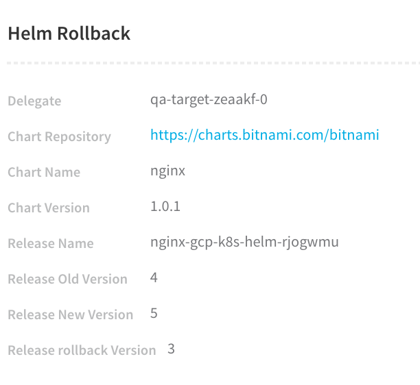

The failed version is **Release Old Version** **4** and the **Release rollback Version** is revision **3**, the last successful version. The rollback version now becomes the new version, **Release New Version 5**.

Let's look at the log of the rollback to see Harness rolling back successfully.


```
INFO   2018-10-11 14:43:22    Rolling back  
INFO   2018-10-11 14:43:23    Rollback was a success! Happy Helming!  
INFO   2018-10-11 14:43:23      
INFO   2018-10-11 14:43:24    Deployed Controllers [2]:  
INFO   2018-10-11 14:43:24    Kind:Deployment, Name:nginx-gcp-k8s-helm-rjogw (desired: 1)  
INFO   2018-10-11 14:43:24    Kind:ReplicaSet, Name:nginx-gcp-k8s-helm-rjogw-565bc8495f (desired: 1)  
INFO   2018-10-11 14:43:26    Desired number of pods reached [1/1]  
INFO   2018-10-11 14:43:26    Pods are updated with image [docker.io/bitnami/nginx:1.14.0-debian-9] [1/1]  
INFO   2018-10-11 14:43:26    Pods are running [1/1]  
INFO   2018-10-11 14:43:26    Pods have reached steady state [1/1]  
INFO   2018-10-11 14:43:28    Pod [nginx-gcp-k8s-helm-rjogw-565bc8495f-w5tzs] is running. Host IP: 10.128.0.24. Pod IP: 10.60.1.8  
INFO   2018-10-11 14:43:28    Command finished with status SUCCESS
```
When the next deployment is successful, you can see a record of the rollback release:


```
INFO   2018-10-11 15:38:16    Installing  
INFO   2018-10-11 15:38:16    List all existing deployed releases for release name: nginx-gcp-k8s-helm-rjogwmu  
INFO   2018-10-11 15:38:16    REVISION	UPDATED                 	STATUS    	CHART      	DESCRIPTION       
INFO   2018-10-11 15:38:16    1       	Tue Oct  9 23:59:53 2018	SUPERSEDED	nginx-1.0.1	Install complete  
INFO   2018-10-11 15:38:16    2       	Thu Oct 11 18:27:35 2018	SUPERSEDED	nginx-1.0.1	Upgrade complete  
INFO   2018-10-11 15:38:16    3       	Thu Oct 11 21:30:24 2018	SUPERSEDED	nginx-1.0.1	Upgrade complete  
INFO   2018-10-11 15:38:16    4       	Thu Oct 11 21:43:12 2018	SUPERSEDED	nginx-1.0.1	Upgrade complete  
INFO   2018-10-11 15:38:16    5       	Thu Oct 11 21:43:22 2018	DEPLOYED  	nginx-1.0.1	Rollback to 3  
```
The **Description** for the last release, **Revision 5**, states that it was a **Rollback to 3**.

#### Helm Rollback Step

You can add a **Helm Rollback** step to your Workflow to perform the aforementioned rollback sequence at a specific point in your deployment.

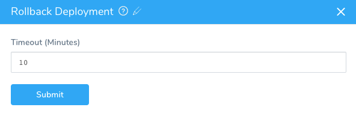

The **Helm Rollback** step rolls back all the deployed objects to the previous version.

### Upgrading Deployments

When you run a Helm deployment a second time it will upgrade your Kubernetes cluster. The upgrade is performed in a rolling fashion that does not cause downtime. Essentially, and gracefully, the upgrade deletes old pods and adds new pods with new version of artifacts.

Let's look at the deployment log from an upgrade to see how Harness handles it.

First, Harness looks for all existing Helm chart releases with the same name and upgrades them:


```
INFO   2018-10-11 14:30:22    Installing  
INFO   2018-10-11 14:30:22    List all existing deployed releases for release name: nginx-gcp-k8s-helm-rjogwmu  
INFO   2018-10-11 14:30:24    REVISION	UPDATED                 	STATUS    	CHART      	DESCRIPTION       
INFO   2018-10-11 14:30:24    1       	Tue Oct  9 23:59:53 2018	SUPERSEDED	nginx-1.0.1	Install complete  
INFO   2018-10-11 14:30:24    2       	Thu Oct 11 18:27:35 2018	DEPLOYED  	nginx-1.0.1	Upgrade complete  
INFO   2018-10-11 14:30:24      
INFO   2018-10-11 14:30:24    Previous release exists for chart. Upgrading chart  
INFO   2018-10-11 14:30:25    Release "nginx-gcp-k8s-helm-rjogwmu" has been upgraded. Happy Helming!  
INFO   2018-10-11 14:30:25    LAST DEPLOYED: Thu Oct 11 21:30:24 2018  
INFO   2018-10-11 14:30:25    NAMESPACE: default  
INFO   2018-10-11 14:30:25    STATUS: DEPLOYED  

```
Then it upgrades the cluster pods with the new Docker image of NGINX:


```
INFO   2018-10-11 14:30:25    Deployed Controllers [2]:  
INFO   2018-10-11 14:30:25    Kind:Deployment, Name:nginx-gcp-k8s-helm-rjogw (desired: 1)  
INFO   2018-10-11 14:30:25    Kind:ReplicaSet, Name:nginx-gcp-k8s-helm-rjogw-565bc8495f (desired: 1)  
INFO   2018-10-11 14:30:25    Desired number of pods reached [1/1]  
INFO   2018-10-11 14:30:25    Pods are updated with image [docker.io/bitnami/nginx:1.14.0-debian-9] [1/1]  
INFO   2018-10-11 14:30:25    Pods are running [1/1]  
INFO   2018-10-11 14:30:25    Pods have reached steady state [1/1]  
INFO   2018-10-11 14:30:27    Pod [nginx-gcp-k8s-helm-rjogw-565bc8495f-w5tzs] is running. Host IP: 10.128.0.24. Pod IP: 10.60.1.8  
INFO   2018-10-11 14:30:27    Command finished with status SUCCESS
```
### Helm Values Priority

Typically, the **values.yaml** applied to your Kubernetes cluster is a single file from the Helm chart repo.

In Harness, you can use values from different sources and Harness will pass them in a pre-defined order. Helm itself resolves the overlapping key-value pairs.

This enables a key in values.yaml to get updated with different, and likely more current, values.

You can simply use a values.yaml in the Helm chart repo. There is no requirement to use multiple sources.Values for the values.yaml can be specified in the following sources:

* Harness Service.
* Harness Environment.
* Harness Workflow via a Git connector.
* The values.yaml file in the Helm chart repo.

The Helm deployer extracts the values.yaml from the chart and passes it as an explicit parameter to the Helm command.

The reason for this extraction for the main chart is that if the chart has some Service variables, Harness needs to render them.

In case of conflicts, values will be overridden. Here is how values are overridden, from least to highest priority:

1. Chart repo values.yaml has the **least** priority. This is the values.yaml in the chart repo you specify in the **Chart Specifications** in the Harness service.
2. Harness Service values override chart repo values. These are values specified the **Values YAML** in the Harness Service.
3. Harness Environment values override Harness Service values. These are the values you specify in the **Add Configuration Overrides** in a Harness Environment.
4. Harness Workflow values added via a Git connector have the **highest** priority.

### Do it All in YAML

All of the Harness configuration steps in this guide can be performed using code instead of the Harness user interface. You can view or edit the YAML for any Harness configuration by clicking the **YAML** button on any page.

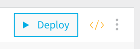

When you click the button, the Harness code editor appears:

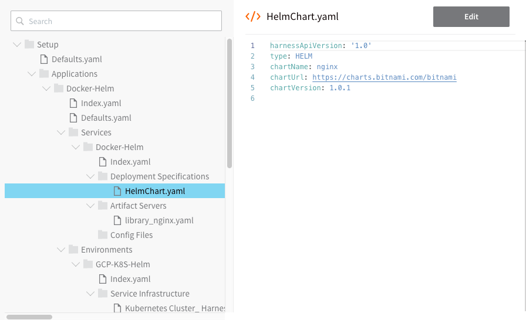

You can edit YAML and click **Save** to change the configuration.

For example, here is the YAML for the workflow we set up in this guide.


```
harnessApiVersion: '1.0'  
type: BASIC  
envName: GCP-K8S-Helm  
failureStrategies:  
- executionScope: WORKFLOW  
  failureTypes:  
  - APPLICATION_ERROR  
  repairActionCode: ROLLBACK_WORKFLOW  
  retryCount: 0  
notificationRules:  
- conditions:  
  - FAILED  
  executionScope: WORKFLOW  
  notificationGroupAsExpression: false  
  notificationGroups:  
  - Account Administrator  
phases:  
- type: HELM  
  computeProviderName: Harness Sample K8s Cloud Provider  
  daemonSet: false  
  infraMappingName: Kubernetes Cluster_ Harness Sample K8s Cloud Provider_DIRECT_Kubernetes_default  
  name: Phase 1  
  phaseSteps:  
  - type: HELM_DEPLOY  
    name: Deploy Containers  
    steps:  
    - type: HELM_DEPLOY  
      name: Helm Deploy  
      properties:  
        steadyStateTimeout: 10  
        gitFileConfig: null  
        helmReleaseNamePrefix: ${service.name}-${env.name}-${infra.helm.shortId}  
    stepsInParallel: false  
  - type: VERIFY_SERVICE  
    name: Verify Service  
    stepsInParallel: false  
  - type: WRAP_UP  
    name: Wrap Up  
    stepsInParallel: false  
  provisionNodes: false  
  serviceName: Docker-Helm  
  statefulSet: false  
rollbackPhases:  
- type: HELM  
  computeProviderName: Harness Sample K8s Cloud Provider  
  daemonSet: false  
  infraMappingName: Kubernetes Cluster_ Harness Sample K8s Cloud Provider_DIRECT_Kubernetes_default  
  name: Rollback Phase 1  
  phaseNameForRollback: Phase 1  
  phaseSteps:  
  - type: HELM_DEPLOY  
    name: Deploy Containers  
    phaseStepNameForRollback: Deploy Containers  
    statusForRollback: SUCCESS  
    steps:  
    - type: HELM_ROLLBACK  
      name: Helm Rollback  
    stepsInParallel: false  
  - type: VERIFY_SERVICE  
    name: Verify Service  
    phaseStepNameForRollback: Deploy Containers  
    statusForRollback: SUCCESS  
    stepsInParallel: false  
  - type: WRAP_UP  
    name: Wrap Up  
    stepsInParallel: false  
  provisionNodes: false  
  serviceName: Docker-Helm  
  statefulSet: false  
templatized: false
```
### Next Steps

* [5 - Helm Troubleshooting](5-helm-troubleshooting.md)
* [Pipelines](https://docs.harness.io/article/zc1u96u6uj-pipeline-configuration)
* [Triggers](https://docs.harness.io/article/xerirloz9a-add-a-trigger-2)
* [Continuous Verification](https://docs.harness.io/article/myw4h9u05l-verification-providers-list)

