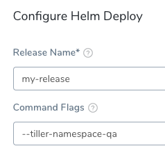

This content is for Harness [FirstGen](../../../getting-started/harness-first-gen-vs-harness-next-gen.md). Switch to [NextGen](https://docs.harness.io/article/lbhf2h71at).The following troubleshooting information should help you diagnose common problems:

* [Failed to Find the Previous Helm Release Version](5-helm-troubleshooting.md#failed-to-find-the-previous-helm-release-version)
* [Helm Install/Upgrade Failed](5-helm-troubleshooting.md#helm-install-upgrade-failed)
* [First Helm Deployment Goes to Upgrade Path](5-helm-troubleshooting.md#first-helm-deployment-goes-to-upgrade-path)
* [Tiller and Helm in Different Namespaces](5-helm-troubleshooting.md#tiller-and-helm-in-different-namespaces)
* [Next Steps](5-helm-troubleshooting.md#next-steps)

### Failed to Find the Previous Helm Release Version

Make sure that the Helm client and Tiller are installed. Do the following:

* Verify that Helm is installed.
* Check if the Git connector being used in the Workflow and the Delegate can connect to the Git repo. Check in the Delegate logs for Git connectivity issues.

### Helm Install/Upgrade Failed

Likely, there is an incompatible Helm client or Tiller. The Helm client needs to be lesser or equal to the Tiller version:

To fix this, upgrade Tiller:

`helm init --upgrade`

### First Helm Deployment Goes to Upgrade Path

In some cases, the first Helm deployment goes to the upgrade path even though the Helm version is working fine.

This is the result of a Helm issue: <https://github.com/helm/helm/issues/4169>.

The issue happens between Helm client versions 2.8.2 to 2.9.1. To fix this, upgrade the Helm client to the version after 2.9.1.

### Tiller and Helm in Different Namespaces

A Helm install/upgrade can fail because Tiller is deployed in a namespace other than `kube-system`.

To fix this, pass the`--tiller-namespace <NAMESPACE>`as command flag in the Workflow **Helm Deploy** step.

### Next Steps

* **Pipeline and Triggers** - Once you have a successful workflow, you can experiment with a Harness pipeline, which as a collection of one or more workflows, and Harness triggers, which enable you to execute a workflow or pipeline deployment using different criteria, such as when a new artifact is added to an artifact source. For more information, see [Add a Pipeline](https://docs.harness.io/article/zc1u96u6uj-pipeline-configuration) and [Add a Trigger](https://docs.harness.io/article/xerirloz9a-add-a-trigger-2).
* **Continuous Verification** - Add verification steps using Splunk, SumoLogic, Elk, AppDynamics, New Relic, DynaTrace, and others to your workflow. For more information, see [Continuous Verification](https://docs.harness.io/article/myw4h9u05l-verification-providers-list).

