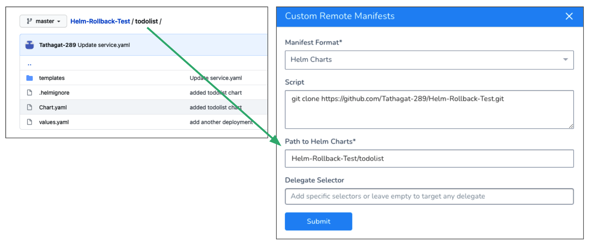
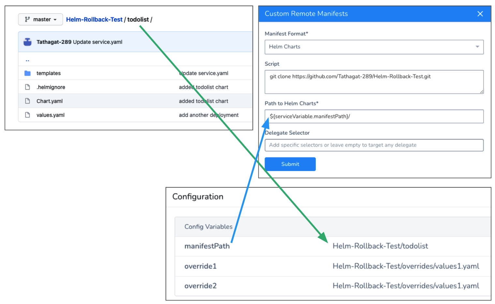
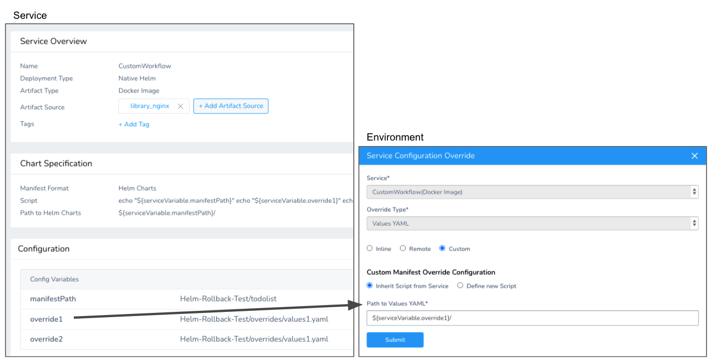

This content is for Harness [FirstGen](../../../getting-started/harness-first-gen-vs-harness-next-gen.md). Switch to [NextGen](https://docs.harness.io/article/lbhf2h71at).Currently, this feature is behind the Feature Flag `CUSTOM_MANIFEST`. Contact [Harness Support](mailto:support@harness.io) to enable the feature.Typically, you add Helm Charts and manifests to a Harness Kubernetes or Native Helm Service from a Helm or Source Repository by simply pointing at the chart repo.

You can see how this is done using Harness Kubernetes integration in [Helm Quickstart](https://docs.harness.io/article/2aaevhygep-helm-quickstart), or using Harness Native Helm integration in [Helm Native Deployment Guide Overview](helm-deployments-overview.md).

Harness also supports less common use cases:

* **Packaged charts:** your charts, manifests, templates, etc are in a packaged archive and you simply wish to extract them and use then at runtime.
* **Preprocessing charts:** you want to perform some preprocessing or manipulation on the fetched files at runtime.
* **Custom chart storage:** your chart is stored using a custom method and you want a generic interface to fetch and pass files to Harness.
* **3rd party tools:** you use 3rd party tooling to fetch the files and simply want to integrate in with Harness.

For these less common use cases, you can use the **Custom Remote Manifests** setting in a Harness Native Helm Service. You add a script to the Service that pulls the package and extracts its contents or performs whatever processing you require. Next, you simply supply the path to the Helm chart to Harness.

**Looking for other methods?** See [Define Kubernetes Manifests](../kubernetes-deployments/define-kubernetes-manifests.md) and [Add Packaged Kubernetes Manifests](../kubernetes-deployments/deploy-kubernetes-manifests-packaged-with-artifacts.md).

### Before You Begin

* [Helm Native Deployment Guide Overview](helm-deployments-overview.md)
* [Helm Quickstart](https://docs.harness.io/article/2aaevhygep-helm-quickstart): this is not a Native Helm Quickstart. This quickstart shows you how to use your own Kubernetes manifests or a Helm chart (remote or local), and have Harness execute the Kubernetes kubectl calls to build everything without Helm and Tiller needing to be installed in the target cluster.

### Supported Platforms and Technologies

See [Supported Platforms and Technologies](https://docs.harness.io/article/220d0ojx5y-supported-platforms).

* Harness certifies its Helm support using [Helm 3.1.2](https://github.com/helm/helm/releases/tag/v3.1.2).
* Helm chart dependencies are not supported in Git source repositories (Harness [Source Repo Providers](https://docs.harness.io/article/ay9hlwbgwa-add-source-repo-providers)). Helm chart dependencies are supported in [Helm Chart Repositories.](https://docs.harness.io/article/0hrzb1zkog-add-helm-repository-servers)

### Limitations

* **Custom Remote Manifests** scripts use Bash only.
* Native Helm deployments in Harness use the Basic Workflow strategy only.
* The Delegate that runs the script must have all the software needed for the scripts to execute. You can use [Delegate Profiles](https://docs.harness.io/article/yd4bs0pltf-run-scripts-on-the-delegate-using-profiles) to add software to Delegates from Harness.  
Typically, when you perform a Native Helm deployment in Harness, Harness checks its Delegates to see which Delegates have Helm installed.  
For custom fetching and preprocessing of Helm charts described in this topic, Harness does not perform this check. Use [Delegate Profiles](https://docs.harness.io/article/yd4bs0pltf-run-scripts-on-the-delegate-using-profiles) and the **Delegate Selector** option described below to ensure that your deployment uses a Delegate running Helm.

### Review: What Workloads Can I Deploy?

Harness Native Helm supports Deployment, StatefulSet, or DaemonSet as **managed** workloads, but not Jobs.

### Option: Add Secrets for Script

You might pull your chart by simply using cURL, like this:


```
git clone https://github.com/johndoe/Helm-Chart.git
```
In some cases, your script to pull the remote package will use a user account. For example:


```
curl -sSf -u "johndoe:mypwd" -O 'https://mycompany.jfrog.io/module/example/chart.zip'
```
You can use Harness secrets for the username and password in your script. For example:


```
curl -sSf -u "${secrets.getValue("username")}:${secrets.getValue("password")}" -O 'https://mycompany.jfrog.io/module/example/chart.zip'
```
For more information, see [Use Encrypted Text Secrets](https://docs.harness.io/article/ygyvp998mu-use-encrypted-text-secrets).

### Step 1: Create a Harness Native Helm Service

Create a Harness Native Helm Service.

In Harness, click **Setup**, and then click **Add Application**.

Enter a name for the Application and click **Submit**.

Click **Services**, and then click **Add Service**. The **Add Service** settings appear.

In **Name**, enter a name for the Service.

In **Deployment Type**, select Native Helm, and then ensure **Enable Helm V3** is selected.

Click **Submit**. The new Harness Native Helm Service is created.

### Step 2: Use Custom Remote Manifests

In your Harness Native Helm Service, in **Chart Specification**, click more options (︙) and select **Custom Remote Manifests**.

In **Manifest Format**, you can see **Helm Charts**.

Now you can add your custom script to fetch and/or preprocess your Helm chart and files.

### Step 3: Add Script for Chart File

In **Script**, enter the script that pulls the chart files or package containing your chart file. If you are pulling a package, your script must also extract the files from the package. For example:


```
curl -sSf -u "${secrets.getValue("username")}:${secrets.getValue("password")}" -O 'https://mycompany.jfrog.io/module/example/chart.zip'  
  
unzip chart.zip
```
You can use Harness Service, Workflow, secrets, and built-in variables in the script.

The script is run on the Harness Delegate selected in **Delegate Selector** or, if you leave this option empty, the Delegate used by the Kubernetes Cluster Cloud Provider in the Workflow's Infrastructure Definition.

Harness creates a temporary working directory on the Delegate host for the downloaded files/package. You can reference the working directory in your script with `WORKING_DIRECTORY=$(pwd)` or `cd $(pwd)/some/other/directory`.

### Step 4: Add Path to Helm Charts

Once you have a script that fetches your files and, if needed, extracts your package, you provide Harness with the path to the Helm chart in the expanded folders and files.

You can enter a path to the chart folder or to the chart file. For example, here is a repo with the chart and related files and how it is referenced in Harness:



You can use Harness Service, Workflow, and built-in variables in the path.

For example, here is the same script using a Service Config Variable:



As you can see, there are also Service Config Variables for values.yaml overrides. You can reference these in Harness Environments **Service Configuration Overrides**. This is discussed later in this topic.

### Option: Delegate Selector

Typically, when you perform a Native Helm deployment in Harness, Harness checks its Delegates to see which Delegates have Helm installed.

For custom fetching and preprocessing of Helm charts described in this topic, Harness does not perform this check. Use [Delegate Profiles](https://docs.harness.io/article/yd4bs0pltf-run-scripts-on-the-delegate-using-profiles) and the **Delegate Selector** option described below to ensure that your deployment uses a Delegate running Helm.

In **Delegate Selector**, select the Selector for the Delegate(s) you want to use. You add Selectors to Delegates to make sure that they're used to execute the command. For more information, see [Select Delegates with Selectors](https://docs.harness.io/article/c3fvixpgsl-select-delegates-for-specific-tasks-with-selectors).

Harness will use Delegates matching the Selectors you add.

If you use one Selector, Harness will use any Delegate that has that Selector.

If you select two Selectors, a Delegate must have both Selectors to be selected. That Delegate might also have other Selectors, but it must have the two you selected.

You can use expressions for Harness built-in variables or Account Default variables in **Delegate Selectors**. When the variable expression is resolved at deployment runtime, it must match an existing Delegate Selector.  
  
For example, if you have a Delegate Selector **prod** and the Workflow is using an Environment also named **prod**, the Delegate Selector can be `${env.name}`. This is very useful when you match Delegate Selectors to Application component names such as Environments, Services, etc. It's also a way to template the Delegate Selector setting.

### Option: Override Values.yaml in Service

You can override the values.yaml in the remote folder you specified in **Path to Helm Charts** using the **Values YAML Override** option in **Configuration**.

In **Values YAML Override**, click edit. The **Values YAML Override** settings appear.

For Custom Remote Manifests, in **Store Type**, click **Custom**.

Choose from the following options.

#### Inherit Script from Service

Select this option if you want to use an alternative values.yaml file from the one in the folder/package you pulled in **Custom Remote Manifest**.

Enter the path to the override values.yaml from the root of the source repo.

You can use Harness Service, Workflow, and built-in variables in the path. For example, `${serviceVariable.overridesPath}/values-production.yaml`.

You can enter multiple values separated by commas.

#### Define new Script

Enter a script to override the script entered in **Custom Remote Manifest**. The new script can download and extract a different package.

In **Path to Values YAML**, provide the path to the override values.yaml file.

You can use Harness Service, Workflow, and built-in variables in the script and path. You can enter multiple values separated by commas.

### Option: Override Values.yaml in Environment

You can override Harness Service settings at the Harness Environment level using **Service Configuration Overrides**. See [Helm Environments](3-helm-environments.md).

In the Harness Environment, in **Service Configuration Override**, click **Add Configuration Overrides**. The Service Configuration Override settings appear.

In **Service**, select the Native Helm Service using the values.yaml you want to override.

In **Override Type**, select **Values YAML**.

Click the **Custom** option.

The **Custom Manifest Override Configuration** section follows the same guidelines as overriding settings using the Service's **Values YAML Override** section: **Inherit Script from Service** and **Define new Script**.

For **Inherit Script from Service**, Harness will use the script you entered to fetch your folder/package and then override the values.yaml file in the folder/package using the value you enter in **Inherit Script from Service**. You can use values or variables.

Here's an example overriding the values.yaml using a Service **Config Variable** from the Service you selected:



### Option: Use a Harness Artifact Source

The values.yaml file you use can have the image and/or dockercfg values hardcoded. In this case, you don't need to use a Harness Artifact Source in your Harness Service.

If you want to use a Harness Service Artifact Source, simply add the artifact in **Artifact Source** as described in [Helm Services](2-helm-services.md).

In your values.yaml, you must reference the Harness Artifact Source using the Harness built-in variable:

* `image: ${artifact.metadata.image}`
* For example, in the values.yaml you would add these variables:


```
...  
image: ${artifact.metadata.image}  
  
createNamespace: true  
...
```
And then in the manifest for a deployment, you would reference these variables:


```
...  
    spec:  
      containers:  
        - name: {{ .Chart.Name }}  
          image: "{{ .Values.image.repository }}:{{ .Values.image.tag }}"  
          imagePullPolicy: {{ .Values.image.pullPolicy }}  
...
```
### See Also

* [Deploy Helm Charts](../kubernetes-deployments/deploy-a-helm-chart-as-an-artifact.md)
* [Add Packaged Kubernetes Manifests](../kubernetes-deployments/deploy-kubernetes-manifests-packaged-with-artifacts.md)

