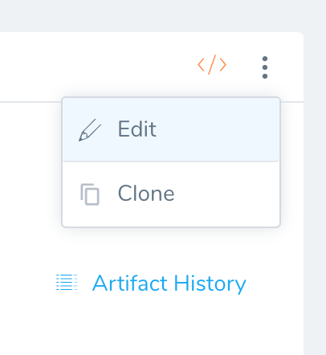
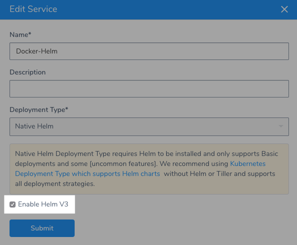

This content is for Harness [FirstGen](../../../getting-started/harness-first-gen-vs-harness-next-gen.md). Switch to [NextGen](https://docs.harness.io/article/lbhf2h71at).

For Kubernetes deployments that use Helm charts, see [Upgrade to Helm 3 Charts in Kubernetes Services](../kubernetes-deployments/upgrade-to-helm-3-charts-in-kubernetes-services.md).When you create your native [Helm deployments](helm-deployments-overview.md) in Harness, you can choose to use Helm 2 or [Helm 3](https://helm.sh/blog/helm-3-released/).

If you have already created native Helm 2 deployments, you can upgrade your deployments to Helm 3 by following the steps in this topic.

**What's a native Helm deployment in Harness?** Harness provides Kubernetes deployments that use Helm charts without requiring Helm or Tiller be installed in your target environment. These are called Harness Kubernetes deployments. This is the recommended method. If you want to deploy to a Kubernetes cluster using Helm explicitly, you can use native Helm deployments. You simply choose **Helm** as the **Deployment Type** when you create a Harness Service.

### Before You Begin

* [Helm Deployments Overview](helm-deployments-overview.md)
* [Kubernetes Deployments Overview](../kubernetes-deployments/kubernetes-deployments-overview.md)

### Blog Post

The following blog post walks you through creating a Helm 3 deployment from scratch using Harness, including a video walkthrough:

[Welcome to the Harness Family, Helm V3!](https://harness.io/2020/02/welcome-to-the-harness-family-helm-v3/?wvideo=1adpr2fxl1)

### Optional: Migrate Your Release History From Tiller

This section is not necessary for Harness Kubernetes deployments that use Helm charts. For Kubernetes Services, see [Upgrade to Helm 3 Charts in Kubernetes Services](../kubernetes-deployments/upgrade-to-helm-3-charts-in-kubernetes-services.md).Helm 3 uses a new data data model that impacts your native Helm deployment release history. If you upgrade Harness native Helm 2 deployments to Helm 3 without migrating your target cluster to Helm 3, your Helm 3 deployments will not include your Helm 2 release history.

If maintaining continuity between your Helm 2 and Helm 3 releases is not required, you do not need to migrate your release history to Helm 3. Simply move onto the next steps.

If you do not migrate your release history to Helm 3, the first time you deploy to it using a Harness native Helm 3 deployment, Harness cannot perform rollback because there will no release history available.1. If you want to maintain release continuity between Helm 2 and Helm 3, migrate your release history to Helm 3 using the steps in [How to migrate from Helm v2 to Helm v3](https://helm.sh/blog/migrate-from-helm-v2-to-helm-v3/) from Helm.  
  
In particular, pay attention to the steps in the [Migrate Helm v2 Releases](https://helm.sh/blog/migrate-from-helm-v2-to-helm-v3/#migrate-helm-v2-releases).

Once you are done migrating, follow the steps below.

### Step 1: Add a new Delegate with Helm 3 Installed

If you are upgrading your native Helm deployments to Helm 3, you will need to add a new Harness Delegate.

1. Install and run a new Kubernetes Cluster Delegate or Helm Delegate in your target cluster, or install a new Helm Delegate using the Kubernetes management platform, Rancher. For steps on setting up a new Delegate, use one of the following:
* [Delegate Installation and Management](https://docs.harness.io/article/h9tkwmkrm7-delegate-installation)
* [Using the Helm Delegate](https://docs.harness.io/article/6n7fon8rit-using-the-helm-delegate)

You do not need to add a Delegate Profile for Helm 3. Harness includes Helm 3 support in any Delegate that can connect to the target Kubernetes cluster.

Harness adds Helm within the Delegate directory path, in **/client-tools/helm/v3.0.2**.

### Step 2: Enable Helm 3 on Harness Services

1. Log into Harness.
2. Click **Setup**, and open your Harness Application.
3. Open the Harness Service you use for native Helm 2 deployments.
4. In the Harness Service, click vertical ellipsis (**︙**) and then click **Edit**:
5. Select the **Enable Helm V3** setting and click **Submit**.

That's it. Now your Harness Service is upgraded for Helm 3 and you can start using Helm 3 charts.

### Notes

#### Custom Helm Binaries and Delegates

Harness ships Helm binaries with all Harness Delegates.

If you want the Delegate to use a specific Helm binary, see the steps in [Use Custom Helm Binaries on Harness Delegates](https://docs.harness.io/article/ymw96mf8wy-use-custom-helm-binaries-on-harness-delegates).

### Troubleshooting

If your deployment uses Helm 3, Harness will select a Delegate that has Helm 3 installed. You do not need to make any changes.

However, if the Infrastructure Definition used by the Workflow is configured with a Cloud Provider that uses the Delegate Selector of a Delegate that is running Helm 2, your Helm 3 deployment might fail.

After you have installed and run your new Delegate, and installed and run Helm 3 on it, add a Selector to your new Delegate and change your Cloud Provider to use its Delegate Selector.

