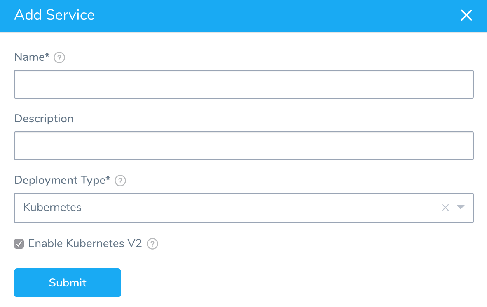
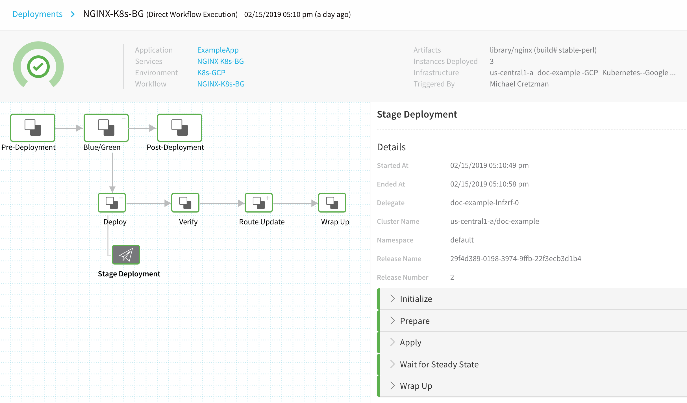
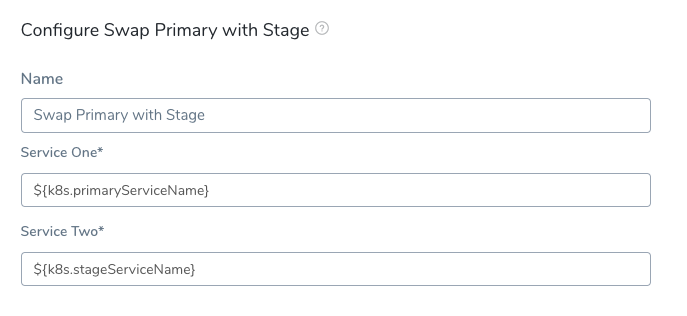
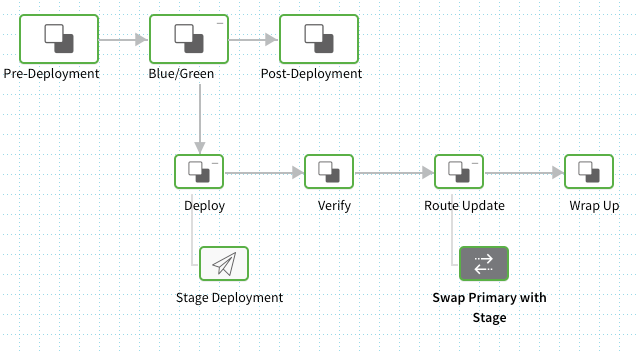
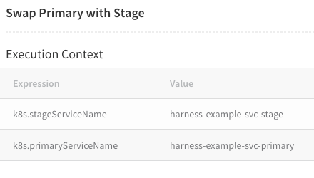
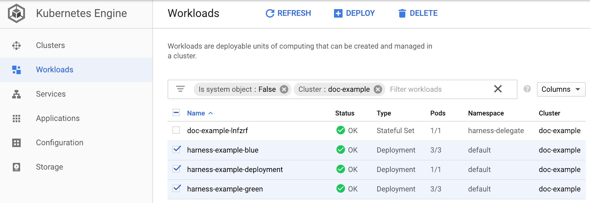
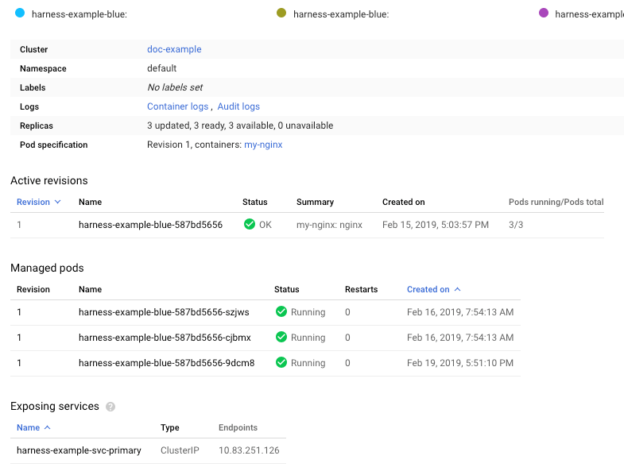

This topic will walk you through creating a Blue/Green Workflow in Harness for a Deployment workload.

For information on Blue/Green deployments, see [Deployment Concepts and Strategies](../concepts-cd/deployment-types/deployment-concepts-and-strategies.md).

### Before You Begin

Ensure you are familiar with the following:

* [Kubernetes Quickstart](https://docs.harness.io/article/7in9z2boh6-kubernetes-quickstart)
* [Kubernetes Deployments Overview](../concepts-cd/deployment-types/kubernetes-overview.md)
* [Define Kubernetes Manifests](define-kubernetes-manifests.md)
* [Define Your Kubernetes Target Infrastructure](define-your-kubernetes-target-infrastructure.md)

### Review: What Workloads Can I Deploy?

Harness Canary and Blue/Green Workflow default steps support a single Deployment workload as a **managed** entity.

In Harness, a **managed** workload is a Deployment, StatefulSet, or DaemonSet object deployed and managed to steady state.

Rolling Workflow default steps support Deployment, StatefulSet, or DaemonSet as **managed** workloads, but not Jobs.

You can deploy any Kubernetes workload in any Workflow type by using a Harness  [annotation](https://docs.harness.io/article/ttn8acijrz-versioning-and-annotations#annotations) to make it unmanaged (`harness.io/direct-apply`).

The [Apply Step](deploy-manifests-separately-using-apply-step.md) can deploy any workloads or objects in any Workflow type as a managed workload.

**OpenShift:** See [Using OpenShift with Harness Kubernetes](using-open-shift-with-harness-kubernetes.md).

### Review: Harness Blue Green Deployments

Here's a quick summary of how Harness performs Blue Green deployments.

Only one Kubernetes service is mandatory and it doesn’t need any annotations to establish if it is the primary (production) service.

Here is a very generic service example that uses a values.yaml file for its values:


```
apiVersion: v1  
kind: Service  
metadata:  
  name: {{.Values.name}}-svc  
spec:  
  type: {{.Values.serviceType}}  
  ports:  
  - port: {{.Values.servicePort}}  
    targetPort: {{.Values.serviceTargetPort}}  
    protocol: TCP  
  selector:  
    app: {{.Values.name}}
```
Note that there are no annotations to indicate that it is the primary service. Harness will add this later.

If you have more than one service, Harness does not automatically know which is the primary service unless you add the annotations described below. If you use two services, please annotate them as described below.
1. **First deployment:**
	1. Harness creates two services (primary and stage) and one pod set for the app.
	2. The primary service is given this annotation:  
	`annotations: harness.io/primary-service: "true"`
	3. The stage service is given this annotation:  
	`annotations: harness.io/stage-service: "true"`
	4. The pod set is given an annotation of `harness.io/color: blue`.
	5. Harness points the stage service at the pod set and verifies that the set reached steady state.
	6. Harness swaps the primary service to pod set. Production traffic now flows to the app.
2. **Second deployment (new version of the same app):**
	1. Harness creates a new pod set for new app version. The pod set is given the annotation `harness.io/color: green`.
	2. Harness points the stage service at new pod set (with new app version) and verifies that the set reached steady state.
	3. Harness swaps the primary service to new pod set, stage service to old pod set.
3. **Third deployment:**
	1. Harness deploy new app version to the pod set not using the primary service.
	2. Harness points the stage service at new pod set (with new app version) and verifies that the set reached steady state.
	3. Harness swaps the primary service to new pod set, stage service to old pod set.

### Visual Summary

Here's an example of what your BlueGreen deployment will look like:


### Step 1: Create the Harness Kubernetes Service

A Harness Service is different from a Kubernetes service. A Harness Service includes the manifests and container used for deployment. A Kubernetes service enables applications running in a Kubernetes cluster to find and communicate with each other, and the outside world. To avoid confusion, a Harness Service is always capitalized in Harness documentation. A Kubernetes service is not.

1. In Harness, click **Setup**, and then click **Add Application**.
2. Enter a name for the Application and click **Submit**.
3. Click **Services**, and then click **Add Service**. The **Add Service** settings appear.

  [](./static/create-a-kubernetes-blue-green-deployment-218.png)

4. In **Name**, enter a name for the Service.
5. In **Deployment Type**, select **Kubernetes**, and then ensure **Enable Kubernetes V2** is selected.
6. Click **Submit**. The new Harness Kubernetes Service is created.

### Step 2: Provide Manifests

When you create a Harness Service for a Blue/Green deployment, you need to include a manifest for one Kubernetes service.

You must also provide a manifest for your Kubernetes Deployment object.

The default manifest provided by Harness will work fine.

That is all that is needed to set up a simple Harness Service for Kubernetes Blue/Green deployment.

There are no Harness Infrastructure Definition settings specific to Kubernetes Blue/Green deployment. Create or use the Infrastructure Definition that targets your cluster, as described in [Define Your Kubernetes Target Infrastructure](define-your-kubernetes-target-infrastructure.md).

### Step 3: Create the Workflow

When you create a Harness Kubernetes Workflow for Blue/Green deployment, Harness automatically generates the steps for setting up the Kubernetes services you defined in your Harness Service, and for swapping the Kubernetes services between the new and old containers.

To create a Kubernetes Blue/Green Workflow, do the following:

1. In your Application, click **Workflows**.
2. Click **Add Workflow**. The **Workflow** dialog appears.
3. In **Name**, enter a name for your Workflow.
4. In **Workflow Type**, select **Blue/Green Deployment**.
5. In **Environment**, select the Environment you created for your Kubernetes deployment.
6. In **Service**, select the Service containing manifests for the primary and stage Kubernetes services.
7. In **Infrastructure Definition**, select the Infrastructure Definition where you want to deploy. As stated earlier, there are no Harness Infrastructure Definition settings specific to Kubernetes Blue/Green deployment.  
When you are finished the Workflow dialog will look like this:
8. Click **SUBMIT**. The new Workflow appears.

[](./static/create-a-kubernetes-blue-green-deployment-221.png)

Let's look at each step in the Workflow and its deployment step logs.

### Step 4: Stage Deployment Step

The **Stage Deployment** step is added automatically when you create the Workflow.

In the Blue/Green Workflow, click the **Stage Deployment** step.

The **Stage Deployment** step has the following options.

#### Manifest Options

##### Export Manifest

If you enable this option, Harness does the following at runtime:

* Downloads manifests (if remote).
* Renders manifests in logs.
* Performs a dry run unless the **Skip Dry Run** option is enabled.
* Export the deployment manifests to the variable `${k8sResources.manifests}`.
* **Does not deploy the manifests.** To deploy the manifests, you must add another Kubernetes step of the same type (Canary, Rolling, Apply, Stage Deployment) an enable the **Inherit Manifest** option to deploy a copy of the exported manifests.

If **Export Manifest** is enabled, the manifests are not deployed. You can use the **Inherit Manifest** option in a subsequent Kubernetes step to deploy a copy of the exported manifests.

The exported manifests can be written to storage on the Delegate where the step is run. For example, you can add a [Shell Script](https://docs.harness.io/article/1fjrjbau7x-capture-shell-script-step-output) step to echo and write the manifest to a file:


```
echo "${k8sResources.manifests}" > /opt/harness-delegate/test/canaryPlan
```
If you use `${k8sResources.manifests}` in a script ensure that your script expects multiline output. You can use `cat` command to concatenate the lines.If you have the 3rd party tool that check compliance, it can use the exported manifests.

To deploy the manifests, a copy of the exported manifests can be inherited by the next Kubernetes step (Canary, Rolling, Apply, Stage Deployment) using the **Inherit Manifest** option.

If **Export Manifest** is enabled in multiple Kubernetes steps of the same type in the same Workflow Phase, the last step overrides the exported manifests. This is important because the next Kubernetes step to inherit a copy of the exported manifests will only use the exported manifests from last Kubernetes step with **Export Manifest** is enabled.

##### Inherit Manifest

Enable this option to inherit and deploy a copy of the manifests exported from the previous Kubernetes step (Canary, Rolling, Apply, Stage Deployment) using the **Export Manifest** option.

The **Inherit Manifest** option will only inherit the exported manifest from the last Kubernetes step of the same type and in the same Workflow Phase.

For example, if you enable the **Inherit Manifest** option in a **Canary Deployment** step, then it will only inherit a copy of the manifests exported from the last **Canary Deployment** step with the **Export Manifest** option enabled in the same Workflow Phase.

#### Skip Dry Run

By default, Harness uses the `--dry-run` flag on the `kubectl apply` command during the **Initialize** step of this command, which prints the object that would be sent to the cluster without really sending it. If the **Skip Dry Run** option is selected, Harness will not use the `--dry-run` flag.

#### Delegate Selector

If your Workflow Infrastructure Definition's Cloud Provider uses a Delegate Selector (supported in Kubernetes Cluster and AWS Cloud Providers), then the Workflow uses the selected Delegate for all of its steps.

In these cases, you shouldn't add a Delegate Selector to any step in the Workflow. The Workflow is already using a Selector via its Infrastructure Definition's Cloud Provider.

If your Workflow Infrastructure Definition's Cloud Provider isn't using a Delegate Selector, and you want this Workflow step to use a specific Delegate, do the following:

In **Delegate Selector**, select the Selector for the Delegate(s) you want to use. You add Selectors to Delegates to make sure that they're used to execute the command. For more information, see [Select Delegates for Specific Tasks with Selectors](https://docs.harness.io/article/c3fvixpgsl-select-delegates-for-specific-tasks-with-selectors).

Harness will use Delegates matching the Selectors you add.

If you use one Selector, Harness will use any Delegate that has that Selector.

If you select two Selectors, a Delegate must have both Selectors to be selected. That Delegate might also have other Selectors, but it must have the two you selected.

You can use expressions for Harness built-in variables or Account Default variables in **Delegate Selectors**. When the variable expression is resolved at deployment runtime, it must match an existing Delegate Selector.  
  
For example, if you have a Delegate Selector **prod** and the Workflow is using an Environment also named **prod**, the Delegate Selector can be `${env.name}`. This is very useful when you match Delegate Selectors to Application component names such as Environments, Services, etc. It's also a way to template the Delegate Selector setting.#### Step Deployment

The **Stage Deployment** step simply deploys the two Kubernetes services you have set up in the Harness Service **Manifests** section.

[](./static/create-a-kubernetes-blue-green-deployment-223.png)

When you look at the **Stage Deployment** step in Harness **Deployments**, you will see the following log sections.

#### Initialize

The Initialize stage initializes the two Kubernetes services you have set up in the Harness Service **Manifests** section (displayed earlier), primary and stage, validating their YAML.


```
Initializing..  
  
Manifests [Post template rendering] :  
  
---  
apiVersion: v1  
kind: Service  
metadata:  
  name: harness-example-svc-primary  
  annotations:  
    harness.io/primary-service: "true"  
  labels:  
    app: bg-demo-app  
spec:  
  type: ClusterIP  
  ports:  
  - port: 80  
    protocol: TCP  
  selector:  
    app: bg-demo-app  
---  
apiVersion: v1  
kind: Service  
metadata:  
  name: harness-example-svc-stage  
  annotations:  
    harness.io/stage-service: "true"  
  labels:  
    app: bg-demo-app  
spec:  
  type: ClusterIP  
  ports:  
  - port: 80  
    protocol: TCP  
  selector:  
    app: bg-demo-app  
---  
apiVersion: apps/v1  
kind: Deployment  
metadata:  
  name: harness-example  
spec:  
  selector:  
    matchLabels:  
      app: bg-demo-app  
  replicas: 3  
  template:  
    metadata:  
      labels:  
        app: bg-demo-app  
    spec:  
      containers:  
      - name: my-nginx  
        image: nginx  
        ports:  
        - containerPort: 80  
  
  
Validating manifests with Dry Run  
  
kubectl --kubeconfig=config apply --filename=manifests-dry-run.yaml --dry-run  
service/harness-example-svc-primary configured (dry run)  
service/harness-example-svc-stage configured (dry run)  
deployment.apps/harness-example created (dry run)  
  
Done.
```
#### Prepare

Typically, in the **Prepare** section, you can see that each release of the resources is versioned. This is used in case Harness needs to rollback to a previous version.

See [Kubernetes Rollback](https://docs.harness.io/article/v41e8oo00e-kubernetes-rollback).In the case of Blue/Green, the resources are not versioned because a Blue/Green deployment uses **rapid rollback**: network traffic is simply routed back to the original instances. You do not need to redeploy previous versions of the service/artifact and the instances that comprised their environment.


```
Manifests processed. Found following resources:   
  
Kind                Name                                    Versioned   
Service             harness-example-svc-primary             false       
Service             harness-example-svc-stage               false       
Deployment          harness-example                         false       
  
Primary Service is at color: blue  
Stage Service is at color: green  
  
Cleaning up non primary releases  
  
Current release number is: 2  
  
Versioning resources.  
  
Workload to deploy is: Deployment/harness-example-green  
  
Done.
```
#### Apply

The Apply section applies a combination of all of the manifests in the Service **Manifests** section as one file using `kubectl apply`.


```
kubectl --kubeconfig=config apply --filename=manifests.yaml --record  
  
service/harness-example-svc-primary configured  
service/harness-example-svc-stage configured  
deployment.apps/harness-example-blue configured  
  
Done.
```
#### Wait for Steady State

The Wait for Steady State section displays the blue service rollout event.


```
kubectl --kubeconfig=config get events --output=custom-columns=KIND:involvedObject.kind,NAME:.involvedObject.name,MESSAGE:.message,REASON:.reason --watch-only  
  
kubectl --kubeconfig=config rollout status Deployment/harness-example-blue --watch=true  
  
Status : deployment "harness-example-blue" successfully rolled out  
  
Done.
```
Next, the **Swap Primary with Stage** Workflow step will swap the blue and green services to route primary network traffic to the new version of the container, and stage network traffic to the old version.

### Step 5: Swap Primary with Stage Step

In the Blue/Green Workflow, click the **Swap Primary with Stage** step.



For the **Delegate Selector** setting, see [Delegate Selector](#delegate_selector) above.You can see that the primary Kubernetes service is represented by the variable `${k8s.primaryServiceName}`, and the stage service by the variable `${k8s.stageServiceName}`. You can see how the swap works in the **Swap Primary with Stage** step in Harness Deployments.

[](./static/create-a-kubernetes-blue-green-deployment-226.png)

Here is the log for the step, where the mandatory Selectors you used in the Harness Service **Manifests** files are used.


```
Begin execution of command Kubernetes Swap Service Selectors  
  
Selectors for Service One : [name:harness-example-svc-primary]  
app: bg-demo-app  
harness.io/color: green  
  
Selectors for Service Two : [name:harness-example-svc-stage]  
app: bg-demo-app  
harness.io/color: blue  
  
Swapping Service Selectors..  
  
Updated Selectors for Service One : [name:harness-example-svc-primary]  
app: bg-demo-app  
harness.io/color: blue  
  
Updated Selectors for Service Two : [name:harness-example-svc-stage]  
app: bg-demo-app  
harness.io/color: green  
  
Done
```
The **Swap Primary with Stage** command is simply the **Swap Service Selectors** command renamed to **Swap Primary with Stage** for this Workflow type. You can use **Swap Service Selectors** to swap the pods referred to by any two Kubernetes services. You simply put the expressions for any two services (`${k8s.primaryServiceName}`, `${k8s.stageServiceName}`) and they will be swapped. For example, you can have a Blue/Green deployment Workflow to swap services and then a separate Workflow that uses the **Swap Service Selectors** command to manually swap back when needed.### Example: Blue/Green Workflow Deployment

Now that the setup is complete, you can click **Deploy** in the Workflow to deploy the artifact to your cluster.

[](./static/create-a-kubernetes-blue-green-deployment-228.png)

Next, select the artifact build version and click **SUBMIT**.

[](./static/create-a-kubernetes-blue-green-deployment-230.png)

The Workflow is deployed. The swap is complete and the Blue/Green deployment was a success.

On the Harness **Deployments** page, expand the Workflow steps and click the **Swap Primary with Stage** step.

[](./static/create-a-kubernetes-blue-green-deployment-232.png)

In the **Details** section, click the vertical ellipsis and click **View Execution Context**.

[](./static/create-a-kubernetes-blue-green-deployment-234.png)

You can see that the names and of primary and stage services deployed.

[](./static/create-a-kubernetes-blue-green-deployment-236.png)

Now that you have successfully deployed your artifact to your Kubernetes cluster pods using your Harness Application, look at the completed workload in the deployment environment of your Kubernetes cluster.

For example, here is the Blue/Green workload in Google Cloud Kubernetes Engine, displaying the blue and green services and Deployment workload:

[](./static/create-a-kubernetes-blue-green-deployment-238.png)

If you click a workload, you will see the pods and service created:

[](./static/create-a-kubernetes-blue-green-deployment-240.png)

### Option: Scale Down Old Version

A great benefit of a Blue/Green deployment is rapid rollback: rolling back to the old version of a service/artifact is simple and reliable because network traffic is simply routed back to the original instances. You do not need to redeploy previous versions of the service/artifact and the instances that comprised their environment.

#### Scale Down Example

If you would like to scale down the old version **for one service**, add a [Shell Script step](https://docs.harness.io/article/1fjrjbau7x-capture-shell-script-step-output) to the Post-deployment steps of your Workflow, for example:


```
kubectl scale deploy -n ${infra.kubernetes.namespace} $(kubectl get deploy -n ${infra.kubernetes.namespace} -o jsonpath='{.items[?(@.spec.selector.matchLabels.harness\.io/color=="'$(kubectl get service/${k8s.stageServiceName} -n ${infra.kubernetes.namespace} -o jsonpath='{.spec.selector.harness\.io/color}')'")].metadata.name}') --replicas=0
```
If you use a Delegate installed outside of the target cluster, any scripts in your Pipeline need to use the `${HARNESS_KUBE_CONFIG_PATH}` expression to reference the path to a Harness-generated kubeconfig file containing the credentials you provided (`export KUBECONFIG=${HARNESS_KUBE_CONFIG_PATH}`).

For example:


```
export KUBECONFIG=${HARNESS_KUBE_CONFIG_PATH} kubectl scale deploy -n ${infra.kubernetes.namespace} $(kubectl get deploy -n ${infra.kubernetes.namespace} -o jsonpath='{.items[?(@.spec.selector.matchLabels.harness\.io/color=="'$(kubectl get service/${k8s.stageServiceName} -n ${infra.kubernetes.namespace} -o jsonpath='{.spec.selector.harness\.io/color}')'")].metadata.name}') --replicas=0
```
This example does not apply to scaling down multiple deployments in the same namespace. If you use the example and you have multiple deployments in the same namespace it will impact multiple deployments. You should also include a label (or another matchSelector) specific to the particular deployment, so it doesn’t scale down all the blue deployments in the namespace. For example, match `blue` and `my-specific-app`.### Option: Using the Horizontal Pod Autoscaler (HPA)

If you are using the Horizontal Pod Autoscaler with your deployment, create a `blue` and `green` HPA configuration that will point at your deployments.

templates/hpa-blue.yaml:


```
apiVersion: autoscaling/v2beta2  
kind: HorizontalPodAutoscaler  
metadata:  
  name: {{.Values.name}}-blue  
  labels:  
    harness.io/color: blue  
spec:  
  scaleTargetRef:  
    apiVersion: apps/v1  
    kind: Deployment  
    name: {{.Values.name}}-blue  
  minReplicas: {{ .Values.autoscaling.minReplicas }}  
  maxReplicas: {{ .Values.autoscaling.maxReplicas }}  
  metrics:  
    {{- toYaml .Values.autoscaling.metrics | nindent 4 }}
```
templates/hpa-green.yaml:


```
apiVersion: autoscaling/v2beta2  
kind: HorizontalPodAutoscaler  
metadata:  
  name: {{.Values.name}}-green  
  labels:  
    harness.io/color: green  
spec:  
  scaleTargetRef:  
    apiVersion: apps/v1  
    kind: Deployment  
    name: {{.Values.name}}-green  
  minReplicas: {{ .Values.autoscaling.minReplicas }}  
  maxReplicas: {{ .Values.autoscaling.maxReplicas }}  
  metrics:  
    {{- toYaml .Values.autoscaling.metrics | nindent 4 }}
```
You can add your scaling configuration to your manifest (or share it if you are using a Helm chart):


```
autoscaling:  
  minReplicas: 1  
  maxReplicas: 5  
  metrics:  
  - type: Resource  
    resource:  
      name: cpu  
      target:  
        type: Utilization  
        averageUtilization: 20  
  - type: Resource  
    resource:  
      name: memory  
      target:  
        type: Utilization  
        averageUtilization: 20
```
When using this with a traffic splitting strategy, your pods will scale automatically as your new pods begin receiving heavier loads.

### Kubernetes Rollback

See [Kubernetes Rollback](https://docs.harness.io/article/v41e8oo00e-kubernetes-rollback).

### Notes

* **Blue/Green Rollback** — A great benefit of a Blue/Green deployment is rapid rollback: rolling back to the old version of a service/artifact is simple and reliable because network traffic is simply routed back to the original instances. You do not need to redeploy previous versions of the service/artifact and the instances that comprised their environment.
* The **Swap Primary with Stage** command is simply the **Swap Service Selectors** command renamed to **Swap Primary with Stage** for this Workflow type. You can use **Swap Service Selectors** to swap the any two Kubernetes services that include the primary and stage selectors. You simply put the expressions for any two services (`${k8s.primaryServiceName}`, `${k8s.stageServiceName}`) in **Swap Service Selectors** and they will be swapped. For example, you can have a Blue/Green deployment Workflow to swap services and then a separate Workflow that uses the **Swap Service Selectors** command to manually swap back when needed.

### Next Steps

* [Create a Kubernetes Rolling Deployment](create-a-kubernetes-rolling-deployment.md)

