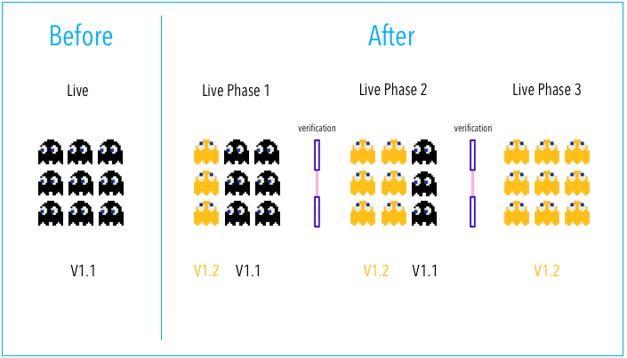
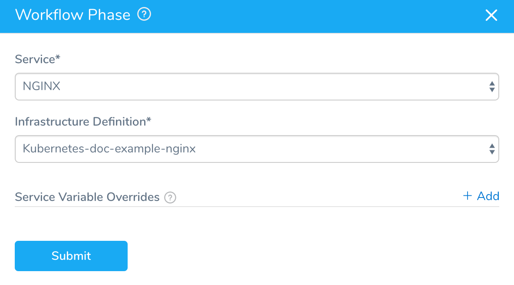
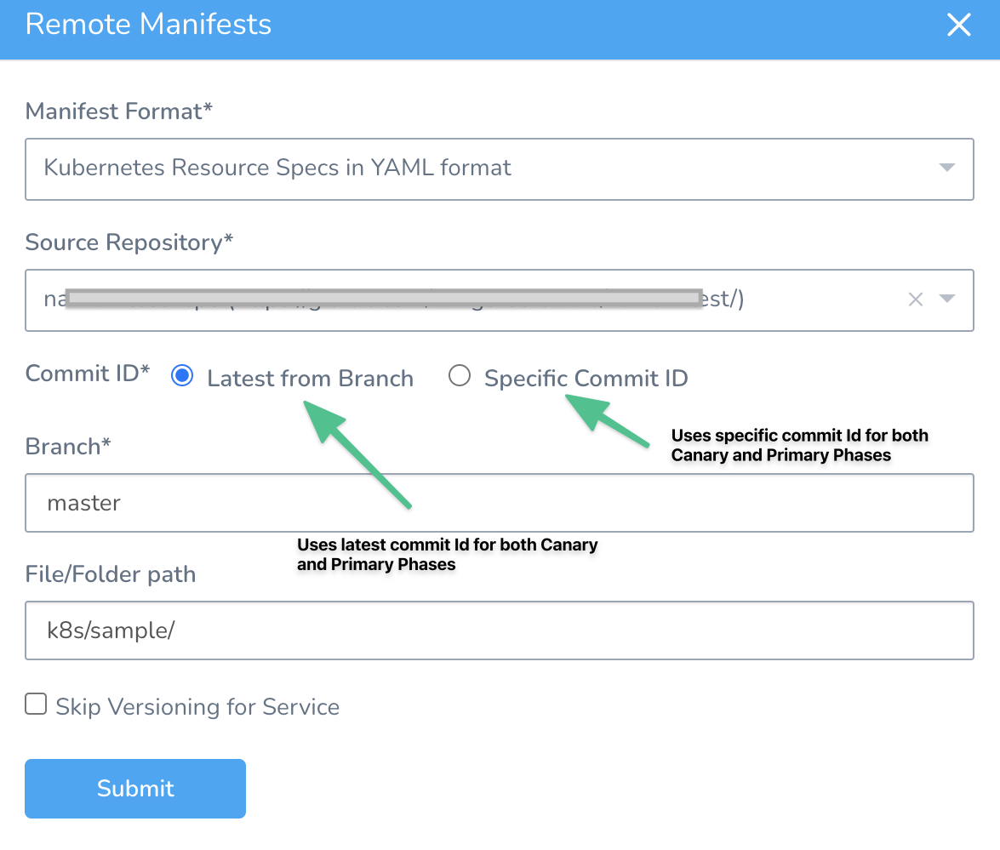
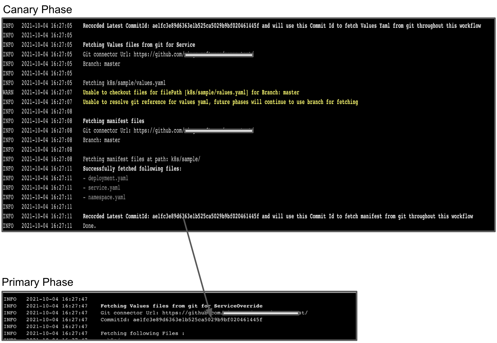
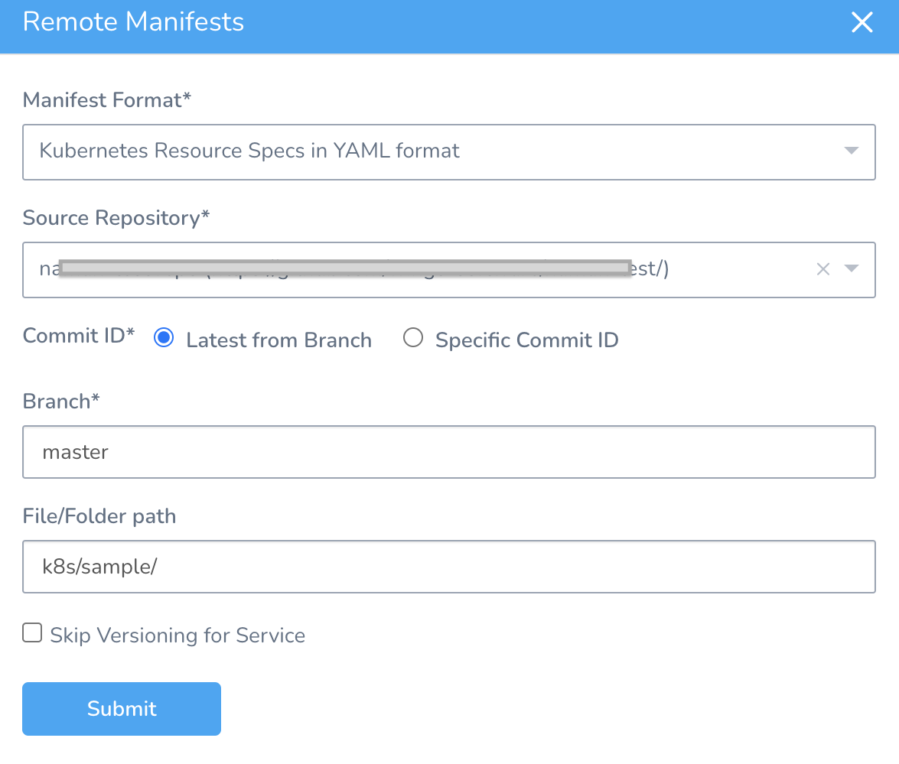
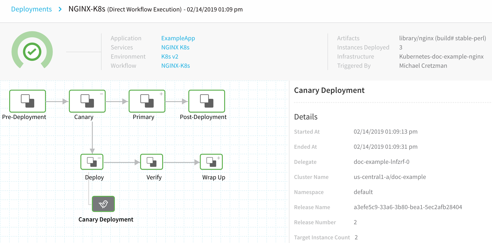
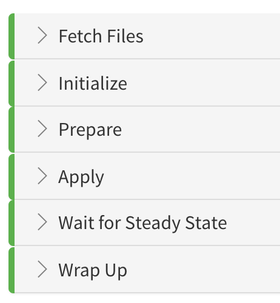
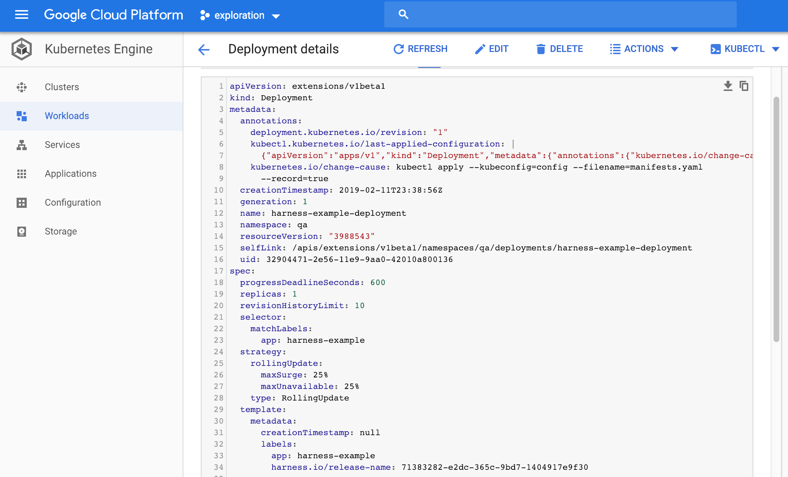

This topic will walk you through creating a Canary Workflow in Harness for a Deployment workload.

### Before You Begin

While you can add multiple phases to a Kubernetes Canary Workflow, you should simply use the Canary and Primary Phases generated by Harness when you add the first two phases. Kubernetes deployments have built-in controls for rolling out in a controlled way. The Canary Phase is a way to test the new build, run your verification, then roll out to the Primary Phase.A Harness Canary Workflow for Kubernetes is a little different than a typical [Canary deployment](../concepts-cd/deployment-types/deployment-concepts-and-strategies.md).

This is a standard Canary deployment:



Harness does this a little different:


In a typical Canary deployment, all nodes in a single environment are incrementally updated in small phases, with each phase requiring a verification/gate to proceed to the next phase.

This typical method isn't needed for Kubernetes because Kubernetes includes Rolling Update. Rolling Update is a built-in control for rolling out in a controlled way. It incrementally updates pod instances with new ones. New pods are scheduled on nodes with available resources.

A Harness Kubernetes Canary Workflow uses two phases, a Canary and a Kubernetes Rolling Update:

1. **Phase 1:** Harness creates a Canary version of the Kubernetes Deployment object defined in your Service **Manifests** section. Once that Deployment is verified, the Workflow deletes it by default.  
Harness provides a Canary Phase as a way to test the new build, run your verification, then rollout to the subsequent Rolling Update phase.
2. **Phase 2:** Run the actual deployment using a Kubernetes Rolling Update with the number of pods you specify in the Service **Manifests** files (for example, `replicas: 3`).

When you add phases to a Kubernetes Canary Workflow, Harness automatically generates the steps for Canary and Primary phases. You simply need to configure them.

If you are new to Kubernetes RollingUpdate deployments, see [Performing a Rolling Update](https://kubernetes.io/docs/tutorials/kubernetes-basics/update/update-intro/) from Kubernetes. That guide summaries Rolling Update and provides an interactive, online tutorial.Although it is not covered here, you can also scale your Workloads between the Canary and Rolling Update phases if you like. You simply add a new Phase and use the Scale step. See [Scale Kubernetes Pods](scale-kubernetes-pods.md).

### Review: What Workloads Can I Deploy?

See [What Can I Deploy in Kubernetes?](https://docs.harness.io/article/6ujb3c70fh).

### Review: Manifest and Canary Phases

Harness pulls the manifests for each Phase in the Canary Workflow. The Canary Phase fetches the manifests, and then when the Primary Phase is initiated the manifests are pulled again.

To ensure that the identical manifest is deployed in both the Canary and Primary phases, use the **Specific Commit ID** option when selecting manifests. See [Link Resource Files or Helm Charts in Git Repos](link-resource-files-or-helm-charts-in-git-repos.md).

If you use the **Latest from Branch** option, when Harness fetches the manifest for each phase there is the possibility that the manifest could change between fetches for the Canary and Primary phases.

### Step 1: Create the Workflow

Create the Harness Kubernetes Canary Workflow that will preform the Canary deployment.

1. In your Application, click **Workflows**.
2. Click **Add Workflow**.
3. In **Name**, enter a name for your Workflow.
4. In **Workflow Type**, select **Canary Deployment**.
5. In **Environment**, select the Environment you created for your Kubernetes deployment. You will pick Infrastructure Definitions from this Environment when you create Phases in the Workflow.
6. Click **SUBMIT**. By default, the new Canary Workflow does not have any phases pre-configured.

### Step 2: Create the Canary Phase

The **Canary Phase** creates a Canary deployment using your Service **Manifests** files and the number of pods you specify in the Workflow's **Canary Deployment** step.

To add the Canary Phase, do the following:

1. In **Deployment Phases**, click **Add Phase**. The **Workflow Phase** dialog appears.
   [](./static/create-a-kubernetes-canary-deployment-04.png)
2. In **Service**, select the **Service** where you set up your Kubernetes configuration files.
3. In Infrastructure Definition, select the Infrastructure Definition where you want this Workflow Phase to deploy your Kubernetes objects. This is the Infrastructure Definition with the Kubernetes cluster and namespace for this Phase's deployment.
4. In **Service Variable Overrides**, you can add a variable to overwrite any variable in the Service you selected. Ensure that the variable names are identical. This is the same process described for overwriting variables in  [Override Harness Kubernetes Service Settings](override-harness-kubernetes-service-settings.md).
5. Click **SUBMIT**. The new Phase is created.

You'll notice the Phase is titled **Canary Deployment**. You can change the name of any Phase by editing it and entering a new name in the **Name** setting.

Let's look at the default settings for this first Phase of a Canary Workflow.

### Step 3: Canary Deployment Step

Click the Phase 1 step, named **Canary Deployment**. The **Canary Deployment** step dialog appears.


In this step, you will define how many pods are deployed for a Canary test of the configuration files in your Service **Manifests** section.

1. In **Instance Unit Type**, click **COUNT** or **PERCENTAGE**.
2. In **Instances**, enter the number of pods to deploy.
* If you selected **COUNT** in **Instance Unit Type**, this is simply the number of pods.
* If you selected **PERCENTAGE**, enter a percentage of the pods defined in your Service **Manifests** files to deploy. For example, in you have `replicas: 4` in a manifest in Service, and you enter **50** in **Instances**, then 2 pods are deployed in this Phase step.

#### Delegate Selector

If your Workflow Infrastructure Definition's Cloud Provider uses a Delegate Selector (supported in Kubernetes Cluster and AWS Cloud Providers), then the Workflow uses the selected Delegate for all of its steps.

In these cases, you should not add a Delegate Selector to any step in the Workflow. The Workflow is already using a Selector via its Infrastructure Definition's Cloud Provider.

If your Workflow Infrastructure Definition's Cloud Provider is not using a Delegate Selector, and you want this Workflow step to use a specific Delegate, do the following:

In **Delegate Selector**, select the Selector for the Delegate(s) you want to use. You add Selectors to Delegates to ensure that they are used to execute the command. For more information, see [Select Delegates for Specific Tasks with Selectors](https://docs.harness.io/article/c3fvixpgsl-select-delegates-for-specific-tasks-with-selectors).

Harness will use Delegates matching the Selectors you add.

If you use one Selector, Harness will use any Delegate that has that Selector.

If you select two Selectors, a Delegate must have both Selectors to be selected. That Delegate might also have other Selectors, but it must have the two you selected.

You can use expressions for Harness built-in variables or Account Default variables in **Delegate Selectors**. When the variable expression is resolved at deployment runtime, it must match an existing Delegate Selector.  
  
For example, if you have a Delegate Selector **prod** and the Workflow is using an Environment also named **prod**, the Delegate Selector can be `${env.name}`. This is very useful when you match Delegate Selectors to Application component names, such as Environments, Services, etc. It is also a way to template the Delegate Selector setting.#### Manifest Options

##### Export Manifest

If you enable this option, Harness does the following at runtime:

* Downloads manifests (if remote).
* Renders manifests in logs.
* Performs a dry run unless the **Skip Dry Run** option is enabled.
* Export the deployment manifests to the variable `${k8sResources.manifests}`.
* **Does not deploy the manifests.** To deploy the manifests, you must add another Kubernetes step of the same type (Canary, Rolling, Apply, Stage Deployment) an enable the **Inherit Manifest** option to deploy a copy of the exported manifests.

If **Export Manifest** is enabled, the manifests are not deployed. You can use the **Inherit Manifest** option in a subsequent Kubernetes step to deploy a copy of the exported manifests.

The exported manifests can be written to storage on the Delegate where the step is run. For example, you can add a [Shell Script](https://docs.harness.io/article/1fjrjbau7x-capture-shell-script-step-output) step to echo and write the manifest to a file:


```
echo "${k8sResources.manifests}" > /opt/harness-delegate/test/canaryPlan
```
If you use `${k8sResources.manifests}` in a script ensure that your script expects multiline output. You can use `cat` command to concatenate the lines.If you have the 3rd party tool that check compliance, it can use the exported manifests.

To deploy the manifests, a copy of the exported manifests can be inherited by the next Kubernetes step (Canary, Rolling, Apply, Stage Deployment) using the **Inherit Manifest** option.

If **Export Manifest** is enabled in multiple Kubernetes steps of the same type in the same Workflow Phase, the last step overrides the exported manifests. This is important because the next Kubernetes step to inherit a copy of the exported manifests will only use the exported manifests from last Kubernetes step with **Export Manifest** is enabled.

##### Inherit Manifest

Enable this option to inherit and deploy a copy of the manifests exported from the previous Kubernetes step (Canary, Rolling, Apply, Stage Deployment) using the **Export Manifest** option.

The **Inherit Manifest** option will only inherit the exported manifest from the last Kubernetes step of the same type and in the same Workflow Phase.

For example, if you enable the **Inherit Manifest** option in a **Canary Deployment** step, then it will only inherit a copy of the manifests exported from the last **Canary Deployment** step with the **Export Manifest** option enabled in the same Workflow Phase.

##### Inherit Manifest From Canary To Primary Phase

Currently, this feature is behind the Feature Flag `MANIFEST_INHERIT_FROM_CANARY_TO_PRIMARY_PHASE` and is only applicable to Kubernetes deployments with Canary Workflow phase. Contact [Harness Support](mailto:support@harness.io) to enable the feature.Harness pulls the manifests for each Phase in the Canary Workflow. The Canary Phase fetches the manifests, and then when the Primary Phase is initiated the manifests are pulled again.

You can select one of the following options for **Commit ID** in the **Remote** **Manifests** settings:

* **Latest from Branch** - Uses the latest commit id for both Canary and Primary Phases.
* **Specific Commit ID** - Uses the specific commit id for both Canary and Primary Phases.



To ensure that the identical manifest is deployed in both the Canary and Primary phases, the commitId recorded in the Canary Phase is used when selecting manifests in the Primary Phase.



To inherit manifests from the Canary to the Primary phase, you must select **Manifest Format** using Git Repositories. Following are the Manifest Formats that use Git Repo:

1. Kubernetes Resource Specs in YAML format
2. Helm Chart from Source Repository
3. Kustomization Configuration
4. OpenShift Template
   

#### Skip Dry Run

By default, Harness uses the `--dry-run` flag on the `kubectl apply` command during the **Initialize** step of this command, which prints the object that would be sent to the cluster without really sending it. If the **Skip Dry Run** option is selected, Harness will not use the `--dry-run` flag.

Phase 1 of the Canary Deployment Workflow is complete. Now the Workflow needs a Primary Phase to roll out the objects defined in the Service **Manifests** section.

#### Canary Delete Step

See [Delete Kubernetes Resources](delete-kubernetes-resources.md).

#### Verifications and Canary Deployments

When you add Harness Continuous Verification steps to a Canary Workflow, add them to the Canary Phase, not the Primary Phase.

If the Canary Phase is verified, then the Primary Phase will proceed successfully. Adding Continuous Verification steps to the Primary Phase defeats the purpose of Canary Workflows, because the Canary Phase verifies the new deployment against previous deployments.

#### Do Not Use Multiple Canary Deployment Steps

Your Phase should only use one Canary Deployment step. If you use multiple Canary Deployment steps, the last step overrides all previous steps, rendering them useless.

If you want to scale the pods deployed by the Canary Deployment step, use the [Scale](scale-kubernetes-pods.md) step.

### Step 4: Create the Primary Phase using Rolling Update

The Primary Phase runs the actual deployment as a rolling update with the number of pods you specify in the Service **Manifests** files (for example, `replicas: 3`).

Similar to application-scaling, during a rolling update of a Deployment, the Kubernetes service will load-balance the traffic only to available pods (an instance that is available to the users of the application) during the update.

To add the Primary Phase, do the following:

1. In your **Workflow**, in **Deployment Phases**, under **Canary**, click **Add Phase**.
   [](./static/create-a-kubernetes-canary-deployment-10.png)
   The **Workflow Phase** dialog appears.
2. In **Service**, select the same **Service** you selected in Phase 1.
3. In Infrastructure Definition, select the same Infrastructure Definition you selected in Phase 1.
4. In **Service Variable Overrides**, you can add a variable to overwrite any variable in the Service you selected. Ensure that the variable names are identical. This is the same process described for overwriting variables in  [Override Harness Kubernetes Service Settings](override-harness-kubernetes-service-settings.md).
5. Click **SUBMIT**. The new Phase is created.[](./static/create-a-kubernetes-canary-deployment-12.png)

The Phase is named **Primary** automatically, and contains one step, **Rollout Deployment**.

**Rollout Deployment** performs a rolling update. Rolling updates allow an update of a Deployment to take place with zero downtime by incrementally updating pod instances with new ones. The new pods are scheduled on nodes with available resources. The rolling update Deployment uses the number of pods you specified in the Service **Manifests** (number of replicas).

### Example: Canary Workflow Deployment

Let's look at how the Workflow steps deploy the workload.

#### Canary Deployment Step in Deployment

Let's look at an example where the **Canary Deployment** step is configured to deploy a **COUNT** of **2**. Here is the step in the Harness **Deployments** page:

[](./static/create-a-kubernetes-canary-deployment-14.png)

You can see **Target Instance Count 2** in the Details section.

Below Details you can see the logs for the step.

[](./static/create-a-kubernetes-canary-deployment-16.png)

Let's look at the **Prepare**, **Apply**, and **Wait** **for Steady State** sections of the step's deployment log, with comments added:

##### Prepare

Here is the log from the Prepare section:


```
Manifests processed. Found following resources:   
  
# API objects in manifest file  
  
Kind                Name                                    Versioned   
ConfigMap           harness-example-config                  true        
Deployment          harness-example-deployment              false       
  
# each deployment is versioned, this is the second deployment  
  
Current release number is: 2   
  
Versioning resources.  
  
# previous deployment  
  
Previous Successful Release is 1   
  
Cleaning up older and failed releases  
  
# existing number if pods  
  
Current replica count is 1   
  
# Deployment workload executed  
  
Canary Workload is: Deployment/harness-example-deployment-canary   
  
# number specified in Canary Deployment step Instance field  
  
Target replica count for Canary is 2   
  
Done.
```
The name of the Deployment workload in the Service **Manifests** file is **harness-example-deployment** (the name variable is `harness-example`): **.**


```
apiVersion: apps/v1  
kind: Deployment  
metadata:  
  name: {{.Values.name}}-deployment
```
As you can see, Harness appends the name with **-canary**, **harness-example-deployment-canary**. This is to identify Canary Deployment step workloads in your cluster.

The next section is **Apply**.

##### Apply

Here you will see the manifests in the Service **Manifests** section applied using kubectl as a single file, **manifests.yaml**.


```
# kubectl command to apply manifests  
  
kubectl --kubeconfig=config apply --filename=manifests.yaml --record  
  
# ConfigMap object created  
  
configmap/harness-example-config-2 created  
  
# Deployment object created  
  
deployment.apps/harness-example-deployment-canary created  
  
Done.
```
Next, Harness logs the steady state of the pods.

##### Wait for Steady State

Harness displays the status of each pod deployed and confirms steady state.


```
# kubectl command for get events  
  
kubectl --kubeconfig=config get events --output=custom-columns=KIND:involvedObject.kind,NAME:.involvedObject.name,MESSAGE:.message,REASON:.reason --watch-only  
  
# kubectl command for status  
  
kubectl --kubeconfig=config rollout status Deployment/harness-example-deployment-canary --watch=true  
  
# status of each pod   
  
Status : Waiting for deployment "harness-example-deployment-canary" rollout to finish: 0 of 2 updated replicas are available...  
Event  : Pod    harness-example-deployment-canary-8675b5b8bf-98sf6   MountVolume.SetUp succeeded for volume "default-token-hwzdf"    SuccessfulMountVolume  
Event  : Pod   harness-example-deployment-canary-8675b5b8bf-rl2n8   pulling image "registry.hub.docker.com/library/nginx:stable-perl"   Pulling  
Event  : Pod   harness-example-deployment-canary-8675b5b8bf-98sf6   pulling image "registry.hub.docker.com/library/nginx:stable-perl"   Pulling  
Event  : Pod   harness-example-deployment-canary-8675b5b8bf-rl2n8   Successfully pulled image "registry.hub.docker.com/library/nginx:stable-perl"   Pulled  
Event  : Pod   harness-example-deployment-canary-8675b5b8bf-98sf6   Successfully pulled image "registry.hub.docker.com/library/nginx:stable-perl"   Pulled  
Event  : Pod   harness-example-deployment-canary-8675b5b8bf-rl2n8   Created container   Created  
Event  : Pod   harness-example-deployment-canary-8675b5b8bf-98sf6   Created container   Created  
Event  : Pod   harness-example-deployment-canary-8675b5b8bf-rl2n8   Started container   Started  
Event  : Pod   harness-example-deployment-canary-8675b5b8bf-98sf6   Started container   Started  
  
Status : Waiting for deployment "harness-example-deployment-canary" rollout to finish: 1 of 2 updated replicas are available...  
  
# canary deployment step completed  
  
Status : deployment "harness-example-deployment-canary" successfully rolled out  
  
Done.
```
##### Wrap Up

The Wrap Up log is long and describes all of the container and pod information for the step, using the kubectl command:


```
kubectl --kubeconfig=config describe --filename=manifests.yaml
```
#### Primary Step in Deployment

Let's look at an example where the **Primary** step deploys the Service **Manifests** objects. Here is the step in the Harness **Deployments** page:

[](./static/create-a-kubernetes-canary-deployment-18.png)

Before we look at the logs, let's look at the Service **Manifests** files it's deploying.

Here is the values.yaml from our Service **Manifests** section:


```
name: harness-example  
replicas: 1  
image: ${artifact.metadata.image}
```
Here is the spec.yaml from our Service **Manifests** section:


```
apiVersion: v1  
kind: ConfigMap  
metadata:  
  name: {{.Values.name}}-config  
data:  
  key: value  
---  
apiVersion: apps/v1  
kind: Deployment  
metadata:  
  name: {{.Values.name}}-deployment  
spec:  
  replicas: {{int .Values.replicas}}  
  selector:  
    matchLabels:  
      app: {{.Values.name}}  
  template:  
    metadata:  
      labels:  
        app: {{.Values.name}}  
    spec:  
      containers:  
      - name: {{.Values.name}}  
        image: {{.Values.image}}  
        envFrom:  
        - configMapRef:  
            name: {{.Values.name}}-config  
        ports:  
        - containerPort: 80
```
Let's look at the **Initialize**, **Prepare**, and **Apply** stages of the **Rollout Deployment**.

##### Initialize

In the **Initialize** section of the **Rollout Deployment** step, you can see the same object descriptions as the Service **Manifests** section:


```
Initializing..  
  
Manifests [Post template rendering] :  
  
# displays the manifests taken from the Service Manifests section  
  
---  
apiVersion: v1  
kind: ConfigMap  
metadata:  
  name: harness-example-config  
data:  
  key: value  
---  
apiVersion: apps/v1  
kind: Deployment  
metadata:  
  name: harness-example-deployment  
spec:  
  replicas: 1  
  selector:  
    matchLabels:  
      app: harness-example  
  template:  
    metadata:  
      labels:  
        app: harness-example  
    spec:  
      containers:  
      - name: harness-example  
        image: registry.hub.docker.com/library/nginx:stable-perl  
        envFrom:  
        - configMapRef:  
            name: harness-example-config  
        ports:  
        - containerPort: 80  
  
# Validates the YAML syntax of the manifest with a dry run  
  
Validating manifests with Dry Run  
  
kubectl --kubeconfig=config apply --filename=manifests-dry-run.yaml --dry-run  
configmap/harness-example-config created (dry run)  
deployment.apps/harness-example-deployment configured (dry run)  
  
Done.  

```
Now that Harness has ensured that manifests can be used, it will process the manifests.

##### Prepare

In the **Prepare** section, you can see that Harness versions the ConfigMap and Secret resources (for more information, see [Kubernetes Versioning and Annotations](https://docs.harness.io/article/ttn8acijrz-versioning-and-annotations)).


```
Manifests processed. Found following resources:   
  
# determine if the resources are versioned  
  
Kind                Name                                    Versioned   
ConfigMap           harness-example-config                  true        
Deployment          harness-example-deployment              false       
  
# indicates that these objects have been released before  
  
Current release number is: 2  
  
Previous Successful Release is 1  
  
# removed unneeded releases  
  
Cleaning up older and failed releases  
  
# identifies new Deployment workload  
  
Managed Workload is: Deployment/harness-example-deployment  
  
# versions the new release  
  
Versioning resources.  
  
Done.
```
Now Harness can apply the manifests.

##### Apply

The Apply section shows the kubectl commands for applying your manifests.


```
# the Service Manifests section are compiled into one file and applied  
  
kubectl --kubeconfig=config apply --filename=manifests.yaml --record  
  
# the objects applied  
  
configmap/harness-example-config-2 configured  
deployment.apps/harness-example-deployment configured  
  
Done.
```
Now that the manifests are applied, you can see the container and pod details described in **Wrap Up**.

##### Wrap Up

Wrap Up is long and uses a kubectl describe command to provide information on all containers and pods deployed:


```
kubectl --kubeconfig=config describe --filename=manifests.yaml
```
Here is a sample from the output that displays the Kubernetes RollingUpdate:


```
# Deployment name  
  
Name:                   harness-example-deployment  
  
# namespace from Deployment manifest  
  
Namespace:              default  
CreationTimestamp:      Wed, 13 Feb 2019 01:00:49 +0000  
Labels:                 <none>  
Annotations:            deployment.kubernetes.io/revision: 2  
                        kubectl.kubernetes.io/last-applied-configuration:  
                          {"apiVersion":"apps/v1","kind":"Deployment","metadata":{"annotations":{"kubernetes.io/change-cause":"kubectl apply --kubeconfig=config --f...  
                        kubernetes.io/change-cause: kubectl apply --kubeconfig=config --filename=manifests.yaml --record=true  
  
# Selector applied  
  
Selector:               app=harness-example,harness.io/track=stable  
  
# number of replicas from the manifest  
  
Replicas:               1 desired | 1 updated | 1 total | 1 available | 0 unavailable  
  
# RollingUpdate strategy  
  
StrategyType:           RollingUpdate  
MinReadySeconds:        0  
  
# RollingUpdate progression  
  
RollingUpdateStrategy:  25% max unavailable, 25% max surge  

```
As you look through the description in **Wrap Up** you can see label added:


```
add label: harness.io/track=stable 
```
You can use the `harness.io/track=stable` label with the values `canary` or `stable` as a selector for managing traffic to these pods, or for testing the pods. For more information, see [Kubernetes Versioning and Annotations](https://docs.harness.io/article/ttn8acijrz-versioning-and-annotations).

The Workflow is deployed.

Now that you have successfully deployed your artifact to your Kubernetes cluster pods using your Harness Application, look at the completed workload in the deployment environment of your Kubernetes cluster.

For example, here is the Deployment workload in Google Cloud Kubernetes Engine:

[](./static/create-a-kubernetes-canary-deployment-20.png)

Or you can simply connect to your cluster in a terminal and see the pod(s) deployed:


```
john_doe@cloudshell:~ (project-15454)$ kubectl get pods  
NAME                                                        READY     STATUS    RESTARTS   AGE  
harness-example-deployment-7df7559456-xdwg5                 1/1       Running   0          9h
```
### Kubernetes Rollback

See [Kubernetes Rollback](https://docs.harness.io/article/v41e8oo00e-kubernetes-rollback).

### Notes

* If you are using the **Traffic Split** step or doing Istio traffic shifting using the **Apply step**, move the **Canary Delete** step from **Wrap Up** section of the **Canary** phase to the **Wrap Up** section of the Primary phase.  
Moving the Canary Delete step to the Wrap Up section of the Primary phase will prevent any traffic from being routed to deleted pods before traffic is routed to stable pods in the Primary phase.  
For more information, see [Set Up Kubernetes Traffic Splitting](set-up-kubernetes-traffic-splitting.md), [Delete Kubernetes Resources](delete-kubernetes-resources.md), and [Deploy Manifests Separately using Apply Step](deploy-manifests-separately-using-apply-step.md).
* Harness does not roll back Canary deployments because your production is not affected during Canary. Canary catches issues before moving to production. Also, you might want to analyze the Canary deployment. The Canary Delete step is useful to perform cleanup when required.
* **Instances Deployed** — In the **Deployments** page, the **Instances Deployed** label shows the total number of pods deployed in the entire deployment, including the Canary and Rollout steps.

### Next Steps

* [Create a Kubernetes Blue/Green Deployment](create-a-kubernetes-blue-green-deployment.md)
* [Set Up Kubernetes Traffic Splitting](set-up-kubernetes-traffic-splitting.md)
* [Delete Kubernetes Resources](delete-kubernetes-resources.md)
* [Deploy Manifests Separately using Apply Step](deploy-manifests-separately-using-apply-step.md)
* [Traffic Splitting Without Istio](traffic-splitting-without-istio.md)

