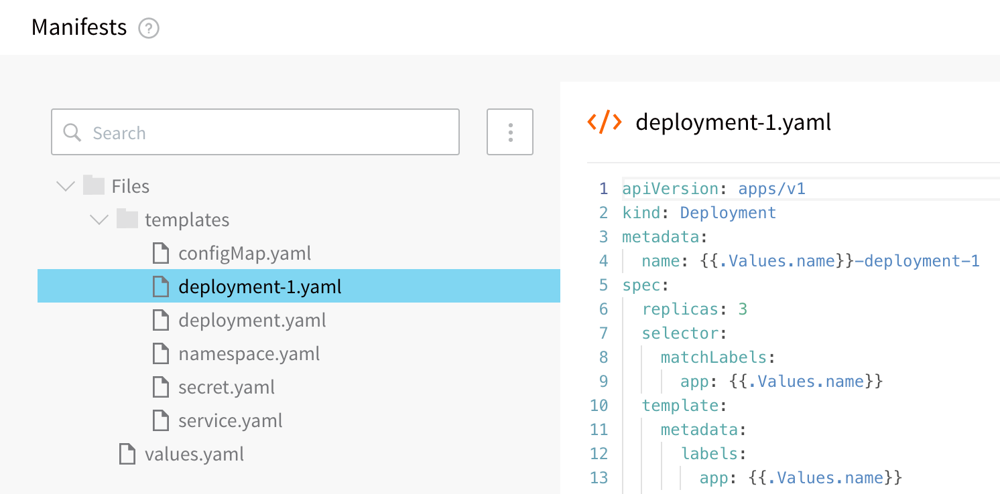
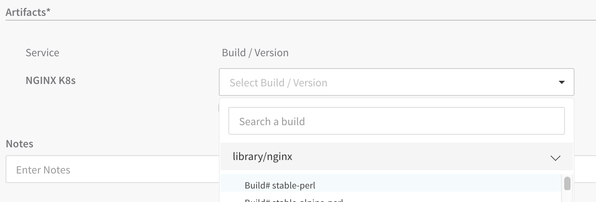

This content is for Harness [FirstGen](../../../getting-started/harness-first-gen-vs-harness-next-gen.md). Switch to [NextGen](https://docs.harness.io/article/xsla71qg8t).

A rolling update strategy updates Kubernetes deployments with zero downtime by incrementally updating pods instances with new ones. New Pods are scheduled on nodes with available resources.

This method is similar to a standard Canary strategy, but different to Harness Kubernetes Canary strategy. The Harness Kubernetes Canary strategy uses a rolling update as its final phase. See [Create a Kubernetes Canary Deployment](create-a-kubernetes-canary-deployment.md) for more information.

For a detailed explanation of Kubernetes rolling updates, see [Performing a Rolling Update](https://kubernetes.io/docs/tutorials/kubernetes-basics/update/update-intro/) from Kubernetes.

### Before You Begin

* [Define Kubernetes Manifests](define-kubernetes-manifests.md)
* [Define Your Kubernetes Target Infrastructure](define-your-kubernetes-target-infrastructure.md)

### Review: What Workloads Can I Deploy?

See [What Can I Deploy in Kubernetes?](https://docs.harness.io/article/6ujb3c70fh).

#### Multiple Managed Workloads

For Rolling Update deployments, you can deploy multiple managed workloads.

For Canary and Blue/Green Workflow deployments, only one managed object may be deployed per Workflow by default. You can deploy additional objects using the [Apply Step](deploy-manifests-separately-using-apply-step.md), but it is typically used for deploying Jobs controllers.

You can specify the multiple workload objects in a single manifest or in individual manifests, or any other arrangement.For example, here is a Service **Manifests** section with two Deployment objects, each in their own manifest:



Here is the log from the deployment, where you can see both Deployment objects deployed:


```
apiVersion: apps/v1  
kind: Deployment  
metadata:  
  name: anshul-multiple-workloads-deployment  
spec:  
  replicas: 1  
  selector:  
    matchLabels:  
      app: anshul-multiple-workloads  
  template:  
    metadata:  
      labels:  
        app: anshul-multiple-workloads  
    spec:  
      containers:  
      - name: anshul-multiple-workloads  
        image: registry.hub.docker.com/library/nginx:stable  
        envFrom:  
        - configMapRef:  
            name: anshul-multiple-workloads  
        - secretRef:  
            name: anshul-multiple-workloads  
---  
apiVersion: apps/v1  
kind: Deployment  
metadata:  
  name: anshul-multiple-workloads-deployment-1  
spec:  
  replicas: 3  
  selector:  
    matchLabels:  
      app: anshul-multiple-workloads  
  template:  
    metadata:  
      labels:  
        app: anshul-multiple-workloads  
    spec:  
      containers:  
      - name: anshul-multiple-workloads  
        image: registry.hub.docker.com/library/nginx:stable  
        envFrom:  
        - configMapRef:  
            name: anshul-multiple-workloads  
        - secretRef:  
            name: anshul-multiple-workloads
```
### Step 1: Define Rollout Strategy

There are no mandatory Rolling Update–specific settings for manifests in the Harness Service. You can use any Kubernetes configuration in your Service **Manifests** section.

The default Rolling Update strategy used by Harness is:


```
RollingUpdateStrategy:  25% max unavailable, 25% max surge
```
If you want to set a Rolling Update strategy that is different from the default, you can include the strategy settings in your Deployment manifest:


```
strategy:  
  type: RollingUpdate  
  rollingUpdate:  
    maxSurge: 1  
    maxUnavailable: 1
```
For details on the settings, see RollingUpdateDeployment in the [Kubernetes API docs](https://kubernetes.io/docs/concepts/overview/kubernetes-api/).

### Step 2: Create Workflow

1. In your Application containing a completed Service and Environment for the Rollout Deployment, click **Workflows**.
2. Click **Add Workflow**. The **Workflow** dialog appears.
3. In **Name**, enter a name for your Workflow.
4. In **Workflow Type**, select **Rolling Deployment**.
5. In **Environment**, select the Environment you created for your Kubernetes deployment.
6. In **Service**, select the Service containing the manifest files you want to use for your deployment.
7. In Infrastructure Definition, select the Infrastructure Definition where you want to deploy.
8. When you are finished, the **Workflow** dialog will look like this example:
9. Click **SUBMIT**. The new Workflow appears.

[](./static/create-a-kubernetes-rolling-deployment-106.png)

### Step 3: Rollout Deployment Step

The Workflow generates the **Rollout Deployment** step automatically. There's nothing to update. You can deploy the Workflow.

The Rollout Deployment step includes the following options.

#### Manifest Options

##### Export Manifest

If you enable this option, Harness does the following at runtime:

* Downloads manifests (if remote).
* Renders manifests in logs.
* Performs a dry run unless the **Skip Dry Run** option is enabled.
* Export the deployment manifests to the variable `${k8sResources.manifests}`.
* **Does not deploy the manifests.** To deploy the manifests, you must add another Kubernetes step of the same type (Canary, Rolling, Apply, Stage Deployment) an enable the **Inherit Manifest** option to deploy a copy of the exported manifests.

If **Export Manifest** is enabled, the manifests are not deployed. You can use the **Inherit Manifest** option in a subsequent Kubernetes step to deploy a copy of the exported manifests.

The exported manifests can be written to storage on the Delegate where the step is run. For example, you can add a [Shell Script](https://docs.harness.io/article/1fjrjbau7x-capture-shell-script-step-output) step to echo and write the manifest to a file:


```
echo "${k8sResources.manifests}" > /opt/harness-delegate/test/canaryPlan
```
If you use `${k8sResources.manifests}` in a script ensure that your script expects multiline output. You can use `cat` command to concatenate the lines.If you have the 3rd party tool that check compliance, it can use the exported manifests.

To deploy the manifests, a copy of the exported manifests can be inherited by the next Kubernetes step (Canary, Rolling, Apply, Stage Deployment) using the **Inherit Manifest** option.

If **Export Manifest** is enabled in multiple Kubernetes steps of the same type in the same Workflow Phase, the last step overrides the exported manifests. This is important because the next Kubernetes step to inherit a copy of the exported manifests will only use the exported manifests from last Kubernetes step with **Export Manifest** is enabled.

##### Inherit Manifest

Enable this option to inherit and deploy a copy of the manifests exported from the previous Kubernetes step (Canary, Rolling, Apply, Stage Deployment) using the **Export Manifest** option.

The **Inherit Manifest** option will only inherit the exported manifest from the last Kubernetes step of the same type and in the same Workflow Phase.

For example, if you enable the **Inherit Manifest** option in a **Canary Deployment** step, then it will only inherit a copy of the manifests exported from the last **Canary Deployment** step with the **Export Manifest** option enabled in the same Workflow Phase.

#### Skip Dry Run

By default, Harness uses the `--dry-run` flag on the `kubectl apply` command during the **Initialize** step of this command, which prints the object that would be sent to the cluster without really sending it. If the **Skip Dry Run** option is selected, Harness will not use the `--dry-run` flag.

Let's look at what the **Rollout Deployment** step does in the deployment logs.

#### Delegate Selector

If your Workflow Infrastructure Definition's Cloud Provider uses a Delegate Selector (supported in Kubernetes Cluster and AWS Cloud Providers), then the Workflow uses the selected Delegate for all of its steps.

In these cases, you shouldn't add a Delegate Selector to any step in the Workflow. The Workflow is already using a Selector via its Infrastructure Definition's Cloud Provider.

If your Workflow Infrastructure Definition's Cloud Provider isn't using a Delegate Selector, and you want this Workflow step to use a specific Delegate, do the following:

In **Delegate Selector**, select the Selector for the Delegate(s) you want to use. You add Selectors to Delegates to make sure that they're used to execute the command. For more information, see [Select Delegates for Specific Tasks with Selectors](https://docs.harness.io/article/c3fvixpgsl-select-delegates-for-specific-tasks-with-selectors).

Harness will use Delegates matching the Selectors you add.

If you use one Selector, Harness will use any Delegate that has that Selector.

If you select two Selectors, a Delegate must have both Selectors to be selected. That Delegate might also have other Selectors, but it must have the two you selected.

You can use expressions for Harness built-in variables or Account Default variables in **Delegate Selectors**. When the variable expression is resolved at deployment runtime, it must match an existing Delegate Selector.  
  
For example, if you have a Delegate Selector **prod** and the Workflow is using an Environment also named **prod**, the Delegate Selector can be `${env.name}`. This is very useful when you match Delegate Selectors to Application component names such as Environments, Services, etc. It's also a way to template the Delegate Selector setting.#### Apply Section in Deployment

The Apply section deploys the manifests from the Service **Manifests** section as one file.


```
kubectl --kubeconfig=config apply --filename=manifests.yaml --record  
  
configmap/harness-example-config-3 configured  
deployment.apps/harness-example-deployment created  
  
Done.
```
#### Wait for Steady State Section in Deployment

The Wait for Steady State section shows the containers and pods rolled out.


```
kubectl --kubeconfig=config get events --output=custom-columns=KIND:involvedObject.kind,NAME:.involvedObject.name,MESSAGE:.message,REASON:.reason --watch-only  
  
kubectl --kubeconfig=config rollout status Deployment/harness-example-deployment --watch=true  
  
  
Status : Waiting for deployment "harness-example-deployment" rollout to finish: 0 of 2 updated replicas are available...  
Event  : Pod    harness-example-deployment-5674658766-6b2fw   Successfully pulled image "registry.hub.docker.com/library/nginx:stable-perl"   Pulled  
Event  : Pod   harness-example-deployment-5674658766-p9lpz   Successfully pulled image "registry.hub.docker.com/library/nginx:stable-perl"   Pulled  
Event  : Pod   harness-example-deployment-5674658766-6b2fw   Created container   Created  
Event  : Pod   harness-example-deployment-5674658766-p9lpz   Created container   Created  
Event  : Pod   harness-example-deployment-5674658766-6b2fw   Started container   Started  
Event  : Pod   harness-example-deployment-5674658766-p9lpz   Started container   Started  
  
Status : Waiting for deployment "harness-example-deployment" rollout to finish: 1 of 2 updated replicas are available...  
  
Status : deployment "harness-example-deployment" successfully rolled out  
  
Done.
```
#### Wrap Up Section in Deployment

The Wrap Up section shows the Rolling Update strategy used.


```
...  
Name:                   harness-example-deployment  
Namespace:              default  
CreationTimestamp:      Sun, 17 Feb 2019 22:03:53 +0000  
Labels:                 <none>  
Annotations:            deployment.kubernetes.io/revision: 1  
                        kubectl.kubernetes.io/last-applied-configuration:  
                          {"apiVersion":"apps/v1","kind":"Deployment","metadata":{"annotations":{"kubernetes.io/change-cause":"kubectl apply --kubeconfig=config --f...  
                        kubernetes.io/change-cause: kubectl apply --kubeconfig=config --filename=manifests.yaml --record=true  
Selector:               app=harness-example  
Replicas:               2 desired | 2 updated | 2 total | 2 available | 0 unavailable  
StrategyType:           RollingUpdate  
MinReadySeconds:        0  
RollingUpdateStrategy:  25% max unavailable, 25% max surge  
...  
NewReplicaSet:   harness-example-deployment-5674658766 (2/2 replicas created)  
Events:  
  Type    Reason             Age   From                   Message  
  ----    ------             ----  ----                   -------  
  Normal  ScalingReplicaSet  8s    deployment-controller  Scaled up replica set harness-example-deployment-5674658766 to 2  
  
Done.
```
### Example: Rolling Update Deployment

Now that the setup is complete, you can click **Deploy** in the Workflow to deploy the artifact to your cluster.

[](./static/create-a-kubernetes-rolling-deployment-108.png)

Next, select the artifact build version and click **SUBMIT**.

[](./static/create-a-kubernetes-rolling-deployment-110.png)

The Workflow is deployed.

To see the completed deployment, log into your cluster and run `kubectl get all`. The output lists the new Deployment:


```
NAME                                                   READY     STATUS    RESTARTS   AGE  
pod/harness-example-deployment-5674658766-6b2fw        1/1       Running   0          34m  
pod/harness-example-deployment-5674658766-p9lpz        1/1       Running   0          34m  
                                                         
NAME                                                   TYPE           CLUSTER-IP      EXTERNAL-IP      PORT(S)        AGE  
service/kubernetes                                     ClusterIP      10.83.240.1     <none>           443/TCP        34m  
                                                         
NAME                                                   DESIRED   CURRENT   UP-TO-DATE   AVAILABLE   AGE  
deployment.apps/harness-example-deployment             2         2         2            2           34m  
                                                         
NAME                                                   DESIRED   CURRENT   READY     AGE  
replicaset.apps/harness-example-deployment-5674658766  2         2         2         34m
```
### Kubernetes Rollback

See [Kubernetes Rollback](https://docs.harness.io/article/v41e8oo00e-kubernetes-rollback).

You can add a **Rollback Deployment** command to the **Rollback Steps** in your Workflow to roll back the workloads deployed by the **Rollout Deployment** step.

Simply add this command to the **Rollback Steps** in a Workflow where you want to initiate a rollback. Note that this command applies to the deployments of the Rollout Deployment command, and not the [Apply Step](deploy-manifests-separately-using-apply-step.md) command.

### Next Steps

* [Create a Kubernetes Blue/Green Deployment](create-a-kubernetes-blue-green-deployment.md)

