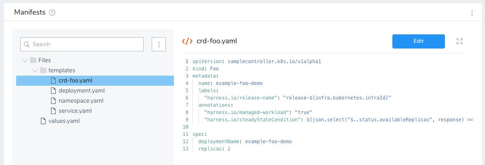
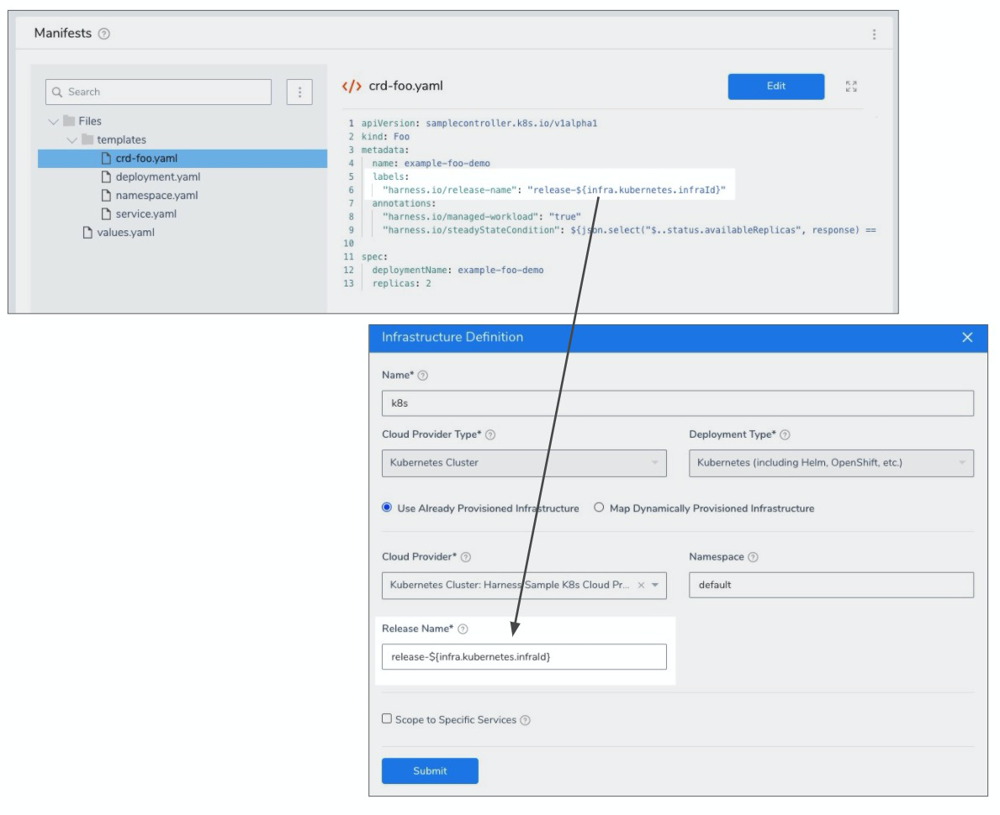

Harness supports all Kubernetes default resources, such as Pods, Deployments, StatefulSets, DaemonSets, etc. For these resources, Harness supports steady state checking, versioning, displays instances on Harness dashboards, performs rollback, and other enterprise features.

In addition, Harness provides many of the same features for Kubernetes [custom resource](https://kubernetes.io/docs/tasks/extend-kubernetes/custom-resources/custom-resource-definitions/) deployments using Custom Resource Definitions (CRDs). CRDs are resources you create that extend the Kubernetes API to support your application.

Harness supports CRDs for both Kubernetes and OpenShift. There is no difference in their custom resource implementation.


### Before You Begin

* [Kubernetes Quickstart](https://docs.harness.io/article/7in9z2boh6-kubernetes-quickstart)
* [Create a Kubernetes Rolling Deployment](create-a-kubernetes-rolling-deployment.md)
* [Kubernetes Versioning and Annotations](https://docs.harness.io/article/ttn8acijrz-versioning-and-annotations)

### Limitations

#### Rollbacks

Harness only performs rollback for the default Kubernetes objects. For failures with CRDs, Harness redeploys the previous successful version.

Harness redeploys using the last successful release that matches the `release-name` label value (`harness.io/release-name: <release_name>`), described below.

#### Rolling Deployment Only

Blue/Green and Canary deployments are not supported at this time. See [Create a Kubernetes Rolling Deployment](create-a-kubernetes-rolling-deployment.md).

#### Versioning

ConfigMap and Secrets are not versioned.

### Review: Harness Custom Resource Requirements

To use a custom resource in Harness, you need to add the following annotations to its manifest:

#### managed-workload

`harness.io/managed-workload`: when you set this annotation to `true`, it informs Harness that this is a custom resource.

Here is an example:


```
...  
    "harness.io/managed-workload": "true"  
...
```
#### steadyStateCondition

`harness.io/steadyStateCondition`: since the resource is not a native Kubernetes resource, Harness needs a way to check its steady state.

Here is an example:


```
apiVersion: samplecontroller.k8s.io/v1alpha1  
kind: Foo  
metadata:  
  name: example-foo-demo  
  annotations:  
    "harness.io/managed-workload": "true"  
    "harness.io/steadyStateCondition": ${json.select("$..status.availableReplicas", response) == json.select("$..spec.replicas", response) && json.select("$..spec.deploymentName", response) == "example-foo-demo"}  
spec:  
  deploymentName: example-foo-demo  
  replicas: 2  
  template:  
    metadata:  
      labels:   
        "harness.io/release-name": {{release}}  
...
```
See Harness support for [JSON and XML Functors](https://docs.harness.io/article/wfvecw3yod-json-and-xml-functors).

If the `steadyStateCondition` fails, Harness logs the following error message:


```
Status check for resources in namespace [[namespace]] failed.
```
#### release-name

`harness.io/release-name: <release_name>` in labels: this is required for Harness to track any pods for the custom resource.

This label is used for redeploys (which Harness performs in place of rollbacks for CRDs).

In the even of deployment failure, Harness will redeploy the last successful release that matches the `release-name` label value (`harness.io/release-name: <release_name>`).

The `<release_name>` must match the **Release Name** in the Harness Infrastructure Definition. See [Define Your Kubernetes Target Infrastructure](define-your-kubernetes-target-infrastructure.md).

You declare the release name in the values.yaml, for example `release:release-${infra.kubernetes.infraId}` , and then reference it in the manifest as `{{.Values.release}}`.

Here is an example:


```
...  
  labels:  
    "harness.io/release-name": "{{.Values.release}}"  
...
```
#### Controller Must Add Release Name to Pods

The CRD controller must add the `harness.io/release-name` label and value from the custom resource manifest to all the pods created for the custom resource. This process sets the label on the resource so Harness can track its releases.

This must be done programmatically by the controller.

Here is an example taken from the [Kubernetes sample controller on Github](https://github.com/kubernetes/sample-controller/blob/master/controller.go#L391):


```
func newDeployment(foo *samplev1alpha1.Foo) *appsv1.Deployment {  
  
  labelsFromSpec := foo.Spec.Template.Metadata.Labels  
  labels := map[string]string{  
    "app":        "nginx",  
    "controller": foo.Name,  
  }  
  for k, v := range labelsFromSpec {  
    labels[k] = v  
  }  
  
  klog.Info("Handle new deployment with labels: ", labelsFromSpec)  
  return &appsv1.Deployment{  
    ObjectMeta: metav1.ObjectMeta{  
      Name:      foo.Spec.DeploymentName,  
      Namespace: foo.Namespace,  
      OwnerReferences: []metav1.OwnerReference{  
        *metav1.NewControllerRef(foo, samplev1alpha1.SchemeGroupVersion.WithKind("Foo")),  
      },  
    },  
    Spec: appsv1.DeploymentSpec{  
      Replicas: foo.Spec.Replicas,  
      Selector: &metav1.LabelSelector{  
        MatchLabels: labels,  
      },  
      Template: corev1.PodTemplateSpec{  
        ObjectMeta: metav1.ObjectMeta{  
          Labels: labels,  
        },  
        Spec: corev1.PodSpec{  
          Containers: []corev1.Container{  
            {  
              Name:  "nginx",  
              Image: "nginx:latest",  
            },  
          },  
        },  
      },  
    },  
  }  
}
```
#### Example Manifest

Here is an example manifest:


```
apiVersion: samplecontroller.k8s.io/v1alpha1  
kind: Foo  
metadata:  
  name: example-foo-demo  
  annotations:  
    "harness.io/managed-workload": "true"  
    "harness.io/steadyStateCondition": ${json.select("$..status.availableReplicas", response) == json.select("$..spec.replicas", response) && json.select("$..spec.deploymentName", response) == "example-foo-demo"}  
spec:  
  deploymentName: example-foo-demo  
  replicas: 2  
  template:  
    metadata:  
      labels:   
        "harness.io/release-name": {{release}}
```
As you can see in this example, steady state status is checked by verifying the replicas and name of the deployed custom resource.

### Step 1: Prepare Target Cluster

In most cases, the target deployment cluster will have the CustomResourceDefinition object already created. For example:


```
apiVersion: apiextensions.k8s.io/v1beta1  
kind: CustomResourceDefinition  
metadata:  
  name: foos.samplecontroller.k8s.io  
spec:  
  group: samplecontroller.k8s.io  
  version: v1alpha1  
  names:  
    kind: Foo  
    plural: foos  
  scope: Namespaced
```
After the CustomResourceDefinition object has been created in the cluster, you can create and deploy custom objects using Harness.

The `kind` field of the custom object comes from the spec of the CustomResourceDefinition object you created in your cluster.

For example:


```
apiVersion: samplecontroller.k8s.io/v1alpha1  
kind: Foo  
metadata:  
  name: example-foo-demo  
  labels:  
    "harness.io/release-name": "{{.Values.release}}"  
  annotations:  
    "harness.io/managed-workload": "true"  
    "harness.io/steadyStateCondition": ${json.select("$..status.availableReplicas", response) == json.select("$..spec.replicas", response) && json.select("$..spec.deploymentName", response) == "example-foo-demo"}spec:  
  deploymentName: example-foo-demo  
  replicas: 2
```
Ensure your target cluster has the CRD for the custom resource object you will create in your deployment.

For an example of a simple CRD setup, see [sample-controller](https://github.com/kubernetes/sample-controller) and [Extend the Kubernetes API with CustomResourceDefinitions](https://kubernetes.io/docs/tasks/extend-kubernetes/custom-resources/custom-resource-definitions/) from Kubernetes.

### Step 2: Define Custom Resource in Harness

You add the manifest for your custom object in a Harness Service, along with the artifact you will deploy. See [Kubernetes Services](https://docs.harness.io/article/t6zrgqq0ny-kubernetes-services).

1. In your Harness Application, click **Services**, and then **Add Service**.
2. Name your Service.
3. In **Deployment Type**, select **Kubernetes**.
4. Click Submit. The new Kubernetes Service appears.
5. Add an artifact, as described in [Add a Docker Artifact Source](https://docs.harness.io/article/gxv9gj6khz-add-a-docker-image-service).
6. Next, you will add the manifest for the custom object In **Manifests**.
7. You can add your manifest inline, remotely, or by uploading. See [Define Kubernetes Manifests](define-kubernetes-manifests.md). You can also use [Go templating](use-go-templating-in-kubernetes-manifests.md).
8. Ensure your manifest has the required annotations and label, as described in [Required Custom Resource Annotations and Labels](#review_required_custom_resource_annotations_and_labels).

When you are done your Service will look something like this:



### Step 3: Define Target Cluster

In the same Harness Application, create your Kubernetes target cluster as described in [Define Your Kubernetes Target Infrastructure](define-your-kubernetes-target-infrastructure.md).

Ensure that the **Release Name** matches the name in the manifest's label, as described in [Review: Required Custom Resource Annotations and Labels](#review_required_custom_resource_annotations_and_labels):



### Step 4: Create Workflow for Custom Resource Deployment

Only the Kubernetes Rolling deployment method is supported for CRDs. See [Create a Kubernetes Rolling Deployment](create-a-kubernetes-rolling-deployment.md).

1. In your Harness Application, click **Workflows**, and then click **Add Workflow**.
2. Name your Workflow.
3. In **Workflow Deployment**, select **Rolling**.
4. In **Environment**, select the Environment containing the Infrastructure Definition you set up for the target cluster where your CRD is defined.
5. In **Service**, select the Service with your custom object manifest.
6. In **Infrastructure Definition**, select the Infrastructure Definition you set up for the target cluster where your CRD is defined.
7. Click **Submit**. The Rolling deployment Workflow is created.

There is nothing to configure in this Workflow unless you want to add additional steps. The default **Rollout Deployment** step will deploy your custom object.

You might want to run a [Shell Script](https://docs.harness.io/article/1fjrjbau7x-capture-shell-script-step-output) step to display additional Kubernetes information. See [Kubernetes Workflow Variables and Expressions](workflow-variables-expressions.md) for expressions you can use.

### Step 5: Deploy Custom Resource

Let's take a look at the logs from a CRD deployment.

#### Initialize

In the Initialize stage you can see that the release name has been added and a dry run was performed.


```
...  
---  
apiVersion: samplecontroller.k8s.io/v1alpha1  
kind: Foo  
metadata:  
  name: example-foo-demo  
  labels:  
    "harness.io/release-name": "release-66259216-da29-35c4-ad4b-1053ffdaaf55"  
  annotations:  
    "harness.io/managed-workload": "true"  
    "harness.io/steadyStateCondition": ${json.select("$..status.availableReplicas", response) == json.select("$..spec.replicas", response) && json.select("$..spec.deploymentName", response) == "example-foo-demo"}  
  
spec:  
  deploymentName: example-foo-demo  
  replicas: 2  
  
  
Validating manifests with Dry Run  
  
kubectl --kubeconfig=config apply --filename=manifests-dry-run.yaml --dry-run  
  
namespace/default configured (dry run)  
secret/harness-example configured (dry run)  
configmap/harness-example created (dry run)  
service/harness-example-svc configured (dry run)  
deployment.apps/harness-example-deployment configured (dry run)  
foo.samplecontroller.k8s.io/example-foo-demo configured (dry run)  

```
#### Prepare

In the Prepare stage the manifests are processed and the workloads are identified:


```
Manifests processed. Found following resources:   
  
Kind                Name                                    Versioned   
Namespace           default                                 false       
Secret              harness-example                         true        
ConfigMap           harness-example                         true        
Service             harness-example-svc                     false       
Deployment          harness-example-deployment              false       
Foo                 example-foo-demo                        false       
  
Current release number is: 8  
  
Previous Successful Release is 7  
...  
Found following Managed Workloads:   
  
Kind                Name                                    Versioned   
Deployment          harness-example-deployment              false       
Foo                 example-foo-demo                        false       
  
Versioning resources.  
  
Done
```
Notice that the custom object is identified by its CRD in **Kind**.

#### Apply

The Apply stage runs a [kubectl apply](https://kubernetes.io/docs/concepts/cluster-administration/manage-deployment/#kubectl-apply) using the manifests:


```
kubectl --kubeconfig=config apply --filename=manifests.yaml --record  
  
namespace/default unchanged  
secret/harness-example-8 configured  
configmap/harness-example-8 created  
service/harness-example-svc unchanged  
deployment.apps/harness-example-deployment configured  
foo.samplecontroller.k8s.io/example-foo-demo configured  
  
Done.
```
As this is the first deployment, the new object is identified as **configured**.

#### Wait for Steady State

This stage performs a [kubectl get](https://kubernetes.io/docs/reference/generated/kubectl/kubectl-commands#get) to display status about the custom resource.


```
...  
Status : example-foo-demo               "kubernetes.io/change-cause": "kubectl apply --kubeconfig=config --filename=manifests.yaml --record=true"  
  
Status : example-foo-demo           },  
  
Status : example-foo-demo           "creationTimestamp": "2020-07-21T09:55:42Z",  
  
Status : example-foo-demo           "generation": 11,  
  
Status : example-foo-demo           "name": "example-foo-demo",  
  
Status : example-foo-demo           "namespace": "default",  
  
Status : example-foo-demo           "resourceVersion": "119096798",  
  
Status : example-foo-demo           "selfLink": "/apis/samplecontroller.k8s.io/v1alpha1/namespaces/default/foos/example-foo-demo",  
  
Status : example-foo-demo           "uid": "f2e2847e-bfa8-4242-9354-db8c83c57df1"  
  
Status : example-foo-demo       },  
  
Status : example-foo-demo       "spec": {  
  
Status : example-foo-demo           "deploymentName": "example-foo-demo",  
  
Status : example-foo-demo           "replicas": 2  
  
Status : example-foo-demo       },  
  
Status : example-foo-demo       "status": {  
  
Status : example-foo-demo           "availableReplicas": 2  
  
Status : example-foo-demo       }  
  
Status : example-foo-demo   }  
  
Done.
```
#### Wrap Up

Finally, the Wrap Up stage shows the deployed custom object:


```
...  
Name:         example-foo-demo  
Namespace:    default  
Labels:       harness.io/release-name: release-66259216-da29-35c4-ad4b-1053ffdaaf55  
Annotations:  harness.io/managed-workload: true  
              harness.io/steadyStateCondition:  
                ${json.select("$..status.availableReplicas", response) == json.select("$..spec.replicas", response) && json.select("$..spec.deploymentName...  
              kubectl.kubernetes.io/last-applied-configuration:  
                {"apiVersion":"samplecontroller.k8s.io/v1alpha1","kind":"Foo","metadata":{"annotations":{"harness.io/managed-workload":"true","harness.io/...  
              kubernetes.io/change-cause: kubectl apply --kubeconfig=config --filename=manifests.yaml --record=true  
API Version:  samplecontroller.k8s.io/v1alpha1  
Kind:         Foo  
Metadata:  
  Creation Timestamp:  2020-07-21T09:55:42Z  
  Generation:          11  
  Resource Version:    119096798  
  Self Link:           /apis/samplecontroller.k8s.io/v1alpha1/namespaces/default/foos/example-foo-demo  
  UID:                 f2e2847e-bfa8-4242-9354-db8c83c57df1  
Spec:  
  Deployment Name:  example-foo-demo  
  Replicas:         2  
Status:  
  Available Replicas:  2  
Events:  
  Type    Reason  Age                  From               Message  
  ----    ------  ----                 ----               -------  
  Normal  Synced  15s (x135 over 98m)  sample-controller  Foo synced successfully  
  
Done.
```
### See Also

* [Delete Kubernetes Resources](delete-kubernetes-resources.md)
* [Deploy Manifests Separately using Apply Step](deploy-manifests-separately-using-apply-step.md)
* [Scale Kubernetes Pods](scale-kubernetes-pods.md)

### Configure As Code

To see how to configure the settings in this topic using YAML, configure the settings in the UI first, and then click the **YAML** editor button.

