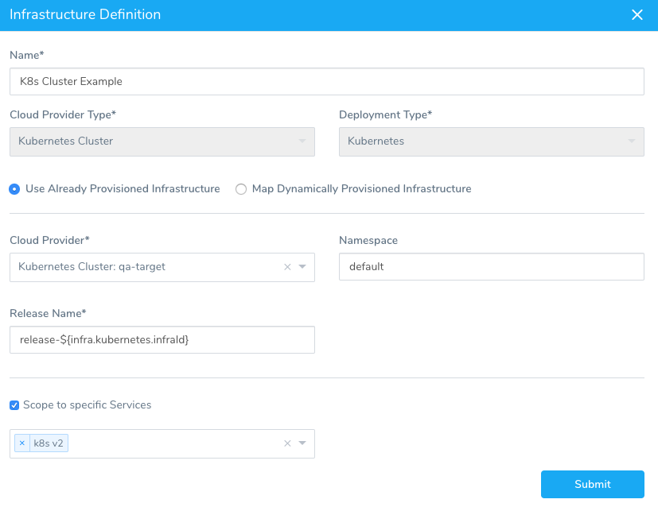
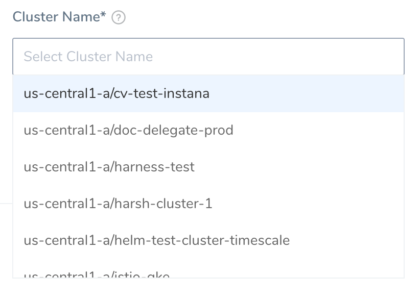
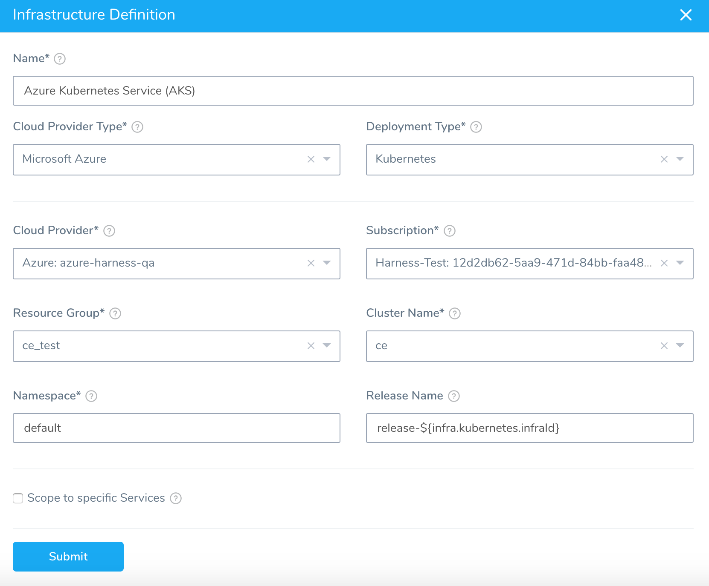

Harness Infrastructure Definitions specify the target deployment infrastructure for your Harness Services, and the specific infrastructure details for the deployment, like cluster settings.

Specify the Kubernetes cluster you want to target for deployment as a Harness Infrastructure Definition.

For Amazon Elastic Kubernetes Service (Amazon EKS) and OpenShift, use [Option 1: Specify a Vendor Agnostic Kubernetes Cluster](#option_1_specify_a_vendor_agnostic_kubernetes_cluster).

### Before You Begin

* [Add Container Images for Kubernetes Deployments](add-container-images-for-kubernetes-deployments.md)
* [Define Kubernetes Manifests](define-kubernetes-manifests.md)

### Step 1: Create an Environment

Environments represent one or more of your deployment infrastructures, such as Dev, QA, Stage, Production, etc. Use Environments to organize your target cluster Infrastructure Definitions.

1. In your Harness Application, click **Environments**. The **Environments** page appears.
2. Click Add Environment. The **Environment** settings appear.
3. In **Name**, enter a name that describes this group of target clusters, such as QA, Stage, Prod, etc.
4. In **Environment Type**, select **Non-Production** or **Production**.
5. Click **SUBMIT**. The new **Environment** page appears.
6. Click  **Add Infrastructure Definition**. The following section provide information on setting up different Add Infrastructure Definitions for different target clusters.

### Option 1: Specify a Vendor Agnostic Kubernetes Cluster

Currently, Harness connects to Amazon Elastic Kubernetes Service (Amazon EKS) and OpenShift using the Kubernetes Cluster Cloud Provider.If you are using a Harness Kubernetes Cluster Cloud Provider to connect to your target cluster, enter the following settings:

#### Name

Enter a name that describes the target cluster, such as **checkout**, **orders**, etc.

#### Cloud Provider Type

Select **Kubernetes Cluster**.

#### Deployment Type

Select **Kubernetes**.

The **Helm** option is only if you are deploying to a Harness native Helm Service. See [Helm Deployments Overview](../helm-deployment/helm-deployments-overview.md).

#### Cloud Provider

Select the **Kubernetes Cluster Cloud Provider** that connects to your target cluster. All Kubernetes Cluster Cloud Providers are prefaced with **Kubernetes Cluster:**.

#### Namespace

Select the namespace of the target Kubernetes cluster. Typically, this is `default`.

The namespace must already exist during deployment. Harness will not create a new namespace if you enter one here.

You can use Harness variables to reference the name here in the Service Manifests files. See [Create Kubernetes Namespaces based on InfraMapping](create-kubernetes-namespaces-based-on-infra-mapping.md).

If you omit the `namespace` key and value from a manifest in your Service, Harness automatically uses the namespace you entered in the Harness Environment  **Infrastructure Definition** settings **Namespace** field.

#### Release Name

Harness requires a Kubernetes release name for tracking.

The release name must be unique across the cluster.

The Harness-generated unique identifier `release-${infra.kubernetes.infraId}` can be used to ensure a unique release name.

The `${infra.kubernetes.infraId}` expression is a unique identifier that identifies the combination of Service and Infrastructure Definition.

In the Infrastructure Definition **Service Infrastructure Mapping** below each listing has a unique identifier that can be referenced using `${infra.kubernetes.infraId}`:

Use `release-${infra.kubernetes.infraId}` for the **Release Name** instead of just `${infra.kubernetes.infraId}`. Kubernetes service and pod names follow RFC-1035 and must consist of lowercase alphanumeric characters or '-', start with an alphabetic character, and end with an alphanumeric character. Using `release-` as a prefix will prevent any issues.Here is an example of how `${infra.kubernetes.infraId}` is used and how the ID is output as the **Release Name**:

See [Built-in Variables List](https://docs.harness.io/article/aza65y4af6-built-in-variables-list) for more expressions.

The release name is not incremented with each release. It identifies releases so that Harness knows which release is being replaced with a new version.

See [Kubernetes Versioning and Annotations](https://docs.harness.io/article/ttn8acijrz-versioning-and-annotations).

##### Release Name is Reserved for Internal Harness ConfigMap

The release name you enter in **Release Name** is reserved for the internal Harness ConfigMap used for tracking the deployment.

Do not create a ConfigMap that uses the same name as the release name. Your ConfigMap will override the Harness internal ConfigMap and cause a NullPointerException.

#### Scope to specific Services

To limit this Infrastructure Definition to specific Harness Services, select the Services in **Scope to specific Services**.

If you leave this setting empty, the Infrastructure Definition is available to all Workflows deploying Services with the Deployment Type of this Infrastructure Definition.

#### Example

### Option 2: Specify a GCP or Azure Kubernetes Cluster

If you are using a Harness Google Cloud Platform or Azure Cloud Provider to connect to your target cluster, enter the following settings:

#### Name

Enter a name that describes the target cluster, such as **checkout**, **orders**, etc.

#### Cloud Provider Type

Select **Google Cloud Platform** or **Microsoft Azure**.

The only differences in settings are the **Azure Subscription** and **Resource Group** settings, described below.

#### Deployment Type

Select **Kubernetes**.

The **Helm** option is only if you are deploying to a Harness native Helm Service. See [Helm Deployments Overview](../helm-deployment/helm-deployments-overview.md).

#### Use Already Provisioned Infrastructure

To manually define the target cluster, select **Use Already Provisioned Infrastructure**.

#### Map Dynamically Provisioned Infrastructure

To use a Harness Infrastructure Provisioner, select **Map Dynamically Provisioned Infrastructure**. For details on provisioning your cluster, See [Provision Kubernetes Infrastructures](provision-kubernetes-infrastructures.md).

#### Cloud Provider

Select the **Google Cloud Platform** or **Azure Cloud Provider** that connects to your target cluster.

All Google Cloud Platform Cloud Providers are prefaced with **Google Cloud Platform:**.

All Azure Cloud Providers are prefaced with **Azure:**.

#### Azure: Subscription

Select the Azure subscription to use.

When you set up the [Azure Cloud Provider](https://docs.harness.io/article/whwnovprrb-cloud-providers) in Harness, you entered the **Client/Application ID** for the Azure App registration. To access resources in your Azure subscription, you must assign the Azure app using this Client ID to a role in that subscription.

In this Azure Infrastructure Definition, you select the subscription. If the Azure App registration using this Client ID is not assigned a role in a subscription, no subscriptions will be available.

#### Azure: Resource Group

Select the resource group where your VM is located.

#### Cluster Name

Select the cluster you created for this deployment.

If the cluster name is taking a long time to load, check the connectivity of the host running the Harness Delegate.

#### Namespace

Enter the namespace of the target Kubernetes cluster. Typically, this is `default`.

The namespace must already exist during deployment. Harness will not create a new namespace if you enter one here.

You can use Harness variables to reference the name here in the Service Manifests files. See [Create Kubernetes Namespaces based on InfraMapping](create-kubernetes-namespaces-based-on-infra-mapping.md).

If you omit the `namespace` key and value from a manifest in your Service, Harness automatically uses the namespace you entered in the Harness Environment  **Infrastructure Definition** settings **Namespace** field.

#### Release Name

Harness requires a Kubernetes release name for tracking.

The release name must be unique across the cluster.

The Harness-generated unique identifier `release-${infra.kubernetes.infraId}` can be used to ensure a unique release name.

Use `release-${infra.kubernetes.infraId}` for the **Release Name** instead of just `${infra.kubernetes.infraId}`. Kubernetes service and pod names follow DNS-1035 and must consist of lowercase alphanumeric characters or '-', start with an alphabetic character, and end with an alphanumeric character. Using `release-` as a prefix will prevent any issues.#### Scope to specific Services

To limit this Infrastructure Definition to specific Harness Services, select the Services in **Scope to specific Services**.

If you leave this setting empty, the Infrastructure Definition is available to all Workflows deploying Services with the Deployment Type of this Infrastructure Definition.

#### Example

Here is an example of a cluster targeted using a Google Cloud Platform Cloud Provider:

Here is an example of a cluster targeted using a Azure Cloud Provider:

### Next Steps

* [Provision Kubernetes Infrastructures](provision-kubernetes-infrastructures.md)

