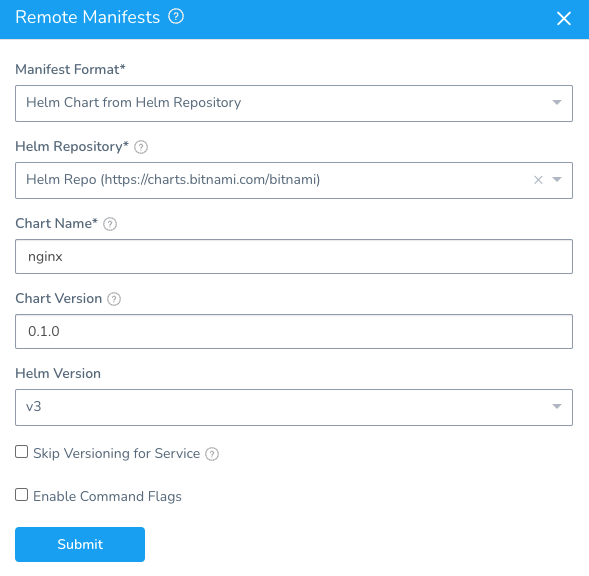
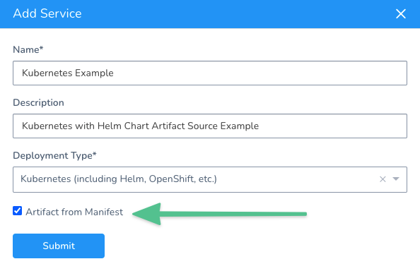
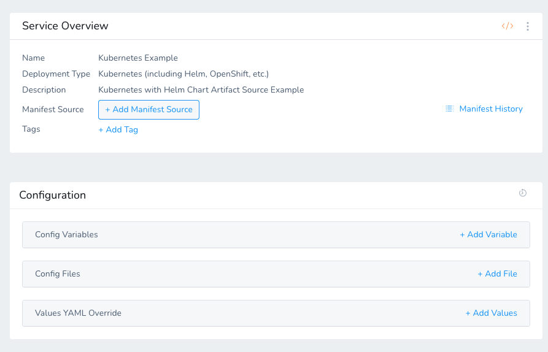
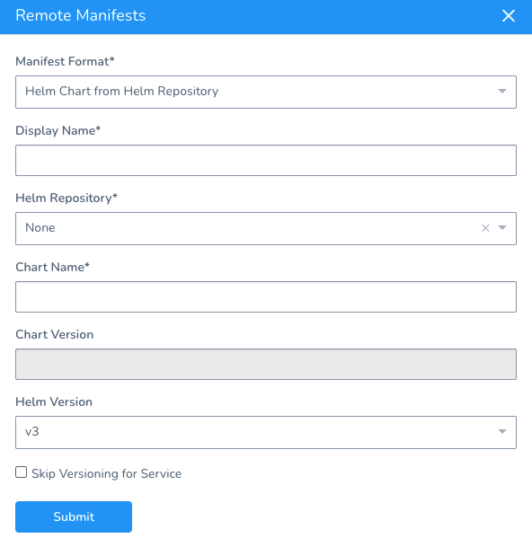
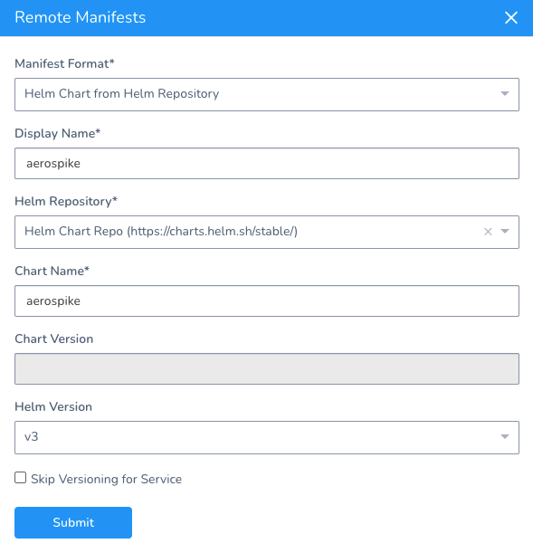
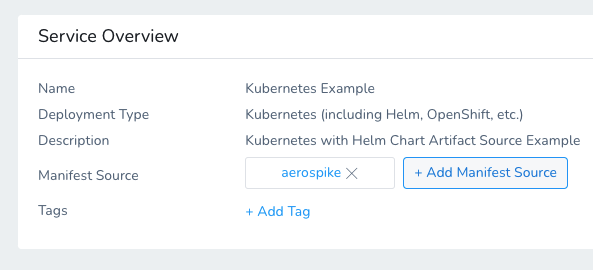
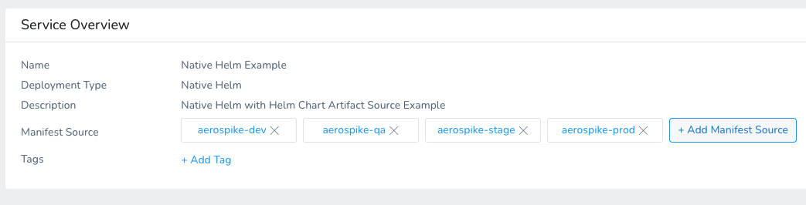
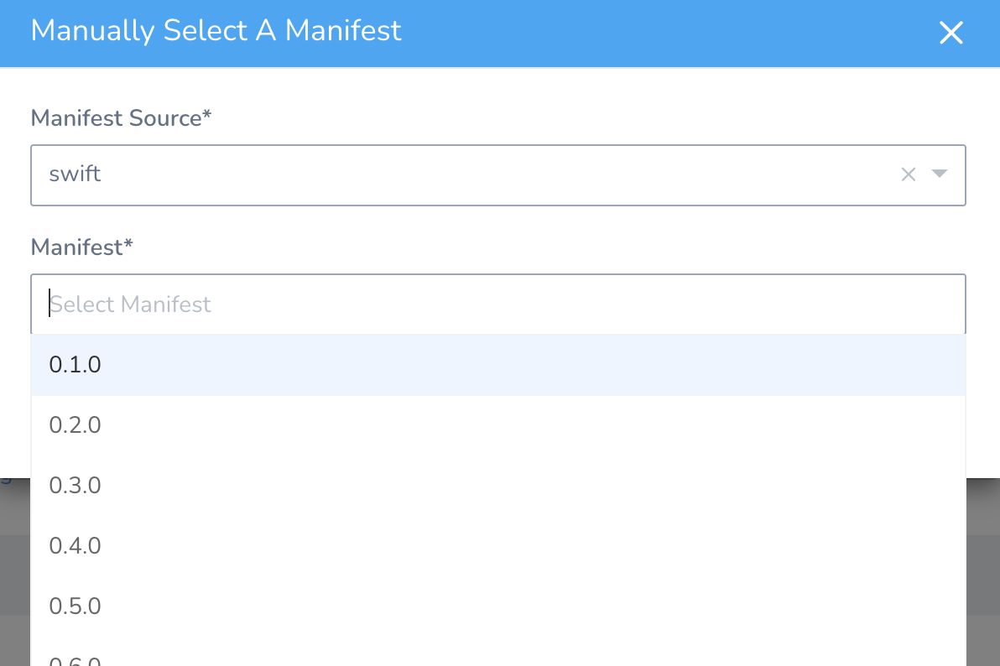
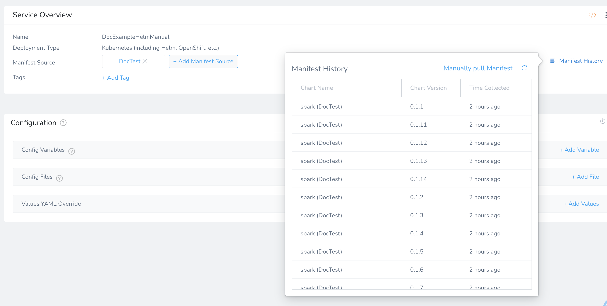
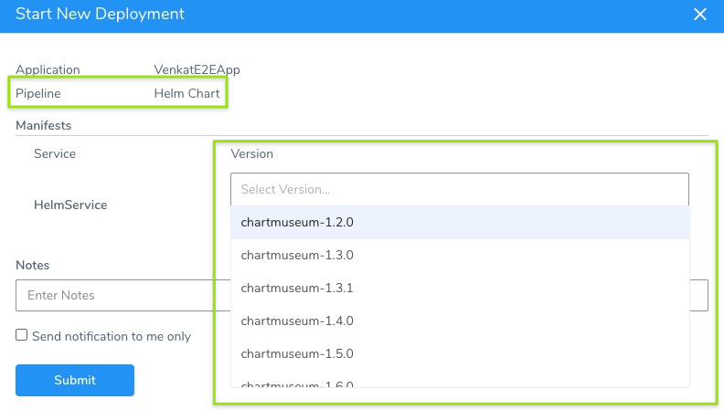

Typically, Harness Kubernetes deployments using Helm charts involve adding your artifact (image) to Harness in addition to your chart. The chart refers to the artifact you added to Harness (via its values.yaml). During deployment, Harness deploys the artifact you added to Harness and uses the chart to manage it.

For the standard Harness Kubernetes and Native Helm deployments using Helm charts, see [Use a Helm Repository with Kubernetes](use-a-helm-repository-with-kubernetes.md) and [Helm Quickstart](https://docs.harness.io/article/2aaevhygep-helm-quickstart).In addition to this method, you can also simply deploy the Helm chart without adding your artifact to Harness. Instead, the *Helm chart is the artifact*. The Helm chart you provide contains the hardcoded link to the artifact.

Harness installs the chart, gets the artifact from the repo, and then installs the artifact. We call this a *Helm chart deployment*.

This topic covers the second method: a Helm chart deployment.

Looking for the API? You can use the Harness GraphQL to run a Helm chart deployment. See [Deploy Helm Charts Using the API](https://docs.harness.io/article/sbvn6uwcq1-deploy-helm-charts-using-api).New to Harness Kubernetes and Native Helm Deployments?Harness includes both [Kubernetes](https://docs.harness.io/article/7in9z2boh6-kubernetes-quickstart) and [Native Helm](../concepts-cd/deployment-types/helm-deployments-overview.md) deployments, and you can use Helm charts in both. Here's the difference:  
• **Harness Kubernetes Deployments** allow you to use your own Kubernetes manifests or a Helm chart (remote or local), and Harness executes the Kubernetes API calls to build everything without Helm and Tiller needing to be installed in the target cluster.  
• Harness Kubernetes deployments also support all deployment strategies (Canary, Blue/Green, Rolling, etc).  
• For **Harness Native Helm Deployments**, you must always have Helm and Tiller running on one pod in your target cluster. Tiller makes the API calls to Kubernetes in these cases.  
• Harness Native Helm deployments only support Basic deployments.

### Before You Begin

* [Kubernetes Quickstart](https://docs.harness.io/article/7in9z2boh6-kubernetes-quickstart)
* [Use a Helm Repository with Kubernetes](use-a-helm-repository-with-kubernetes.md)
* [Native Helm Deployments Overview](../concepts-cd/deployment-types/helm-deployments-overview.md)
* [The Chart Template Developer's Guide](https://helm.sh/docs/chart_template_guide/) from Helm.

### Limitations and Requirements

* Harness does not support AWS cross-account access for [ChartMuseum](https://chartmuseum.com/) and AWS S3. For example, if the Harness Delegate used to deploy charts is in AWS account A, and the S3 bucket is in AWS account B, the Harness Cloud Provider that uses this Delegate in A cannot assume the role for the B account.
* The Helm Chart must have the [appVersion](https://helm.sh/docs/topics/charts/#the-appversion-field) defined in its chart.yaml (for example, `appVersion: 1.16.0`).

### Permissions Required

The Harness User Group must have the following [Application Permissions](https://docs.harness.io/article/ven0bvulsj-users-and-permissions) for the Service (or All Services):

* Create
* Read
* Update
* Delete

### Supported Platforms and Technologies

See [Supported Platforms and Technologies](https://docs.harness.io/article/220d0ojx5y-supported-platforms).

#### ChartMuseum Binaries

Many Helm Chart users use ChartMuseum as their Helm Chart Repository server.

* **ChartMuseum binary v0.8.2:** the default ChartMuseum binary used by Harness is v0.8.2.
* **ChartMuseum binary v0.12.0:** to use ChartMuseum binary v0.12.0 you must enable the feature flag `USE_LATEST_CHARTMUSEUM_VERSION`. Contact [Harness Support](mailto:support@harness.io) to enable the feature.

### Review: Chart Collection

Charts are added as a Manifest Source in a Harness Service using a Helm repository.

Once you add a chart, if you then go and make changes to the source other than a change in credentials, Harness will delete any charts it has already collected and initiate a new collection.

#### Random Chart Collection for Incorrect or Non-existing Chart Version

When Harness fetches the chart, it runs the `helm pull` command and fetches and unpacks the chart in the chart directory you specify.

Harness then compares the chart version from the Chart.yaml file (present in specified chart directory) with the version you specify in **Remote Manifests** > **Manifest Format** > **Helm Chart from Helm Repository** > **Version**.



If an incorrect or non-existing chart version is provided, Helm (and, consequently, Harness) fetches a random chart.

For example, suppose we have a repo with the following chart versions:                                


|  |  |
| --- | --- |
| NAME | CHART VERSION |
| `latest/nginx-with-version-page` | `0.1.0+master-34263821-ed3f337` |
| `latest/nginx-with-version-page` | `0.1.0+master-24263821-ed3f337` |
| `latest/nginx-with-version-page` | `0.1.0+main-24263821-ed3f337` |

Currently, if you enter an incorrect version like `0.1.0+master-34263821-wrong` Helm will fetch one of the two existing versions and deploy it.

#### Strict Chart Matching during Collection

When Harness fetches the chart, it runs the `helm pull` command and fetches and unpacks the chart in the chart directory you specify.

Harness then compares the chart version from the Chart.yaml file (present in specified chart directory) with the version you specify in **Remote Manifests** > **Manifest Format** > **Helm Chart from Helm Repository** > **Version**.


If the version you entered does not match the chart Harness pulls, Harness will fail deployment.

If no version is entered, Harness does not check for a match.

### Step 1: Add a Helm Repository Artifact Server

You connect Harness to a Helm Chart Repository as a Harness Artifact Server and then use it in Kubernetes and Native Helm Services **Manifest Source** settings.

To add the Helm Repository Artifact Server for your chart repo, follow the steps in [Add Helm Repository Artifact Servers](https://docs.harness.io/article/0hrzb1zkog-add-helm-repository-servers).

### Step 2: Create Service and Select Artifact from Manifest

Deploying Helm charts is supported in both Harness Kubernetes or Native Helm deployments.

In your Harness Application, click **Services**, and then click **Add Service**.

Enter a name for the Service.

In **Deployment Type**, select either **Kubernetes** or **Native Helm**. If you select Native Helm, you can enable Helm v3.

Enable the **Artifact from Manifest** setting. This setting tells Harness that you will use the **Manifest Source** in the Service to link to your remove chart.



Click **Submit**. The new Service is created.

Normally, there would be a **Manifests** section in your Kubernetes Service or a **Chart Specification** section in your Native Helm Service; however, since you are using the **Manifest Source** for the chart, those sections are omitted.



### Step 3: Add the Helm Chart

The Helm chart is added the same way in both the Harness Kubernetes or Native Helm Services.

The artifact is specified in your Helm values.yaml using `image` parameters just as you normally configure your Helm charts.

In your Harness Service, click **Add Manifest Source**.

The steps are the same for Kubernetes and Native Helm. The only difference is that you select Helm Version in the Kubernetes **Manifest Source**. For the Native Helm Service, the Helm Version was already selected when you created the Service.

Here's the Remote Manifests settings from the Kubernetes Service **Manifest Source**:



Do the following:

In **Manifest Format**, select **Helm Chart from Helm Repository**.

Chart polling is only available for Helm charts in a Helm repository, and not for Helm charts is a source (Git) repository.In **Helm Repository**, select the Helm Repository Artifact Server you set up.

In **Chart Name**, enter the name of the Helm chart to deploy.

Leave **Chart Version** empty. Harness will poll all versions of the chart so you can select which version you want to deploy.

Enable the **Skip Versioning for Service** option to skip versioning of ConfigMaps and Secrets deployed into Kubernetes clusters.

When you are done, it will look something like this:



Click **Submit**.

The remote Helm chart repository and chart is listed as a **Manifest Source**.



### Option: Multiple Manifest Sources

You can add multiple charts by adding multiple Manifest Sources.



When you deploy the Service, you can specify which chart to use.

### Option: Pull a Specific Chart Version

When you add a Helm chart as a Manifest Source to the Service, Harness will pull all the chart and version history metadata. You can see the results of the pull in Manifest History and manually select a specific chart version for the deployment using **Manually pull Manifest**.

To view the manifest history,  do the following:

1. Click **Manifest History**. This assistant lists the chart names and versions Harness has pulled.
2. In the **Manifest History** assistant, click **Manually pull Manifest**. The **Manually Select A Manifest** dialog appears.
   
3. In **Manifest Source**, click the Manifest Source you added to the Service.
4. In **Manifest**, select a manifest version, and then click **SUBMIT**.
5. Click **Manifest History** to view the history.

Now all available manifest charts and version history metadata are displayed.



### Option: Values YAML Override

In the **Values YAML Override** section, you can enter the YAML for your values.yaml file. The values.yaml file contains the default values for a chart. You will typically have this file in the repo for your chart, but you can add it in the Harness service instead.

The values.yaml added in the Harness Service will override any matching `key:value` pairs values.yaml in your remote repo.

If you add a values.yaml in **Values YAML Override** and you have a values.yaml in your chart already, then Harness will merge them at runtime. The values.yaml in **Values YAML Override** overrides at a `key:value` level, not a file level. If you have a values.yaml in your chart with `key:value` pairs you do not want, you must remove them from that file or override them in the values.yaml in **Values YAML Override**. See .See [Override Values YAML Files](override-values-yaml-files.md) and [Helm Services](../helm-deployment/2-helm-services.md).

The **Values YAML Override** settings can be overwritten by Harness Environments **Service Configuration Overrides**. See below.

### Step 4: Define the Infrastructure Definition

There is nothing unique about defining the target cluster Infrastructure Definition for a Helm chart deployment. It is the same process as a typical Harness Kubernetes or Native Helm deployment.

Follow the steps in [Define Your Kubernetes Target Infrastructure](define-your-kubernetes-target-infrastructure.md) or [Helm Environments](../helm-deployment/3-helm-environments.md).

### Option: Override Values YAML in Environment

Harness Service **Values YAML Override** settings can be overwritten by Harness Environments **Service Configuration Overrides**.

This enables you to have a Service keep its settings but change them when the Service is deployed to different Environments.

For example, you might have a single Service but an Environment for QA and an Environment for Production, and you want to overwrite the `namespace` setting in the Service's **Values YAML Override** values.yaml depending on the Environment.

You can also overwrite Service variables at the Phase-level of a multiple Phase Workflow.If you add a values.yaml in **Service Configuration Overrides** and you have a values.yaml in your chart already, then Harness will merge them at runtime. The values.yaml in **Service Configuration Overrides** overrides at a `key:value` level, not a file level. If you have a values.yaml in your chart with `key:value` pairs you do not want, you must remove them from that file or override them in the values.yaml in **Service Configuration Overrides**. See [Variable Override Priority](https://docs.harness.io/article/benvea28uq-variable-override-priority).For details, see [Override Harness Kubernetes Service Settings](override-harness-kubernetes-service-settings.md) or [Helm Environments](../helm-deployment/3-helm-environments.md).

1. In the Harness Environment, in **Service Configuration Overrides**, click **Add Configuration Overrides**.
2. In **Service**, select the Harness Service where you added your remote Helm chart.
3. In **Override Type**, select **Values YAML**. Click **Local** or **Remote**.
	1. **Local** - Enter in the values.yaml variables and values.
	2. **Remote** - See [Override Remote Values YAML Files](override-values-yaml-files.md).
4. When you are done, click **Submit**.

### Step 5: Create the Workflow

Now that your Service and Infrastructure Definition are set up, you can create the Workflow for your Helm chart deployment.

Harness Native Helm deployments only support **Basic** Workflow deployments.You create your Kubernetes or Native Helm Workflows just as you would if the Service you are deploying is using a **Manifest Source**. There is nothing different you need to do when using a Helm chart exclusively.

For steps on creating Kubernetes Workflows, see:

* [Create a Kubernetes Canary Deployment](create-a-kubernetes-canary-deployment.md)
* [Create a Kubernetes Rolling Deployment](create-a-kubernetes-rolling-deployment.md)
* [Create a Kubernetes Blue/Green Deployment](create-a-kubernetes-blue-green-deployment.md)

For steps on creating a Native Helm Basic Workflow, see [Helm Workflows and Deployments](../helm-deployment/4-helm-workflows.md).

### Step 6: Deploy

Each Helm chart deployment is treated as a release. During deployment, when Harness detects that there is a previous release for the chart, it upgrades the chart to the new release.

1. In the Workflow, click **Deploy**. The **Start New Deployment** settings appear. Here you will pick the chart version to deploy.
2. In **Version**, select a version of the chart to deploy.
3. Click **Submit**.

The Helm chart deployment runs.

For a Kubernetes or Native Helm deployment you will see Harness fetch the Helm chart. Here is an example from a Kubernetes deployment:


```
Fetching files from helm chart repo  
Helm repository: Helm Chart Repo  
Chart name: chartmuseum  
Chart version: 2.14.0  
Helm version: V2  
Repo url: http://storage.googleapis.com/kubernetes-charts/  
Successfully fetched following files:  
- helm/repository/repositories.yaml  
- helm/repository/local/index.yaml  
- helm/repository/cache/local-index.yaml  
- helm/repository/cache/b83a7c1d-4cec-3655-9a3c-db9de73510fd-index.yaml  
- chartmuseum/values.yaml  
- chartmuseum/README.md  
- chartmuseum/ci/ingress-values.yaml  
- chartmuseum/Chart.yaml  
- chartmuseum/templates/ingress.yaml  
- chartmuseum/templates/pvc.yaml  
- chartmuseum/templates/service.yaml  
- chartmuseum/templates/NOTES.txt  
- chartmuseum/templates/servicemonitor.yaml  
- chartmuseum/templates/serviceaccount.yaml  
- chartmuseum/templates/pv.yaml  
- chartmuseum/templates/secret.yaml  
- chartmuseum/templates/_helpers.tpl  
- chartmuseum/templates/deployment.yaml  
- chartmuseum/.helmignore  
  
Done.
```
Next, Harness will initialize and prepare the workloads, apply the Kubernetes manifests, and wait for steady state.

In **Wait for Steady State** you will see the Kubernetes workloads deployed and the pods scaled up and running:


```
Deployed Controllers [3]:  
Kind:Deployment, Name:doc-chartmuseum (desired: 1)  
Kind:ReplicaSet, Name:doc-chartmuseum-75bffc6fc7 (desired: 1)  
Kind:ReplicaSet, Name:doc-chartmuseum-766fc995c (desired: 1)  
  
****  Kubernetes Controller Events  ****  
  Controller: doc-chartmuseum  
   - Scaled up replica set doc-chartmuseum-75bffc6fc7 to 1  
  
  
****  Kubernetes Pod Events  ****  
  Pod: doc-chartmuseum-75bffc6fc7-k5tfb  
   - Successfully assigned default/doc-chartmuseum-75bffc6fc7-k5tfb to aks-delegatepool-37455690-vmss000000  
   - Pulling image "chartmuseum/chartmuseum:v0.7.0"  
   - Successfully pulled image "chartmuseum/chartmuseum:v0.7.0"  
   - Created container chartmuseum  
   - Started container chartmuseum  
  
Waiting for desired number of pods [2/1]  
Waiting for desired number of pods [2/1]  
Waiting for desired number of pods [2/1]  
  
****  Kubernetes Controller Events  ****  
  Controller: doc-chartmuseum  
   - Scaled down replica set doc-chartmuseum-766fc995c to 0  
  
Desired number of pods reached [1/1]  
Pods are updated with image [chartmuseum/chartmuseum:v0.7.0] [1/1]  
Pods are running [1/1]  
Pods have reached steady state [1/1]  
Pod [doc-chartmuseum-75bffc6fc7-k5tfb] is running. Host IP: 10.240.0.5. Pod IP: 10.244.2.204  
  
Done
```
You deployment is successful.

#### Versioning and Rollback

Helm chart deployments support versioning and rollback in the same way as Kubernetes and Native Helm deployments.

For Helm chart deployments, the Helm chart version is selected at runtime, and versioning is based on that selection.

### Review: Helm Artifact Variable Expressions

Harness includes several built-in variable expressions that you can use to output Helm chart deployment information:

* `${helmChart.description}` - The `description` in the Helm chart.
* `${helmChart.displayName}` - The display `name` of the chart.
* `${helmChart.metadata.basePath}` - The base path used for Helm charts stored in AWS S3 and Google GCS.
* `${helmChart.metadata.bucketName}` - The S3 or GCS bucket name, if used.
* `${helmChart.metadata.repositoryName}` - The name setting for the repo.
* `${helmChart.metadata.url}` - The URL from where the chart was pulled.
* `${helmChart.name}` - The `name` in the chart.
* `${helmChart.version}` - The version of the chart that was deployed.

You can use these expressions in a [Shell Script](https://docs.harness.io/article/1fjrjbau7x-capture-shell-script-step-output) Workflow step after the deployment step in the Workflow:


```
echo "description: ${helmChart.description}"  
echo "displayName: ${helmChart.displayName}"  
echo "basePath: ${helmChart.metadata.basePath}"  
echo "bucketName: ${helmChart.metadata.bucketName}"  
echo "repositoryName: ${helmChart.metadata.repositoryName}"  
echo "metadataURL: ${helmChart.metadata.url}"  
echo "Chart name: ${helmChart.name}"  
echo "Version: ${helmChart.version}"
```
The output will be something like this:


```
description: Host your own Helm Chart Repository  
displayName: chartmuseum-2.14.0  
basePath: null  
bucketName: null  
repositoryName: Helm Chart Repo  
metadataURL: http://storage.googleapis.com/kubernetes-charts/  
Chart name: chartmuseum  
Version: 2.14.0
```
### Review: Helm Artifacts in Pipelines and Triggers

You can add your Workflow to a stage in a Harness [Pipeline](https://docs.harness.io/article/zc1u96u6uj-pipeline-configuration) or have it executed by a Harness [Trigger](https://docs.harness.io/article/xerirloz9a-add-a-trigger-2).

In both cases, you can select the Helm chart version you want to deploy.

#### Pipeline

Once you add the Workflow to a stage in a Pipeline, you must select the Helm chart version for deployment when you deploy the Pipeline.

The steps are the same as when deploying the Workflow. You select a chart version:



#### Trigger

You can create a Trigger for any Workflow or Pipeline to run when a new version of the chart is published.

1. In your Harness Application, click **Triggers**.
2. Click **Add Trigger**. The **Trigger** settings appear.
3. In **Name**, enter a name for the Trigger. This name will appear in the **Deployments** page to indicate the Trigger that initiated a deployment.
4. Click **Next**.
5. In **Condition**, select **On Manifest Changes**.
6. In **Services**, select the Service using the Helm chart in **Manifest Source**. You can use regex to filter names if needed.
7. Click **Next**.
8. In **Actions**, there are three main settings:
    * **From Triggering Manifest:** Select this option to use the chart identified in Service you selected in **Condition**.
    * **Last Collected:** Select this option to use the last version collected by Harness in the Harness Service. Chart versions are collected automatically by Harness every minute.
    * **Last Successfully Deployed:** The last chart that was deployed by the Workflow/Pipeline you selected. In **Workflow**/**Pipeline**, select the Workflow/Pipeline to run.
9. Click **Submit**. The Trigger is created.

### Configure As Code

To see how to configure the settings in this topic using YAML, configure the settings in the UI first, and then click the **YAML** editor button.

