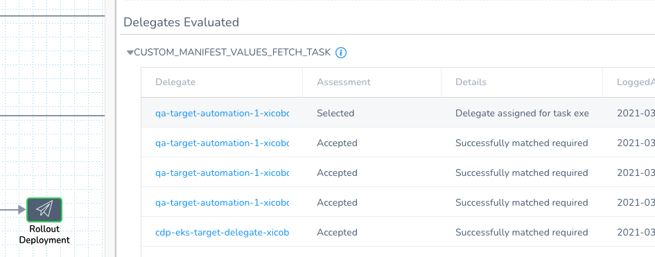
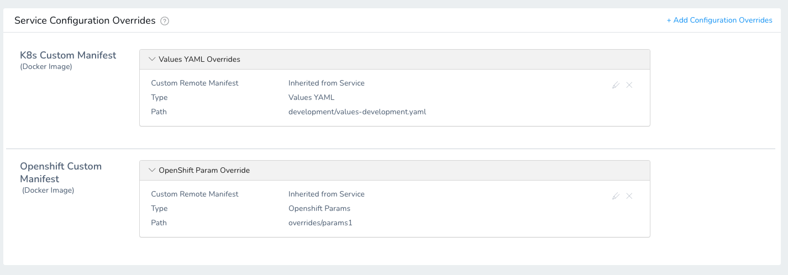
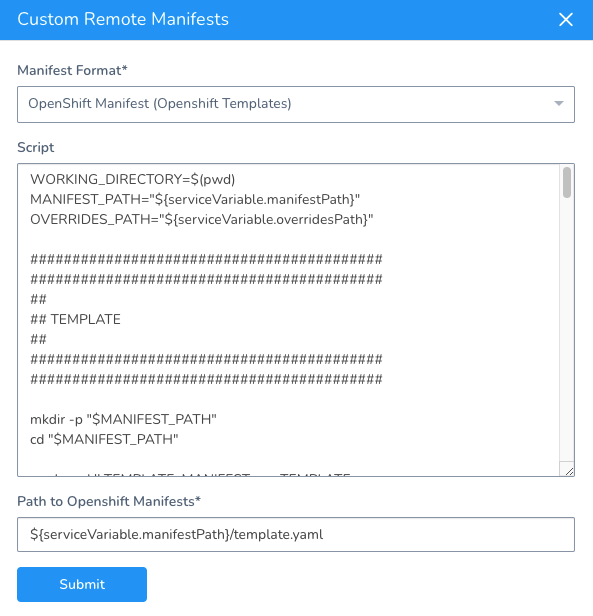

Currently, this feature is behind the Feature Flag `CUSTOM_MANIFEST`. Contact [Harness Support](mailto:support@harness.io) to enable the feature.By default, you add Kubernetes and OpenShift files to a Harness Kubernetes Service inline or from a repo as files.

In some cases, your manifests, templates, etc are in a packaged archive and you simply wish to extract them and use then at runtime.

You can use a packaged archive with the **Custom Remote Manifests** setting in a Harness Kubernetes Service. You add a script to the Service that pulls the package and extracts its contents. Next, you supply the path to the manifest, template, etc.

Looking for other methods? See [Define Kubernetes Manifests](define-kubernetes-manifests.md).

### Before You Begin

* [Kubernetes Quickstart](https://docs.harness.io/article/7in9z2boh6-kubernetes-quickstart)
* [Kubernetes Deployments Overview](../concepts-cd/deployment-types/kubernetes-overview.md)
* [Add Container Images for Kubernetes Deployments](add-container-images-for-kubernetes-deployments.md)

### Supported Platforms and Technologies

See [Supported Platforms and Technologies](https://docs.harness.io/article/220d0ojx5y-supported-platforms).

### Limitations

* Custom Remote Manifests scripts use Bash only.
* The Delegate that runs the script must have all the software needed for the scripts to execute.  
Currently, you cannot select a specific Delegate to execute the Custom Remote Manifests script. Harness selects the Delegate based on [its standard methods](https://docs.harness.io/article/h9tkwmkrm7-delegate-installation#how_does_harness_manager_pick_delegates). You can use [Delegate Profiles](https://docs.harness.io/article/yd4bs0pltf-run-scripts-on-the-delegate-using-profiles) to add software to Delegates from Harness.  
If you select a Delegate in the Kubernetes Cluster Cloud Provider used by the Workflow's Infrastructure Definition, then the script is run on that Delegate.

### Review: What Workloads Can I Deploy?

See [Kubernetes How-tos](kubernetes-deployments-overview.md).

### Option: Add Secrets for Script

Typically, your script to pull the remote package will use a user account. For example:


```
curl -sSf -u "johndoe:mypwd" -O 'https://mycompany.jfrog.io/module/example/manifest.zip'
```
You can use Harness secrets for the username and password in your script. For example:


```
curl -sSf -u "${secrets.getValue("username")}:${secrets.getValue("password")}" -O 'https://mycompany.jfrog.io/module/example/manifest.zip'
```
For more information, see [Use Encrypted Text Secrets](https://docs.harness.io/article/ygyvp998mu-use-encrypted-text-secrets).

### Step 1: Create a Harness Kubernetes Service

Create a Harness Kubernetes Service.

In Harness, click **Setup**, and then click **Add Application**.

Enter a name for the Application and click **Submit**.

Click **Services**, and then click **Add Service**. The **Add Service** settings appear.

In **Name**, enter a name for the Service.

In **Deployment Type**, select **Kubernetes**, and then ensure **Enable Kubernetes V2** is selected.

Click **Submit**. The new Harness Kubernetes Service is created.

### Step 2: Use Custom Remote Manifests

In your Harness Kubernetes Service, in **Manifests**, click more options (︙) and select **Custom Remote Manifests**.

In **Manifest Format**, select **Kubernetes YAML** or **OpenShift Manifest**.

Now you can add your script to pull the package containing your manifest.

### Step 3: Add Script for Remote Package

In **Script**, enter the script that pulls the package containing your manifest and extracts the manifest from the package. For example:


```
curl -sSf -u "${secrets.getValue("username")}:${secrets.getValue("password")}" -O 'https://mycompany.jfrog.io/module/example/manifest.zip'  
  
unzip manifest.zip
```
You can use Harness Service, Workflow, secrets, and built-in variables in the script.

The script is run on the Harness Delegate selected for deployment. If you selected a Delegate in the Kubernetes Cluster Cloud Provider used by the Workflow's Infrastructure Definition, then the script is run on that Delegate.

Harness creates a temporary working directory on the Delegate host for the downloaded package. You can reference the working directory in your script with `WORKING_DIRECTORY=$(pwd)` or `cd $(pwd)/some/other/directory`.

Once you have deployed the Workflow, you can check which Delegate was selected in the **Delegates Evaluated** setting for the Workflow step that used the manifest.

Look for the **CUSTOM\_MANIFEST\_VALUES\_FETCH\_TASK** task:



You can also map specific Delegates to specific Harness tasks. See [Delegate Task Category Mapping](https://docs.harness.io/article/nzuhppobyg-map-tasks-to-delegates-and-profiles).

### Step 4: Add Path to Manifests

Once you have a script that extracts your package, you provide Harness with the path to the manifest in the expanded folders and files.

You can use Harness Service, Workflow, and built-in variables in the path.

#### Kubernetes YAML

You can enter the path to a manifests folder.

For example, if your expanded package has this folder structure:


```
manifest:  
 - values.yaml  
 - templates  
    - deployment.yaml  
    - service.yaml
```
In this example, you can enter **manifest** and Harness automatically detects the **values.yaml** and the other file (for example, **deployment.yaml** and **service.yaml**). If no values.yaml file is present, Harness will simply use the other files.

That's all the setup required. You can now deploy the Service and the script is executed at runtime.

The remainder of this topic covers options for overriding the manifest.

#### OpenShift Manifest

Provide the path to the OpenShift template, Kubernetes manifest, or Helm file. For example, **manifest/template.yaml**.

Do not enter a folder. Harness requires a direct path to the file.That's all the setup required. You can now deploy the Service and the script is executed at runtime.

The remainder of this topic covers options for overriding the template.

### Option: Delegate Selector

In **Delegate Selector**, select the Selector for the Delegate(s) you want to use. You add Selectors to Delegates to make sure that they're used to execute the command. For more information, see [Select Delegates with Selectors](https://docs.harness.io/article/c3fvixpgsl-select-delegates-for-specific-tasks-with-selectors).

Harness will use Delegates matching the Selectors you add.

If you use one Selector, Harness will use any Delegate that has that Selector.

If you select two Selectors, a Delegate must have both Selectors to be selected. That Delegate might also have other Selectors, but it must have the two you selected.

You can use expressions for Harness built-in variables or Account Default variables in **Delegate Selectors**. When the variable expression is resolved at deployment runtime, it must match an existing Delegate Selector.  
  
For example, if you have a Delegate Selector **prod** and the Workflow is using an Environment also named **prod**, the Delegate Selector can be `${env.name}`. This is very useful when you match Delegate Selectors to Application component names such as Environments, Services, etc. It's also a way to template the Delegate Selector setting.

### Option: Override Manifest in Service

You can override settings in the manifest you unpacked in Custom Remote Manifest using the Service's **Configuration** section.

In the Harness Service, in **Configuration**, click **Add Values** (Kubernetes) or **Add Param** (OpenShift).

Choose from the following options.

#### Inherit Script from Service

Select this option if you want to use an alternative values.yaml file (Kubernetes) or parameters file (OpenShift) from the package you pulled in **Custom Remote Manifest**.

You can use Harness Service, Workflow, and built-in variables in the path. For example, `${serviceVariable.overridesPath}/values-production.yaml`.

You can enter multiple values separated by commas.

##### Kubernetes

Enter the path to an alternative values file in the extracted package.

For example, let's say you entered the folder **manifest** in the **Custom Remote Manifest** path, but you have another values file in a **production** folder in the extracted package.

You can enter the path to the other values file and Harness will use it instead of the values.yaml file in the **manifest** folder. For example, `production/values-production.yaml`.

The path must be from the root of the extracted package.

##### OpenShift

Enter the path to an alternative parameters file in the extracted package.

For OpenShift, this is the equivalent of the passing a parameters file in the `oc process` command (`--param-file=parameters/file.env`).

#### Define new Script

Enter a script to override the script entered in **Custom Remote Manifest**. The new script can download and extract a different package.

Provide the path to the new manifest folder (Kubernetes) or template file (OpenShift).

You can use Harness Service, Workflow, and built-in variables in the script and path. You can enter multiple values separated by commas.

### Option: Override Manifests in Environment

You can override Harness Service settings at the Harness Environment level using Service Configuration Overrides. See [Override Harness Kubernetes Service Settings](override-harness-kubernetes-service-settings.md) and [Override a Service Configuration in an Environment](https://docs.harness.io/article/4m2kst307m-override-service-files-and-variables-in-environments).

The **Custom Manifest Override Configuration** follows the same guidelines as overriding settings using the Service's **Configuration** sections: **Add Values** (Kubernetes) or **Add Param** (OpenShift).

Here's an example overriding Service file locations with new file locations:



You can use Harness Service, Workflow, and built-in variables in the script and path. You can enter multiple values separated by commas.

### Option: Use a Harness Artifact Source

Although the **Custom Remote Manifests** option is designed for when the manifest and deployment artifact are in the same package, you can use them separately with **Custom Remote Manifests**.

Deploying a manifest separately from the deployment artifact is the Harness default setup. Artifacts are added to a Harness Kubernetes Service from a repository and manifests are inline or added from a separate repo. See [Add Container Images for Kubernetes Deployments](add-container-images-for-kubernetes-deployments.md) and [Define Kubernetes Manifests](define-kubernetes-manifests.md).Simply add the artifact in **Artifact Source** as described in [Add Container Images for Kubernetes Deployments](add-container-images-for-kubernetes-deployments.md).

In the values.yaml and manifests that you add using **Custom Remote Manifests**, you must reference the Harness Artifact Source using the Harness built-in variables:

* `image: ${artifact.metadata.image}`
* `dockercfg: ${artifact.source.dockerconfig}`

For example, in the values.yaml you would add these variables:


```
name: harness-example  
replicas: 1  
  
image: ${artifact.metadata.image}  
dockercfg: ${artifact.source.dockerconfig}  
  
createNamespace: true  
...
```
And then in the manifest for a deployment, you would reference these variables:


```
...  
spec:  
      {{- if .Values.dockercfg}}  
      imagePullSecrets:  
      - name: {{.Values.name}}-dockercfg  
      {{- end}}  
      containers:  
      - name: {{.Values.name}}  
        image: {{.Values.image}}  
...
```
### Option: Use Local Script

You can also use a local script to create your manifest in **Custom Remote Manifests**.

You can use Harness Service, Workflow, secrets, and built-in variables in the script.

Here is an example using Service variables in the script and **Path to OpenShift Manifests** setting:



Here is the script used:

Example Script
```
WORKING_DIRECTORY=$(pwd)  
MANIFEST_PATH="${serviceVariable.manifestPath}"  
OVERRIDES_PATH="${serviceVariable.overridesPath}"  
  
##########################################  
##########################################  
##  
## TEMPLATE  
##  
##########################################  
##########################################  
  
mkdir -p "$MANIFEST_PATH"  
cd "$MANIFEST_PATH"  
  
read -r -d '' TEMPLATE_MANIFEST <<- TEMPLATE  
apiVersion: v1  
kind: Template  
metadata:  
  name: ${workflow.variables.workloadName}-template  
  annotations:  
    description: "Description"  
objects:  
- apiVersion: v1  
  kind: ConfigMap  
  metadata:  
    name: \${WORKLOAD_NAME}  
  data:  
    value: \${CONFIGURATION}  
- apiVersion: v1  
  kind: Secret  
  metadata:  
    name: \${WORKLOAD_NAME}  
  stringData:  
    value: \${SECRET}  
- apiVersion: apps/v1  
  kind: Deployment  
  metadata:  
    name: \${WORKLOAD_NAME}-deployment  
    labels:  
      secret: ${secrets.getValue("custom-manifest-validation-test-secret")}  
  spec:  
    replicas: 1  
    selector:  
      matchLabels:  
        app: \${WORKLOAD_NAME}  
        param: ${workflow.variables.valueOverride}  
        param1: ${workflow.variables.value1Override}  
        param2: ${workflow.variables.value2Override}  
        param3: ${workflow.variables.value3Override}  
        param4: ${workflow.variables.value4Override}  
  
    template:  
      metadata:  
        labels:  
          app: \${WORKLOAD_NAME}  
          param: \${PARAM}  
          param1: \${PARAM1}  
          param2: \${PARAM2}  
          param3: \${PARAM3}  
          param4: \${PARAM4}  
      spec:  
        containers:  
        - name: \${WORKLOAD_NAME}  
          image:  harness/todolist-sample:11  
          envFrom:  
          - configMapRef:  
              name: \${WORKLOAD_NAME}  
          - secretRef:  
              name: \${WORKLOAD_NAME}  
parameters:  
- name: WORKLOAD_NAME  
  description: Workload name  
  value: ${workflow.variables.workloadName}  
- name: CONFIGURATION  
  description: Configuration value  
  value: Some configuration value  
- name: SECRET  
  description: Secret value  
  value: Some secret value  
- name: PARAM  
  description: Param value  
  value: default-override  
- name: PARAM1  
  description: Param value  
  value: default-override  
- name: PARAM2  
  description: Param value  
  value: default-override  
- name: PARAM3  
  description: Param value  
  value: default-override  
- name: PARAM4  
  description: Param value  
  value: default-override  
TEMPLATE  
  
echo "$TEMPLATE_MANIFEST" > template.yaml  
  
##########################################  
##########################################  
##  
## ADDITIONAL OVERRIDES  
##  
##########################################  
##########################################  
  
cd "$WORKING_DIRECTORY"  
mkdir -p "$OVERRIDES_PATH"  
cd "$OVERRIDES_PATH"  
  
read -r -d '' PARAMS_OVERRIDE1 <<- OVERRIDE1  
PARAM1: ${configFile.getAsString("values1-override.txt")}  
PARAM2: ${configFile.getAsString("values1-override.txt")}  
OVERRIDE1  
  
read -r -d '' PARAMS_OVERRIDE2 <<- OVERRIDE2  
PARAM2: ${configFile.getAsString("value2Override")}  
PARAM3: values2-override  
OVERRIDE2  
  
echo "$PARAMS_OVERRIDE1" > params1  
echo "$PARAMS_OVERRIDE2" > params2  
  

```
### Notes

* You can use Go templating in your Kubernetes resource files, just as you would for files stored in Git or inline. See [Use Go Templating in Kubernetes Manifests](use-go-templating-in-kubernetes-manifests.md). For OpenShift, you must use OpenShift templating.
* If the artifact you are deploying with your manifest is public (DockerHub) and does not require credentials, you can use the standard public image reference, such as `image: harness/todolist-sample:11`.

### Configure As Code

To see how to configure the settings in this topic using YAML, configure the settings in the UI first, and then click the **YAML** editor button.

