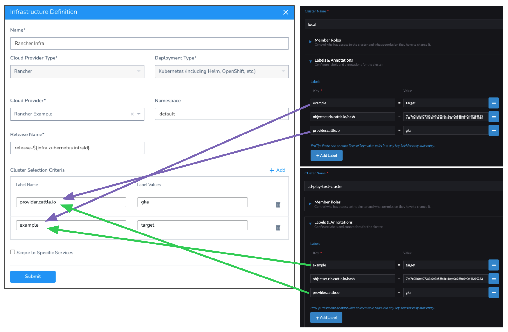
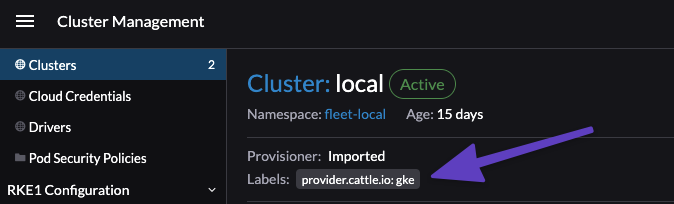
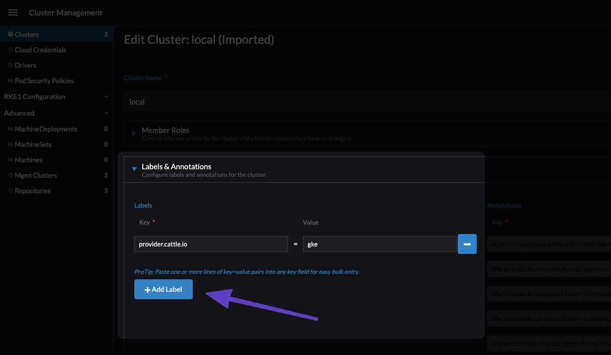
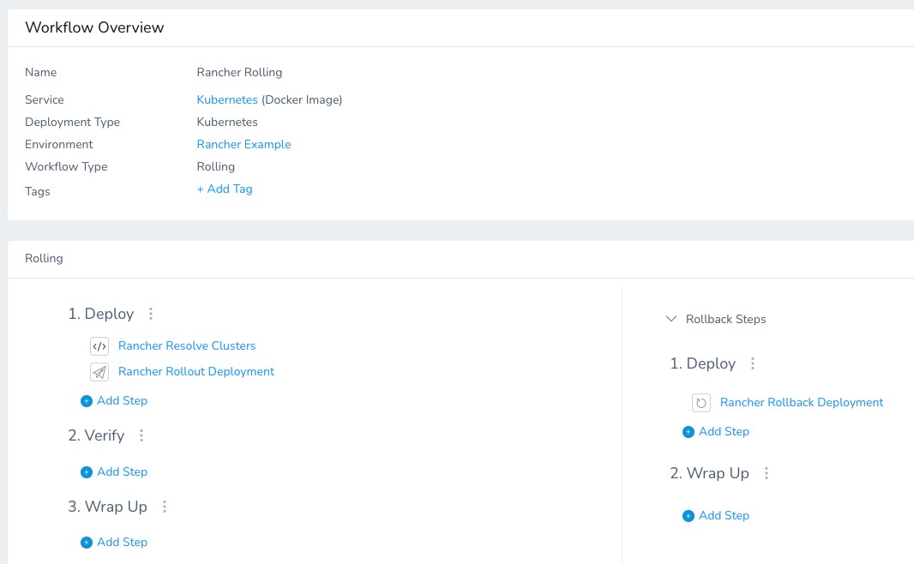
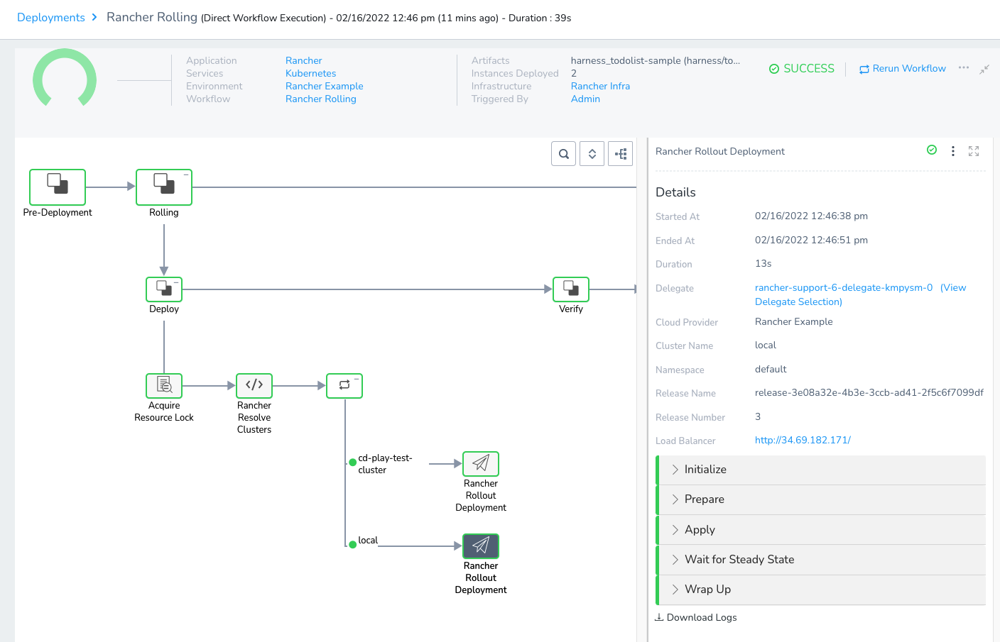

Currently, this feature is behind the feature flag `RANCHER_SUPPORT`. Contact [Harness Support](mailto:support@harness.io) to enable the feature.You can deploy Kubernetes Services to multiple clusters simultaneously using Rancher and Harness. You use Rancher cluster labels to identify multiple clusters in a Harness Infrastructure Definition and then Harness deploys to each cluster simultaneously.

**What's Rancher?** Rancher is a centralized control plane for all the Kubernetes clusters running across your company. Rancher centralizes operations like cluster provisioning, upgrades, user management, and policy management. See [Rancher product docs](https://rancher.com/docs/rancher/v2.6/en/).This topic describes how to set up a multiple cluster Infrastructure Definition in Harness for Rancher clusters and then deploy to those clusters using Harness Workflows.


You can also deploy to multiple infrastructures without using Rancher. See [Deploy a Workflow to Multiple Infrastructures Simultaneously](../concepts-cd/deployments-overview/deploy-to-multiple-infrastructures.md).

### Before You Begin

* This topic assumes you are familiar with Rancher and have set up Kubernetes clusters in its UI. If you are new to Rancher, see [Setting up Kubernetes Clusters in Rancher](https://rancher.com/docs/rancher/v2.5/en/cluster-provisioning/) from Rancher.
* This topic assumes you are familiar with Harness Kubernetes deployments. See [Kubernetes Quickstart](https://docs.harness.io/article/7in9z2boh6-kubernetes-quickstart).

### Visual Summary

The following brief video demonstrates how to deploy Services to multiple Kubernetes clusters simultaneously using Rancher:

<!-- Video:
https://harness-1.wistia.com/medias/rpv5vwzpxz-->
<docvideo src="https://www.youtube.com/embed/dWgeMnVCmK4?feature=oembed" />

### Limitations

* Harness supports Rancher version 2.6.3 or later.
* Harness uses v3 APIs to interact with Rancher (`/v3/clusters/{clusterName}?action=generateKubeconfig` and `/v3/clusters`).
* Harness supports the **Kubernetes** Deployment Type for Rancher deployments at this time. Helm will be supported soon.
* Harness supports Rolling, Canary, and Blue Green deployments for multiple clusters using Rancher.
* Harness does not support cluster-level overrides in this scenario. The same manifests and Services are deployed to all eligible clusters.

### Review: Harness Delegates and Rancher Clusters

Before setting up a Rancher Cloud Provider, you need to install a Harness Delegate in your environment.

The Harness Delegate does not need to be a Kubernetes Delegate and it does not need to be installed in a target cluster.

The Harness Delegate does need to be able to connect to the Rancher URL endpoint and to connect to the target Kubernetes clusters.

See [Harness Delegate Overview](https://docs.harness.io/article/h9tkwmkrm7-delegate-installation).

### Review: Cluster Labels and Harness Infrastructure Definitions

Harness targets Rancher clusters using cluster labels. When you set up a Rancher Infrastructure Definition in Harness, you will select the target clusters by adding the labels as name:value pairs in **Cluster Selection Criteria**.

Here's an example where the labels from two clusters are added to **Cluster Selection Criteria**.



Harness uses labels in the following way:

* Harness will only target clusters that match the name:value pair you add in the Infrastructure Definition.
* If you add multiple name:value pairs, Harness treats those as AND conditions. Clusters must have all of the name:value pairs as labels to be selected.
* In **Label Values**, you can enter a comma-separated list of values. This list makes that value an OR condition. Labels in **Label Name** can have any of the values in the comma-separated list to match. For example: if the value in **Label Name** is `a, b` the value in a cluster label can be either `a` or `b` and it will be a match.

### Step 1: Add Labels to Rancher Clusters

You can use existing cluster labels or add new ones for Harness deployments.



In Rancher, add labels to the clusters to identify them for the Harness deployment.

To add labels to an existing cluster in Rancher, select the cluster, click more options (**︙**), and then click **Edit Config**.


Click **Add Label** to add new labels.



Now that the cluster has labels, you can identify it in Harness as a target cluster.

### Step 2: Add a Harness Rancher Cloud Provider

To connect Harness to your Rancher account, you must set up a Harness Rancher Cloud Provider.

See [Add Rancher Cloud Providers](https://docs.harness.io/article/dipgqjn5pq-add-rancher-cloud-providers).

### Step 3: Add a Rancher Infrastructure Definition

The Rancher Infrastructure Definition targets the Kubernetes clusters for your deployments. You select clusters in the Infrastructure Definition using cluster labels you added in Rancher.

See [Review: Cluster Labels and Harness Infrastructure Definitions](https://harness.helpdocs.io/article/hsc50ny57g#review_cluster_labels_and_harness_infrastructure_definitions) above.

In your Harness Application, click **Environments**.

Click Add **Infrastructure Definition**.

Enter the following settings:

* In **Cloud Provider Type**, select **Rancher**.
* In **Deployment Type**, select **Kubernetes**.
* In **Cloud Provider**, select the Rancher Cloud Provider you added using the steps in [Add Rancher Cloud Providers](https://docs.harness.io/article/dipgqjn5pq-add-rancher-cloud-providers).
* In **Namespace**, enter the target namespace for the deployments.
	+ You can only enter one namespace. When you deploy to multiple clusters, the target namespaces must be the same.
	+ You can also use a Harness variable expression to reference Kubernetes namespaces in Harness Infrastructure Definitions. When a Workflow is run, the namespace in the Infrastructure Definition is applied to all manifests in the Service. See [Select Kubernetes Namespaces based on InfraMapping](create-kubernetes-namespaces-based-on-infra-mapping.md).
* In **Release Name**, use the default `release-${infra.kubernetes.infraId}` or enter in a Kubernetes-compliant release name.

In **Cluster Selection Criteria**, you will add the Rancher cluster labels to select the target clusters for this Infrastructure Definition.

Click **Add**, and then enter the label name and value(s).

See [Review: Cluster Labels and Harness Infrastructure Definitions](https://harness.helpdocs.io/article/hsc50ny57g#review_cluster_labels_and_harness_infrastructure_definitions) above.


Click **Submit**. The Infrastructure Definition is added to the Environment. You can now select it in your Harness Workflows.

### Option: Harness Variables in Infrastructure Definition

You can use Harness built-in and Workflow variables in **Cluster Selection Criteria**. This allows you to provide the labels and values at runtime.

See:

* [Built-in Variables List](https://docs.harness.io/article/aza65y4af6-built-in-variables-list)
* [Set Workflow Variables](https://docs.harness.io/article/766iheu1bk-add-workflow-variables-new-template)
* [Pass Variables between Workflows](https://docs.harness.io/article/gkmgrz9shh-how-to-pass-variables-between-workflows)
* [Passing Variables into Workflows and Pipelines from Triggers](https://docs.harness.io/article/revc37vl0f-passing-variable-into-workflows)

### Step 4: Create a Workflow

Harness supports Rolling, Canary, and Blue Green deployments for multiple clusters using Rancher.

Each deployment type uses different steps for deploying to the clusters selected in the Infrastructure Definition.

#### Rolling

Rolling deployment follows the standard Harness Kubernetes Rolling deployment process as described in [Create a Kubernetes Rolling Deployment](create-a-kubernetes-rolling-deployment.md). The only difference is that the process is performed on multiple clusters simultaneously.

When you create a Rolling Workflow using your Rancher Infrastructure Definition, Harness populates the Workflow with the following default steps:

* **Rancher Resolve Clusters:** gets the total list of clusters using the Infrastructure Definition and then uses the **Cluster Selection Criteria** from the Infrastructure Definition to filter the list.
* Here's an example of the log from a deployment:
```
INFO   2022-02-16 12:46:39    Fetching list of clusters and labels from Rancher: https://rancher-internal.dev.harness.io  
INFO   2022-02-16 12:46:39    Fetched clusters list: [cd-play-test-cluster, local]  
INFO   2022-02-16 12:46:39    Eligible clusters list after applying label filters: [cd-play-test-cluster, local]
```
* **Rancher Rollout Deployment:** performs a new Kubernetes rollout deployment for each cluster matching the criteria in **Cluster Selection Criteria**.
* **Rancher Rollback Deployment:** in the case of failures, rolls back each cluster to its previous app version.



Here's what a successful deployment looks like. You can see that two matching clusters were targeted.



#### Canary

Canary deployment follows the standard Harness Kubernetes Canary deployment process as described in [Create a Kubernetes Canary Deployment](create-a-kubernetes-canary-deployment.md). The only difference is that the process is performed on multiple clusters simultaneously.

When you create a Canary Workflow using your Rancher Infrastructure Definition, Harness populates the Workflow with the following default steps:

* Canary Phase:
	+ **Rancher Resolve Clusters:** gets the total list of clusters using the Infrastructure Definition and then uses the **Cluster Selection Criteria** from the Infrastructure Definition to filter the list.
	+ **Rancher Canary Deployment:** performs a Canary deployment to the number of pods you want as either a count or percentage.
	+ **Rancher Delete:** deletes the pods used by Rancher Canary Deployment.
* Primary Phase:
	+ **Rancher Resolve Clusters:** since cluster resolution was performed in the Canary Phase, it is skipped here. In the deployment, you will see a message like `Cluster Resolution is already done. Filtered clusters list: [cd-play-test-cluster, local]. Skipping`.
	+ **Rancher Rollout Deployment:** performs a new Kubernetes rollout deployment for each cluster matching the criteria in **Cluster Selection Criteria**.
	+ **Rancher Rollback Deployment:** in the case of failures, rolls back each cluster to its previous version.

#### Blue Green

Blue Green deployment follows the standard Harness Kubernetes Blue Green deployment process as described in [Create a Kubernetes Blue/Green Deployment](create-a-kubernetes-blue-green-deployment.md). The only difference is that the process is performed on multiple clusters simultaneously.

When you create a Canary Workflow using your Rancher Infrastructure Definition, Harness populates the Workflow with the following default steps:

* **Rancher Resolve Clusters:** gets the total list of clusters using the Infrastructure Definition and then uses the **Cluster Selection Criteria** from the Infrastructure Definition to filter the list.
* **Rancher Stage Deployment:** standard Harness Blue Green step for Kubernetes where Harness creates two Kubernetes services (primary and stage), one pod set for the new app version, annotates the primary and stage services to identify them, and points the stage service at the new app version pod set. See [Create a Kubernetes Blue/Green Deployment](create-a-kubernetes-blue-green-deployment.md).
* **Rancher Swap Primary with Stage:** Harness swaps the primary service to the pod set for new app version. Production traffic now flows to the new app version. See [Create a Kubernetes Blue/Green Deployment](create-a-kubernetes-blue-green-deployment.md).
* Rollback Steps:
	+ **Rancher Swap Primary with Stage:** the resources are not versioned because a Blue/Green deployment uses **rapid rollback**: network traffic is simply routed back to the original instances. You do not need to redeploy previous versions of the service/artifact and the instances that comprised their environment.

### Review: Rancher Expressions

The `${rancher.clusters}` expression can be used anywhere in your Workflow following the **Rancher Resolve Clusters** step.

The `${rancher.clusters}` expression resolves to a comma-separated list of the clusters used in the deployment.

### See Also

* [Deploy a Workflow to Multiple Infrastructures Simultaneously](../concepts-cd/deployments-overview/deploy-to-multiple-infrastructures.md)
* [Select Kubernetes Namespaces based on InfraMapping](create-kubernetes-namespaces-based-on-infra-mapping.md)

