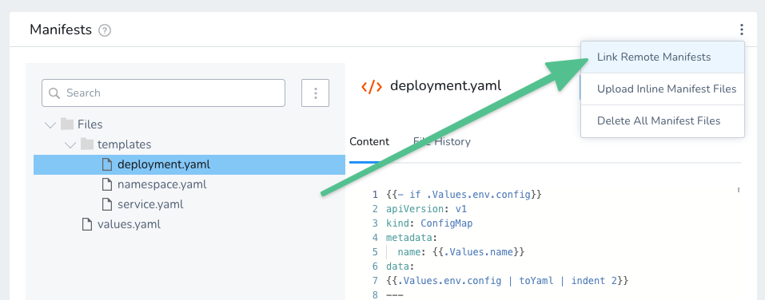
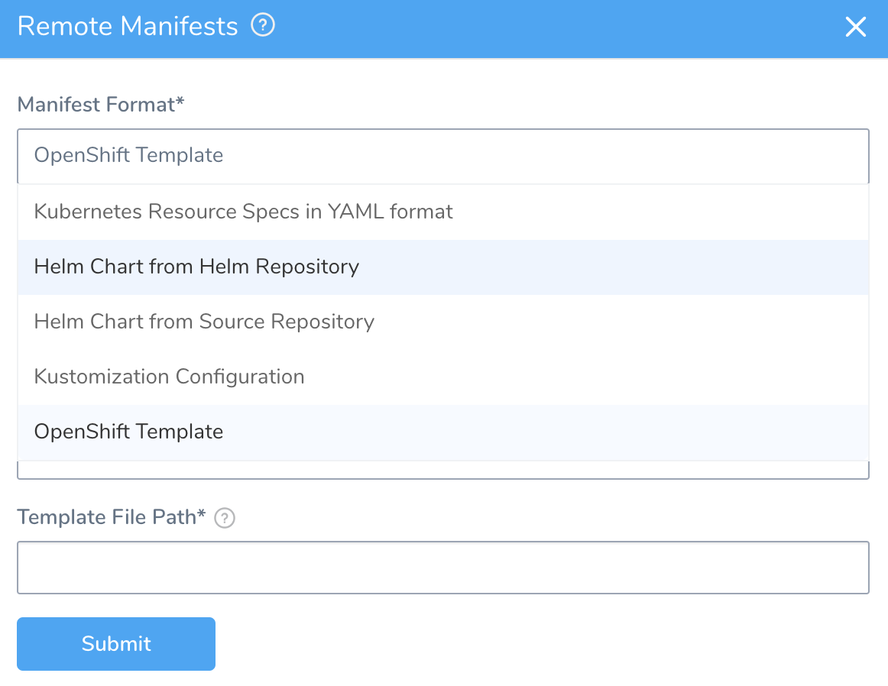
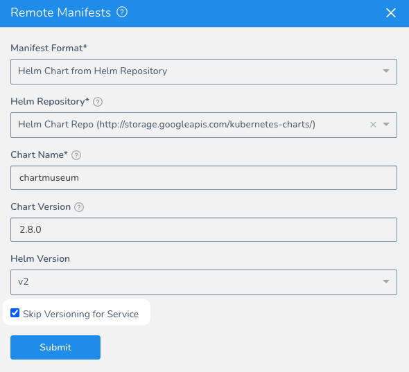

This content is for Harness [FirstGen](../../../getting-started/harness-first-gen-vs-harness-next-gen.md). Switch to [NextGen](https://docs.harness.io/category/qfj6m1k2c4).

You can use your Git repo for the configuration files in **Manifests** and Harness will use them at runtime. You have two options for remote files:

* **Standard Kubernetes Resources in YAML** - These files are simply the YAML manifest files stored on a remote Git repo.
* **Helm Chart from Source Repository** - These are Helm chart files stored in standard Helm syntax in YAML on a remote Git repo.

For steps on other options, see:

* All options — See [Define Kubernetes Manifests](define-kubernetes-manifests.md).
* **Helm Chart from Helm Repository** — See [Use a Helm Repository with Kubernetes](use-a-helm-repository-with-kubernetes.md).
* **Kustomization Configuration** — See [Use Kustomize for Kubernetes Deployments](use-kustomize-for-kubernetes-deployments.md).
* **OpenShift Template** — See [Using OpenShift with Harness Kubernetes](using-open-shift-with-harness-kubernetes.md).


### Before You Begin

* [Define Kubernetes Manifests](define-kubernetes-manifests.md)
* [Use a Helm Repository with Kubernetes](use-a-helm-repository-with-kubernetes.md)

You can also use a Git repo for your entire Harness Application, and sync it unidirectionally or bidirectionally. For more information, see  [Configuration as Code](https://docs.harness.io/article/htvzryeqjw-configuration-as-code). There is no conflict between the Git repo used for remote **Manifests** files and the Git repo used for the entire Harness Application.

### Step 1: Add a Source Repo Provider

To use a remote Git repo for your resource files or Helm charts, you must set up a Harness Source Repo Provider to connect to your repo. To set up the connection, see one of the following:

* [Add a GitHub Repo](https://docs.harness.io/article/sip9rr6ogy-add-github-repo)
* [Add a GitLab Repo](https://docs.harness.io/article/od1u7t4vgq-add-a-gitlab-repo)
* [Add a Bitbucket Repo](https://docs.harness.io/article/etl0yejzsm-add-bitbucket-repo)

### Step 2: Link Remote Manifests

In your Harness Kubernetes Service, in **Manifests**, click the vertical ellipsis and click **Link Remote Manifests**.



The **Remote Manifests** dialog appears.



### Step 3: Select a Manifest Format

In **Manifest Format**, select one of the following options:

* **Kubernetes Resource Specs in YAML format** — Use any manifest and values files from a Git repo.
* **Helm Chart from Source Repository** — Use a Helm chart stored in a Git repo.

Helm Dependencies are supported with charts in [Helm Chart from Helm Repository](use-a-helm-repository-with-kubernetes.md) (see below), not with **Helm Chart from Source Repository**.For steps on the remaining options:

* **Helm Chart from Helm Repository** — See [Use a Helm Repository with Kubernetes](use-a-helm-repository-with-kubernetes.md).
* **Kustomization Configuration** — See [Use Kustomize for Kubernetes Deployments](use-kustomize-for-kubernetes-deployments.md).
* **OpenShift Template** — See [Using OpenShift with Harness Kubernetes](using-open-shift-with-harness-kubernetes.md).

### Step 4: Configure the Repo Settings

In **Source Repository**, select a SourceRepo Provider for the Git repo you added to your Harness account. For more information, see  [Add Source Repo Providers](https://docs.harness.io/article/ay9hlwbgwa-add-source-repo-providers).

In **Commit ID** , select **Latest from Branch** or **Specific Commit ID**.

For Canary deployments: to ensure that the identical manifest is deployed in both the Canary and Primary phases, use **Specific Commit ID**. If you use **Latest from Branch**, when Harness fetches the manifest for each phase there is the possibility that the manifest could change between fetches for the Canary and Primary phases.In **Branch/Commit ID** (required), enter the branch or commit ID for the remote repo.

In **File/Folder path(s)**,  enter the repo file and folder path.

If you want to use Go templating in your remote repo for your configuration files in **Manifests**, ensure that the **values.yaml** file is at the root of the folder path you select.When the remote manifests are added, the **Manifests** section displays the connection details.

### Option: Skip Versioning for Service

By default, Harness versions ConfigMaps and Secrets deployed into Kubernetes clusters. In some cases, you might want to skip versioning.

Typically, to skip versioning in your deployments, you add the annotation `harness.io/skip-file-for-deploy` to your manifests. See [Deploy Manifests Separately using Apply Step](deploy-manifests-separately-using-apply-step.md).

In some cases, such as when using public manifests or Helm charts, you cannot add the annotation. Or you might have 100 manifests and you only want to skip versioning for 50 of them. Adding the annotation to 50 manifests is time-consuming.

Instead, enable the **Skip Versioning for Service** option in **Remote Manifests**.



When you enable **Skip Versioning for Service**, Harness will not perform versioning of ConfigMaps and Secrets for the Service.

If you have enabled **Skip Versioning for Service** for a few deployments and then disable it, Harness will start versioning ConfigMaps and Secrets.

### Option: Helm Command Flags

You can extend the Helm commands that Harness runs when deploying your Helm chart.

Use **Enable Command Flags** to have Harness run Helm-specific Helm commands and their options as part of preprocessing. All the commands you select are run before `helm install/upgrade`.

Click **Enable Command Flags**, and then select commands from the **Command Flag Type** dropdown.

Next, in **Input**, add any options for the command.

The `--debug` option is not supported.For Kubernetes deployments using Helm charts, the following commands are supported (more might be added):

* TEMPLATE: `helm template` to render the helm template files.
* VERSION: `helm version` to validate Helm on the Delegate.
* FETCH: `helm fetch` (v1) `helm pull` (v2) to get the Helm chart from its source.

You will see the outputs for the commands you select in the Harness deployment logs. The output will be part of pre-processing and appear before `helm install/upgrade`.

If you use Helm commands in the Harness Service and in a Workflow deploying that Service, the Helm commands in the Harness Service override the commands in the Workflow.

#### Harness Variable Expressions are Supported

You can use [Harness variable expressions](https://docs.harness.io/article/9dvxcegm90-variables) in any of the command options settings. For example, [Service Config variables](https://docs.harness.io/article/q78p7rpx9u-add-service-level-config-variables) and [Workflow variables](https://docs.harness.io/article/766iheu1bk-add-workflow-variables-new-template).

### How Does Harness Use the Remote Files?

At deployment runtime, the Harness Delegate pulls the remote configuration files from the repo and then uses them to create resources via the Kubernetes API. It does not matter if the Delegate runs in the same Kubernetes cluster as the deployed pods. The Kubernetes API is used by the Delegate regardless of the cluster networking topology.

When you deploy a Workflow or Pipeline that uses this Service, you can see the Delegate fetch the **Manifests** files from the repo in the **Fetch Files** section of the log Harness **Deployments**:


```
Fetching files from git  
    
Git connector Url: https://github.com/michaelcretzman/harness-example # remote manifest files  
    
Branch: example # Git repo branch  
    
Fetching NGINX/values.yaml # values.yaml file in repo  
    
Successfully fetched NGINX/values.yaml  
    
Fetching manifest files at path: NGINX/ # manifest files in repo  
    
Successfully fetched following manifest [.yaml] files:  
  
- templates/spec.yaml # manifest file with ConfigMap and Deployment objects  
    
Done.
```
If you experience errors fetching the remote files, it is most likely because the wrong branch has been configured in the **Branch/Commit ID**.

To return to local configuration files, click the vertical ellipsis and select **Use Inline Manifests**.

Your remote files are not copied locally. You are simply presented with the local configuration files you used last.

### Next Steps

* [Use a Helm Repository with Kubernetes](use-a-helm-repository-with-kubernetes.md)

