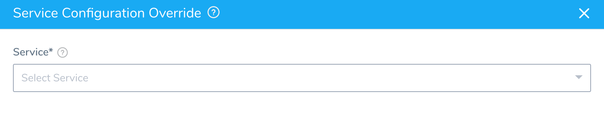
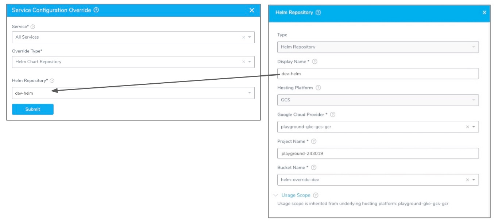
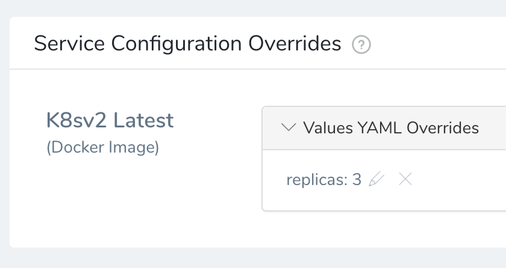
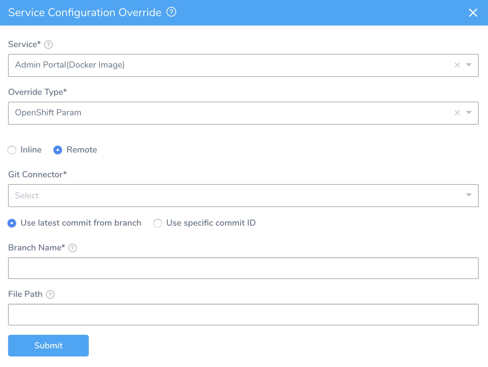

This content is for Harness [FirstGen](../../../getting-started/harness-first-gen-vs-harness-next-gen.md). Switch to [NextGen](https://docs.harness.io/article/t57uzu1i41).Harness Kubernetes Service **Config Variables**, **Config Files**, and **values.yaml** settings can be overwritten by Harness Environments **Service Configuration Overrides**.

This enables you to have a Service keep its settings but change them when the Service is deployed to the Environment.

For example, you might have a single Service but an Environment for QA and an Environment for Production, and you want to overwrite the `namespace` setting in the Service values.yaml depending on the Environment.

You can also overwrite Service variables at the Phase-level of a multiple Phase Workflow.

### Before You Begin

* [Define Kubernetes Manifests](define-kubernetes-manifests.md)
* [Using Harness Config Variables in Manifests](using-harness-config-variables-in-manifests.md)
* [Using Harness Config Files in Manifests](using-harness-config-files-in-manifests.md)

### Step 1: Select the Service to Override

1. In the Harness Environment, in the **Service Configuration Overrides** section, click **Add Configuration Overrides**. The **Service Configuration Override** settings appear.

  
  
2. In **Service**, select the Service you are using for your Kubernetes deployment.

3. Select one of the **Override Type** options.

### Option: Variable Override

1. In **Override Type**, select **Variable Override**. The **Variable Override** options appear.
2. In **Configuration Variable**, select a variable configured in the Service's **Config Variables** settings.
3. In **Type**, select **Text** or **Encrypted Text**.
4. In **Override Value**, enter the value to overwrite the variable value in the Service. If you selected **Encrypted Text** in Type, you can select an Encrypted Text values defined in [Secrets Management](https://docs.harness.io/article/au38zpufhr-secret-management).

### Option: File Override

1. In **Override Type**, select **File Override**.
2. In **File Name**, select a file configured in the Service's **Config Files** settings.
3. In **File**, select the file to overwrite the Service's **Config Files** file.

### Option: Values YAML

1. In **Override Type**, select **Values YAML**. Click **Local** or **Remote**.
2. **Local** - Enter in the values.yaml variables and values just as your would in a Service **Manifests** values.yaml. Ensure the name of the variable you want to overwrite is identical.
3. **Remote** - See [Override Remote Values YAML Files](override-values-yaml-files.md).

### Option: Helm Chart for Specific Service

1. In **Override Type**, select **Helm Chart**.
2. In **Helm Repository**, select a Helm Chart Repo that you have set up as a [Helm Repository Artifact Server](https://docs.harness.io/article/0hrzb1zkog-add-helm-repository-servers). See [Use a Helm Repository with Kubernetes](use-a-helm-repository-with-kubernetes.md).

#### Notes

* You can use some overrides together. For example, you can use both Helm Chart Overrides with Values YAML Overrides for the same Harness Service. Harness will merge the overrides.

### Option: Helm Chart for All Services

You can use a specific Helm chart to override All Services deployed to this Environment.

1. In **Service**, select **All Services**.
2. In **Override Type**, select **Helm Chart Repository**.
3. In **Helm Repository**, select the Helm Repository containing the Helm chart that you want to override all Service's Helm Charts, and then click **Submit**.



### Example

Here is an example of overwriting a Service values.yaml with a **Service Configuration Override**.

In the Service values.yaml, we have a variable for `replicas`:


```
replicas: 1
```
This is used in the manifest file like this:


```
...  
spec:  
  replicas: {{int .Values.replicas}}  
...
```
Now, in **Service Configuration Override**, you can overwrite the Service values.yaml `replicas` value using the **Local** option:

At deployment runtime to this Environment, the overwritten `replicas` values is used:


```
kind: Deployment  
metadata:  
  name: nginx-deployment  
  labels:  
    app: nginx  
spec:  
  replicas: 3
```
### Option: OpenShift Template for Specific Service

1. In **Service**, select the specific service that you want to override.
2. In **Override Type**, select **OpenShift Param**.
3. Select **Inline** or **Remote**.
	1. If you select **Inline,** then enter the value inline. If you select **Remote**, perform the following steps.
4. Select the **Git Connector**.
5. Select either **Use latest commit from branch** or **Use specific commit ID.**  
- If you select **Use** **latest commit from branch**, enter the branch name where the file is located, such as `master`, `dev`, or `myAppName`. Do not provide the full URL to the branch.  
- If you select **Use specific commit ID**, enter the commit ID.
6. In **File path**, enter the full path to the file in the repo.
7. Click **Submit**.

### Option: OpenShift Template for All Services

1. In **Service**, select **All Services**.
2. In **Override Type**, select **OpenShift Param**.
3. Select **Inline** or **Remote**.
	1. If you select **Inline,** then enter the value inline. If you select **Remote**, perform the following steps.
4. Select the **Git Connector**.
5. Select either **Use latest commit from branch** or **Use specific commit ID.**  
- If you select **Use** **latest commit from branch**, enter the branch name where the file is located, such as `master`, `dev`, or `myAppName`. Do not provide the full URL to the branch.  
- If you select **Use specific commit ID**, enter the commit ID.
6. In **File path**, enter the full path to the file in the repo.
7. Click **Submit**.

### Next Steps

* [Kubernetes Deployments Overview](../concepts-cd/deployment-types/kubernetes-overview.md)

