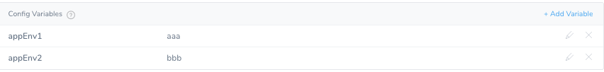
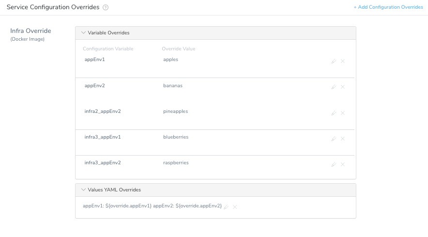
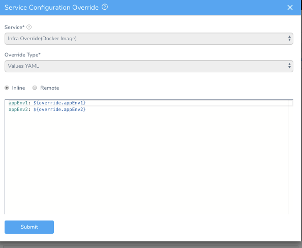
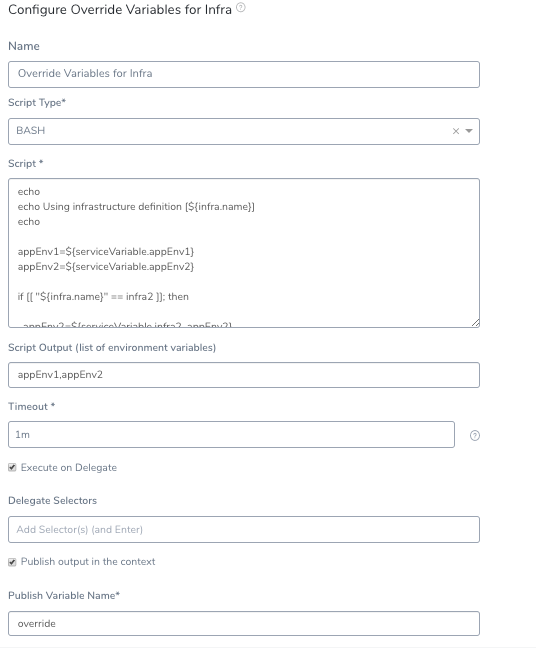
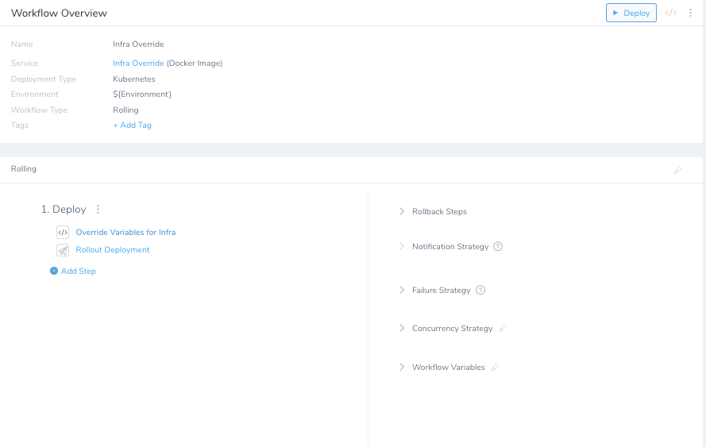
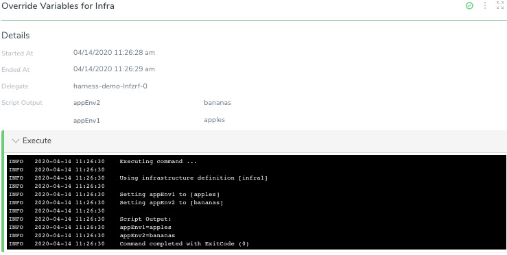
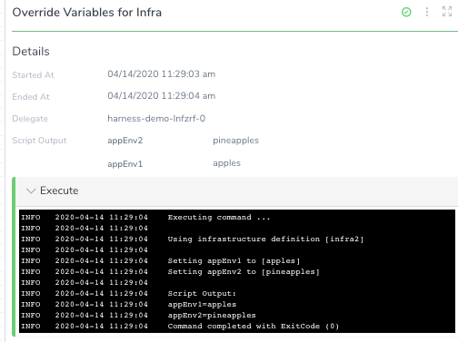

This content is for Harness [FirstGen](../../../getting-started/harness-first-gen-vs-harness-next-gen.md). Switch to [NextGen](https://docs.harness.io/article/t57uzu1i41).This topic describes how to override specific sets of variables for Kubernetes at the Infrastructure Definition level. You can override the `values.yaml` in your Service at the Infrastructure level and different Services can have different overrides in the same namespace.

### Before You Begin

* Your target Environment must have multiple Infrastructure Definitions.
* You must have a Service that needs to be overridden at the Infrastructure Definition level.
* The Application must contain a Service, a Workflow, and an Environment.
* Review the [Override Harness Kubernetes Service Settings](override-harness-kubernetes-service-settings.md) topic to understand Harness variable override and its hierarchy.

### Step 1: Configure the Service

Configure and deploy a Harness Kubernetes Service to an Environment that has multiple Infrastructure Definitions.

The following are the sample service Manifests: 

**Deployment.yaml**


```
apiVersion: v1  
kind: Namespace  
metadata:  
 name: {{.Values.namespace}}  
---  
apiVersion: v1  
kind: ConfigMap  
metadata:  
 name: {{.Values.name}}-{{.Values.track}}  
 labels:  
   app: {{.Values.name}}  
   track: {{.Values.track}}  
data:  
 APP_ENV1: {{.Values.appEnv1}}  
 APP_ENV2: {{.Values.appEnv2}}  
---  
apiVersion: apps/v1beta1  
kind: Deployment  
metadata:  
 name: {{.Values.name}}-{{.Values.track}}  
 labels:  
   app: {{.Values.name}}  
   track: {{.Values.track}}  
   version: {{.Values.version}}  
spec:  
 replicas: {{.Values.replicas}}  
 selector:  
   matchLabels:  
     app: {{.Values.name}}  
     track: {{.Values.track}}  
 template:  
   metadata:  
     labels:  
       app: {{.Values.name}}  
       track: {{.Values.track}}  
       version: {{.Values.version}}  
   spec:  
     containers:  
     - name: {{.Values.name}}  
       image: {{.Values.image}}  
       imagePullPolicy: Always  
       resources:  
         requests:  
           cpu: 100m  
           memory: 50Mi  
       ports:  
       - name: http  
         containerPort: 8080  
       envFrom:  
       - configMapRef:  
           name: {{.Values.name}}-{{.Values.track}}
```
**Service.yaml**


```
apiVersion: v1  
kind: Service  
metadata:  
 name: {{.Values.name}}  
 labels:  
   app: {{.Values.name}}  
spec:  
 type: ClusterIP  
 ports:  
 - name: http  
   port: 9080  
   protocol: TCP  
   targetPort: http  
 selector:  
   app: {{.Values.name}}
```
Perform the following steps to configure the Service:

1. In **Service**, add `s3bucketName` and `dnsServer` configuration variables.
2. Set the configuration variable `appEnv1` to `aaa`.
3. Set the configuration variable `appEnv2` to `bbb`.
4. In `values.yaml`, reference Harness variables as:  
  
`appEnv1: ${serviceVariable.appEnv1}`  
`appEnv2: ${serviceVariable.appEnv2}`  
  
**Values.yaml**  
  

```
namespace: ${infra.kubernetes.namespace}  
apiUrl: http://localhost:8080  
replicas: 1  
   
name: infra-override  
image: ${artifact.metadata.image}  
version: ${artifact.metadata.tag}  
track: primary  
endpoint: rpc  
   
appEnv1: ${serviceVariable.appEnv1}  
appEnv2: ${serviceVariable.appEnv2}
```

### Step 2: Add the Environment Overrides

Environment overrides are overridden at the Infrastructure Definition level. You can use the Infrastructure Definition's name or value to override the variable.

To override, first you need the Environment variables. Then, you need to enable specific values to be passed when the Infrastructure Definition Mapping is selected.

The Environment variables are the access points for the override variables to be assigned. Ensure that you have multiple Infrastructure Definitions mapped to your Environment. Once the mappings are configured, add Service Configuration Override variables to the Environment.



1. Provide an override variable for your Environment.  
You can associate the Infrastructure Definition name with the variable. This helps to identify the overriding variable applied in your Environment.
2. Configure `values.yaml` file override.
3. Create a new key-value pair where the key is the variable value that is overridden at the Infrastructure Definition level, and the value is a Workflow variable (it is set up later) called `$``{``override.keyNameHere``}`.  
  
When you are done, it will look something like this:

### Step 3: Configure the Workflow

You need to configure a shell script to handle the assignment of these variables in the Workflow. The shell script assigns the infrastructure variables as the Environment variables configured in the previous step.

1. In Workflow, write a script to assign variables based on the infra name.  
  
    Here is a sample shell script:  
      
    ```
    echo  
    echo Using infrastructure definition [${infra.name}]  
    echo  
      
    appEnv1=${serviceVariable.appEnv1}  
    appEnv2=${serviceVariable.appEnv2}  
      
    if [[ "${infra.name}" == infra2 ]]; then  
      
      appEnv2=${serviceVariable.infra2_appEnv2}  
      
    elif [[ "${infra.name}" == infra3 ]]; then  
      
      appEnv1=${serviceVariable.infra3_appEnv1}  
      appEnv2=${serviceVariable.infra3_appEnv2}  
      
    fi  
      
    echo Setting appEnv1 to [$appEnv1]  
    echo Setting appEnv2 to [$appEnv2]  
    echo
    ```

2. Export the variables into the context. This variable is used in the override configured [earlier](override-variables-per-infrastructure-definition.md#step-1-configure-the-service). The `$``{``override.appEnv1``}` references a value based on this shell script.
3. In **Publish Variable Name**, enter **override**, which is referenced in the `values.yaml` configuration override.  
  
  When you are done, it will look something like this:
  
4. Add the shell script to the **Deploy** steps before the Rollout Deployment.

  

5. Deploy the Workflow. Based on the Infrastructure Definition, certain variables are overridden. For InfraDef1, the values were assigned based on the Service configuration variables provided in the Environment. InfraDef1 did not override the Environment level values.

  

6. Run this deployment again in InfraDef2. Now the Environment level value is taken for `appEnv1`, but `appEnv2` is overridden with the value specific to InfraDef2.

  

7. Deploy the third Infrastructure Definition. This time both the variables are overridden with values specific to InfraDef3.

### Next Steps

Check out the community article on publishing variable outputs: [Publish Variables](https://community.harness.io/t/publish-variables/227)

