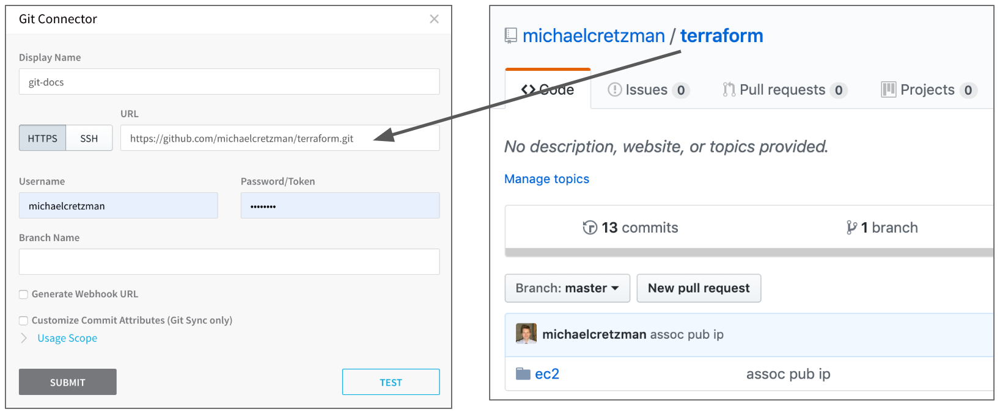
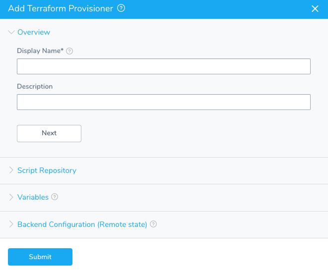
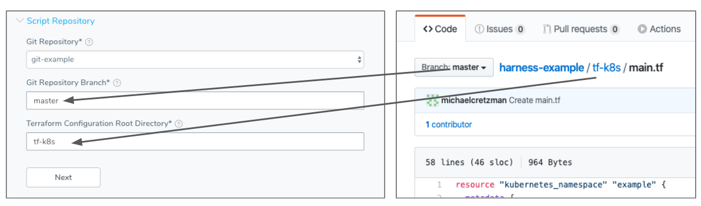
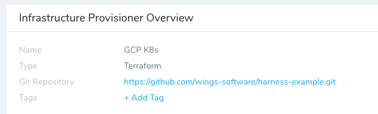
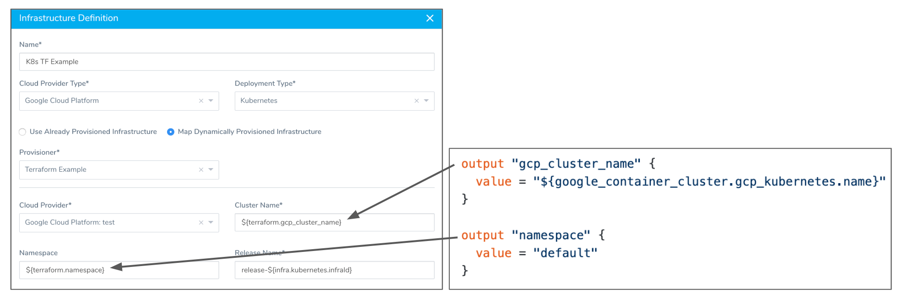
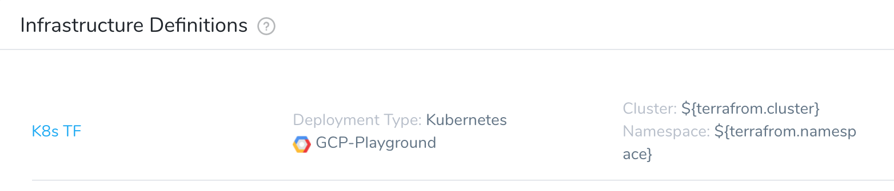
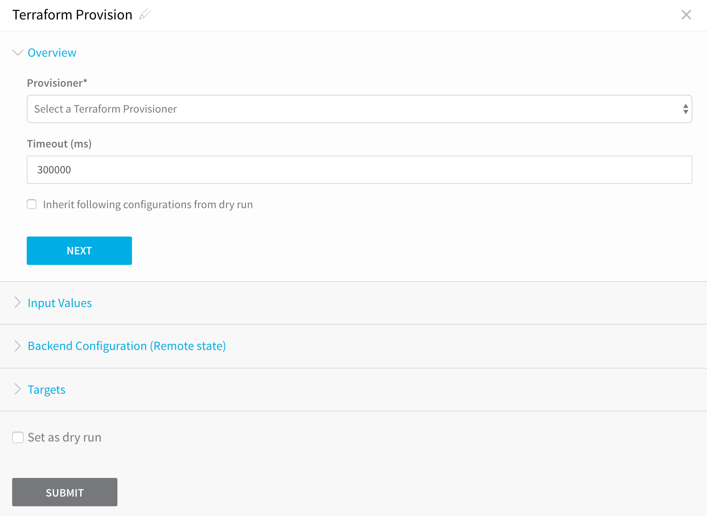

You can provision the target Kubernetes infrastructure as part of a pre-deployment step in your Workflow. When the Workflow runs, it builds your Kubernetes infrastructure first, and then deploys to the new infrastructure.

Provisioning involves creating a Harness Infrastructure Provisioner, and then using it in the Infrastructure Definition and Workflow.

Provisioning Kubernetes is supported with the Google Cloud Platform Cloud Provider, but not the Azure or Kubernetes Cluster Cloud Providers.

* [Next Steps](#next_steps)

### Before You Begin

* [Define Your Kubernetes Target Infrastructure](define-your-kubernetes-target-infrastructure.md)
* Creating a Terraform Infrastructure Provisioner is covered in the topic [Terraform Provisioner](../terraform-category/terrform-provisioner.md). In this topic, we will summarize all the related steps, but focus on the Infrastructure Definition and Workflow step.

### Step 1: Set Up the Delegate for Terraform

1. Install the Kubernetes Delegate where it can connect to the provisioned cluster.  
The Delegate needs to be able to reach the Kubernetes master endpoint of the provisioned cluster and have the necessary credentials, such as the Kubernetes service account token.  
Follow the steps in [Connect to Your Target Kubernetes Platform](connect-to-your-target-kubernetes-platform.md).
2. Install Terraform on the Delegate using a Delegate Profile.  
Follow the steps in [Delegate Installation and Management](https://docs.harness.io/article/h9tkwmkrm7-delegate-installation) and [Common Delegate Profile Scripts](https://docs.harness.io/article/nxhlbmbgkj-common-delegate-profile-scripts).
3. Tag the Delegate.  
When you add the Terraform Provision step in your Workflow, you will specify that a specific Delegate perform the operation by using its Delegate Tag.  
Follow the steps in [Delegate Installation and Management](https://docs.harness.io/article/h9tkwmkrm7-delegate-installation).

### Step 2: Set Up the Cloud Provider

Harness supports provisioning Kubernetes using Google Cloud Platform (GKE) only. The Kubernetes Cluster Cloud Provider, which connects directly to an existing cluster, cannot be used to perform provisioning.Add a Harness Cloud Provider that connects to your Google Cloud Platform account.

The GCP service account requires **Kubernetes Engine Admin** (GKE Admin) role to get the Kubernetes master username and password. Harness also requires **Storage Object Viewer** permissions.

See [Add Cloud Providers](https://docs.harness.io/article/whwnovprrb-cloud-providers).

### Step 3: Git Repo Setup

The Terraform script you use with Harness must be available in a Git repo. You connect Harness to the repo using a Harness Source Repro Provider.



Set up a Harness Source Repro Provider that connects to the Git repo hosting your Terraform script. See [Add Source Repo Providers](https://docs.harness.io/article/ay9hlwbgwa-add-source-repo-providers).

### Step 4: Set Up a Terraform Infrastructure Provisioner

You set up a Terraform Infrastructure Provisioner to identify your script repo information and script input variables.

Setting up the Terraform Provisioner involves the following:

1. Add your Terraform script via its Git Repo so Harness can pull the script.
2. Map the relevant Terraform output variables from the script to the required Harness fields for the deployment platform (AWS, Kubernetes, etc).

  Once the Terraform Infrastructure Provisioner is set up, it can be used in:

   * Infrastructure Definitions — To identify the target cluster and namespace.
   * Workflow Terraform Provisioner Steps — To provision the infrastructure as part of the Workflow.

  Harness supports first class Terraform Kubernetes provisioning for Google Kubernetes Engine (GKE).To set up a Terraform Infrastructure Provisioner, do the following:

3. In your Harness Application, click **Infrastructure Provisioners**.
4. Click **Add Infrastructure Provisioner**, and then click **Terraform**. The **Add Terraform Provisioner** dialog appears.

  

5. In **Display Name**, enter the name for this provisioner. You will use this name to select this provisioner in Harness Environments and Workflows.
6. Click **NEXT**. The **Script Repository** section appears. This is where you provide the location of your Terraform script in your Git repo.
7. In **Script Repository**, in **Git Repository**, select the [Source Repo Provider](https://docs.harness.io/article/ay9hlwbgwa-add-source-repo-providers) you added for the Git repo where your script is located.
8. In **Git Repository Branch**, enter the repo branch to use. For example, **master**. For master, you can also use a dot (`.`).
9. In **Terraform Configuration Root Directory**, enter the folder where the script is located. Here is an example showing the Git repo on GitHub and the **Script Repository** settings:

  

10. Click **NEXT**. The **Variables** section is displayed. This is where you will add the script input variables that must be given values when the script is run.
11. In **Variables**, click **Populate Variables**. The **Populate from Example** dialog appears. Click **SUBMIT** to have the Harness Delegate use the Source Repo Provider you added to pull the variables from your script and populate the **Variables** section.

   
   If Harness cannot pull the variables from your script, check your settings and try again. Ensure that your Source Repo Provisioner is working by clicking its **TEST** button.  
  Once Harness pulls in the variables from the script, it populates the **Variables** section.
  
12. In the **Type** column for each variable, specify **Text** or **Encrypted Text**.  

  When you add the provisioner to a Workflow, you will have to provide text values for **Text** variables, and select Harness Encrypted Text variables for **Encrypted Text** variables. See [Secrets Management](https://docs.harness.io/article/au38zpufhr-secret-management).
  
13. Click **NEXT**. The **Backend Configuration (Remote state)** section appears. This is an optional step.  
  
  By default, Terraform uses the local backend to manage state, in a local [Terraform language](https://www.terraform.io/docs/configuration/syntax.html) file named **terraform.tfstate** on the disk where you are running Terraform. With remote state, Terraform writes the state data to a persistent remote data store (such as an S3 bucket or HashiCorp Consul), which can then be shared between all members of a team. You can add the backend configs (remote state variables) for remote state to your Terraform Provisioner in **Backend Configuration (Remote state)**.
  
14. In **Backend Configuration (Remote state)**, enter the backend configs from your script.
15. Click **Next** and then **Submit**. The Terraform Provisioner is created.



Now you can use the Terraform Provisioner in Infrastructure Definitions and Workflows.

### Step 5: Map Outputs in Infrastructure Definition

Typically, when you add an Environment, you specify the Infrastructure Definition for an *existing* infrastructure. To use your Terraform Provisioner, you add the Terraform Provisioner to the Infrastructure Definition to identify a dynamically provisioned infrastructure *that will exist*.

Later, when you create a Workflow, you will use a Terraform Provisioner step to provision the infrastructure. During deployment, the Terraform Provisioner step will provision the infrastructure and then the Workflow will deploy to it via the Infrastructure Definition.

To add the Infrastructure Provisioner to the Infrastructure Definition, do the following:

1. In your Harness Environment, click **Infrastructure Definition**. The **Infrastructure Definition** settings appear.
2. In **Name**, enter the name for the Infrastructure Definition. You will use this name to select the Infrastructure Definition when you set up Workflows and Workflow Phases.
3. In **Cloud Provider Type**, select **Google Cloud Platform**.

:::note 
Harness supports first class Terraform Kubernetes provisioning for Google Kubernetes Engine (GKE).
:::

4. In **Deployment Type**, select **Kubernetes**.
5. Click **Map Dynamically Provisioned Infrastructure**.
6. In **Provisioner**, select your Terraform Infrastructure Provisioner.
7. In **Cloud Provider**, select the Cloud Provider that you use to connect Harness with GCP.
8. In **Cluster Name** and **Namespace**, map the required fields to your Terraform script outputs.

You map the Terraform script outputs using this syntax, where `exact_name` is the name of the output:


```
${terrafrom.*exact\_name*}
```
:::note
When you map a Terraform script output to a Harness field as part of a Service Mapping, the variable for the output, `${terrafrom.exact_name​}`, can be used anywhere in the Workflow that uses that Terraform Provisioner.
:::

The Kubernetes deployment type requires that you map an output to **Cluster Name**. You can map an output to **Namespace** as an option.

The following example shows the Terraform script outputs used for the Kubernetes deployment type fields:



For information on Kubernetes deployments, see [Kubernetes Deployments Overview](../concepts-cd/deployment-types/kubernetes-overview.md).

Click **Submit**. The Infrastructure Definition is created.



Now that the Infrastructure Definition is created, you must add a **Terraform Provision** step to the Workflows that will use this Infrastructure Definition.

### Step 6: Add Terraform Provisioner to Workflow

The Terraform Provision step lets you customize the Infrastructure Provisioner for a specific deployment. You can specify the inputs, remote state, targets for the provisioning performed by the Workflow.

1. Open or create a Workflow that is configured with an Infrastructure Definition that uses the Kubernetes Infrastructure Provisioner.
2. In **Pre-deployment Steps**, click **Add Step**.
3. Select **Terraform Provision**. The **Terraform Provision** dialog appears.

  

4. In **Provisioner**, select a Kubernetes Terraform Provisioner.
5. In **Timeout**, enter how long Harness should wait to apply the Terraform Provisioner before failing the Workflow.

The **Inherit following configurations from dry run** setting is described in .1. Click **NEXT**. The remaining settings appear.

The remaining settings are not Kubernetes-specific. You can review them in [Terraform Provisioner](../terraform-category/terrform-provisioner.md).

In the **Post-deployment Steps** of the Workflow, you can add a **Terraform Destroy** step to remove any provisioned infrastructure, just like running the `terraform destroy` command. See the [Remove Provisioned Infra with Terraform Destroy](../terraform-category/terraform-destroy.md) How-to and  [destroy](https://www.terraform.io/docs/commands/destroy.html) from Terraform.1. Complete your Workflow and click **Deploy**.

### Next Steps

* [​Use Terraform Destroy](../terraform-category/terrform-provisioner.md#terraform-destroy)
* [Using the Terraform Apply Command](../terraform-category/using-the-terraform-apply-command.md)

