Kubernetes [Jobs](https://kubernetes.io/docs/concepts/workloads/controllers/jobs-run-to-completion/) create one or more pods to carry out commands. For example, a calculation or a backup operation.

In Harness Kubernetes deployments, you define Jobs in the Harness Service **Manifests**. Next you add the **Apply** step to your Harness Workflow to execute the Job.

In this topic, we will show you how to execute a Job in a Harness Kubernetes deployment as part of the main deployment.

Typically, Jobs are not part of the main deployment. You can exclude them from the main deployment and simply call them at any point in the Workflow using the Apply step. For steps on ignoring the Job as part of the main deployment and executing it separately, see [Deploy Manifests Separately using Apply Step](deploy-manifests-separately-using-apply-step.md).

### Before You Begin

* **​Kubernetes Jobs** — We assume you are familiar with [Kubernetes Jobs](https://kubernetes.io/docs/concepts/workloads/controllers/jobs-run-to-completion/).
* **Apply step** — The Harness Workflow Apply step allows you to deploy any resource you have set up in the Service **Manifests** section at any point in your Workflow. See  [Deploy Manifests Separately using Apply Step](deploy-manifests-separately-using-apply-step.md).
* **Ignoring Manifests** — You can annotate a manifest to have Harness ignore it when performing its main deployment operations. Then you can use the Apply step to execute the manifest wherever you want to run it in the Workflow. See [Ignore a Manifest File During Deployment](ignore-a-manifest-file-during-deployment.md).
* **Delete Jobs before rerunning deployments** — Once you've deployed the Job, you must delete it before deploying a Job of the same name to the same namespace.

### Visual Summary

In this topic, we will walk through a simple Job deployment. Here is the completed deployment in Harness:

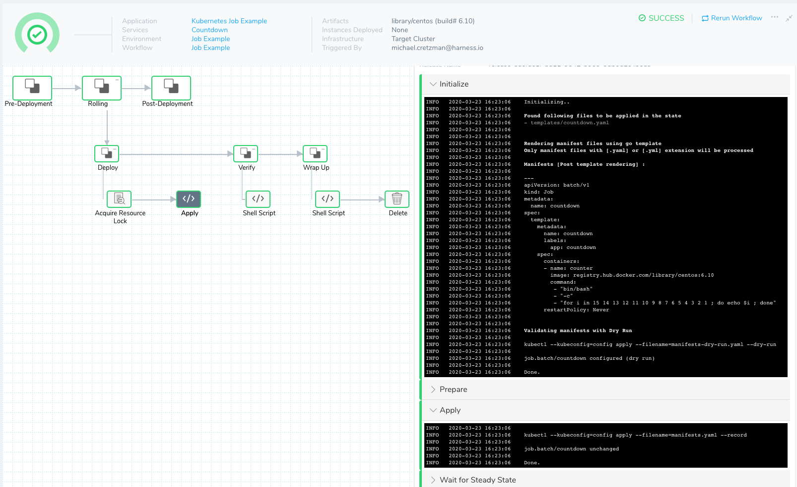

### Review: Apply Step

Workflows include an **Apply** step that allows you to deploy *any resource* you have set up in the Service **Manifests** section.

For details on what you can deploy in different Harness Workflow types, see [What Can I Deploy in Kubernetes?](https://docs.harness.io/article/6ujb3c70fh-what-can-i-deploy-in-kubernetes).

The Apply step can deploy *all workload types*, including Jobs in any Workflow type.

You can add an Apply step anywhere in your Harness Workflow. This makes the Apply step useful for running Kubernetes Jobs.

Here are some Job examples:

* Run independent but related work items in parallel: sending emails, rendering frames, transcoding files, or scanning database keys.
* Create a new pod if the first pod fails or is deleted due to a node hardware failure or node reboot.
* Create a Job that cleans up the configuration of an environment, to create a fresh environment for deployment.
* Use a Job to spin down the replica count of a service, to save on cost.

Any workload deployed with the **Apply** step is not rolled back by Harness.

### Step 1: Add Job Manifest

For this topic, we will create a Service named **Countdown** of the Kubernetes Deployment Type.

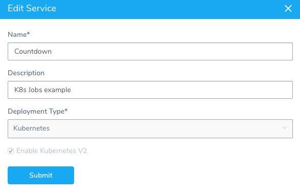

The Job manifest is added to the Harness Service **Manifests** section.

Here is a Job that will countdown from 15 to 1 and print out the countdown when complete:


```
apiVersion: batch/v1  
kind: Job  
metadata:  
  name: {{.Values.name}}  
spec:  
  template:  
    metadata:  
      name: {{.Values.name}}  
      labels:  
        app: {{.Values.name}}  
    spec:  
      containers:  
      - name: counter  
        image: {{.Values.image}}  
        command:  
         - "bin/bash"  
         - "-c"  
         - "for i in $(seq 1 15); do echo $((16-i)); sleep 1s; done"  
      restartPolicy: Never
```
In your Harness Service, in **Manifests**, you simply add the Job in a manifest file. Let's walk through adding the manifest and the values.yaml file.

First, we add a [CentOS Docker Image](https://hub.docker.com/_/centos) as the [Docker Registry Artifact Source](https://docs.harness.io/article/gxv9gj6khz-add-a-docker-image-service) for the Service.

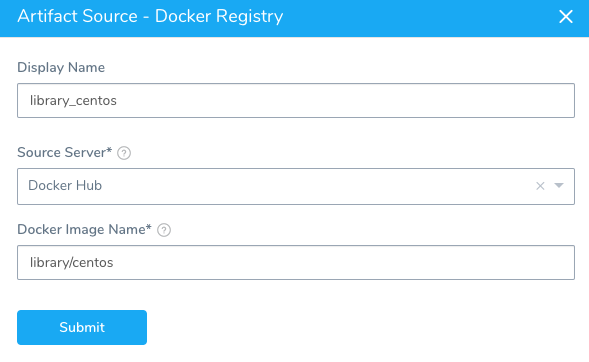

Next, we create the **countdown.yaml** file in a **templates** folder. It contains the exact same countdown Job example listed above:

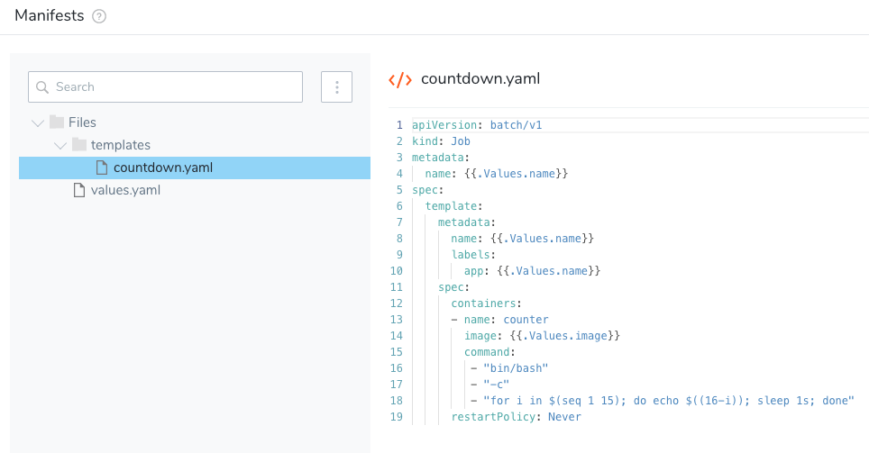

Next, edit **values.yaml** to contain the name and image labels only:


```
name: countdown  
image: ${artifact.metadata.image}
```
Now that the Job is added to the Service, we can select the target cluster where the Job will be deployed.

### Step 2: Define Target Cluster

Jobs do not require any changes to the way you specify the target cluster in Harness.

For steps on setting up the target cluster, see [Define Your Kubernetes Target Infrastructure](define-your-kubernetes-target-infrastructure.md).

### Step 3: Add the Job to the Workflow

For this topic, we will create a Harness Rolling Workflow for our Service, named **Countdown**.

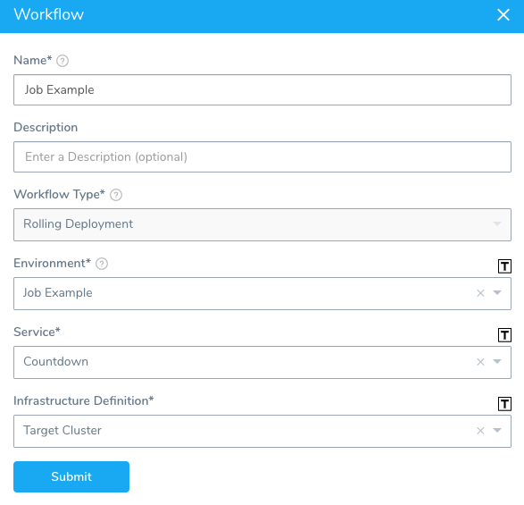

1. In the Workflow **Deploy** section, delete the **Rollout Deployment** step. We don't need the Rollout Deployment step because we will simply deploy the Job using the **Apply** step.
2. In the Workflow **Deploy** section, click **Add Step**, and then select the **Apply** step.
3. Set up the Apply step to use the Job manifest in the Service **Manifests**: `templates/countdown.yaml`.

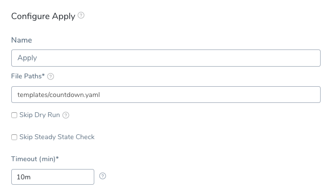

That's all you have to do to add the Job to your Workflow. Next, we'll add some test and clean up steps.

### Option: Delegate Selector

The Apply step has the Delegate Selector option.

If your Workflow Infrastructure Definition's Cloud Provider uses a Delegate Selector (supported in Kubernetes Cluster and AWS Cloud Providers), then the Workflow uses the selected Delegate for all of its steps.

In these cases, you shouldn't add a Delegate Selector to any step in the Workflow. The Workflow is already using a Selector via its Infrastructure Definition's Cloud Provider.

If your Workflow Infrastructure Definition's Cloud Provider isn't using a Delegate Selector, and you want this Workflow step to use a specific Delegate, do the following:

In **Delegate Selector**, select the Selector for the Delegate(s) you want to use. You add Selectors to Delegates to make sure that they're used to execute the command. For more information, see [Select Delegates with Selectors](https://docs.harness.io/article/c3fvixpgsl-select-delegates-for-specific-tasks-with-selectors).

Harness will use Delegates matching the Selectors you add.

If you use one Selector, Harness will use any Delegate that has that Selector.

If you select two Selectors, a Delegate must have both Selectors to be selected. That Delegate might also have other Selectors, but it must have the two you selected.

You can use expressions for Harness built-in variables or Account Default variables in **Delegate Selectors**. When the variable expression is resolved at deployment runtime, it must match an existing Delegate Selector.  
  
For example, if you have a Delegate Selector **prod** and the Workflow is using an Environment also named **prod**, the Delegate Selector can be `${env.name}`. This is very useful when you match Delegate Selectors to Application component names such as Environments, Services, etc. It's also a way to template the Delegate Selector setting.### Option: Skip Steady State Check

If you select this option, Harness will not check that the workload (Job) has reached steady state.

### Option: Add Test and Clean Up Steps

1. In **Workflow Variables**, add a new variable named **JobName** and give it the value `countdown`. We will use this variable in a Shell Script step to check if the Job is complete.
   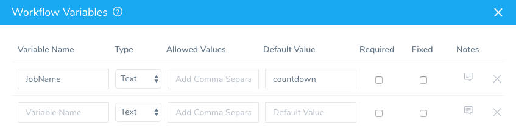
2. In the **Verify** section of the Workflow, click **Add Step**, and then select the **Shell Script** step.
3. In the Shell Script step, in **Script**, add the following script to check if the Job completed:

    ```
    kubectl wait --for=condition=complete --timeout=30s jobs/${workflow.variables.JobName} -n ${infra.kubernetes.namespace}
    ```
    You can see the script uses the Workflow variable expression `${workflow.variables.JobName}` to get the name of the Job, **countdown**.

    Next, we'll add a Shell Script step to output the log for the Job. When we deploy, the log will display the countdown from 15 to 1 performed by the Job.

4. In the **Wrap Up** section of the Workflow, add another Shell Script step. In **Script**, enter the following script:

  ```
  kubectl logs -n ${infra.kubernetes.namespace} $(kubectl get pods -n ${infra.kubernetes.namespace} -l job-name=${workflow.variables.JobName} -o jsonpath='{.items[*].metadata.name}')
  ```
  Finally, let's add a **Delete** step to remove the Job.

5. In the **Wrap Up** section of the Workflow, after the Shell Script step, click **Add Step**. Select the **Delete** step.

6. In **Resources**, enter the type and name of the resource, `Job/countdown`.


See [Delete Kubernetes Resources](delete-kubernetes-resources.md) for more information on how to reference resources.

Now that our Job deployment is set up, we can run it.

### Step 4: Deploy the Job

1. In the Workflow, click **Deploy**.
2. In **Start New Deployment**, we enter `countdown` for the **JobName** Workflow variable, select a **Build/Version** for our CentOS artifact, and click **Submit**.

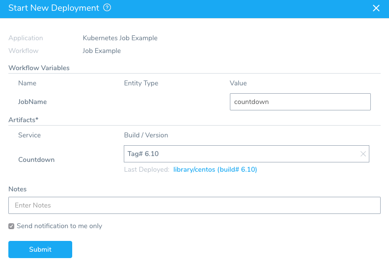

Let's look at the results of each step.

In the **Apply** step, in **Wrap Up**, you can see that the Job is run:


```
Wrapping up..  
  
  
kubectl --kubeconfig=config describe --filename=manifests.yaml  
  
Name:           countdown  
Namespace:      default  
Selector:       controller-uid=aff025af-6ebe-11ea-b052-4201ac10c80b  
Labels:         app=countdown  
                controller-uid=aff025af-6ebe-11ea-b052-4201ac10c80b  
                job-name=countdown  
Annotations:    kubectl.kubernetes.io/last-applied-configuration:  
                  {"apiVersion":"batch/v1","kind":"Job","metadata":{"annotations":{"kubernetes.io/change-cause":"kubectl apply --kubeconfig=config --filenam...  
                kubernetes.io/change-cause: kubectl apply --kubeconfig=config --filename=manifests.yaml --record=true  
Parallelism:    1  
Completions:    1  
Start Time:     Wed, 25 Mar 2020 17:33:06 +0000  
Completed At:   Wed, 25 Mar 2020 17:33:22 +0000  
Duration:       16s  
Pods Statuses:  0 Running / 1 Succeeded / 0 Failed  
Pod Template:  
  Labels:  app=countdown  
           controller-uid=aff025af-6ebe-11ea-b052-4201ac10c80b  
           job-name=countdown  
  Containers:  
   counter:  
    Image:      registry.hub.docker.com/library/centos:6.10  
    Port:       <none>  
    Host Port:  <none>  
    Command:  
      bin/bash  
      -c  
      for i in $(seq 1 15); do echo $((16-i)); sleep 1s; done  
    Environment:  <none>  
    Mounts:       <none>  
  Volumes:        <none>  
Events:  
  Type    Reason            Age   From            Message  
  ----    ------            ----  ----            -------  
  Normal  SuccessfulCreate  22s   job-controller  Created pod: countdown-wzph5  
  
Done.
```
In the Shell Script step in **Verify**, we can see that our Job completed:

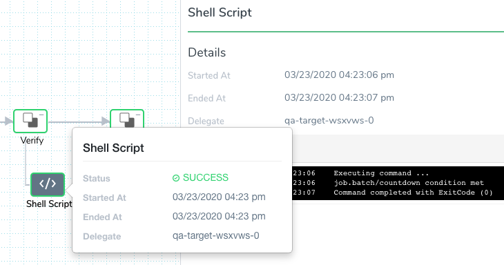

In the Shell Script step in **Wrap Up**, we can see the log for the Job pod:


Finally, in the **Delete** step, you can see the countdown Job deleted.

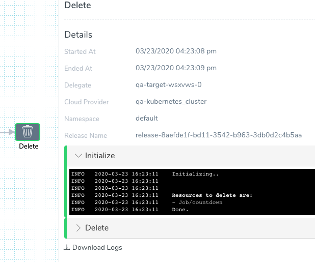

### Option: Showing Job Output

To view Job output after the Apply step, you can use a simple script in a [Shell Script](https://docs.harness.io/article/1fjrjbau7x-capture-shell-script-step-output) step:


```
echo  
  
pods=$(kubectl get pods -n ${infra.kubernetes.namespace} --selector=job-name=my-job --output=jsonpath='{.items[*].metadata.name}')  
  
kubectl logs -n ${infra.kubernetes.namespace} $pods  
  
echo
```
If you need to show the logs *during* job execution rather than after the Apply step, then modify the script and run the step in parallel with Apply.

Alternatively, if you have your cluster logs going to a log service you can generate a URL to that system that shows the job logs in parallel as well.

### Summary

Using the Apply step, you are able to configure, manage, and deploy a Kubernetes Job.

### One More Thing to Try

As we demonstrated, you can get the status of the Job using a simple script. In addition, you can output that status to a Jira, ServiceNow, or Email step using the Shell Script step **Publish Variable Name**.

For example, let's change the Shell Script that checks the success of the Job. We will add the output to a variable and then publish that variable:

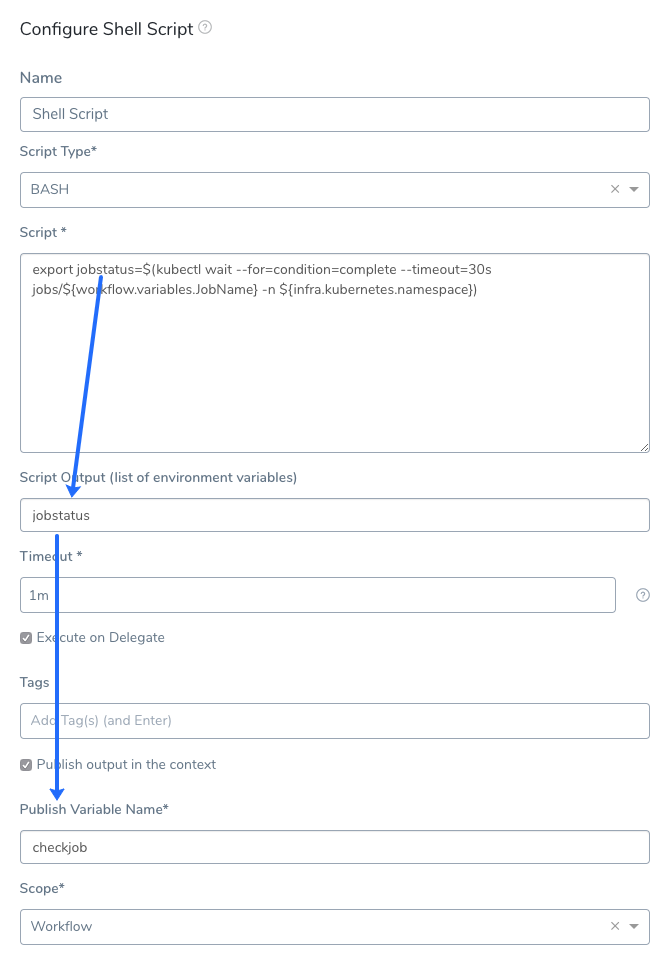

Now you can obtain the output via the variable expression `${context.checkjob.jobstatus}`. Here's an Email step using the published variable:

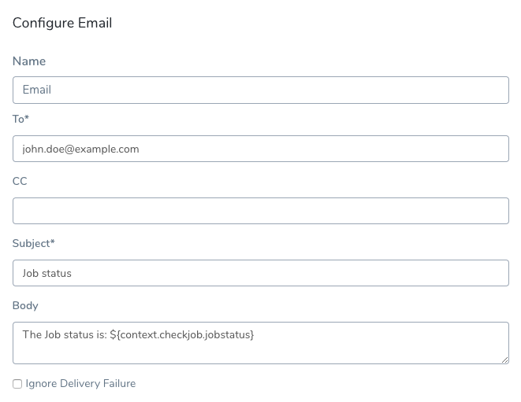

For information on these collaboration tools, see:

* [Jira Integration](https://docs.harness.io/article/077hwokrpr-jira-integration)
* [ServiceNow Integration](https://docs.harness.io/article/7vsqnt0gch-service-now-integration)
* [Add Collaboration Providers](https://docs.harness.io/article/cv98scx8pj-collaboration-providers)

