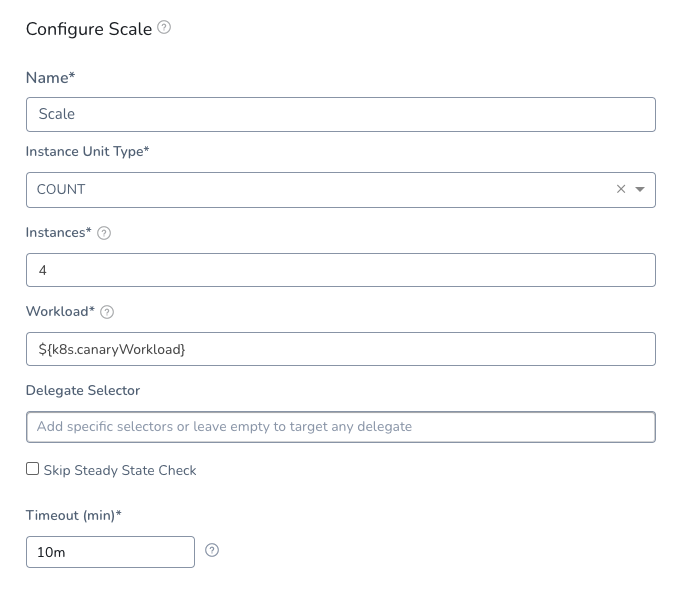

When you deploy a Kubernetes workload using Harness, you set the number of pods you want in your manifests and in the deployment steps.

With the Scale step, you can scale this number of running pods up or down, by count or percentage.

### Before You Begin

* [Define Kubernetes Manifests](define-kubernetes-manifests.md)
* [Create a Kubernetes Canary Deployment](create-a-kubernetes-canary-deployment.md)
* [Create a Kubernetes Rolling Deployment](create-a-kubernetes-rolling-deployment.md)
* [Create a Kubernetes Blue/Green Deployment](create-a-kubernetes-blue-green-deployment.md)
* [Kubernetes Workflow Variable Expressions](workflow-variables-expressions.md)

### Step 1: Add Scale Step

In your Harness Workflow, click **Add Step**, and select **Scale**. The **Scale** settings appear.

Name the step and then provide the scaling strategy, described below.

### Step 2: Pick Count or Percentage

The Scale step updates the number of instances running, either by count or percentage.

In **Instance Unit Type**, select **COUNT** or **PERCENTAGE**.

* **COUNT** — The number is simply the number of pods.
* **PERCENTAGE** — A percentage of the pods defined in your Harness Service **Manifests** files or a previous Workflow step.

### Step 3: Set the Number of Pods

Enter the number of pods to scale up or down compared to the number of instances specified *before* the Scale step.

The number may come from the Harness Service manifest or a previous Workflow step, whichever set the number of pods right before the Scale step.

For example, in you have `replicas: 4` in a manifest in your Service, and you enter **50** **PERCENT** in **Instances**, then 2 pods are deployed in this step.

If you have an odd number of instances, such as 3 instances, and then enter 50% in Scale, the number of instances is scaled down to 2.

### Step 4: Specify Resources to Scale

Enter the Harness built-in variable `${k8s.canaryWorkload}` or the name of the resource in the format `[namespace/]Kind/Name`, with `namespace` optional. For example: 

`my-namespace/Deployment/harness-example-deployment-canary`

You can scale Deployment, DaemonSet, or StatefulSet.

You can only enter one resource in **Workload**. To scale another resource, add another Scale step.

Here is what a completed step looks like:

### Option: Delegate Selector

If your Workflow Infrastructure Definition's Cloud Provider uses a Delegate Selector (supported in Kubernetes Cluster and AWS Cloud Providers), then the Workflow uses the selected Delegate for all of its steps.

In these cases, you shouldn't add a Delegate Selector to any step in the Workflow. The Workflow is already using a Selector via its Infrastructure Definition's Cloud Provider.

If your Workflow Infrastructure Definition's Cloud Provider isn't using a Delegate Selector, and you want this Workflow step to use a specific Delegate, do the following:

In **Delegate Selector**, select the Selector for the Delegate(s) you want to use. You add Selectors to Delegates to make sure that they're used to execute the command. For more information, see [Select Delegates with Selectors](https://docs.harness.io/article/c3fvixpgsl-select-delegates-for-specific-tasks-with-selectors).

Harness will use Delegates matching the Selectors you add.

If you use one Selector, Harness will use any Delegate that has that Selector.

If you select two Selectors, a Delegate must have both Selectors to be selected. That Delegate might also have other Selectors, but it must have the two you selected.

You can use expressions for Harness built-in variables or Account Default variables in **Delegate Selectors**. When the variable expression is resolved at deployment runtime, it must match an existing Delegate Selector.  
  
For example, if you have a Delegate Selector **prod** and the Workflow is using an Environment also named **prod**, the Delegate Selector can be `${env.name}`. This is very useful when you match Delegate Selectors to Application component names such as Environments, Services, etc. It's also a way to template the Delegate Selector setting.### Option: Skip Steady State Check

If you select this, Harness will not check to see if the workload has reached steady state.

### Notes

* You can scale down to **0** to remove all instances.

### Next Steps

* [Delete Kubernetes Resources](delete-kubernetes-resources.md)
* [Kubernetes Workflow Variable Expressions](workflow-variables-expressions.md)

