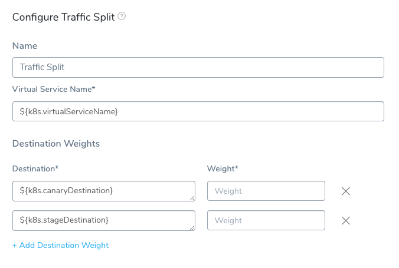
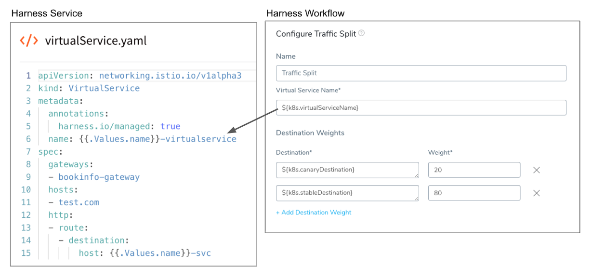
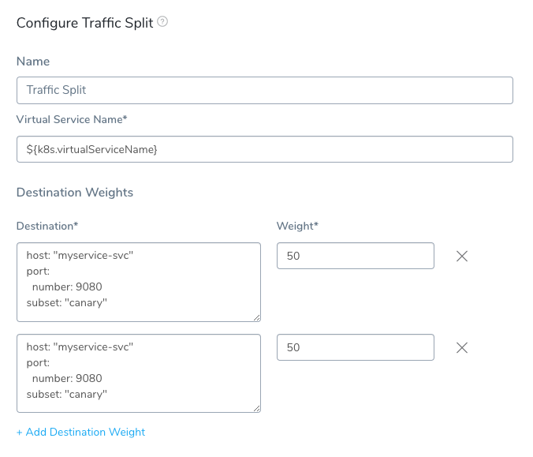
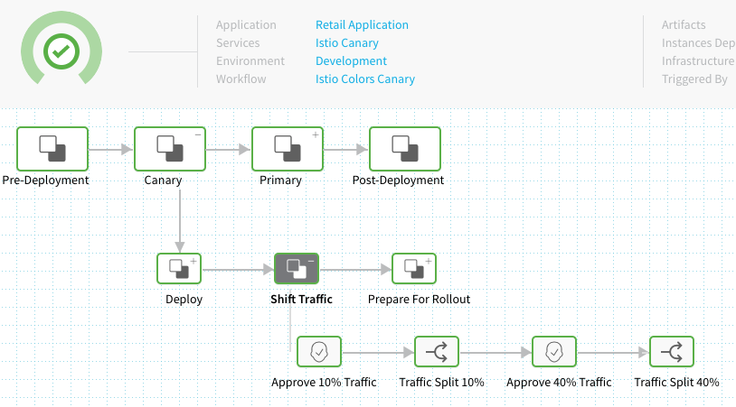

Harness provides traffic splitting to gradually migrate traffic between application versions.

Harness supports Istio 1.2 and above.

Not using Istio? No problem. See [Traffic Splitting Without Istio](traffic-splitting-without-istio.md).In a [Kubernetes Canary](create-a-kubernetes-canary-deployment.md) or [Blue/Green](create-a-kubernetes-blue-green-deployment.md) deployment, as the new application is verified, you can shift traffic from the previous version to a new version.


### Before You Begin

* [Create a Kubernetes Canary Deployment](create-a-kubernetes-canary-deployment.md)
* [Define Kubernetes Manifests](define-kubernetes-manifests.md)

### Limitations

Traffic Splitting is supported for Harness Canary and Blue/Green deployment strategies only. It is not supported with the Rolling Update strategy.

### Step 1: Review Istio

In Istio, traffic splitting is set in each VirtualService using route rules:


```
apiVersion: networking.istio.io/v1alpha3  
kind: VirtualService  
metadata:  
  name: reviews  
spec:  
  hosts:  
    - reviews  
  http:  
  - route:  
    - destination:  
        host: reviews  
        subset: v1  
      weight: 75  
    - destination:  
        host: reviews  
        subset: v2  
      weight: 25
```
In Harness, you can use a simple DestinationRule and a VirtualService without route rules, and then specify the routing in the Workflow that uses the VirtualService, via the Traffic Split step:


Setting up Traffic Splitting involves adding a standard traffic management manifest to your Harness Service, and then using the Traffic Split step in your Workflow.

### Step 2: Add DestinationRule Manifest

In your Harness Service, add a manifest for a simple [DestinationRule](https://istio.io/docs/reference/config/networking/v1alpha3/destination-rule/#DestinationRule) without route rules. It will act as a template using the Service values.yaml file for names via its `{{.Values.name}}` placeholder.

Here is a simple DestinationRule:


```
apiVersion: networking.istio.io/v1alpha3  
kind: DestinationRule  
metadata:  
  annotations:  
    harness.io/managed: "true"  
  name: {{.Values.name}}-destinationrule  
spec:  
  host: {{.Values.name}}-svc  
  trafficPolicy:  
    loadBalancer:  
      simple: RANDOM
```
#### harness.io/managed: true Required

Note the use of the `harness.io/managed: "true"` annotation. This is **required** for Harness to identify this DestinationRule as managed.

This annotation is used to identify which DestinationRule or VirtualService Harness should update during traffic splitting when there are more than one.

Harness requires that the managed VirtualService have only one route in the `http` list in order to know which one to update.

If the DestinationRule/VirtualService uses `harness.io/managed: "false"`, that is the same as if `harness.io/managed` were omitted. In this case, Harness will not perform any traffic shifting.

The quotations around "true" and "false" are mandatory.

### Step 3: Add VirtualService Manifest

Next, in your Harness Service, add a manifest for a simple [VirtualService](https://istio.io/docs/reference/config/networking/v1alpha3/virtual-service/) without route rules. As with the DestinationRule manifest, it will act as a template using the Service values.yaml file for names via its `{{.Values.name}}` placeholder.

Here is a simple VirtualService:


```
apiVersion: networking.istio.io/v1alpha3  
kind: VirtualService  
metadata:  
  annotations:  
    harness.io/managed: "true"  
  name: {{.Values.name}}-virtualservice  
spec:  
  gateways:  
  - {{.Values.name}}-gateway  
  hosts:  
  - test.com  
  http:  
  - route:  
    - destination:  
        host: {{.Values.name}}-svc
```
#### harness.io/managed: true Required

Note the use of the `harness.io/managed: "true"` annotation. This is **required** for Harness to identify this DestinationRule as managed.

This annotation is used to identify which DestinationRule or VirtualService Harness should update during traffic splitting when there are more than one.

Harness requires that the managed VirtualService have only one route in the `http` list in order to know which one to update.

If the DestinationRule/VirtualService uses `harness.io/managed: "false"`, that is the same as if `harness.io/managed` were omitted. In this case, Harness will not perform any traffic shifting.

The quotations around "true" and "false" are mandatory.

### Step 4: Review Weighting

You do not need to enter weights in the `destination` section.

By default, Harness adds a weight value of 100 for the existing (stable) service and 0 for the (canary) service, regardless of whether you use the Traffic Split step.

Here is a sample from the deployment log of a VirtualService without weights specified that where Harness has applied weights.


```
- destination:  
    host: "anshul-traffic-split-demo-svc"  
    subset: "stable"  
  weight: 100  
- destination:  
    host: "anshul-traffic-split-demo-svc"  
    subset: "canary"  
  weight: 0
```
If you do specify weights in your VirtualService, Harness will still use its defaults for Canary deployments and you can use the Traffic Split to change the weights.

### Step 5: Add Gateway Manifest

The VirtualService includes a reference to a Gateway object.

Typically, you will also add a Gateway manifest to your Service, describing the load balancer for the mesh receivingHTTP/TCP connections. The Gateway manifest can also use the values.yaml placeholder:


```
apiVersion: networking.istio.io/v1alpha3  
kind: Gateway  
metadata:  
  name: {{.Values.name}}-gateway  
spec:  
  selector:  
    istio: ingressgateway  
  servers:  
  - port:  
      number: 80  
      name: http  
      protocol: HTTP  
    hosts:  
    - "*"
```
That's all you need to set up simple traffic management in your Harness Kubernetes Service. Next, you use the Traffic Split step in your Workflow to control routing weights for the existing service and the new service you are deploying.

### Step 6: Add Traffic Split Step

You perform traffic management in your Workflow using the Traffic Split step.

You can use the Traffic Split step anywhere in your Workflow, but you will typically apply it the **Verify** section after the **Canary Deployment** step was successful.

1. To add the Traffic Split step, in your Workflow, click **Add Step**.
2. Select **Traffic Split**. The **Traffic Split** settings appear.



### Step 7: Define Virtual Service Name

By default, the Traffic Split step includes Harness variables to refer the VirtualService set up in the Service the Workflow is deploying, and the named destination service subsets Harness deploys.

In **Virtual Service Name**, Traffic Split takes the name of the VirtualService set up in the Service:



The variable `${k8s.virtualServiceName}` refers to the value of the name label in your VirtualService manifest in the Harness Service.

If you have multiple VirtualService manifests in your Harness Service **Manifests**, you can enter the name of the VirtualService you want to use manually.

### Option: Delegate Selector

If your Workflow Infrastructure Definition's Cloud Provider uses a Delegate Selector (supported in Kubernetes Cluster and AWS Cloud Providers), then the Workflow uses the selected Delegate for all of its steps.

In these cases, you shouldn't add a Delegate Selector to any step in the Workflow. The Workflow is already using a Selector via its Infrastructure Definition's Cloud Provider.

If your Workflow Infrastructure Definition's Cloud Provider isn't using a Delegate Selector, and you want this Workflow step to use a specific Delegate, do the following:

In **Delegate Selector**, select the Selector for the Delegate(s) you want to use. You add Selectors to Delegates to make sure that they're used to execute the command. For more information, see [Select Delegates with Selectors](https://docs.harness.io/article/c3fvixpgsl-select-delegates-for-specific-tasks-with-selectors).

Harness will use Delegates matching the Selectors you add.

If you use one Selector, Harness will use any Delegate that has that Selector.

If you select two Selectors, a Delegate must have both Selectors to be selected. That Delegate might also have other Selectors, but it must have the two you selected.

You can use expressions for Harness built-in variables or Account Default variables in **Delegate Selectors**. When the variable expression is resolved at deployment runtime, it must match an existing Delegate Selector.  
  
For example, if you have a Delegate Selector **prod** and the Workflow is using an Environment also named **prod**, the Delegate Selector can be `${env.name}`. This is very useful when you match Delegate Selectors to Application component names such as Environments, Services, etc. It's also a way to template the Delegate Selector setting.

### Step 8: Set Destinations and Weights

In **Destination**, Harness provides two variables:

* `${k8s.canaryDestination}` - Refers to the new Kubernetes service the Workflow is deploying.
* `${k8s.stableDestination}` - Refers to the previous Kubernetes service.

Harness will use these variables to initialize destinations and then apply the traffic split by adding destination subsets and weights into the VirtualService it deploys.

Here is an example of a Traffic Split step and the logs from its deployment showing how the destinations are initialized and then applied by Traffic Split:


That's all that is needed to set up Traffic Splitting.

### Option 1: Use Subsets

In cases where you are using multiple subsets in destination rules and you want to assign different values to them, you can use your own subsets in Traffic Split as well. Here is a simple example:



The only requirement of Destination field values is that they contain a host, subset and are valid YAML. See  [Destination](https://istio.io/docs/reference/config/networking/v1alpha3/virtual-service/#Destination) from Istio for details.

### Option 2: Use Multiple Traffic Split Steps

You can use multiple Traffic Split steps in your Workflow to change the routing to your old and new service versions. Here is an example with Approval steps between each Traffic Split step:



### Notes

* **Canary Delete and Traffic Management** — If you are using the **Traffic Split** step or doing Istio traffic shifting using the **Apply step**, move the **Canary Delete** step from **Wrap Up** section of the **Canary** phase to the **Wrap Up** section of the *Primary* phase (the phase containing the Rollout Deployment step).  
Moving the **Canary Delete** step to the **Wrap Up** section of the Primary phase will prevent any traffic from being routed to deleted pods before traffic is routed to stable pods in the Primary phase.
* **HTTP in the VirtualService** — For traffic management using the Traffic Split step, Harness only supports HTTP in the VirtualService manifest. If you want to use HTTPS or TLS, you can use another manifest and apply it using the Apply Step.

For more information, see [Create a Kubernetes Canary Deployment](create-a-kubernetes-canary-deployment.md), [Deploy Manifests Separately using Apply Step](deploy-manifests-separately-using-apply-step.md), and [Delete Kubernetes Resources](delete-kubernetes-resources.md).

### Next Steps

* [Traffic Splitting Without Istio](traffic-splitting-without-istio.md)

