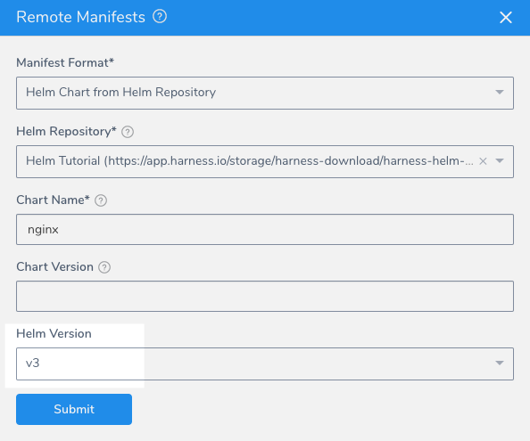
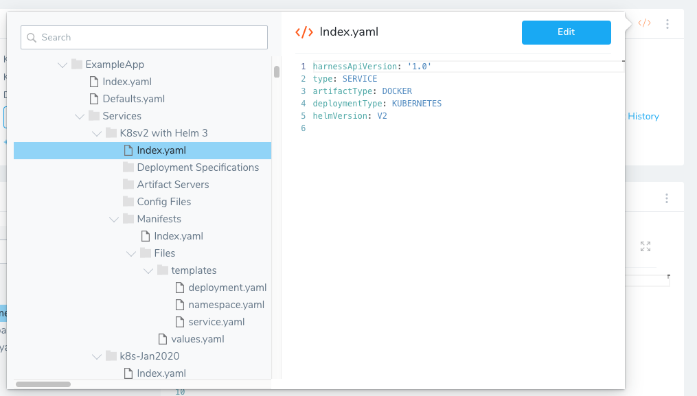

This topic describes how to upgrade your Harness Kubernetes Service to use Helm 3 charts.

You can use Helm 3 charts in both Kubernetes and native Helm Services. For information on upgrading native Helm Services, see [Upgrade Native Helm 2 Deployments to Helm 3](../helm-deployment/upgrade-native-helm-2-deployments-to-helm-3.md).

**What's a native Helm deployment in Harness?** Harness provides Kubernetes deployments that use Helm charts without requiring Helm or Tiller be installed in your target environment. These are called Harness Kubernetes deployments. This is the recommended method. If you want to deploy to a Kubernetes cluster using Helm explicitly, you can use native Helm deployments. You simply choose **Helm** as the **Deployment Type** when you create a Harness Service.I

### Review: Custom Helm Binaries

Harness ships Helm binaries with all Harness Delegates.

If you want the Delegate to use a specific Helm binary, do the following:

1. In the installed Harness Delegate folder **harness-delegate**, open the file **config-delegate.yml**.
	1. For a Helm 2 binary, add `helmPath`.
	2. For a Helm 3 binary, add `helm3Path`.
2. Next, enter the path to the binary. For example: `helm3Path: /usr/local/bin/helm_3`.

### Option 1: Upgrade Helm Version Number in the Harness UI

1. In Harness, locate a Kubernetes Service that uses Helm charts, or where you plan on using Helm charts.
2. In **Manifests**, click **Link Remote Manifests**. The **Remote Manifests** settings appear.
3. In **Manifest Format**, **Helm Chart from Helm Repository** will be selected already if you are upgrading an existing Service. For steps on configuring all of these settings, see [Use a Helm Repository with Kubernetes](use-a-helm-repository-with-kubernetes.md).
4. In **Helm Version**, select the Helm version of your chart, such as **v3**.
5. Click **Submit**.

You can now use Helm 3 charts.

### Option 2: Upgrade Helm Version Number in YAML

1. In Harness, locate a Service that uses Helm charts, or where you plan on using Helm charts.
2. In your Harness Kubernetes Service, click the **Configure As Code** button. The index.yaml for your Service contains the current Helm version used as `helmVersion: V2`:If `helmVersion` is not listed, do not worry. You can add it.
3. Click **Edit**.
4. Do one of the following:
	* Change `helmVersion: V2` to `helmVersion: V3`.
	* Add `helmVersion: V3`.
5. Click **Save**.

You can now use Helm 3 charts.

### Option 3: Use Helm v3.8.0 Binary

Currently, this feature is behind the feature flag `HELM_VERSION_3_8_0`. Contact [Harness Support](mailto:support@harness.io) to enable the feature.You can use Helm v3.8.0 binary by having Harness enable the feature flag `HELM_VERSION_3_8_0`.

When this feature flag is enabled and you have selected **V3** in **Helm Version** in **Remote Manifests**, Harness will use Helm version v3.8.0 by default.

### Step 2: Add Your Helm 3 Charts

You can add charts using one of the following options:

* [Link Resource Files or Helm Charts in Git Repos](link-resource-files-or-helm-charts-in-git-repos.md)
* [Use a Helm Repository with Kubernetes](use-a-helm-repository-with-kubernetes.md)

### Notes

* You do not need to add a Delegate Profile for Helm 3. Harness includes Helm 3 support in any Delegate that can connect to the target Kubernetes cluster.

### Next Steps

* [Configuration as Code](https://docs.harness.io/article/htvzryeqjw-configuration-as-code)

