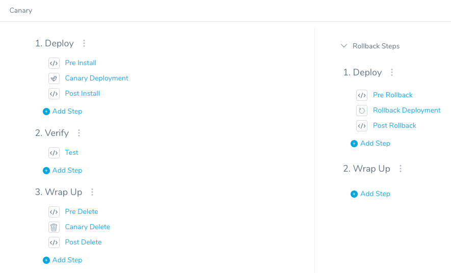
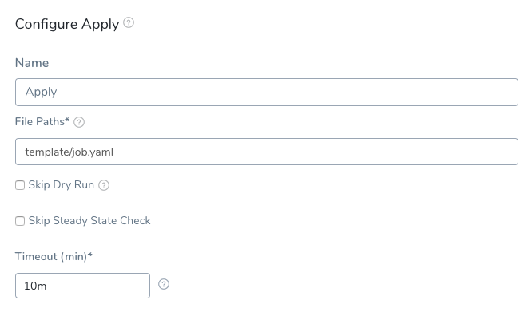
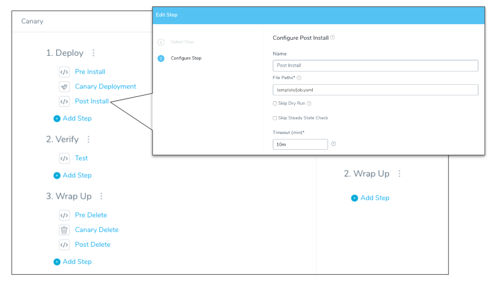
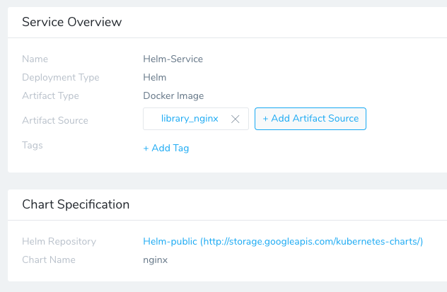
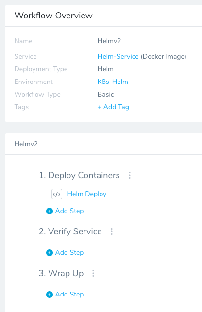

You can use [Helm chart hooks](https://helm.sh/docs/topics/charts_hooks/) in your Kubernetes deployments to intervene at specific points in a release cycle.

Harness provides a few ways to integrate your Helm chart hooks into your Harness deployments. You can use a native Helm deployment in Harness or use a Harness Kubernetes deployment which supports Canary and Blue/Green strategies.

This topic describes the available options.

### Before You Begin

* **Helm chart hooks** — We assume you are familiar with Helm chart hooks (sometimes called *lifecycle hooks*). If you are new to them, review Helm's [docs](https://helm.sh/docs/topics/charts_hooks/).
* **Harness Kubernetes and Helm differences** — Harness includes both Kubernetes and Helm deployments, and you can use Helm charts in both. Here's the difference:
	+ Harness [Kubernetes Deployments](kubernetes-deployments-overview.md) allow you to use your own Kubernetes manifests (remote or local) or a Helm chart, and Harness executes the Kubernetes API calls to build everything without Helm and Tiller needing to be installed in the target cluster.
	+ For Harness [Helm Deployments](../helm-deployment/helm-deployments-overview.md), you must always have Helm and Tiller running on one pod in your target cluster. Tiller makes the API calls to Kubernetes in these cases.
* **Apply step** — The Harness Workflow Apply step allows you to deploy any resource you have set up in the Service **Manifests** section at any point in your Workflow. See [Deploy Manifests Separately using Apply Step](deploy-manifests-separately-using-apply-step.md).

### Option 1: Kubernetes and the Apply Step

This is the recommended method. It allows you to use Harness Kubernetes Canary and Blue/Green deployments and to apply the hooks flexibly with the Apply step.

A Harness Kubernetes deployment runs `kubectl apply` for manifest files. There is no Tiller involved in this process because Harness is not running any Helm commands. Harness native Helm implementation can only perform [Basic deployments](../concepts-cd/deployment-types/deployment-concepts-and-strategies.md).

Let's implement a hook using Harness Kubernetes implementation, with no Helm or Tiller.

Here is a typical example of a Kubernetes Job using a Helm chart hook:


```
apiVersion: batch/v1  
kind: Job  
metadata:  
  name: "{{.Release.Name}}"  
  labels:  
    app.kubernetes.io/managed-by: {{.Release.Service | quote }}  
    app.kubernetes.io/instance: {{.Release.Name | quote }}  
    app.kubernetes.io/version: {{ .Chart.AppVersion }}  
    helm.sh/chart: "{{.Chart.Name}}-{{.Chart.Version}}"  
  annotations:  
    # This is what defines this resource as a hook. Without this line, the  
    # job is considered part of the release.  
    "helm.sh/hook": post-install  
    "helm.sh/hook-weight": "-5"  
    "helm.sh/hook-delete-policy": hook-succeeded  
spec:  
  template:  
    metadata:  
      name: "{{.Release.Name}}"  
      labels:  
        app.kubernetes.io/managed-by: {{.Release.Service | quote }}  
        app.kubernetes.io/instance: {{.Release.Name | quote }}  
        helm.sh/chart: "{{.Chart.Name}}-{{.Chart.Version}}"  
    spec:  
      restartPolicy: Never  
      containers:  
      - name: post-install-job  
        image: "alpine:3.3"  
        command: ["/bin/sleep","{{default "10" .Values.sleepyTime}}"]
```
The hook is a `post-install-job`. It will execute the Job after all resources are loaded into Kubernetes.

If you are using a *pre-install* hook, ensure the `hook-weight` is **less than** the `hook-weight` of the job.To implement Helm chart hooks in Harness Kubernetes deployments, you remove the Hook annotations and split out the Kubernetes Job as a separate yaml file in your Harness Service **Manifests**.

Next, you set when the Job is to be executed using the **Apply** step in your Workflow. Where you add the Apply step in the Workflow replaces the Helm hook annotation values (pre-install, post-delete, etc).

Here is an example of a Phase in a Harness Canary Workflow showing where all of the Helm chart hooks can be applied using Apply steps:



Using the example Job above, the Hook annotations are removed and the Kubernetes Job is set as a separate yaml file. In your Harness Service **Manifests** section, the Job manifest should look something like this:


```
apiVersion: batch/v1  
kind: Job  
metadata:  
  name: "{{.Release.Name}}"  
  labels:  
    app.kubernetes.io/managed-by: {{.Release.Service | quote }}  
    app.kubernetes.io/instance: {{.Release.Name | quote }}  
    app.kubernetes.io/version: {{ .Chart.AppVersion }}  
spec:  
  template:  
    metadata:  
      name: "{{.Release.Name}}"  
      labels:  
        app.kubernetes.io/managed-by: {{.Release.Service | quote }}  
        app.kubernetes.io/instance: {{.Release.Name | quote }}  
    spec:  
      restartPolicy: Never  
      containers:  
      - name: post-install-job  
        image: "alpine:3.3"
```
To apply the Job in a Workflow, you add the [Apply](deploy-manifests-separately-using-apply-step.md) step to your Workflow and reference the job.yaml in Service **Manifests**:



Since the original Helm chart hook was a `post-install`, you simply place the **Apply** step after the **Canary Deployment** step in your Workflow.



You can see the flexibility available for deploying your manifests in any order you want.

For example, if there is a `pre-install` Helm chart hook, you can use Apply to place this job.yaml *before* the Canary Deployment step.

With this method, you can integrate your hooks using the Canary and Blue/Green strategies.

### Option 2: Use Native Helm

You can also use a Harness native Helm implementation. This utilizes Helm and Tiller capabilities.

As noted, you cannot use Canary deployment or Blue/Green deployments. Native Helm deployments can only leverage a Basic deployment.

For a Harness native Helm implementation, you simply link to your remote Helm chart in your Harness Service.



And then deploy the chart using a Harness Basic Workflow:



You Helm chart hooks are implement by Helm and Tiller in your target cluster.

### Option: Delegate Selector

The Apply step has the **Delegate Selector** option.

If your Workflow Infrastructure Definition's Cloud Provider uses a Delegate Selector (supported in Kubernetes Cluster and AWS Cloud Providers), then the Workflow uses the selected Delegate for all of its steps.

In these cases, you shouldn't add a Delegate Selector to any step in the Workflow. The Workflow is already using a Selector via its Infrastructure Definition's Cloud Provider.

If your Workflow Infrastructure Definition's Cloud Provider isn't using a Delegate Selector, and you want this Workflow step to use a specific Delegate, do the following:

In **Delegate Selector**, select the Selector for the Delegate(s) you want to use. You add Selectors to Delegates to make sure that they're used to execute the command. For more information, see [Select Delegates with Selectors](https://docs.harness.io/article/c3fvixpgsl-select-delegates-for-specific-tasks-with-selectors).

Harness will use Delegates matching the Selectors you add.

If you use one Selector, Harness will use any Delegate that has that Selector.

If you select two Selectors, a Delegate must have both Selectors to be selected. That Delegate might also have other Selectors, but it must have the two you selected.

You can use expressions for Harness built-in variables or Account Default variables in **Delegate Selectors**. When the variable expression is resolved at deployment runtime, it must match an existing Delegate Selector.  
  
For example, if you have a Delegate Selector **prod** and the Workflow is using an Environment also named **prod**, the Delegate Selector can be `${env.name}`. This is very useful when you match Delegate Selectors to Application component names such as Environments, Services, etc. It's also a way to template the Delegate Selector setting.

### Related

* [Deploy Manifests Separately using Apply Step](deploy-manifests-separately-using-apply-step.md)
* [Create a Kubernetes Blue/Green Deployment](create-a-kubernetes-blue-green-deployment.md)
* [Create a Kubernetes Canary Deployment](create-a-kubernetes-canary-deployment.md)
* [Create a Kubernetes Rolling Deployment](create-a-kubernetes-rolling-deployment.md)
* [Deployment Concepts and Strategies](../concepts-cd/deployment-types/deployment-concepts-and-strategies.md)

