Harness supports [Kustomize](https://kustomize.io/) kustomizations in your Kubernetes deployments. You can use overlays, multibase, plugins, sealed secrets, etc, just as you would in any native kustomization.

**New to Kustomize?** In a nutshell, kustomizations let you create specific Kubernetes deployments while leaving the original manifests untouched. You drop a kustomization.yaml file next to your Kubernetes YAML files and it defines new behavior to be performed during deployment.  
Please review the video [Kustomize: Deploy Your App with Template Free YAML](https://youtu.be/ahMIBxufNR0) (30min), the [Kustomize Glossary](https://kubectl.docs.kubernetes.io/references/kustomize/glossary/), and the [Declarative Management of Kubernetes Objects Using Kustomize](https://kubernetes.io/docs/tasks/manage-kubernetes-objects/kustomization/).

### Before You Begin

* [Connect to Your Target Kubernetes Platform](connect-to-your-target-kubernetes-platform.md)
* [Kubernetes Quickstart](https://docs.harness.io/article/7in9z2boh6-kubernetes-quickstart)

Kustomize is supported in Harness Kubernetes v2 Services only. This is the default type, but some Harness users might be using a legacy Kubernetes v1 Service.

### Visual Summary

The following diagram shows a very simple topology for implementing Kustomize.

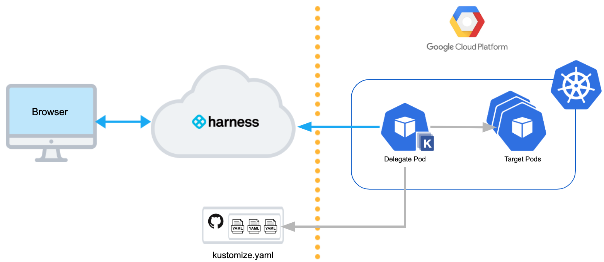

The Harness Kubernetes Delegate runs in the target cluster with Kustomize pre-installed. The Delegate obtains kustomization.yaml and resource files from a Git repo. The Delegate deploys the Kubernetes objects declared using Kustomize in the target pods.

In this diagram we use Google GCP, but Harness deploys to any Kubernetes cluster vendor.

### Video Summary

<!-- Video:
https://harness-1.wistia.com/medias/rpv5vwzpxz-->
<docvideo src="https://www.youtube.com/embed/BlxPanrpaX0" />

### Limitations

Currently, Harness support for Kustomize has the following limitations:

* Harness variables and secrets are not supported.
	+ Harness variables are not supported because Kustomize follows a template-free methodology.
	+ Use [sealed secrets](https://github.com/bitnami-labs/sealed-secrets) instead. See **Sealed Secrets** in [How to keep your Kubernetes secrets secure in Git](https://learnk8s.io/kubernetes-secrets-in-git) by Omer Levi Hevroni.
* Harness artifacts are not supported, as described in [Review: Artifact Sources and Kustomization](#review_artifact_sources_and_kustomization).
* Harness does not use Kustomize for rollback. Harness renders the templates using Kustomize and then passes them onto kubectl. A rollback works exactly as it does for native Kubernetes.

### Review: Kustomize and Harness Delegates

All Harness Delegates include kustomize by default. There is no installation required.

Your Delegate hosts, typically a pod in the target cluster, require outbound HTTPS/SSH connectivity to Harness and your Git repo.

The Delegate you use for Kustomize deployments must have access to the Git repo containing your kustomize and resource files.The remainder of this topic assumes you have a running Harness Delegate and Cloud Provider connection. For details on setting those up, see [Connect to Your Target Kubernetes Platform](connect-to-your-target-kubernetes-platform.md).

### Step 1: Connect to Your Kustomize Repo

You add a connection to the repo containing your kustomize and resource files as a Harness Source Repo Provider.

For details on adding a Source Repro Provider, see [Add Source Repo Providers](https://docs.harness.io/article/ay9hlwbgwa-add-source-repo-providers).

Here is a quick summary:

1. In Harness, click **Setup**, and then **Connectors**.
2. Click **Source Repo Providers**, and then click **Add Source Repo Provider**.
3. Provide the following settings and click **Submit**:


|  |  |
| --- | --- |
|  | * **Display Name:** You will use this name to select the repo in your Harness Service.
* **URL:** Provide the Git repo URL.
* **Username/password:** Enter your Git credentials.
* **Branch:** Enter the name of the branch you want to use, such as **master**.
 |

The Delegate you use for Kustomize deployments must have access to the Git repo containing your kustomize and resource files.Now you have a connection to your kustomize and resource files. Next, you can identify these files as Remote Manifests in a Harness Service.

The following steps assume you have created a Harness Service for your Kubernetes deployment. For details, see [Create the Harness Kubernetes Service](define-kubernetes-manifests.md#step-1-create-the-harness-kubernetes-service).

### Review: Artifact Sources and Kustomization

Typically, Harness Services are configured with an Artifact Source. This is the container image or other artifact that Harness will deploy. For Kustomize, you do not specify an Artifact Source in your Harness Service.

The artifact you want to deploy must be specified in a spec (for example, deployment.yaml). If the image is in the public Docker hub repo, you can just list its name:


```
...  
spec:  
  containers:  
  - name: app  
    image: pseudo/your-image:latest  
...
```
If your image is hosted in a private Docker hub repo, you need to specify an [imagePullSecrets](https://kubernetes.io/docs/tasks/configure-pod-container/pull-image-private-registry/) in the spec field:


```
...  
spec:  
  containers:  
  - name: app  
    image: pseudo/your-image:latest  
  imagePullSecrets:  
  - name: dockerhub-credential  
 ...
```
### Step 2: Add Manifests and Kustomization

1. In your Harness Service, in **Manifests**, click **Link Remote Manifests**.

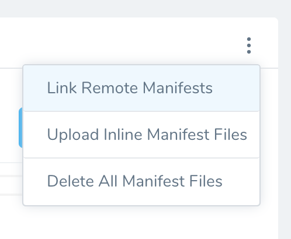

1. In **Remote Manifests**, in **Manifest Format**, click **Kustomization Configuration**.
2. Enter the following settings and click **Submit**.


|  |  |
| --- | --- |
|  | * **Source Repository:** Select the Source Repo Provider connection to your repo.
* **Commit ID:** Select **Latest from Branch** or **Specific Commit ID**. Do one of the following:
	+ **Branch:** Enter the branch name, such as **master**.
	+ **Commit ID:** Enter the Git commit ID.
* **Path to kustomization directory:** This setting is discussed below.
* **Path to Kustomize plugin on Delegate:** Enter the path to the plugin installed on the Delegate. This setting and using plugins are discussed later in this topic.
 |

Once you have set up **Kustomization Configuration**, you can use the Service in a Harness Workflow. There are no other Kustomize-specific settings to configure in Harness.

#### Path to Kustomization Directory

You can manually enter the file path to your [kustomization root](https://kubectl.docs.kubernetes.io/references/kustomize/glossary/#kustomization-root): The directory that contains a kustomization.yaml file in your repo. You do not need to enter the filename.

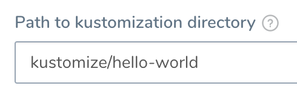

If you are using overlays, enter the path to the overlay kustomization.yaml.

As explained below, you can use Harness variable expressions in **Path to kustomization directory** to dynamically select bases for overlays.

#### Skip Versioning for Service

By default, Harness versions ConfigMaps and Secrets deployed into Kubernetes clusters. In some cases, you might want to skip versioning.

Typically, to skip versioning in your deployments, you add the annotation `harness.io/skip-file-for-deploy` to your manifests. See [Deploy Manifests Separately using Apply Step](deploy-manifests-separately-using-apply-step.md).

In some cases, such as when using public manifests or Helm charts, you cannot add the annotation. Or you might have 100 manifests and you only want to skip versioning for 50 of them. Adding the annotation to 50 manifests is time-consuming.

Instead, enable the **Skip Versioning for Service** option in **Remote Manifests**.

When you enable **Skip Versioning for Service**, Harness will not perform versioning of ConfigMaps and Secrets for the Service.

If you have enabled **Skip Versioning for Service** for a few deployments and then disable it, Harness will start versioning ConfigMaps and Secrets.

#### Review: Artifact Sources and Kustomization

You can list artifacts in two ways:

* Artifacts can be hardcoded in the deployment YAML file deployed using your Kustomization files.
* You can add artifacts to the Service **Artifact Source** section and reference them in Kustomize Patch files using the Harness variable `${artifact.metadata.image}`. See [Option: Kustomize Patches](#option_kustomize_patches) below, and [Built-in Variables List](https://docs.harness.io/article/aza65y4af6-built-in-variables-list).

### Option: Kustomize Patches

Currently, this feature is behind the Feature Flag `KUSTOMIZE_PATCHES_CG`. Contact [Harness Support](mailto:support@harness.io) to enable the feature. When you enable this Feature Flag, you will be able to use Kustomize version 4.0.0.You cannot use Harness variables in the base manifest or kustomization.yaml. You can only use Harness variables in kustomize patches you add in **Kustomize Patches**.Kustomize patches override values in the base manifest. Harness supports the `patchesStrategicMerge` patches type.

For example, let's say you have a simple kustomization.yaml for your **application** folder like this:


```
resources:  
  - namespace.yaml  
  - deployment.yaml  
  - service.yaml  
  - configmap.yaml
```
And you have an overlay for a production environment that points to the **application** folder like this:


```
resources:  
  - ../../application  
namePrefix: nonpro-  
configMapGenerator:  
- name: example-config  
  namespace: default  
  #behavior: replace  
  files:  
    - configs/config.json  
patchesStrategicMerge:  
  - env.yaml
```
The `patchesStrategicMerge` label identifies the location of the patch **env.yaml**, which looks like this:


```
apiVersion: apps/v1  
kind: Deployment  
metadata:  
  name: example-deploy  
spec:  
  template:  
    spec:  
      containers:  
      - name: example-app  
        env:  
        - name: ENVIRONMENT  
          value: Production
```
As you can see, it patches a new environment variable `name: ENVIRONMENT`.

Here's what the patching looks like side-by-side:

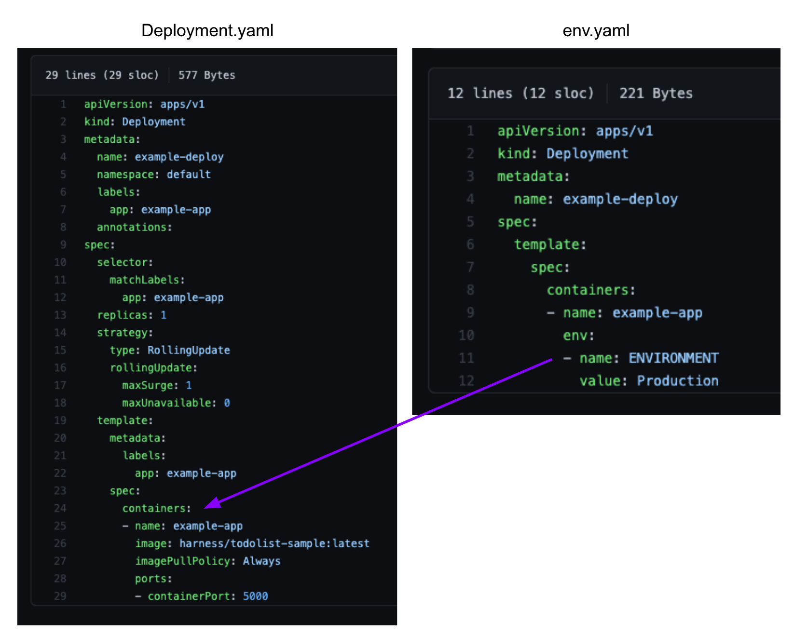

When the kustomization.yaml is deployed, the patch is rendered and the environment variable is added to the deployment.yaml that is deployed.

#### Adding Kustomize Patches

You cannot use Harness variables in the base manifest or kustomization.yaml. You can only use Harness variables in kustomize patches you add in **Kustomize Patches**.In **Service**, in **Configuration**, in **Kustomize Patches**, click **Add Patches**.

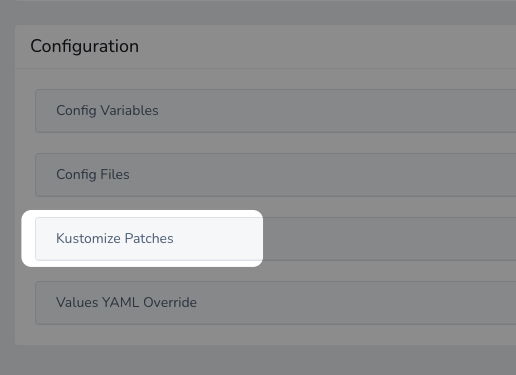

You can add multiple files by using **Add Patches** multiple times.In **Store Type**, select **Inline** or **Remote**.

For **Inline**, enter the patch YAML, and click **Submit**.

For **Remote**, in **Source Repository**, select your Source Repo Connector. See [Add Source Repo Providers](https://docs.harness.io/article/ay9hlwbgwa-add-source-repo-providers).

For Commit ID, select whether to use the latest branch or a specific commit Id/Git tag.

In **Branch**/**Commit Id**: enter the branch or commit Id/Git tag.

In **File/Folder Path:** enter the path to the patch file(s) from the root of the repo. The file you add should be the same file listed in `patchesStrategicMerge` of the main kustomize file in your Service.

You can add multiple files by using **Add Patches** multiple times.The order in which you add file paths for patches in **File/Folder Path** is the same order that Harness applies the patches during the kustomization build.Small patches that do one thing are recommended. For example, create one patch for increasing the deployment replica number and another patch for setting the memory limit.Click **Submit**. The patch file(s) is added to **Kustomize Patches**.

When the main kustomization.yaml is deployed, the patch is rendered and its overrides are added to the deployment.yaml that is deployed.

##### How Harness Uses patchesStrategicMerge

If the `patchesStrategicMerge` label is missing from the kustomization YAML file, but you have added Kustomize Patches to your Harness Service, Harness will add the Kustomize Patches you added in Harness to the `patchesStrategicMerge` in the kustomization file.

If you have hardcoded patches in `patchesStrategicMerge`, but not add these patches to Harness as Kustomize Patches, Harness will ignore them.

#### Using Harness Variables in Patches

Currently, this feature is behind the Feature Flag `KUSTOMIZE_PATCHES_CG`. Contact [Harness Support](mailto:support@harness.io) to enable the feature.Kustomize does not natively support variable substitution but Harness supports variable substitution using [Harness variable expressions](https://docs.harness.io/article/9dvxcegm90-variables) in Kustomize patches.

This allows you to configure any patch YAML labels as Harness variables expressions and replace those values at Pipeline runtime.

Let's look at an example.

Here is the deployment.yaml used by our kustomization:


```
apiVersion: apps/v1  
kind: Deployment  
metadata:  
  name: example-deploy  
  namespace: default  
  labels:  
    app: example-app  
  annotations:  
spec:  
  selector:  
    matchLabels:  
      app: example-app  
  replicas: 1  
  strategy:  
    type: RollingUpdate  
    rollingUpdate:  
      maxSurge: 1  
      maxUnavailable: 0  
  template:  
    metadata:  
      labels:  
        app: example-app  
    spec:  
      containers:  
      - name: example-app  
        image: harness/todolist-sample:latest  
        imagePullPolicy: Always  
        ports:  
        - containerPort: 5000
```
You cannot use Harness variables in the base manifest or kustomization.yaml. You can only use Harness variables in kustomize patches you add in **Kustomize Patches**.You add the patch files that will patch deployment.yaml to **Kustomize Patches**. Only these patch files can use Harness variables.

We're going to use variables for `replicas` and `image`.

Let's look at the Harness variables in our Service. Here are two Service [Config Variables](https://docs.harness.io/article/q78p7rpx9u-add-service-level-config-variables):

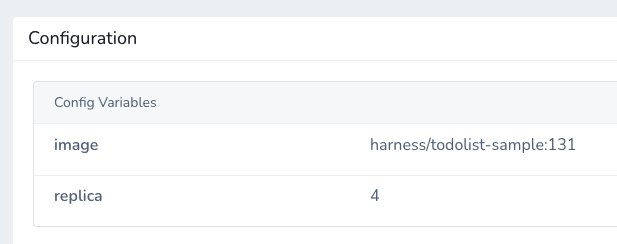

One variable is for the `image` and another for the `replicas` count.

A patch using these variables will look like this:


```
apiVersion: apps/v1  
kind: Deployment  
metadata:  
 name: example-deploy  
 namespace: default  
spec:  
 template :  
   spec:  
     containers:  
       - name: example-app  
         image: ${serviceVariable.image}  
   
---  
apiVersion: apps/v1  
kind: Deployment  
metadata:  
 name: example-deploy  
 namespace: default  
spec:  
 replicas: ${serviceVariable.replica}
```
Add this patch in the Service **Kustomize Patches**.

Now, when the Pipeline is run, the values for the two variables are rendered in the patch YAML and then the patch is applied to the deployment.yaml.

If you look at the Initialize phase of the deployment step (in Rolling, Canary, etc), you can see the variable values rendered in the Deployment manifest.

#### Using Harness Secrets in Patches

You can also use [Harness secrets](https://docs.harness.io/article/ygyvp998mu-use-encrypted-text-secrets) in patches.

For example, let's say we have two secrets, one for `image` and one for `app`:

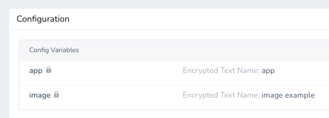

The following patch uses these secrets for `image` and `app`, referencing them using the expression `${secrets.getValue("[secret name]")}`.


```
apiVersion: apps/v1  
kind: Deployment  
metadata:  
  name: example-deploy  
  namespace: default  
spec:  
  template :  
    spec:  
      containers:  
        - name: example-app  
          image: ${secrets.getValue("image-example")}  
  
---  
apiVersion: v1  
kind: Service  
metadata:  
  name: example-service  
  namespace: default  
spec:  
  selector:  
    app: ${secrets.getValue("app")}
```
The secret output in the manifest will be asterisks (\*). The secret value is not displayed.

#### Override Patches in Environments

You can override the Service settings for **Kustomize Patches** in a Harness Environment using **Service Configuration Overrides**.

Click **Service Configuration Overrides**.

In **Service**, select the Service for your kustomization that has **Kustomize Patches** configured.

In **Override Type**, click **Kustomize Patches**.

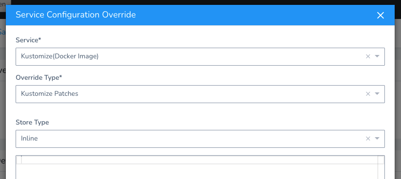

In **Store Type**, select **Inline** or **Remote**.

For **Inline**, enter the patch YAML, and click **Submit**.

For **Remote**, in **Source Repository**, select your Source Repo Connector. See [Add Source Repo Providers](https://docs.harness.io/article/ay9hlwbgwa-add-source-repo-providers).

For Commit ID, select whether to use the latest branch or a specific commit Id/Git tag.

In **Branch**/**Commit Id**: enter the branch or commit Id/Git tag.

In **File/Folder Path:** enter the path to the patch file(s) from the root of the repo. The file you add should be the same file listed in `patchesStrategicMerge` of the main kustomize file in your Service.

You can add multiple files by using **Add Patches** multiple times.The order in which you add file paths for patches in **File/Folder Path** is the same order that Harness applies the patches during the kustomization build.Small patches that do one thing are recommended. For example, create one patch for increasing the deployment replica number and another patch for setting the memory limit.Click **Submit**. The patch file(s) is added to **Service Configuration Overrides**.

### Option: Overlays and Multibases using Variable Expressions

An overlay is a kustomization that depends on another kustomization, creating variants of the common base. In simple terms, overlays change pieces of the base kustomization.yaml. These are commonly used in patches.

A multibase is a type of overlay where copies of the base use the base but make additions, like adding a namespace.yaml. Basically, you are declaring that the overlays aren't just changing pieces of the base, but are new bases.

In both overlays and multibases, the most common example is staging and production variants that use a common base but make changes/additions for their environments. A staging overlay could add a configMap and a production overlay could have a higher replica count and persistent disk.

To execute a staging overlay you would run the following command selecting the overlay's root:


```
kubectl apply -f $DEMO_HOME/overlays/staging
```
To deploy each overlay in Harness, you could create a Service for each overlay and configure the **Path to kustomization directory** setting in **Remote Manifests** to point to the overlay root:

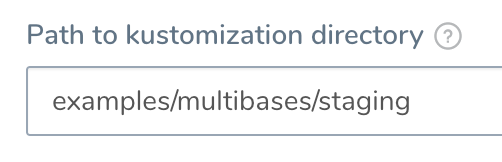

A better method is to use a single Service for all bases and manually or dynamically identify which base to use at deployment runtime.

You can accomplish this using Harness Variable Expressions in **Path to kustomization directory**

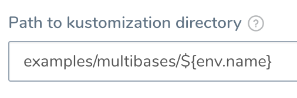

##### Environment Name Variables

Using Environment name variables is the simplest method of using one Service and selecting from multiple bases.

First, in your repo, create separate folders for each environment's kustomization.yaml. Here we have folders for **dev**, **production**, and **staging**:

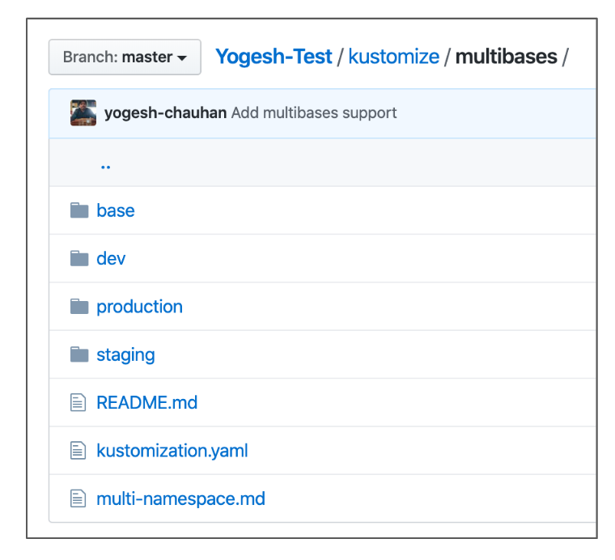

The kustomization.yaml file in the root will reference these folders of course:


```
resources:  
- dev  
- staging  
- production
```
We are only concerned with staging and production in this example.

Next, mirror the repo folder names in Harness Environment names. Here we have two Environments named **production** and **staging** for the corresponding repo folders named **production** and **staging**.

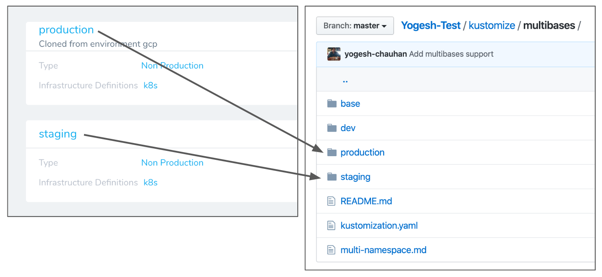

Next, use the built-in Harness variable expression `${env.name}` in **Path to kustomization directory** to use the Environment names. The `${env.name}` expression resolves to the name of the Harness Environment used by a Workflow.

For example, if you have two Environments named **production** and **staging**, at deployment runtime the `${env.name}` expression resolves to whichever Environment is used by the Workflow.


Now, to use the `${env.name}` expression in **Path to kustomization directory**, and reference the Environments and corresponding folders, you would enter `kustomize/multibases/${env.name}`.

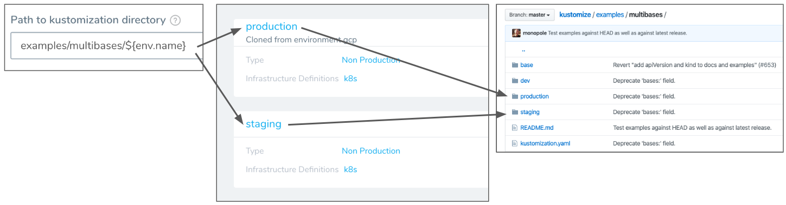

Each time a Workflow runs, it will replace the `${env.name}` expression with the name of the Environment selected for the Workflow.

For example, if the Workflow uses the Environment **production**, the **Path to kustomization directory** setting will become `kustomize/multibases/production`. Now Harness looks in the **production** folder in your repo for the kustomization.yaml file.

Once you have created a Workflow, you can templatize its Service setting so that you can select the Environment and its corresponding repo folder:

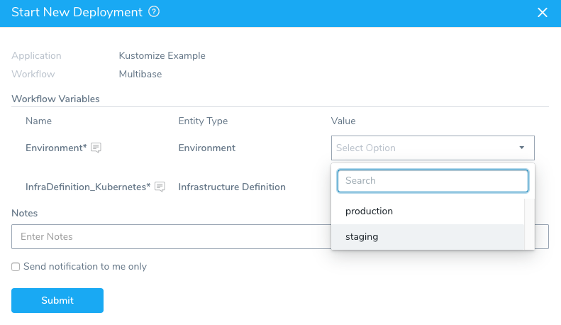

You can also select the Environment in a Trigger than executes the Workflow:

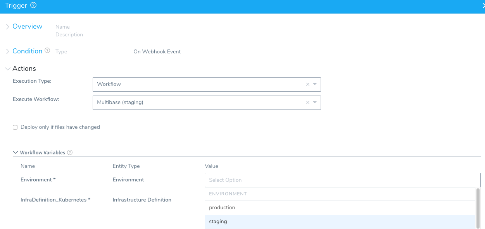

For more information, see [Triggers](https://docs.harness.io/article/xerirloz9a-add-a-trigger-2) and [Passing Variables into Workflows and Pipelines from Triggers](https://docs.harness.io/article/revc37vl0f-passing-variable-into-workflows).

##### Service Variables

You can also use Service variables in **Path to kustomization directory**. This allows you to templatize the **Path to kustomization directory** setting and overwrite it at the Harness Environment level. Let's look at an example.

Here is an example of using a Service variable in **Path to kustomization directory**:

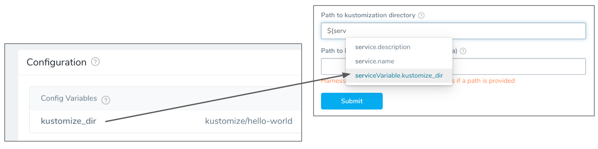

If you have Service **Config Variables** set up, you will see the variable expressions displayed when you enter `$`. For details on Service variables, see [Services](https://docs.harness.io/article/eb3kfl8uls-service-configuration).

Service variables can be overwritten at the Harness Environment level. This allows you to use a variable for the **Path to kustomization directory** setting and then override it for each Harness Environment you use with this Service.

For example, if you have two Environments, staging and production, you can supply different values in each Environment for **Path to kustomization directory**.

For details on overriding Service settings, see [Override Harness Kubernetes Service Settings](override-harness-kubernetes-service-settings.md).

##### Workflow Variables

For Workflow variables, you need to create the variable in the Workflow and then enter the variable name manually in **Path to kustomization directory**, following the format `${workflow.variable.variable_name}`.

Here is an example of using a Workflow variable for **Path to kustomization directory**:

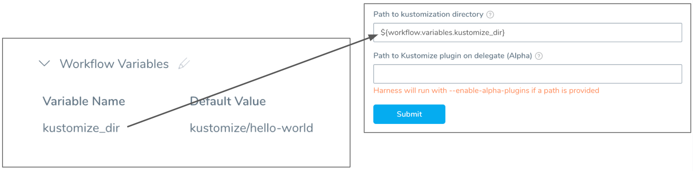

If you use Workflow variables for **Path to kustomization directory**, you can provide a value for **Path to kustomization directory** when you deploy the Workflow (standalone or as part of a Pipeline).

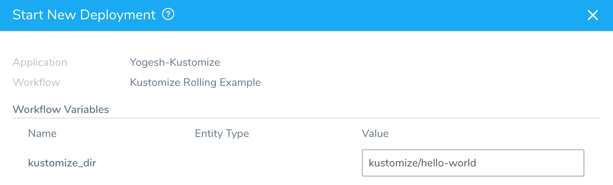

Typically, when you deploy a Workflow, you are prompted to select an artifact for deployment. If a Workflow is deploying a Service that uses a remote **Kustomization Configuration**, you are not prompted to provide an artifact for deployment.See [Workflows](https://docs.harness.io/article/m220i1tnia-workflow-configuration) and [Kubernetes Workflow Variable Expressions](https://docs.harness.io/article/9dvxcegm90-variables).

### Option: Use Plugins in Deployments

Kustomize offers a plugin framework to generate and/or transform a kubernetes resource as part of a kustomization.

You can add your plugins to the Harness Delegate(s) and then reference them in the Harness Service you are using for the kustomization.

When Harness deploys, it will apply the plugin you reference just like you would with the `--enable_alpha_plugins` parameter. See [Extending Kustomize](https://kubectl.docs.kubernetes.io/guides/extending_kustomize/) from Kustomize.

#### Add Plugins to Delegate using a Delegate Profile

To add a plugin to a Delegate, you create a Delegate Profile and apply it to the Delegates.

1. In Harness, click **Setup**, and click **Harness Delegates**.
2. Click **Manage Delegate Profiles**, and then click **Add Delegate Profile**. The Delegate Profile settings appear.
3. Enter a name and the script for the plugin and click **Submit**.

For example, here is a ConfigMap generator plugin script:


```
MY_PLUGIN_DIR=$HOME/K_PLUGINS/kustomize/plugin/myDevOpsTeam/sillyconfigmapgenerator  
mkdir -p $MY_PLUGIN_DIR  
cat <<'EOF' >$MY_PLUGIN_DIR/SillyConfigMapGenerator  
#!/bin/bash  
# Skip the config file name argument.  
shift  
today=`date +%F`  
echo "  
kind: ConfigMap  
apiVersion: v1  
metadata:  
  name: the-map  
data:  
  today: $today  
  altGreeting: "$1"  
  enableRisky: "$2"  
"  
EOF  
cat $MY_PLUGIN_DIR/SillyConfigMapGenerator  
chmod +x $MY_PLUGIN_DIR/SillyConfigMapGenerator  
readlink -f $MY_PLUGIN_DIR/SillyConfigMapGenerator
```
Each plugin is added to its own directory, following this convention:


```
$XDG_CONFIG_HOME/kustomize/plugin  
    /${apiVersion}/LOWERCASE(${kind})
```
The default value of `XDG_CONFIG_HOME` is `$HOME/.config`. See [Placement](https://kubectl.docs.kubernetes.io/guides/extending_kustomize/go_plugins/#placement) from Kustomize.

In the script example above, you can see that the plugin is added to its own folder following the plugin convention:


```
$HOME/K_PLUGINS/kustomize/plugin/myDevOpsTeam/sillyconfigmapgenerator
```
Note the location of the plugin because you will use that location in the Harness Service to indicate where the plugin is located (described below).

Plugins can only be applied to Harness Kubernetes Delegates.Next, apply the Profile to Kubernetes Delegate(s):

1. Click the Profile menu in the Delegate lists and choose your Profile.

   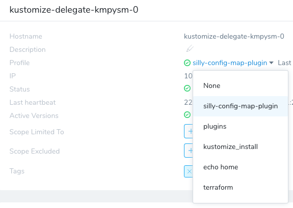

2. Click **Confirm**.

Wait a few minutes for the Profile to install the plugin. Next click **View Logs** to see the output of the Profile.

#### Select Plugin in Service

Once the plugin is added to the Delegate(s), you can reference it in the Remote Manifests **Path to Kustomize plugin on Delegate** setting in the Harness Service. You will indicate the same location where your Delegate Profile script installed the plugin:

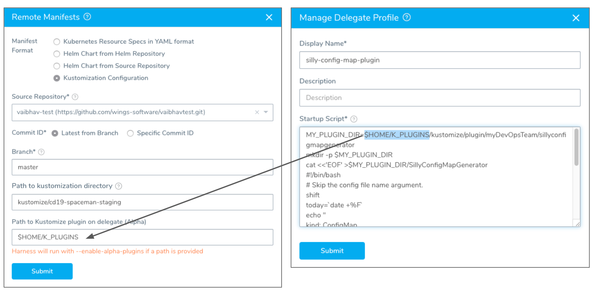

Click **Submit**. Harness is now configured to use the plugin when it deploys using kustomize.

### Example 1: Multibase Rolling Deployment

For this example, we will deploy the [multibases example for Kustomize](https://github.com/kubernetes-sigs/kustomize/tree/master/examples/multibases) in a Rolling Update strategy. You can set up a [Harness Source Repro Provider](https://docs.harness.io/article/ay9hlwbgwa-add-source-repo-providers) to connect to that repo.

We will use Harness Environment names that match the base folder names in the repo.

In the Harness Service, we will use the `${env.name}` expression in the **Path to kustomization directory** setting.

When we deploy, the Workflow will use the name of the Environment in **Path to kustomization directory** and the corresponding repo folder's kustomization.yaml will be used.

Here is what the repo looks like:

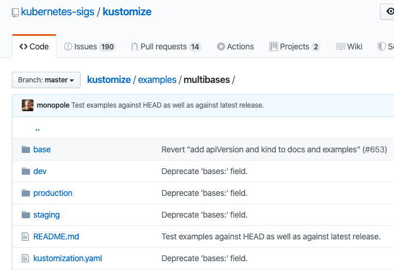

Here are the Harness Environments whose names correspond to the dev, stage, and production repo folders:

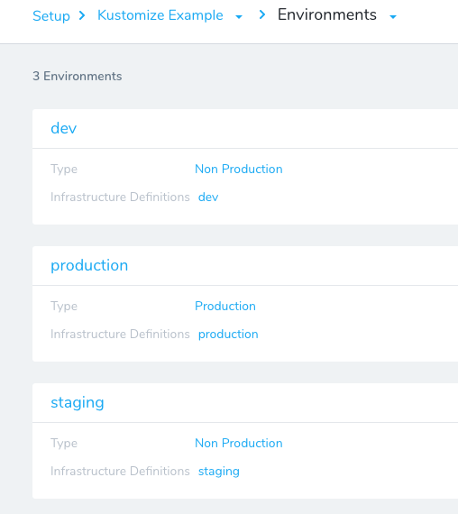

Here is the Harness Service **Remote Manifests** settings. The **Path to kustomization directory** setting uses the `${env.name}` expression that will be replaced with a Harness Environment name at deployment runtime.

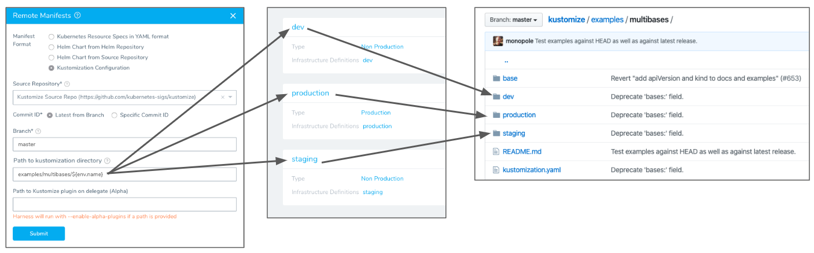

Next we'll create a Workflow using the Rolling Deployment strategy. Here we select the Service we set up.

When you first create the Workflow you cannot set the **Environment** setting as a variable expression. Create the Workflow using any of the Environments, and then edit the Workflow settings and turn the **Environment** and **Infrastructure Definition** settings to variable expressions by clicking their **[T]** icons.

When you are done, the Workflow settings will look like this:

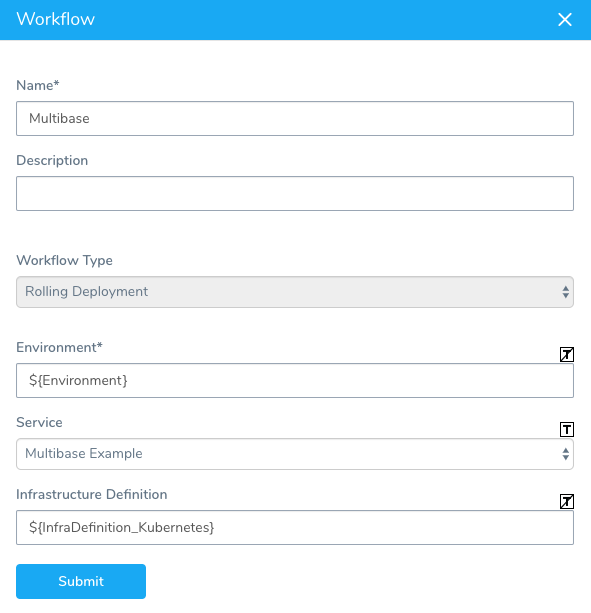

There is nothing to set up in the Workflow. Harness automatically adds the Rollout Deployment step that performs the Kubernetes Rolling Update.

In the Workflow, click **Deploy**. In **Start New Deployment**, select the name of the Environment that corresponds to the repo folder containing the base you want to use:

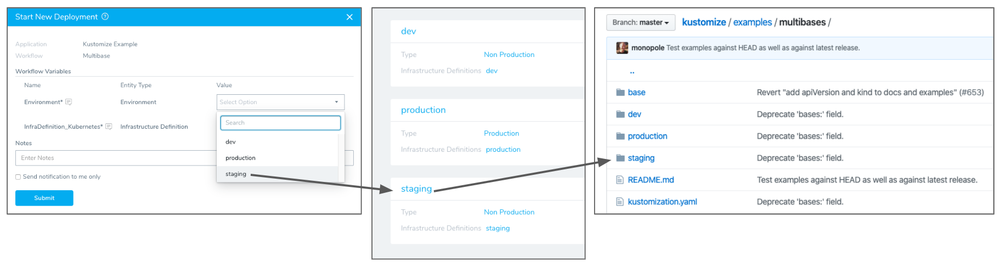

In this example, we select the **stage** Environment. Once deployment is complete you can see the stage repo folder's base used and the `staging-myapp-pod` created:

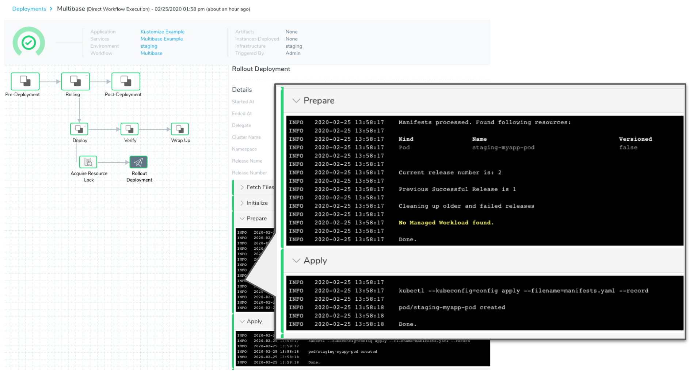

### Review: What Workloads Can I Deploy?

See [What Can I Deploy in Kubernetes?](https://docs.harness.io/article/6ujb3c70fh).

### Change the Default Path for the Kustomize Binary

The Harness Delegate ships with the 3.5.4 [release](https://github.com/kubernetes-sigs/kustomize/releases) of Kustomize.

If you want to use a different release of Kustomize, add it to a location on the Delegate, update the following Delegate files, and restart the Delegate.

See [Manage Harness Delegates](https://docs.harness.io/category/gyd73rp7np-manage-delegates) for details on each Delegate type.

#### Shell Script Delegate

Add `kustomizePath: <path>` to config-delegate.yml.

#### Kubernetes Delegate

Update the `value` environment variable in harness-delegate.yaml:


```
...  
name: KUSTOMIZE_PATH  
value: "<path>"  
...
```
#### Helm Delegate

Add `kustomizePath: "<path>"` to harness-delegate-values.yaml.


```
kustomizePath: "<path>"
```
#### Docker Delegate

Set the Kustomize path in the launch-harness-delegate.sh:


```
-e KUSTOMIZE_PATH= <path> \
```
#### ECS Delegate

Update the following in ecs-task-spec.json:


```
...  
{  
  "name": "KUSTOMIZE_PATH",  
  "value": "<path>"  
}  
...
```
### Next Steps

* [Create a Kubernetes Rolling Deployment](create-a-kubernetes-rolling-deployment.md)
* [Create a Kubernetes Canary Deployment](create-a-kubernetes-canary-deployment.md)
* [Create a Kubernetes Blue/Green Deployment](create-a-kubernetes-blue-green-deployment.md)

