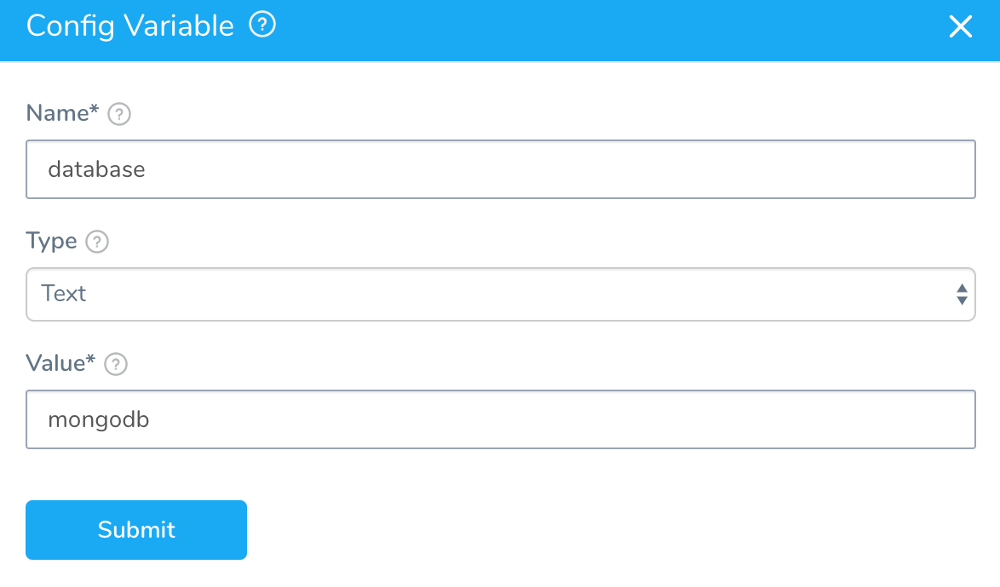
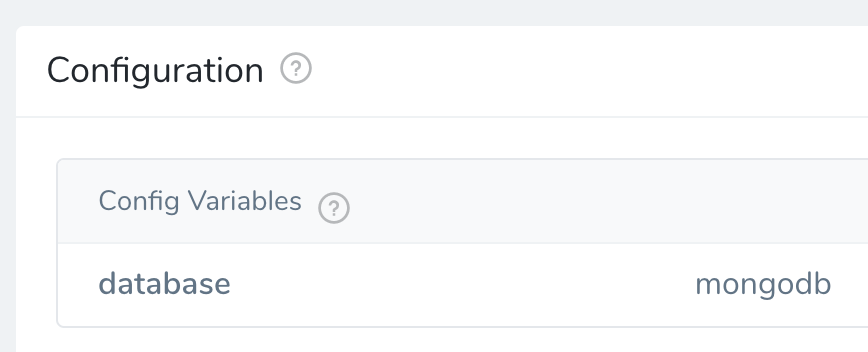
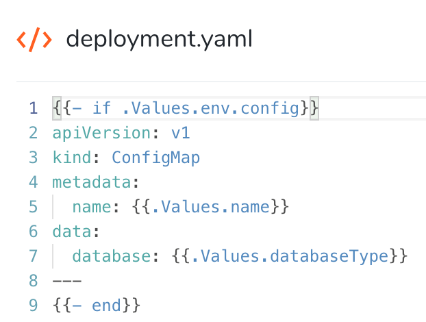

This content is for Harness [FirstGen](../../../getting-started/harness-first-gen-vs-harness-next-gen.md). Switch to [NextGen](https://docs.harness.io/category/qfj6m1k2c4).

You can create a variable in the Harness Kubernetes Service **Config Variables** section and then use it in your **Manifests** files, such as in the ConfigMap definition.

### Before You Begin

* [Services](https://docs.harness.io/article/eb3kfl8uls-service-configuration)
* [Define Kubernetes Manifests](define-kubernetes-manifests.md)

In Harness Kubernetes version 1 implementation, Harness would create the ConfigMap automatically using the `${CONFIG_MAP_NAME}` expression and all unencrypted Service **Config Variables** and **Config Files**. In the current Harness Kubernetes implementation, you define your ConfigMap manually using the values.yaml and **Config Variables** and **Config Files**.

### Review: Config Variable Reference Scope

You cannot reference a Service's Config Variable in the Pre-Deployment Phase of a Workflow. Canary and Multi-Service Workflows are the only Workflow types with the Pre-Deployment Phase.

The Pre-Deployment Phase does not use a Service and so it has no access to Service Config Variables (or Config Files).

You can reference a Service's Config Variable in the Deployment Phase of the Workflow.

### Step 1: Create the Service Variable in Config Variables

For this explanation, we'll create a variable that indicates the database to use for a ConfigMap.

1. In **Config Variables**, click **Add Variable**.
2. In **Config Variable**, add a variable named `database` with the value `mongodb`.

   

3. Click **Submit**. The variable is added to the **Config Variables** section.

  

### Step 2: Reference the Service Variable in values.yaml

1. In **values.yaml**, create a new variable named `databaseType` that references the Service variable `database`:

   

### Step 3: Reference the Variable in the Manifest

1. In the manifest file containing you object (in this example, ConfigMap), reference the values.yaml variable in the ConfigMap `data` section.

   

When the Service is deployed, the Service variable will be used to provide the value `mongodb` to the `data` label in ConfigMap.

### Notes

* You can also overwrite the Service variable in an Environment **Service Configuration Override.** When a Workflow using that Service and Environment deploys, the Service variable for the ConfigMap `data` value will be overwritten. See [Override Harness Kubernetes Service Settings](override-harness-kubernetes-service-settings.md).

### Next Steps

* [Define Kubernetes Manifests](define-kubernetes-manifests.md)

