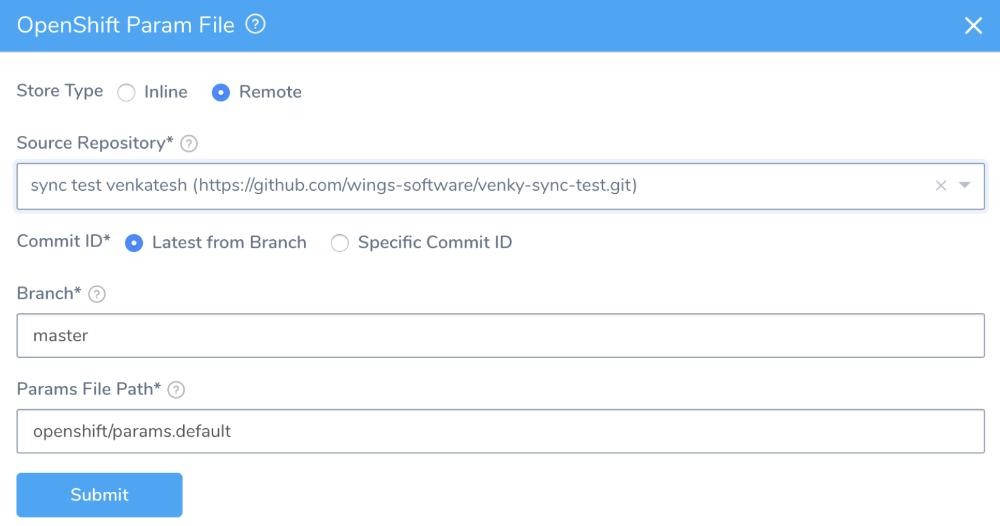

Harness supports OpenShift for Kubernetes deployments. This topic reviews OpenShift support in the Harness Delegate and Workflows.

### Before You Begin

* [Connect to Your Target Kubernetes Platform](connect-to-your-target-kubernetes-platform.md)
* [Delegate Installation and Management](https://docs.harness.io/article/h9tkwmkrm7-delegate-installation)
* [Add Cloud Providers](https://docs.harness.io/article/whwnovprrb-cloud-providers)

### Review: Kubernetes Delegate and OpenShift

Harness supports OpenShift using a Delegate running externally to the Kubernetes cluster.

For steps on connecting, see Kubernetes Cluster in [Add Cloud Providers](https://docs.harness.io/article/whwnovprrb-cloud-providers).Harness does support running Delegates internally for OpenShift 3.11 or greater, but the cluster must be configured to allow images to run as root inside the container in order to write to the filesystem.

Typically, OpenShift is supported through an external Delegate installation (shell script installation of the Delegate outside of the Kubernetes cluster) and a service account token, entered in the **Kubernetes Service Account Token** field. You only need to use the **Master URL** and **Kubernetes Service Account Token** fields in the **Kubernetes Cloud Provider** dialog.

The following shell script is a quick method for obtaining the service account token. Run this script wherever you run kubectl to access the cluster.

Set the `SERVICE_ACCOUNT_NAME` and `NAMESPACE` values to the values in your infrastructure.


```
SERVICE_ACCOUNT_NAME=default  
NAMESPACE=mynamepace  
SECRET_NAME=$(kubectl get sa "${SERVICE_ACCOUNT_NAME}" --namespace "${NAMESPACE}" -o json | jq -r '.secrets[].name')  
TOKEN=$(kubectl get secret "${SECRET_NAME}" --namespace "${NAMESPACE}" -o json | jq -r '.data["token"]' | base64 -D)  
echo $TOKEN
```
Once configured, OpenShift is used by Harness as a typical Kubernetes cluster.

### Review: Deployment Strategy Support

In order to successfully deploy the workloads in your **Manifests** section of the Harness Service, they must meet the *minimum* requirements of the type of deployment you are performing.

* [Canary](create-a-kubernetes-canary-deployment.md) and [Blue/Green](create-a-kubernetes-blue-green-deployment.md) Workflow Type - Deployment workloads only.
* [Rolling Workflow Type](create-a-kubernetes-rolling-deployment.md) - All workload types except Jobs. Jobs will be added soon.
* [​Apply Step](deploy-manifests-separately-using-apply-step.md) - All workload types, including Jobs.
* **OpenShift:** Harness supports [DeploymentConfig](https://docs.openshift.com/container-platform/4.1/applications/deployments/what-deployments-are.html), [Route](https://docs.openshift.com/enterprise/3.0/architecture/core_concepts/routes.html), and [ImageStream](https://docs.openshift.com/enterprise/3.2/architecture/core_concepts/builds_and_image_streams.html#image-streams) across Canary, Blue Green, and Rolling deployment strategies. Please use `apiVersion: apps.openshift.io/v1` and not `apiVersion: v1`.

### Review: Harness Supports List Objects

You can leverage Kubernetes list objects as needed without modifying your YAML for Harness.

When you deploy, Harness will render the lists and show all the templated and rendered values in the log.

Harness supports:

* List
* NamespaceList
* ServiceList
* For Kubernetes deployments, these objects are supported for all deployment strategies (Canary, Rolling, Blue/Green).
* For Native Helm, these objects are supported for Basic deployments.

If you run `kubectl api-resources` you should see a list of resources, and `kubectl explain` will work with any of these.

### Step: Add Manifests and OpenShift Template

1. In your Harness Service, in **Manifests**, click **Link Remote Manifests**.

   

2. In **Remote Manifests**, in **Manifest Format**, click **OpenShift Template**.

3. Enter the following settings and click **Submit**.

* **Source Repository:** Select the Source Repo Provider connection to your repo.
* **Commit ID:** Select **Latest from Branch** or **Specific Commit ID**. Do one of the following:
  * **Branch:** Enter the branch name, such as **master**.
	* **Commit ID:** Enter the Git commit ID.
* **Template File** **Path:** Enter the Openshift Template File Path. 

  

### Option: Define Service Variables

You can define Service variables in **OpenShift Param File**, after adding the OpenShift Template file. **OpenShift Param File** is visible only after you have selected an OpenShift Template in **Remote Manifests**.

1. In the Harness Service, in the **Configuration** section, click **Add Param**.
2. Select **Inline** or **Remote** Store Type.
	a. If you select **Inline,** then enter the value inline. If you select **Remote**, perform the following steps.
	   
3. Select **Source Repository** from the drop-down menu.
4. Select **Latest from Branch** or **Specific Commit ID**. Do one of the following:
   * **Branch:** Enter the branch name, such as **master**.
   * **Commit ID:** Enter the Git commit ID.
5. Enter the file path in **Params File Path**.

Service variables can be overwritten at the Harness Environment level. For details on overriding Service settings, see [Override Harness Kubernetes Service Settings](override-harness-kubernetes-service-settings.md).

### Option: Skip Versioning for Service

By default, Harness versions ConfigMaps and Secrets deployed into Kubernetes clusters. In some cases, you might want to skip versioning.

Typically, to skip versioning in your deployments, you add the annotation `harness.io/skip-file-for-deploy` to your manifests. See [Deploy Manifests Separately using Apply Step](deploy-manifests-separately-using-apply-step.md).

In some cases, such as when using public manifests or Helm charts, you cannot add the annotation. Or you might have 100 manifests and you only want to skip versioning for 50 of them. Adding the annotation to 50 manifests is time-consuming.

Instead, enable the **Skip Versioning for Service** option in **Remote Manifests**.

When you enable **Skip Versioning for Service**, Harness will not perform versioning of ConfigMaps and Secrets for the Service.

If you have enabled **Skip Versioning for Service** for a few deployments and then disable it, Harness will start versioning ConfigMaps and Secrets.

### Notes

* Make sure that you update your version to `apiVersion: apps.openshift.io/v1` and not `apiVersion: v1`.
* The token does not need to have global read permissions. The token can be scoped to the namespace.
* The Kubernetes containers must be OpenShift-compatible containers. If you are already using OpenShift, then this is already configured. But be aware that OpenShift cannot simply deploy any Kubernetes container. You can get OpenShift images from the following public repos: <https://hub.docker.com/u/openshift> and <https://access.redhat.com/containers>.
* Useful articles for setting up a local OpenShift cluster for testing: [How To Setup Local OpenShift Origin (OKD) Cluster on CentOS 7](https://computingforgeeks.com/setup-openshift-origin-local-cluster-on-centos/), [OpenShift Console redirects to 127.0.0.1](https://chrisphillips-cminion.github.io/kubernetes/2019/07/08/OpenShift-Redirect.html).

### Next Steps

* [Delegate Installation](https://docs.harness.io/article/h9tkwmkrm7-delegate-installation)

